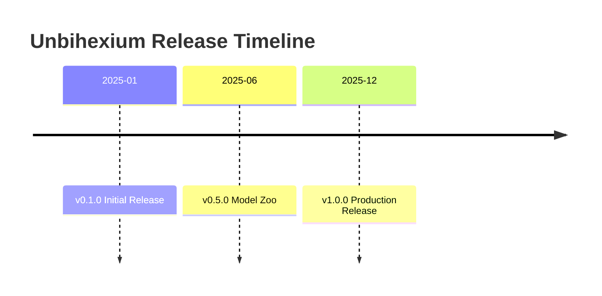

# Changelog

All notable changes to Unbihexium are documented in this file.

## Purpose

This changelog follows [Keep a Changelog](https://keepachangelog.com/) format and adheres to [Semantic Versioning](https://semver.org/).

## Version History

## Semantic Versioning

Version numbers follow the pattern:

$$
\text{MAJOR}.\text{MINOR}.\text{PATCH}
$$

Where:

- MAJOR: Incompatible API changes
- MINOR: Backwards-compatible features
- PATCH: Backwards-compatible fixes

## Releases

| Version | Date | Type |
| ------- | ---------- | ---------- |
| 1.0.0 | 2025-12-19 | Production |
| 0.5.0 | 2025-06-01 | Beta |
| 0.1.0 | 2025-01-15 | Alpha |

---

## [Unreleased]

### Added (Unreleased)

- Model zoo rebuilt around a single catalogue (`src/unbihexium/zoo/catalog.yaml`) of 130 model families in four variants (520 models), with inputs, outputs, units, required training labels and suitable data for every family
- Trainable architectures for every task: CenterNet detector, U-Net for segmentation, change detection, dense regression and enhancement, a pooled encoder for scene regression, an EDSR-style super-resolution network, and exact spectral index modules
- Deterministic, platform-independent starter weights generated from the model id, with published SHA-256 digests of all 520 models and verification on load
- Safe checkpoints loaded with `torch.load(weights_only=True)`, ONNX export verified against ONNX Runtime, and a local model store under `$UNBIHEXIUM_CACHE`
- `python -m unbihexium.zoo.sync` to generate the digests, manifests, model cards and inventory from the catalogue, and a JSON Schema for the manifests
- Model Zoo workflow that checks the generated files and rebuilds the models to prove that their digests are reproducible
- Python documentation style check (`.github/scripts/check_python_style.py`) for the converted directories
- Training for every learned task (`unbihexium.ai.training`, `unbihexium train`): dataset folders with GeoTIFF or NumPy images, class masks, pixel or GeoJSON boxes and scene targets, random and grid chips, augmentation, normalisation statistics stored in the checkpoint, task losses, AdamW with warm-up and cosine decay, validation, best and last checkpoints, early stopping and a JSON history
- Synthetic datasets for every trainable task to check a training setup without data (`--synthetic`)
- Evaluation metrics for every task: mAP at IoU 0.5 and 0.5 to 0.95, confusion matrix with IoU, F1 and kappa, MAE, RMSE, bias and R squared, PSNR and SSIM (`unbihexium evaluate`)
- Tiled inference with seamless blending, no-data handling and PyTorch or ONNX Runtime backends (`unbihexium.ai.inference.Predictor`); ONNX files carry their configuration so that inference needs no PyTorch
- Task APIs backed by the model zoo: detectors (ships, SAR ships, buildings, aircraft, vehicles, greenhouses, crop fields, pivots, fires), segmenters (land cover, water, clouds, crops, SAR floods and oil spills), change detection, dense and scene regression, enhancement and super-resolution, with georeferenced results, GeoJSON and GeoTIFF output
- Commands `unbihexium train`, `evaluate`, `predict`, `zoo build`, `zoo export`, `zoo info` and `zoo clear`; `unbihexium index` now computes and writes the index
- Guides `docs/model_zoo/training.md` and `docs/model_zoo/inference.md`
- Official support for Python 3.13 and 3.14; Python 3.10 through 3.14 are now supported and tested in CI
- Python version support policy in VERSIONING.md
- Issue forms for bug reports, feature requests, documentation, model zoo, performance, compliance, build and questions, each with about 95 mandatory questions, an AI usage declaration and regulatory confirmations
- Pull request template with the same declarations, AI usage declaration and regulatory confirmations
- CODEOWNERS, label definitions with a label sync workflow, and release notes categories
- Workflows for package builds, licence compliance, text policy, Markdown, model zoo integrity, notebooks, repository configuration schemas, workflow linting, secret scanning, container scanning, pull request titles, path labels, link checking, stale items and first-time contributor greetings
- Pull request path labeler configuration, dependency review policy, link checker configuration and instructions for AI coding assistants in `.github/`
- Root project files: AUTHORS.md, MAINTAINERS.md, ROADMAP.md, RESPONSIBLE_USE.md, security-insights.yml (OpenSSF Security Insights 2.2), codemeta.json, codecov.yml, REUSE.toml, .mailmap, .env.example and .yamllint.yml
- REUSE compliance, Security Insights, Codecov, CodeMeta and yamllint checks in CI
- Locked dependency sets `requirements.txt` (runtime, ONNX and serving) and `requirements-dev.txt` (all extras) generated with `uv pip compile --universal` for Python 3.10 to 3.14, with `make lock` and `make lock-check`
- tox environments for the lowest supported dependency versions, formatting, security, text policy and package builds
- Codecov components per subpackage, and in-scope and out-of-scope lists, security champions and scan results in `security-insights.yml`
- Detailed third-party licence attribution in `NOTICE`, and dependency references in `CITATION.cff`

### Removed (Unreleased)

- Model weights stored in Git LFS under `model_zoo/assets/`, the 520 per-variant model cards and their metrics, which were not the result of training or evaluation on real data
- Placeholder model classes in `unbihexium.ai.models`, `unbihexium.ai.change_detection`, `unbihexium.ai.super_resolution` and `unbihexium.ai.synthesis`, and the model zoo `cache` and `downloader` modules
- MkDocs site configuration (`mkdocs.yml`), the Read the Docs configuration and the documentation deployment workflow; the documentation is maintained as Markdown under `docs/`
- The `docs` extra from `pyproject.toml`
- `yamllint` and `reuse` from the `dev` extra, because their GPL-3.0-or-later licence is denied by the dependency licence policy; they run in isolated pre-commit and tox environments

### Fixed (Unreleased)

- `unbihexium.ai` could not be imported because the `super_resolution` module and package had the same name
- The detection, segmentation and super-resolution classes returned empty or interpolated placeholder results instead of running a model
- `unbihexium index` read the input but did not compute or write the index, and `from unbihexium.cli import cli` failed
- The model zoo registry referenced a task that does not exist and failed on import
- Invalid YAML in `.github/FUNDING.yml`
- SLSA provenance workflow, which called the reusable generator as a step and could not run
- Release workflow wrote `SHA256SUMS.txt` into `dist/`, which would have made the PyPI upload fail
- pre-commit hook pointing to a missing script
- markdownlint findings in the documentation
- Repository Config workflow failed because PyYAML was not installed
- README security controls table listed tools that the repository does not run
- `write_zarr` failed with zarr 3 because numcodecs compressors are only accepted for the version 2 storage format
- Zarr unit tests called `write_zarr` and `read_zarr` with the wrong argument order and return type
- The source distribution did not include `LICENSE.txt`, the notices, `REUSE.toml` or `CITATION.cff`
- Dependency floors that allowed releases with known vulnerabilities (Pillow, PyTorch, Requests, PyArrow, Starlette, python-multipart, pytest, GeoPandas, Click and Ray)

### Changed (Unreleased)

- Task APIs take a catalogue model, a trained checkpoint or an ONNX file (`weights=`) and default to the base variant; `SuperResolution` uses the catalogue factor 4 unless `scale_factor` is given; `CropDetector` and `GreenhouseDetector` are detectors, as in the catalogue, and remain importable from `unbihexium.ai.segmentation`
- `unbihexium zoo download` and `unbihexium infer` are kept as hidden aliases of `zoo build` and `predict`
- Python files outside the package (`.github/scripts/`, `scripts/` and `examples/`) use `#` comments instead of docstrings, carry an academic header and footer with project, module, author, affiliation, copyright and licence, and have a comment for every line of code; behaviour is unchanged and the example API keeps its OpenAPI descriptions
- Contact address in package metadata, citation files, the container image, the Helm chart and the security, privacy, conduct and support policies changed to `yunus.z.imanov@helsinki.fi`
- Relicensed the project from Apache-2.0 to the Mozilla Public License 2.0 (MPL-2.0)
- Added MPL-2.0 license headers to source files
- Updated package metadata, model manifests, model cards, and notebooks to reference MPL-2.0
- Raised all dependency floors to releases current in September 2026 that provide wheels for Python 3.10 to 3.14, with separate floors for Python 3.10 where newer releases dropped it
- Build backend requirement raised to hatchling 1.27 for Core Metadata 2.4 licence expressions (PEP 639)
- Rewrote `pyproject.toml`, `Makefile`, `tox.ini`, `Dockerfile`, `.dockerignore`, `docker-compose.yml`, `.pre-commit-config.yaml`, `.gitignore`, `.gitattributes`, `.editorconfig`, `.mailmap`, `.env.example`, `.yamllint.yml`, `CITATION.cff`, `codemeta.json`, `codecov.yml`, `REUSE.toml` and `NOTICE` with explanatory comments
- Container image based on Python 3.14 on Debian 13 (trixie), running as a non-root user with a health check
- Docker Compose service hardened with a read-only root file system, dropped capabilities and `no-new-privileges`, with an optional GPU profile
- markdownlint configuration moved from `.markdownlint.json` to `.markdownlint.yaml` with a reason for each disabled rule, and markdownlint-cli updated to 0.49.1
- pre-commit hooks updated (ruff 0.16.8, bandit 1.9.4, yamllint 1.38.0, actionlint 1.7.12, check-jsonschema 0.38.1, reuse 6.2.0) and aligned with the CI checks
- The licence text is kept only in `LICENSE.txt`; REUSE checks copy it to the git-ignored `LICENSES/MPL-2.0.txt` before running `reuse lint`
- Trailing whitespace and missing final newlines removed from documentation, notebooks and scripts

---

## [1.0.0] - 2025-12-19

### Added (1.0.0)

- Complete Model Zoo with 130 models and 520 variants
- Production-grade pipeline framework
- CLI with inference and pipeline commands
- Comprehensive documentation with 130 notebooks
- SHA256 verification for all models

### Changed (1.0.0)

- Upgraded to ONNX Runtime for inference
- Standardized model naming convention

### Security (1.0.0)

- Added supply chain security measures
- Implemented model integrity verification

---

## [0.5.0] - 2025-06-01

### Added (0.5.0)

- Initial model zoo structure
- Basic pipeline framework
- Core capability registry

---

## [0.1.0] - 2025-01-15

### Added (0.1.0)

- Project initialization
- Basic architecture
- Development tooling
