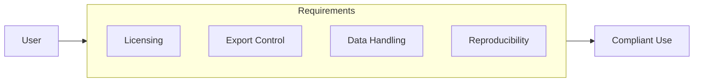

# Compliance

## Purpose

This document outlines data licensing, legal disclaimers, and compliance requirements.

## Audience

Users, legal teams, and compliance officers.

## Scope

This policy applies to all users of the unbihexium library.

## Compliance Overview

## Licensing

| Component | License | Obligations |
|-----------|---------|-------------|
| Library code | Apache-2.0 | Attribution, notice |
| Models (tiny) | Apache-2.0 | Attribution |
| Models (base/large) | Apache-2.0 | Attribution |
| Documentation | CC-BY-4.0 | Attribution |

## Compliance Score

$$C = \frac{\sum_{i=1}^{n} w_i \times c_i}{\sum_{i=1}^{n} w_i}$$

Where $c_i \in \{0,1\}$ indicates compliance for requirement $i$ with weight $w_i$.

## Export Control

This software is subject to export control regulations. Users are responsible for compliance with:

- U.S. Export Administration Regulations (EAR)
- EU Dual-Use Regulation
- Applicable local laws

## Data Handling

This library processes:
- Satellite imagery (user-provided)
- Model weights (pre-trained)
- Geospatial data (user-provided)

No user data is transmitted to external services by default.

## Reproducibility

All processing pipelines support reproducibility through:
- Fixed random seeds
- Provenance tracking
- Deterministic algorithms

## Legal Disclaimer

This document does not constitute legal advice. Users should consult qualified legal counsel for specific compliance requirements.

## References

- [Security Policy](SECURITY.md)
- [Privacy Policy](PRIVACY.md)
- [Responsible Use](RESPONSIBLE_USE.md)
