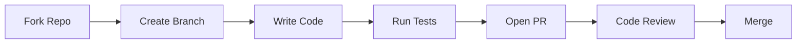

# Contributing Guide

## Purpose

This document provides guidelines for contributing to unbihexium.

## Audience

Contributors, maintainers, and community members.

## Contribution Workflow



## Getting Started

| Step | Command | Description |
|------|---------|-------------|
| 1 | `git clone` | Clone your fork |
| 2 | `pip install -e ".[dev]"` | Install dev dependencies |
| 3 | `pre-commit install` | Setup hooks |
| 4 | `pytest tests/` | Run tests |

## Code Quality

Quality score calculation:

$$Q = \frac{tests + lint + types}{3}$$

Where each component is 0-1 based on pass rate.

## Coding Standards

- Use type hints for all functions
- Follow PEP 8 and ruff formatting
- Write docstrings (Google style)
- Add tests for new features

## Pull Request Process

1. Fork the repository
2. Create a feature branch
3. Make changes with tests
4. Run `ruff check src/` and `pyright src/`
5. Open a pull request
6. Address review feedback

## Commit Messages

- No emojis in commit messages
- Use conventional commits format
- Examples: `feat:`, `fix:`, `docs:`, `test:`

## Testing

```bash
# Run all tests
pytest tests/

# Run with coverage
pytest tests/ --cov=unbihexium
```

## Code of Conduct

See [CODE_OF_CONDUCT.md](CODE_OF_CONDUCT.md).

## References

- [Documentation](docs/index.md)
- [Architecture](docs/architecture/overview.md)
