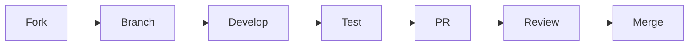

# Contributing to Unbihexium

## Purpose

This document provides guidelines for contributing to the Unbihexium project.

## Audience

- Open source contributors
- Internal developers
- Documentation writers

## Contribution Workflow

```mermaid
flowchart LR
    A[Fork] --> B[Branch]
    B --> C[Develop]
    C --> D[Test]
    D --> E[PR]
    E --> F[Review]
    F --> G[Merge]
```

## Code Quality Metrics

Contributions must meet quality thresholds:

$$
\text{Coverage} \geq 80\%, \quad \text{Complexity} \leq 10
$$

## Contribution Types

| Type | Description | Branch Prefix |
| -------- | ----------------- | ------------- |
| Feature | New functionality | `feat/` |
| Fix | Bug correction | `fix/` |
| Docs | Documentation | `docs/` |
| Refactor | Code improvement | `refactor/` |
| Test | Test additions | `test/` |

## Getting Started

1. Fork the repository
2. Create a feature branch
3. Make changes
4. Run tests: `pytest tests/`
5. Run linting: `ruff check src/`
6. Submit pull request

## Code Standards

- Python 3.10+
- Type hints required
- Docstrings for public APIs
- No emojis in code or commits

## Commit Messages

Format: `type(scope): description`

Examples:

- `feat(models): add ship detector`
- `fix(pipeline): correct tiling logic`
- `docs(api): update reference docs`

## Review Process

All PRs require:

- Passing CI checks
- Code review approval
- Documentation updates (if applicable)

## Issue and Pull Request Templates

Issues are opened through the forms in `.github/ISSUE_TEMPLATE/`; blank issues are disabled. Pull requests use `.github/PULL_REQUEST_TEMPLATE.md`. Every question in the templates is mandatory:

- Closed questions list all expected answers and always offer an "Other" answer with room to specify it.
- Open questions must be answered in full; write `N/A` only when a question genuinely does not apply.
- The declarations cover the repository, third-party libraries, models and data involved.
- The regulatory confirmations link to the exact articles of the GDPR, the EU AI Act, the Cyber Resilience Act and the other regulations listed in [COMPLIANCE.md](COMPLIANCE.md).

## Continuous Integration

Every pull request runs the workflows in `.github/workflows/`. The most important checks are:

| Workflow | What it checks |
| --- | --- |
| CI | Lint, type check and tests on Python 3.10 to 3.14 |
| Integration Tests | Integration, end-to-end and API tests |
| Package | Builds the sdist and wheel, validates metadata and installs the wheel on Python 3.10 and 3.14 |
| License Compliance | MPL-2.0 notices in every source file and licences of all dependencies |
| Text Policy | English only, no emojis and no em dashes in files and commit messages |
| Markdown | markdownlint with `.markdownlint.json` |
| Model Zoo | Model zoo structure, SHA256 checksums, model cards and manifests |
| Notebooks | Valid notebook format and no committed outputs |
| Repository Config | Issue forms, workflows, Dependabot, Read the Docs, CITATION.cff and Compose files against their schemas |
| Workflow Lint | actionlint and shellcheck on all workflows |
| Security, Secret Scan, Container Scan | Bandit, pip-audit, dependency review, TruffleHog and Grype |
| PR Title | Conventional commit format of the pull request title |

Scheduled workflows check links (Links), mark inactive issues and pull requests (Stale) and run the OpenSSF Scorecard.

## AI-Assisted Contributions

Contributions prepared with AI assistance are accepted when they are disclosed. Every issue form and the pull request template contain an AI usage declaration. Contributors must:

- Declare which parts were produced with AI assistance and which tools were used.
- Review, understand and verify all AI generated content before submitting it.
- Never use AI to fabricate logs, benchmark results, test results or citations.
- Not enter personal data or confidential data into AI tools without a lawful basis and permission.

## Security

Report security issues via [SECURITY.md](SECURITY.md), not public issues.

## License

Contributions are licensed under the Mozilla Public License 2.0 (MPL-2.0). By submitting a contribution, you agree that it is made available under the terms of [LICENSE.txt](LICENSE.txt).
