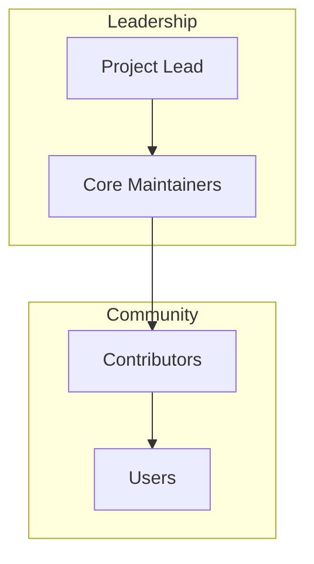

# Governance

## Purpose

This document describes the governance model for the unbihexium project.

## Audience

Contributors, maintainers, and community members.

## Governance Structure

## Roles

| Role | Responsibilities | Decision Authority |
|------|------------------|-------------------|
| Project Lead | Strategic direction, final decisions | Full |
| Core Maintainer | Review, merge, release | Commit access |
| Contributor | Code, docs, issues | Pull requests |
| User | Feedback, issues | Issue reporting |

## Decision Making

Decision weight formula:

$$W_{decision} = \sum_{i} role_i \times vote_i$$

Where $role_i$ is the role weight and $vote_i \in \{-1, 0, 1\}$.

## Becoming a Maintainer

1. Sustained quality contributions
2. Demonstrated understanding of codebase
3. Nomination by existing maintainer
4. Approval by project lead

## Code of Conduct

All participants must follow [CODE_OF_CONDUCT.md](CODE_OF_CONDUCT.md).

## References

- [Contributing](CONTRIBUTING.md)
- [Security](SECURITY.md)
