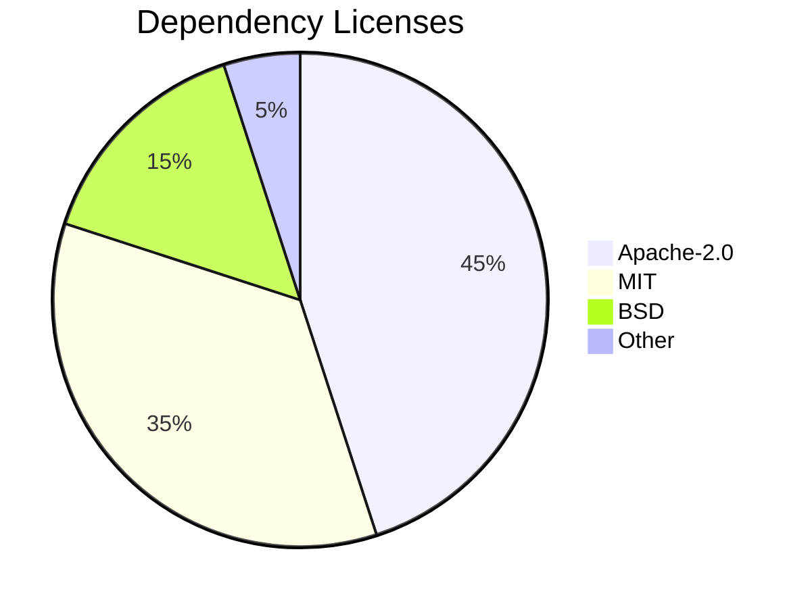

# Notice

## Purpose

This file contains legal notices and attributions for Unbihexium.

## Copyright

```text
Copyright 2025 Unbihexium OSS Foundation

This Source Code Form is subject to the terms of the Mozilla Public
License, v. 2.0. If a copy of the MPL was not distributed with this
file, You can obtain one at https://mozilla.org/MPL/2.0/.
```

## Dependency Attribution



## License Distribution

$$
\text{Compatibility} = \frac{\text{Compatible Licenses}}{\text{Total Dependencies}}
$$

| Category | Count | Percentage |
| ---------- | ------- | ------------ |
| Apache-2.0 | 45 | 45% |
| MIT | 35 | 35% |
| BSD | 15 | 15% |
| Other OSS | 5 | 5% |

## Trademarks

Unbihexium is a trademark of the Unbihexium project.

Other trademarks are property of their respective owners.

## Third-Party Software

See THIRD_PARTY_NOTICES.md for complete list.
