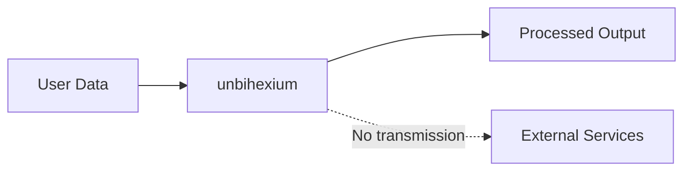

# Privacy Policy

## Purpose

This document describes data handling practices for the unbihexium library.

## Audience

All users and data protection officers.

## Scope

This policy applies to all uses of the unbihexium library.

## Data Flow

## Data Collection

| Data Type | Collected | Transmitted | Purpose |
|-----------|-----------|-------------|---------|
| Imagery | User-provided | No | Processing |
| Model weights | Downloaded once | No | Inference |
| Telemetry | No | No | N/A |
| Usage analytics | No | No | N/A |

## Privacy Score

$$P = 1 - \frac{D_{transmitted}}{D_{total}}$$

Where $D_{transmitted}$ = 0 by default, resulting in $P = 1$ (maximum privacy).

## Telemetry

**No telemetry is collected by default.**

The library operates entirely offline after initial model downloads.

## Model Downloads

When downloading models:
- Connection to GitHub Releases (public)
- SHA256 verification performed locally
- Models cached locally in `~/.cache/unbihexium/`

## Data Processing

All data processing occurs locally. No user data is transmitted to external services.

## User Rights

Users retain full ownership of:
- Input data
- Processed outputs
- Derived products

## Contact

For privacy inquiries: privacy@unbihexium.org

## References

- [Security Policy](SECURITY.md)
- [Compliance](COMPLIANCE.md)
