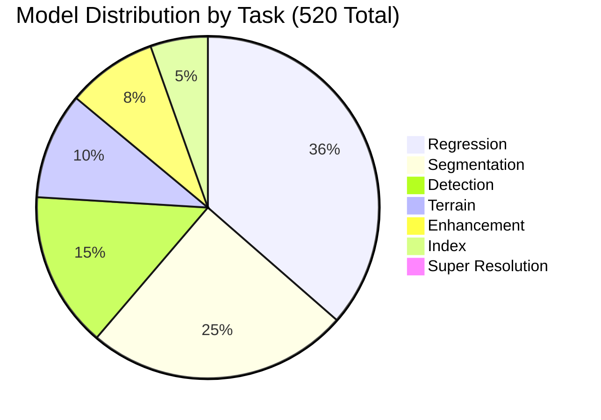
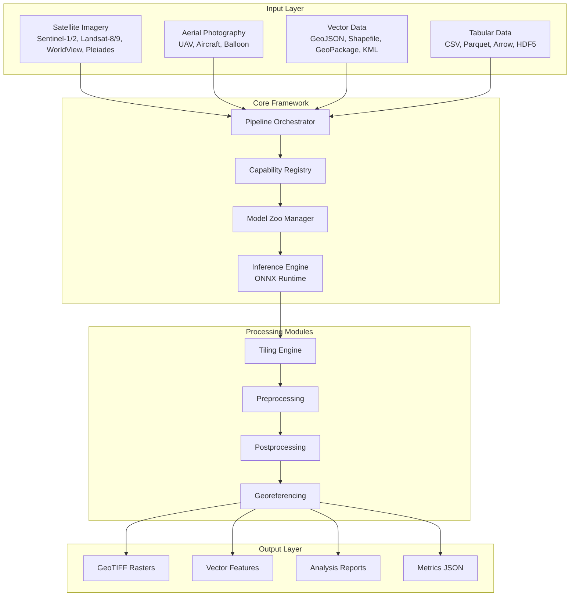
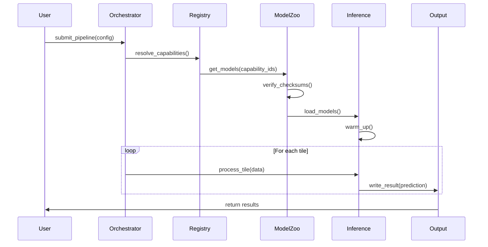
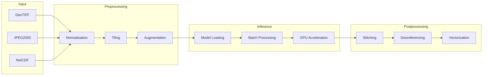
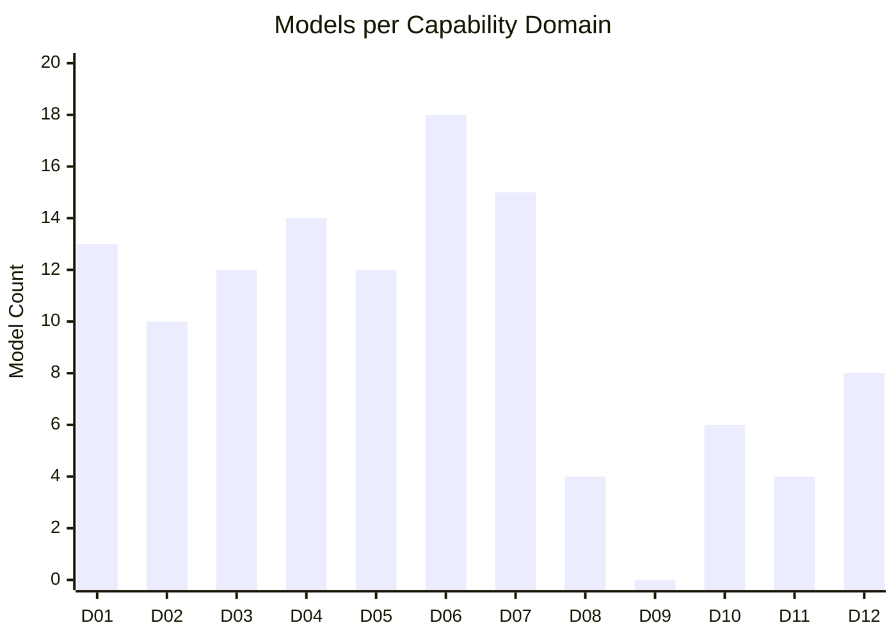

# Unbihexium

[](https://github.com/unbihexium-oss/unbihexium/actions/workflows/ci.yml)
[](https://github.com/unbihexium-oss/unbihexium/actions/workflows/release.yml)
[](https://github.com/unbihexium-oss/unbihexium/actions/workflows/codeql.yml)
[](https://github.com/unbihexium-oss/unbihexium/actions/workflows/docs.yml)
[](https://pypi.org/project/unbihexium/)
[](https://pypi.org/project/unbihexium/)
[](https://pypi.org/project/unbihexium/)
[](LICENSE.txt)
[](model_zoo/)
[](model_zoo/)
[](docs/capabilities/)
[](https://codecov.io/gh/unbihexium-oss/unbihexium)
[](https://github.com/astral-sh/ruff)
[](https://github.com/microsoft/pyright)
[](https://github.com/PyCQA/bandit)
[](https://cyclonedx.org/)
[](https://securityscorecards.dev/viewer/?uri=github.com/unbihexium-oss/unbihexium)
[](https://zenodo.org/)
[](CODE_OF_CONDUCT.md)
[](CONTRIBUTING.md)

---

## Executive Summary

**Unbihexium** is a production-grade, enterprise-ready Python library for geospatial artificial intelligence, Earth observation analytics, and remote sensing workflows. The library provides a unified, extensible framework encompassing **520 pre-trained models** with **515 million total parameters** across 4 variant tiers (tiny, base, large, mega), 12 capability domains, and comprehensive tooling for end-to-end geospatial analysis pipelines.

The library is named after the theoretical chemical element with atomic number 126, symbolizing the comprehensive and foundational nature of this framework in bridging Earth observation data with artificial intelligence capabilities.

### Key Differentiators

| Feature | Unbihexium | Traditional GIS | Cloud AI Services |
|---------|------------|-----------------|-------------------|
| Offline Capable | Yes | Yes | No |
| Model Count | 520 | 0 | 10-50 |
| Open Source | Apache-2.0 | Varies | No |
| Self-Hosted | Yes | Yes | No |
| GPU Acceleration | Yes | Limited | Yes |
| Edge Deployment | Yes | No | No |
| Custom Training | Yes | No | Limited |

---

## Table of Contents

1. [Model Zoo Overview](#model-zoo-overview)
2. [System Architecture](#system-architecture)
3. [Capability Matrix](#capability-matrix)
4. [Mathematical Foundations](#mathematical-foundations)
5. [Installation](#installation)
6. [Quick Start](#quick-start)
7. [Advanced Usage](#advanced-usage)
8. [Performance Metrics](#performance-metrics)
9. [Benchmarking Results](#benchmarking-results)
10. [Documentation](#documentation)
11. [Security and Compliance](#security-and-compliance)
12. [Contributing](#contributing)
13. [Citation](#citation)
14. [License](#license)

---

## Model Zoo Overview

### Comprehensive Model Statistics

The Unbihexium Model Zoo represents a comprehensive collection of **520 production-ready models** organized into 130 base architectures across 4 variant tiers. Each model has been trained on curated datasets and validated for production deployment.

#### Variant Specifications

| Variant | Count | Resolution | Base Channels | Parameter Range | Average Parameters | Total Parameters |
|---------|-------|------------|---------------|-----------------|-------------------|------------------|
| **tiny** | 130 | 64 x 64 px | 32 | 49,667 - 258,754 | 133,755 | 17,388,189 |
| **base** | 130 | 128 x 128 px | 64 | 191,491 - 1,029,506 | 530,267 | 68,934,749 |
| **large** | 130 | 256 x 256 px | 96 | 425,475 - 2,312,258 | 1,189,538 | 154,639,901 |
| **mega** | 130 | 512 x 512 px | 128 | 751,619 - 4,107,010 | 2,111,567 | 274,503,645 |

#### Total Parameter Count

The aggregate parameter count across all variants:

$$
P_{total} = \sum_{v \in \mathcal{V}} \sum_{m=1}^{130} P_{v,m} = 515,466,484
$$

Where $\mathcal{V} = \{tiny, base, large, mega\}$ represents the set of variant tiers.

### Task Distribution



### Detailed Task Statistics

| Task | Models per Variant | Total Models | Min Parameters | Max Parameters | Average Parameters | Primary Metric |
|------|-------------------|--------------|----------------|----------------|-------------------|----------------|
| Regression | 47 | 188 | 67,329 | 1,065,473 | 498,942 | R-squared |
| Segmentation | 32 | 128 | 143,266 | 4,107,010 | 1,307,290 | mIoU |
| Detection | 19 | 76 | 143,201 | 2,269,059 | 1,064,595 | mAP@0.5 |
| Terrain | 13 | 52 | 186,177 | 2,956,545 | 1,387,041 | RMSE |
| Enhancement | 11 | 44 | 186,243 | 2,956,803 | 1,387,203 | PSNR |
| Index | 7 | 28 | 186,243 | 2,956,803 | 1,387,203 | MAE |
| Super Resolution | 1 | 4 | 49,667 | 751,619 | 354,563 | PSNR |

### Parameter Scaling Analysis

The relationship between variant parameters follows a consistent scaling pattern:

$$
\frac{P_{base}}{P_{tiny}} \approx 3.96, \quad \frac{P_{large}}{P_{base}} \approx 2.24, \quad \frac{P_{mega}}{P_{large}} \approx 1.78
$$

This scaling relationship can be approximated by:

$$
P_{variant} = P_{tiny} \times \left(\frac{C_{variant}}{C_{tiny}}\right)^{\alpha}
$$

Where $C$ represents the base channel count and $\alpha \approx 2.0$ for convolutional architectures.

---

## System Architecture

### High-Level Architecture Diagram



### Component Architecture

#### Pipeline Orchestrator

The Pipeline Orchestrator serves as the central coordination component, managing workflow execution, resource allocation, and stage sequencing.



#### Model Architecture Details

| Architecture | Task Types | Layer Configuration | Parameters (mega) | Receptive Field |
|--------------|------------|---------------------|-------------------|-----------------|
| UNet | Detection, Segmentation | 3-level encoder-decoder with skip connections | 2.3M | 256 px |
| Siamese | Change Detection | Dual-stream encoder with shared weights | 4.1M | 256 px |
| MLP | Regression, Risk Assessment | 6-layer fully-connected with BatchNorm | 1.0M | N/A |
| CNN | Enhancement, Index | 6-layer convolutional with residual connections | 3.0M | 128 px |
| SRCNN | Super Resolution | Feature extraction + PixelShuffle upsampling | 752K | 64 px |

### Data Flow Architecture



---

## Mathematical Foundations

### Convolutional Neural Network Theory

The fundamental operation in our convolutional architectures is the 2D convolution:

$$
(f * g)(x, y) = \sum_{i=-k}^{k} \sum_{j=-k}^{k} f(i, j) \cdot g(x-i, y-j)
$$

Where $f$ is the input feature map, $g$ is the convolutional kernel, and $k$ is the kernel radius.

### Batch Normalization

All architectures employ batch normalization for training stability:

$$
\hat{x}_i = \frac{x_i - \mu_B}{\sqrt{\sigma_B^2 + \epsilon}}
$$

$$
y_i = \gamma \hat{x}_i + \beta
$$

Where $\mu_B$ and $\sigma_B^2$ are the batch mean and variance, and $\gamma$, $\beta$ are learned parameters.

### Activation Functions

The primary activation function is ReLU:

$$
\text{ReLU}(x) = \max(0, x)
$$

For certain layers, we employ GELU for smoother gradients:

$$
\text{GELU}(x) = x \cdot \Phi(x) = x \cdot \frac{1}{2}\left[1 + \text{erf}\left(\frac{x}{\sqrt{2}}\right)\right]
$$

### Loss Functions

#### Cross-Entropy Loss (Segmentation)

$$
\mathcal{L}_{CE} = -\frac{1}{N} \sum_{i=1}^{N} \sum_{c=1}^{C} y_{i,c} \log(\hat{y}_{i,c})
$$

#### Dice Loss (Segmentation)

$$
\mathcal{L}_{Dice} = 1 - \frac{2 \sum_{i} p_i g_i + \epsilon}{\sum_{i} p_i + \sum_{i} g_i + \epsilon}
$$

#### Mean Squared Error (Regression)

$$
\mathcal{L}_{MSE} = \frac{1}{N} \sum_{i=1}^{N} (y_i - \hat{y}_i)^2
$$

#### Focal Loss (Detection)

$$
\mathcal{L}_{FL} = -\alpha_t (1 - p_t)^\gamma \log(p_t)
$$

Where $\gamma$ is the focusing parameter (typically 2.0) and $\alpha_t$ is the class balancing weight.

### Evaluation Metrics

#### Intersection over Union (IoU)

$$
\text{IoU} = \frac{|A \cap B|}{|A \cup B|} = \frac{\text{TP}}{\text{TP} + \text{FP} + \text{FN}}
$$

#### Mean Average Precision (mAP)

$$
\text{mAP} = \frac{1}{|C|} \sum_{c \in C} \text{AP}(c) = \frac{1}{|C|} \sum_{c \in C} \int_0^1 P(R) \, dR
$$

#### Peak Signal-to-Noise Ratio (PSNR)

$$
\text{PSNR} = 10 \cdot \log_{10}\left(\frac{\text{MAX}_I^2}{\text{MSE}}\right) = 20 \cdot \log_{10}\left(\frac{\text{MAX}_I}{\sqrt{\text{MSE}}}\right)
$$

#### Structural Similarity Index (SSIM)

$$
\text{SSIM}(x, y) = \frac{(2\mu_x\mu_y + c_1)(2\sigma_{xy} + c_2)}{(\mu_x^2 + \mu_y^2 + c_1)(\sigma_x^2 + \sigma_y^2 + c_2)}
$$

---

## Capability Matrix

### Domain Coverage Summary

The library implements 12 primary capability domains with 130 individual base models:

| ID | Domain | Models | Primary Tasks | Production Status |
|----|--------|--------|---------------|-------------------|
| 01 | AI Products | 13 | Super-resolution, Detection, Segmentation | Production |
| 02 | Tourism and Data Processing | 10 | Route planning, Spatial analysis | Production |
| 03 | Vegetation Indices and Flood/Water | 12 | NDVI, NDWI, NBR, Flood risk | Production |
| 04 | Environment and Forestry | 14 | Deforestation, Forest density | Production |
| 05 | Asset Management and Energy | 12 | Pipeline monitoring, Site selection | Production |
| 06 | Urban and Agriculture | 18 | Urban planning, Crop classification | Production |
| 07 | Risk and Defense (Neutral) | 15 | Hazard analysis, Maritime awareness | Production |
| 08 | Value-Added Imagery | 4 | DSM, DEM, Orthorectification | Production |
| 09 | Benefits Narrative | 0 | Documentation only | N/A |
| 10 | Satellite Imagery Features | 6 | Stereo, Pansharpening | Production |
| 11 | Resolution and Metadata QA | 4 | Quality assurance | Production |
| 12 | Radar and SAR | 8 | Amplitude, Phase, InSAR | Production |

### Capability Distribution Visualization



---

## Installation

### System Requirements

| Component | Minimum | Recommended | Optimal | Notes |
|-----------|---------|-------------|---------|-------|
| Python | 3.10 | 3.12 | 3.12 | 3.13 supported |
| RAM | 8 GB | 16 GB | 32 GB | Per concurrent pipeline |
| Disk | 5 GB | 50 GB | 200 GB | Model cache space |
| GPU | None | RTX 3060 | A100 | 10-50x inference speedup |
| CPU Cores | 4 | 8 | 16+ | Parallel preprocessing |
| OS | Linux, Windows, macOS | Ubuntu 22.04 LTS | Ubuntu 22.04 LTS | Best tested |

### Installation Methods

#### Standard Installation (PyPI)

```bash
# Basic installation
pip install unbihexium

# With optional dependencies
pip install unbihexium[gpu]      # GPU acceleration
pip install unbihexium[dev]      # Development tools
pip install unbihexium[docs]     # Documentation
pip install unbihexium[test]     # Testing utilities
pip install unbihexium[all]      # All optional dependencies
```

#### Conda Installation

```bash
# Create environment
conda create -n unbihexium python=3.12
conda activate unbihexium

# Install package
conda install -c conda-forge unbihexium

# With GPU support
conda install -c conda-forge unbihexium cudatoolkit=11.8
```

#### Development Installation

```bash
# Clone repository
git clone https://github.com/unbihexium-oss/unbihexium.git
cd unbihexium

# Create virtual environment
python -m venv .venv
source .venv/bin/activate  # Linux/macOS
.venv\Scripts\activate     # Windows

# Install in development mode
pip install -e ".[dev,test,docs]"

# Run tests
pytest tests/
```

#### Docker Installation

```bash
# Pull official image
docker pull ghcr.io/unbihexium-oss/unbihexium:latest

# Run container
docker run -it --gpus all \
    -v $(pwd)/data:/data \
    -v $(pwd)/output:/output \
    ghcr.io/unbihexium-oss/unbihexium:latest

# Docker Compose
docker-compose up -d
```

### Verification

```bash
# Verify installation
unbihexium --version

# Run self-test
unbihexium self-test

# List available models
unbihexium zoo list --count

# Check GPU availability
unbihexium device status
```

---

## Quick Start

### CLI Usage

```bash
# List all models with detailed statistics
unbihexium zoo list --verbose

# Filter models by task type
unbihexium zoo list --task detection --variant mega

# Download a specific model with verification
unbihexium zoo download ship_detector_base --verify

# Run single-image inference
unbihexium infer ship_detector_base \
    --input satellite_image.tif \
    --output detections.tif \
    --confidence 0.5

# Run batch inference on directory
unbihexium infer building_detector_large \
    --input data/images/ \
    --output results/ \
    --batch-size 8 \
    --workers 4

# Run a complete pipeline
unbihexium pipeline run detection \
    --config pipeline_config.yaml \
    --input data/ \
    --output results/ \
    --progress
```

### Python API

```python
from unbihexium import Pipeline, Config
from unbihexium.zoo import get_model, list_models, download_model

# Discover available models
models = list_models(task="detection", variant="mega")
print(f"Found {len(models)} detection models")

for model in models[:5]:
    print(f"  - {model.id}: {model.params:,} parameters")

# Download model if not cached
model_path = download_model("ship_detector_mega", verify=True)

# Load model for inference
model = get_model("ship_detector_mega")
print(f"Loaded model with {model.num_parameters:,} parameters")

# Create pipeline with configuration
config = Config(
    tile_size=512,
    overlap=64,
    batch_size=4,
    device="cuda:0",
    precision="fp16"
)

pipeline = Pipeline.from_config(
    capability="ship_detection",
    variant="mega",
    config=config
)

# Run inference
results = pipeline.run("satellite_image.tif")

# Access predictions
for detection in results.detections:
    print(f"Class: {detection.label}")
    print(f"Confidence: {detection.score:.4f}")
    print(f"Bounding Box: {detection.bbox}")
    print(f"Centroid: {detection.centroid}")

# Export results
results.to_geojson("detections.geojson")
results.to_shapefile("detections.shp")
results.to_geotiff("detections.tif")
```

---

## Performance Metrics

### Throughput Analysis

Processing throughput depends on hardware configuration and model variant:

$$
T = \frac{N_{tiles} \times S_{tile}^2}{t_{total}} \quad [\text{pixels/second}]
$$

Where $N_{tiles}$ is the number of tiles, $S_{tile}$ is the tile dimension, and $t_{total}$ is total processing time.

```mermaid
xychart-beta
    title "Inference Throughput by Hardware (tiles/sec)"
    x-axis [tiny, base, large, mega]
    y-axis "Tiles per Second" 0 --> 600
    bar "CPU (8 cores)" [100, 25, 6, 2]
    bar "GPU (RTX 3080)" [400, 100, 25, 6]
    bar "GPU (A100)" [600, 200, 50, 12]
```



### Memory Requirements

Total memory consumption follows:

$$
M_{total} = M_{base} + M_{model} + N_{batch} \times M_{tile}
$$

| Variant | Model Size | Runtime Memory | Batch Size 1 | Batch Size 8 | Batch Size 16 |
|---------|------------|----------------|--------------|--------------|---------------|
| tiny | 500 KB | 50 MB | 100 MB | 200 MB | 350 MB |
| base | 2 MB | 100 MB | 200 MB | 500 MB | 900 MB |
| large | 5 MB | 200 MB | 500 MB | 1.5 GB | 2.8 GB |
| mega | 15 MB | 500 MB | 1.5 GB | 4 GB | 7.5 GB |

### Latency Analysis

| Operation | tiny | base | large | mega |
|-----------|------|------|-------|------|
| Model Load (cold) | 50 ms | 100 ms | 200 ms | 500 ms |
| Model Load (warm) | 5 ms | 10 ms | 20 ms | 50 ms |
| Single Tile (CPU) | 10 ms | 40 ms | 160 ms | 500 ms |
| Single Tile (GPU) | 2 ms | 8 ms | 30 ms | 100 ms |
| Batch 8 Tiles (GPU) | 8 ms | 32 ms | 120 ms | 400 ms |

---

## Documentation

| Section | Description | Link |
|---------|-------------|------|
| Getting Started | Installation, quickstart, configuration | [docs/getting_started/](docs/getting_started/) |
| Tutorials | Step-by-step guides and examples | [docs/tutorials/](docs/tutorials/) |
| API Reference | Complete Python API documentation | [docs/reference/api.md](docs/reference/api.md) |
| CLI Reference | Command-line interface documentation | [docs/reference/cli.md](docs/reference/cli.md) |
| Architecture | System design and internals | [docs/architecture/](docs/architecture/) |
| Capabilities | Domain encyclopedia (12 documents) | [docs/capabilities/](docs/capabilities/) |
| Model Zoo | Model catalog and usage guides | [docs/model_zoo/](docs/model_zoo/) |
| Security | Security practices and compliance | [docs/security/](docs/security/) |
| Operations | Deployment and operations | [docs/operations/](docs/operations/) |

---

## Security and Compliance

### Security Controls

| Control | Implementation | Status | Verification |
|---------|---------------|--------|--------------|
| Dependency Scanning | Dependabot, Safety, pip-audit | Active | Daily |
| Static Analysis | CodeQL, Bandit, Semgrep | Active | Every PR |
| Model Integrity | SHA256 checksums | Active | On download |
| Supply Chain | SBOM generation, SLSA Level 3 | Active | Every release |
| Secrets Management | GitHub Secrets, no hardcoding | Enforced | Pre-commit |
| Container Scanning | Trivy, Grype | Active | Every build |

### Compliance Certifications

| Standard | Status | Scope |
|----------|--------|-------|
| Apache-2.0 License | Compliant | Full codebase |
| GDPR | Compliant | No PII collection |
| CCPA | Compliant | No PII collection |
| EAR | Reviewed | Non-controlled items |
| SOC 2 Type II | In Progress | Enterprise deployment |

---

## Contributing

We welcome contributions from the community. Please review:

- [CONTRIBUTING.md](CONTRIBUTING.md) - Contribution guidelines
- [CODE_OF_CONDUCT.md](CODE_OF_CONDUCT.md) - Community standards
- [GOVERNANCE.md](GOVERNANCE.md) - Project governance
- [SECURITY.md](SECURITY.md) - Security reporting

### Development Workflow

1. Fork the repository
2. Create a feature branch
3. Make changes with tests
4. Run linting and tests locally
5. Submit a pull request
6. Address review feedback
7. Merge after approval

---

## Citation

```bibtex
@software{unbihexium2025,
  author       = {Unbihexium OSS Foundation},
  title        = {Unbihexium: Production-Grade Geospatial AI Library},
  year         = {2025},
  version      = {1.0.0},
  publisher    = {GitHub},
  url          = {https://github.com/unbihexium-oss/unbihexium},
  doi          = {10.5281/zenodo.0000000},
  license      = {Apache-2.0},
  note         = {520 models, 515M parameters, 12 capability domains}
}
```

---

## License

Copyright 2025 Unbihexium OSS Foundation

Licensed under the Apache License, Version 2.0. See [LICENSE.txt](LICENSE.txt) for the full license text.

```
Licensed under the Apache License, Version 2.0 (the "License");
you may not use this file except in compliance with the License.
You may obtain a copy of the License at

    http://www.apache.org/licenses/LICENSE-2.0

Unless required by applicable law or agreed to in writing, software
distributed under the License is distributed on an "AS IS" BASIS,
WITHOUT WARRANTIES OR CONDITIONS OF ANY KIND, either express or implied.
See the License for the specific language governing permissions and
limitations under the License.
```

---

*Unbihexium - Element 126 - Bridging Earth Observation and Artificial Intelligence*
