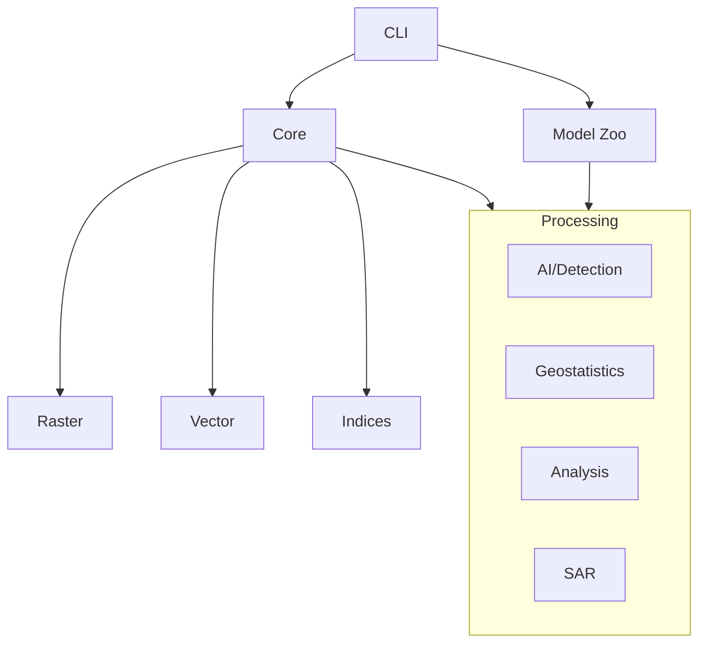

# Unbihexium

Production-grade Earth Observation, Geospatial, Remote Sensing, and SAR Python library.

[](https://pypi.org/project/unbihexium/)
[](https://pypi.org/project/unbihexium/)
[](https://github.com/unbihexium-oss/unbihexium/blob/main/LICENSE)
[](https://github.com/unbihexium-oss/unbihexium/actions/workflows/ci.yml)
[](https://github.com/unbihexium-oss/unbihexium/actions/workflows/coverage.yml)
[](https://github.com/unbihexium-oss/unbihexium/actions/workflows/docs.yml)
[](https://github.com/unbihexium-oss/unbihexium/actions/workflows/security.yml)
[](https://github.com/unbihexium-oss/unbihexium/actions/workflows/scorecard.yml)
[](https://github.com/unbihexium-oss/unbihexium/actions/workflows/sbom.yml)
[](https://github.com/unbihexium-oss/unbihexium/actions/workflows/codeql.yml)
[](https://github.com/unbihexium-oss/unbihexium/actions/workflows/release.yml)
[](https://github.com/unbihexium-oss/unbihexium/actions/workflows/publish.yml)
[](https://pypi.org/project/unbihexium/)
[](https://github.com/astral-sh/ruff)
[](https://microsoft.github.io/pyright/)
[](https://bestpractices.coreinfrastructure.org/projects/0)
[](https://slsa.dev)
[](https://pre-commit.com/)
[](CODE_OF_CONDUCT.md)
[](https://github.com/unbihexium-oss/unbihexium/stargazers)
[](https://github.com/unbihexium-oss/unbihexium/issues)

## Overview

Unbihexium provides a comprehensive suite of tools for Earth observation, satellite imagery analysis, geospatial processing, and synthetic aperture radar (SAR) applications. Built with production-grade architecture, it offers:

- **AI Products**: Object detection (ships, buildings, aircraft, vehicles), change detection, segmentation, super-resolution
- **Spectral Indices**: NDVI, NDWI, NBR, EVI, SAVI, MSI
- **Geostatistics**: Variogram analysis, Ordinary/Universal Kriging, Moran's I, Geary's C
- **Suitability Analysis**: AHP, weighted overlay
- **Network Analysis**: Routing, accessibility, service areas
- **Flood and Water**: Watershed management, flood risk assessment
- **Agriculture**: Crop classification, yield prediction, crop health
- **Urban Planning**: Growth assessment, infrastructure monitoring
- **Environmental Monitoring**: Deforestation, land cover change
- **SAR Processing**: Amplitude analytics, phase displacement (research-grade)

## Installation

```bash
pip install unbihexium
```

With optional dependencies:

```bash
# GPU support
pip install unbihexium[gpu]

# All features
pip install unbihexium[all]
```

## Quick Start

### Spectral Index Calculation

```python
from unbihexium.core.index import compute_index
import numpy as np

# Sample band data
bands = {
    "NIR": np.random.rand(256, 256),
    "RED": np.random.rand(256, 256),
}

# Calculate NDVI
ndvi = compute_index("NDVI", bands)
```

### Object Detection

```python
from unbihexium.ai.detection import ShipDetector
from unbihexium.core.raster import Raster

detector = ShipDetector(threshold=0.5)
raster = Raster.from_file("satellite_image.tif")
result = detector.predict(raster)

print(f"Found {result.count} ships")
```

### Geostatistics

```python
from unbihexium.geostat import Variogram, OrdinaryKriging
import numpy as np

coordinates = np.random.rand(100, 2) * 100
values = np.sin(coordinates[:, 0] / 10) + np.random.rand(100) * 0.1

variogram = Variogram(model="spherical")
variogram.fit(coordinates, values)

kriging = OrdinaryKriging(variogram=variogram)
kriging.fit(coordinates, values)
result = kriging.predict(np.array([[50, 50]]))
```

### CLI Usage

```bash
# List available models
unbihexium zoo list

# Download a model
unbihexium zoo download ship_detector_tiny

# Verify model integrity
unbihexium zoo verify ship_detector_tiny

# List pipelines
unbihexium pipeline list

# Run a pipeline
unbihexium pipeline run ship_detection -i input.tif -o output.geojson
```

## Model Zoo

Unbihexium includes a model zoo with pre-trained models for various tasks:

| Model ID | Task | Source | Description |
|----------|------|--------|-------------|
| ship_detector_tiny | Detection | repo | Tiny ship detection for smoke tests |
| building_detector_tiny | Detection | repo | Tiny building detection |
| segmentation_tiny | Segmentation | repo | Tiny semantic segmentation |
| super_resolution_tiny | Super Resolution | repo | Tiny super resolution |
| change_detector_tiny | Change Detection | repo | Tiny change detection |

Full models are available in GitHub Releases with SHA256 verification.

## Architecture



### Key Formula: NDVI

$$NDVI = \frac{NIR - RED}{NIR + RED}$$

## Documentation

- [Getting Started](docs/getting_started/installation.md)
- [Tutorials](docs/tutorials/)
- [API Reference](docs/reference/api.md)
- [CLI Reference](docs/reference/cli.md)
- [Architecture](docs/architecture/overview.md)

## Security

See [SECURITY.md](SECURITY.md) for security policies and reporting vulnerabilities.

## Contributing

See [CONTRIBUTING.md](CONTRIBUTING.md) for contribution guidelines.

## License

Apache License 2.0. See [LICENSE](LICENSE) for details.

## Responsible Use

This library is intended for civilian applications including environmental monitoring, urban planning, agriculture, and scientific research. Users must comply with all applicable laws and regulations. See [RESPONSIBLE_USE.md](RESPONSIBLE_USE.md) for details.

## Citation

```bibtex
@software{unbihexium,
  title={Unbihexium: Production-grade Earth Observation Library},
  author={Unbihexium OSS Foundation},
  year={2025},
  url={https://github.com/unbihexium-oss/unbihexium}
}
```
