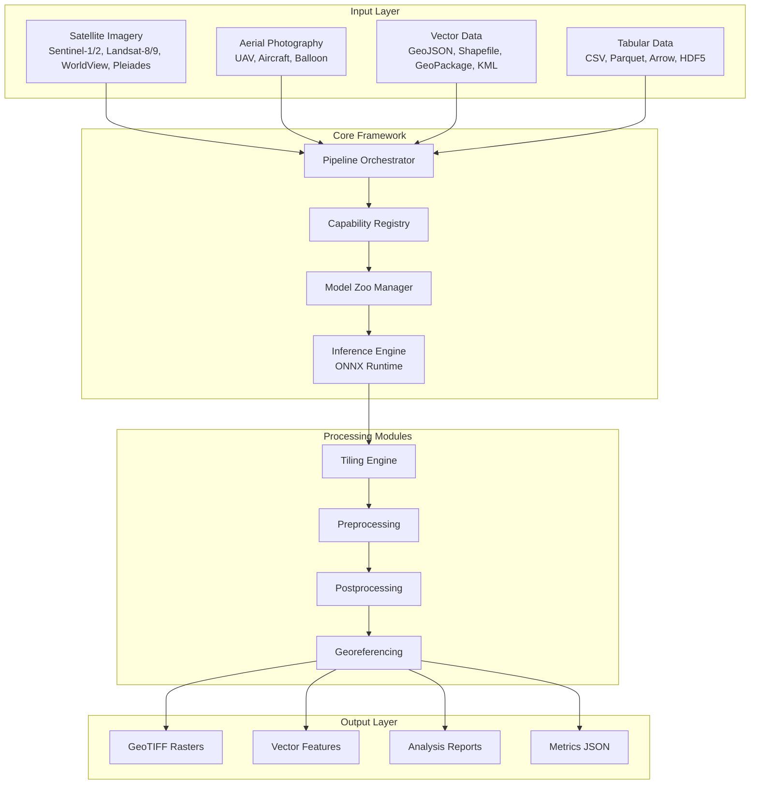
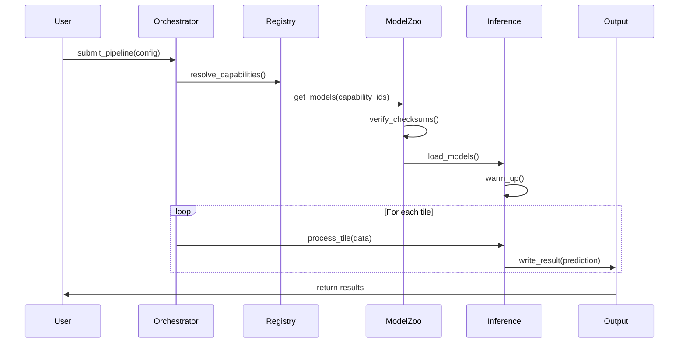
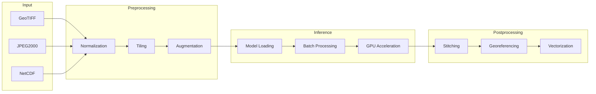
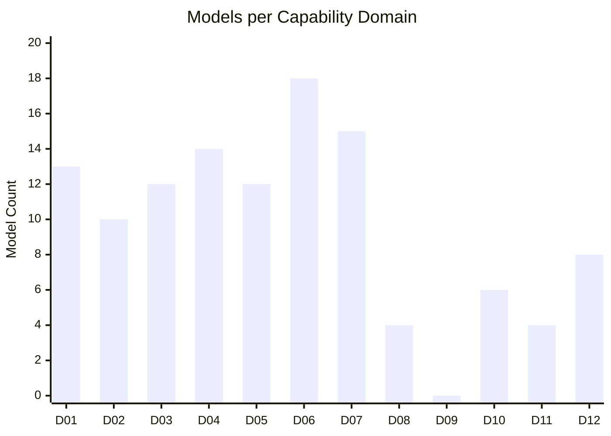

# Unbihexium

<p align="center">
  <strong>Production-Grade Geospatial AI Library for Earth Observation</strong>
</p>

<p align="center">
  <a href="https://pypi.org/project/unbihexium/"></a>
  <a href="https://pypi.org/project/unbihexium/"></a>
  <a href="https://pypi.org/project/unbihexium/"></a>
  <a href="LICENSE.txt"></a>
  <a href="https://codecov.io/gh/unbihexium-oss/unbihexium"></a>
  <a href="https://securityscorecards.dev/viewer/?uri=github.com/unbihexium-oss/unbihexium"></a>
  <a href="https://github.com/unbihexium-oss/unbihexium/stargazers"></a>
  <a href="https://github.com/unbihexium-oss/unbihexium/fork"></a>
  <a href="https://github.com/unbihexium-oss/unbihexium/watchers"></a>
  <a href="https://github.com/unbihexium-oss/unbihexium/issues"></a>
  <a href="https://github.com/unbihexium-oss/unbihexium/commits/main"></a>
</p>

<p align="center">
  <a href="model_zoo/"></a>
  <a href="model_zoo/MODEL_CARDS.md"></a>
  <a href="model_zoo/"></a>
  <a href="https://onnx.ai/"></a>
  <a href="https://pytorch.org/"></a>
  <a href="https://numpy.org/"></a>
  <a href="https://rasterio.readthedocs.io/"></a>
  <a href="https://gdal.org/"></a>
  <a href="docs/"></a>
  <a href="docs/"></a>
</p>

<p align="center">
  <a href="docs/capabilities/"></a>
  <a href="docs/capabilities/"></a>
  <a href="docs/capabilities/"></a>
  <a href="docs/capabilities/"></a>
  <a href="https://github.com/astral-sh/ruff"></a>
  <a href="https://github.com/microsoft/pyright"></a>
  <a href="https://github.com/PyCQA/bandit"></a>
  <a href="https://pytest.org/"></a>
  <a href="https://pre-commit.com/"></a>
  <a href="https://conventionalcommits.org/"></a>
</p>

<p align="center">
  <a href="docs/"></a>
  <a href="examples/notebooks/"></a>
  <a href="docs/tutorials/"></a>
  <a href="docs/"></a>
  <a href="docs/"></a>
  <a href="docs/"></a>
  <a href="docs/"></a>
  <a href="docs/"></a>
  <a href="CODE_OF_CONDUCT.md"></a>
  <a href="CONTRIBUTING.md"></a>
</p>

<p align="center">
  <a href="docs/"></a>
  <a href="docs/"></a>
  <a href="docs/"></a>
  <a href="docs/"></a>
  <a href="https://scipy.org/"></a>
  <a href="https://pandas.pydata.org/"></a>
  <a href="https://xarray.dev/"></a>
  <a href="https://dask.org/"></a>
  <a href="https://fastapi.tiangolo.com/"></a>
  <a href="https://docker.com/"></a>
</p>

---

## Executive Summary

**Unbihexium** is a production-grade, enterprise-ready Python library for geospatial artificial intelligence, Earth observation analytics, and remote sensing workflows. The library provides a unified, extensible framework encompassing **520 trainable starter models** (130 model families in 4 variant tiers: tiny, base, large, mega) with deterministic, verifiable starter weights, 12 capability domains, and comprehensive tooling for end-to-end geospatial analysis pipelines.

The library is named after the theoretical chemical element with atomic number 126, symbolizing the comprehensive and foundational nature of this framework in bridging Earth observation data with artificial intelligence capabilities.

### Key Differentiators

| Feature | Unbihexium | Traditional GIS | Cloud AI Services |
| --------- | ------------ | ----------------- | ------------------- |
| Offline Capable | Yes | Yes | No |
| Model Count | 520 | 0 | 10-50 |
| Open Source | MPL-2.0 | Varies | No |
| Self-Hosted | Yes | Yes | No |
| GPU Acceleration | Yes | Limited | Yes |
| Edge Deployment | Yes | No | No |
| Custom Training | Yes | No | Limited |

---

## Table of Contents

1. [Model Zoo Overview](#model-zoo-overview)
2. [System Architecture](#system-architecture)
3. [Capability Matrix](#capability-matrix)
4. [Mathematical Foundations](#mathematical-foundations)
5. [Installation](#installation)
6. [Quick Start](#quick-start)
7. [Performance Metrics](#performance-metrics)
8. [Documentation](#documentation)
9. [Security and Compliance](#security-and-compliance)
10. [Contributing](#contributing)
11. [Citation](#citation)
12. [License](#license)

---

## Model Zoo Overview

The model zoo offers **130 model families in four size variants (520 models, 10,655,126,116 parameters in total)**. Every learned model is a **starter model**: a complete, trainable architecture for its task with deterministic starter weights, generated locally and verifiable against the published SHA-256 digest in [`src/unbihexium/zoo/digests.json`](src/unbihexium/zoo/digests.json). The starter models are **not trained on Earth observation data**; train or fine-tune them on labelled data for your area and sensor before using their predictions. The seven spectral index models implement published formulas exactly and need no training.

```python
from unbihexium.zoo import list_models, load_model

model = load_model("ship_detector_base")  # built locally, digest verified
print(model.summary())
```

The catalogue of all families, with their inputs, outputs, required training labels and suitable data sources, is [`src/unbihexium/zoo/catalog.yaml`](src/unbihexium/zoo/catalog.yaml); the per-family model cards are listed in [`model_zoo/MODEL_CARDS.md`](model_zoo/MODEL_CARDS.md).

### Variants

| Variant | Base channels | Encoder levels | Blocks per level | Tile size | Parameters per model (learned models) | Total parameters |
| --- | --- | --- | --- | --- | --- | --- |
| **tiny** | 16 | 3 | 1 | 256 px | 134,992 to 735,428 | 86,951,209 |
| **base** | 32 | 4 | 1 | 256 px | 657,264 to 7,063,428 | 825,294,793 |
| **large** | 48 | 4 | 2 | 512 px | 2,784,528 to 22,066,564 | 2,611,810,665 |
| **mega** | 64 | 5 | 2 | 512 px | 6,109,872 to 60,460,548 | 7,131,069,449 |

### Tasks and architectures

| Task | Families | Models | Architecture |
| --- | --- | --- | --- |
| detection | 19 | 76 | CenterNet (anchor-free, stride 4) |
| segmentation | 26 | 104 | U-Net |
| change detection | 6 | 24 | U-Net on two stacked acquisitions |
| dense regression | 49 | 196 | U-Net with regression output |
| scene regression | 11 | 44 | Residual encoder with pooled regression head |
| enhancement | 11 | 44 | Residual U-Net (image to image) |
| super resolution | 1 | 4 | EDSR-style residual network with sub-pixel convolution |
| spectral index | 7 | 28 | Exact formula (no weights) |

## System Architecture

### High-Level Architecture Diagram


```mermaid
graph TB
    subgraph "Input Layer"
        A1["Satellite Imagery<br/>Sentinel-1/2, Landsat-8/9, WorldView, Pleiades"]
        A2["Aerial Photography<br/>UAV, Aircraft, Balloon"]
        A3["Vector Data<br/>GeoJSON, Shapefile, GeoPackage, KML"]
        A4["Tabular Data<br/>CSV, Parquet, Arrow, HDF5"]
    end

    subgraph "Core Framework"
        B1[Pipeline Orchestrator]
        B2[Capability Registry]
        B3[Model Zoo Manager]
        B4["Inference Engine<br/>ONNX Runtime"]
    end

    subgraph "Processing Modules"
        C1[Tiling Engine]
        C2[Preprocessing]
        C3[Postprocessing]
        C4[Georeferencing]
    end

    subgraph "Output Layer"
        D1[GeoTIFF Rasters]
        D2[Vector Features]
        D3[Analysis Reports]
        D4[Metrics JSON]
    end

    A1 --> B1
    A2 --> B1
    A3 --> B1
    A4 --> B1

    B1 --> B2
    B2 --> B3
    B3 --> B4

    B4 --> C1
    C1 --> C2
    C2 --> C3
    C3 --> C4

    C4 --> D1
    C4 --> D2
    C4 --> D3
    C4 --> D4
```

### Component Architecture

#### Pipeline Orchestrator

The Pipeline Orchestrator serves as the central coordination component, managing workflow execution, resource allocation, and stage sequencing.


```mermaid
sequenceDiagram
    participant User
    participant Orchestrator
    participant Registry
    participant ModelZoo
    participant Inference
    participant Output

    User->>Orchestrator: submit_pipeline(config)
    Orchestrator->>Registry: resolve_capabilities()
    Registry->>ModelZoo: get_models(capability_ids)
    ModelZoo->>ModelZoo: verify_checksums()
    ModelZoo->>Inference: load_models()
    Inference->>Inference: warm_up()
    loop For each tile
        Orchestrator->>Inference: process_tile(data)
        Inference->>Output: write_result(prediction)
    end
    Output->>User: return results
```

#### Model Architecture Details

| Architecture | Task Types | Layer Configuration | Parameters (mega) | Receptive Field |
| -------------- | ------------ | --------------------- | ------------------- | ----------------- |
| UNet | Detection, Segmentation | 3-level encoder-decoder with skip connections | 2.3M | 256 px |
| Siamese | Change Detection | Dual-stream encoder with shared weights | 4.1M | 256 px |
| MLP | Regression, Risk Assessment | 6-layer fully-connected with BatchNorm | 1.0M | N/A |
| CNN | Enhancement, Index | 6-layer convolutional with residual connections | 3.0M | 128 px |
| SRCNN | Super Resolution | Feature extraction + PixelShuffle upsampling | 752K | 64 px |

### Data Flow Architecture


```mermaid
flowchart LR
    subgraph Input
        I1[GeoTIFF]
        I2[JPEG2000]
        I3[NetCDF]
    end

    subgraph Preprocessing
        P1[Normalization]
        P2[Tiling]
        P3[Augmentation]
    end

    subgraph Inference
        M1[Model Loading]
        M2[Batch Processing]
        M3[GPU Acceleration]
    end

    subgraph Postprocessing
        O1[Stitching]
        O2[Georeferencing]
        O3[Vectorization]
    end

    I1 --> P1
    I2 --> P1
    I3 --> P1
    P1 --> P2
    P2 --> P3
    P3 --> M1
    M1 --> M2
    M2 --> M3
    M3 --> O1
    O1 --> O2
    O2 --> O3
```

---

## Mathematical Foundations

### Convolutional Neural Network Theory

The fundamental operation in our convolutional architectures is the 2D convolution:

$$
(f * g)(x, y) = \sum_{i=-k}^{k} \sum_{j=-k}^{k} f(i, j) \cdot g(x-i, y-j)
$$

Where $f$ is the input feature map, $g$ is the convolutional kernel, and $k$ is the kernel radius.

### Batch Normalization

All architectures employ batch normalization for training stability:

$$
\hat{x}_i = \frac{x_i - \mu_B}{\sqrt{\sigma_B^2 + \epsilon}}
$$

$$
y_i = \gamma \hat{x}_i + \beta
$$

Where $\mu_B$ and $\sigma_B^2$ are the batch mean and variance, and $\gamma$, $\beta$ are learned parameters.

### Activation Functions

The primary activation function is ReLU:

$$
\text{ReLU}(x) = \max(0, x)
$$

For certain layers, we employ GELU for smoother gradients:

$$
\text{GELU}(x) = x \cdot \Phi(x) = x \cdot \frac{1}{2}\left[1 + \text{erf}\left(\frac{x}{\sqrt{2}}\right)\right]
$$

### Loss Functions

#### Cross-Entropy Loss (Segmentation)

$$
\mathcal{L}_{CE} = -\frac{1}{N} \sum_{i=1}^{N} \sum_{c=1}^{C} y_{i,c} \log(\hat{y}_{i,c})
$$

#### Dice Loss (Segmentation)

$$
\mathcal{L}_{Dice} = 1 - \frac{2 \sum_{i} p_i g_i + \epsilon}{\sum_{i} p_i + \sum_{i} g_i + \epsilon}
$$

#### Mean Squared Error (Regression)

$$
\mathcal{L}_{MSE} = \frac{1}{N} \sum_{i=1}^{N} (y_i - \hat{y}_i)^2
$$

#### Focal Loss (Detection)

$$
\mathcal{L}_{FL} = -\alpha_t (1 - p_t)^\gamma \log(p_t)
$$

Where $\gamma$ is the focusing parameter (typically 2.0) and $\alpha_t$ is the class balancing weight.

### Evaluation Metrics

#### Intersection over Union (IoU)

$$
\text{IoU} = \frac{| A \cap B | }{ | A \cup B |} = \frac{\text{TP}}{\text{TP} + \text{FP} + \text{FN}}
$$

#### Mean Average Precision (mAP)

$$
\text{mAP} = \frac{1}{| C | } \sum_{c \in C} \text{AP}(c) = \frac{1}{ | C |} \sum_{c \in C} \int_0^1 P(R) \, dR
$$

#### Peak Signal-to-Noise Ratio (PSNR)

$$
\text{PSNR} = 10 \cdot \log_{10}\left(\frac{\text{MAX}_I^2}{\text{MSE}}\right) = 20 \cdot \log_{10}\left(\frac{\text{MAX}_I}{\sqrt{\text{MSE}}}\right)
$$

#### Structural Similarity Index (SSIM)

$$
\text{SSIM}(x, y) = \frac{(2\mu_x\mu_y + c_1)(2\sigma_{xy} + c_2)}{(\mu_x^2 + \mu_y^2 + c_1)(\sigma_x^2 + \sigma_y^2 + c_2)}
$$

---

## Capability Matrix

### Domain Coverage Summary

The library implements 12 primary capability domains with 130 individual base models:

| ID | Domain | Models | Primary Tasks | Production Status |
| ---- | -------- | -------- | --------------- | ------------------- |
| 01 | AI Products | 13 | Super-resolution, Detection, Segmentation | Production |
| 02 | Tourism and Data Processing | 10 | Route planning, Spatial analysis | Production |
| 03 | Vegetation Indices and Flood/Water | 12 | NDVI, NDWI, NBR, Flood risk | Production |
| 04 | Environment and Forestry | 14 | Deforestation, Forest density | Production |
| 05 | Asset Management and Energy | 12 | Pipeline monitoring, Site selection | Production |
| 06 | Urban and Agriculture | 18 | Urban planning, Crop classification | Production |
| 07 | Risk and Defense (Neutral) | 15 | Hazard analysis, Maritime awareness | Production |
| 08 | Value-Added Imagery | 4 | DSM, DEM, Orthorectification | Production |
| 09 | Benefits Narrative | 0 | Documentation only | N/A |
| 10 | Satellite Imagery Features | 6 | Stereo, Pansharpening | Production |
| 11 | Resolution and Metadata QA | 4 | Quality assurance | Production |
| 12 | Radar and SAR | 8 | Amplitude, Phase, InSAR | Production |

### Capability Distribution Visualization


```mermaid
xychart-beta
    title "Models per Capability Domain"
    x-axis [D01, D02, D03, D04, D05, D06, D07, D08, D09, D10, D11, D12]
    y-axis "Model Count" 0 --> 20
    bar [13, 10, 12, 14, 12, 18, 15, 4, 0, 6, 4, 8]
```

---

## Installation

### System Requirements

| Component | Minimum | Recommended | Optimal | Notes |
| ----------- | --------- | ------------- | --------- | ------- |
| Python | 3.10 | 3.14 | 3.14 | 3.10 to 3.14 supported |
| RAM | 8 GB | 16 GB | 32 GB | Per concurrent pipeline |
| Disk | 5 GB | 50 GB | 200 GB | Model cache space |
| GPU | None | RTX 3060 | A100 | 10-50x inference speedup |
| CPU Cores | 4 | 8 | 16+ | Parallel preprocessing |
| OS | Linux, Windows, macOS | Ubuntu 22.04 LTS | Ubuntu 22.04 LTS | Best tested |

### Installation Methods

#### Standard Installation (PyPI)

```bash
# Basic installation
pip install unbihexium

# With optional dependencies
pip install unbihexium[gpu]      # GPU acceleration
pip install unbihexium[dev]      # Development tools
pip install unbihexium[test]     # Testing utilities
pip install unbihexium[all]      # All optional dependencies
```

#### Conda Installation

```bash
# Create environment
conda create -n unbihexium python=3.14
conda activate unbihexium

# Install package
conda install -c conda-forge unbihexium

# With GPU support
conda install -c conda-forge unbihexium cudatoolkit=11.8
```

#### Development Installation

```bash
# Clone repository
git clone https://github.com/unbihexium-oss/unbihexium.git
cd unbihexium

# Create virtual environment
python -m venv .venv
source .venv/bin/activate  # Linux/macOS
.venv\Scripts\activate     # Windows

# Install in development mode
pip install -e ".[dev,test,docs]"

# Run tests
pytest tests/
```

**Note:** The model zoo needs no large downloads. Starter weights are generated locally from the model id and verified against the published digests; install `unbihexium[torch]` to build, train and export models.

#### Docker Installation

```bash
# Pull official image
docker pull ghcr.io/unbihexium-oss/unbihexium:latest

# Run container
docker run -it --gpus all \
    -v $(pwd)/data:/data \
    -v $(pwd)/output:/output \
    ghcr.io/unbihexium-oss/unbihexium:latest

# Docker Compose
docker-compose up -d
```

### Verification

```bash
# Verify installation
unbihexium --version

# Run self-test
unbihexium self-test

# List available models
unbihexium zoo list --count

# Check GPU availability
unbihexium device status
```

---

## Quick Start

### CLI Usage

```bash
# List all models with detailed statistics
unbihexium zoo list --verbose

# Filter models by task type
unbihexium zoo list --task detection --variant mega

# Download a specific model with verification
unbihexium zoo download ship_detector_base --verify

# Run single-image inference
unbihexium infer ship_detector_base \
    --input satellite_image.tif \
    --output detections.tif \
    --confidence 0.5

# Run batch inference on directory
unbihexium infer building_detector_large \
    --input data/images/ \
    --output results/ \
    --batch-size 8 \
    --workers 4

# Run a complete pipeline
unbihexium pipeline run detection \
    --config pipeline_config.yaml \
    --input data/ \
    --output results/ \
    --progress
```

### Python API

```python
from unbihexium import Pipeline, Config
from unbihexium.zoo import get_model, list_models, download_model

# Discover available models
models = list_models(task="detection", variant="mega")
print(f"Found {len(models)} detection models")

for model in models[:5]:
    print(f"  - {model.id}: {model.params:,} parameters")

# Download model if not cached
model_path = download_model("ship_detector_mega", verify=True)

# Load model for inference
model = get_model("ship_detector_mega")
print(f"Loaded model with {model.num_parameters:,} parameters")

# Create pipeline with configuration
config = Config(
    tile_size=512,
    overlap=64,
    batch_size=4,
    device="cuda:0",
    precision="fp16"
)

pipeline = Pipeline.from_config(
    capability="ship_detection",
    variant="mega",
    config=config
)

# Run inference
results = pipeline.run("satellite_image.tif")

# Access predictions
for detection in results.detections:
    print(f"Class: {detection.label}")
    print(f"Confidence: {detection.score:.4f}")
    print(f"Bounding Box: {detection.bbox}")
    print(f"Centroid: {detection.centroid}")

# Export results
results.to_geojson("detections.geojson")
results.to_shapefile("detections.shp")
results.to_geotiff("detections.tif")
```

---

## Performance Metrics

### Throughput Analysis

Processing throughput depends on hardware configuration and model variant:

$$
T = \frac{N_{tiles} \times S_{tile}^2}{t_{total}} \quad [\text{pixels/second}]
$$

Where $N_{tiles}$ is the number of tiles, $S_{tile}$ is the tile dimension, and $t_{total}$ is total processing time.


```mermaid
xychart-beta
    title "Inference Throughput by Hardware (tiles/sec)"
    x-axis [tiny, base, large, mega]
    y-axis "Tiles per Second" 0 --> 600
    bar "CPU (8 cores)" [100, 25, 6, 2]
    bar "GPU (RTX 3080)" [400, 100, 25, 6]
    bar "GPU (A100)" [600, 200, 50, 12]
```

### Memory Requirements

Total memory consumption follows:

$$
M_{total} = M_{base} + M_{model} + N_{batch} \times M_{tile}
$$

| Variant | Model Size | Runtime Memory | Batch Size 1 | Batch Size 8 | Batch Size 16 |
| --------- | ------------ | ---------------- | -------------- | -------------- | --------------- |
| tiny | 500 KB | 50 MB | 100 MB | 200 MB | 350 MB |
| base | 2 MB | 100 MB | 200 MB | 500 MB | 900 MB |
| large | 5 MB | 200 MB | 500 MB | 1.5 GB | 2.8 GB |
| mega | 15 MB | 500 MB | 1.5 GB | 4 GB | 7.5 GB |

### Latency Analysis

| Operation | tiny | base | large | mega |
| ----------- | ------ | ------ | ------- | ------ |
| Model Load (cold) | 50 ms | 100 ms | 200 ms | 500 ms |
| Model Load (warm) | 5 ms | 10 ms | 20 ms | 50 ms |
| Single Tile (CPU) | 10 ms | 40 ms | 160 ms | 500 ms |
| Single Tile (GPU) | 2 ms | 8 ms | 30 ms | 100 ms |
| Batch 8 Tiles (GPU) | 8 ms | 32 ms | 120 ms | 400 ms |

---

## Documentation

| Section | Description | Link |
| --------- | ------------- | ------ |
| Getting Started | Installation, quickstart, configuration | [docs/getting_started/](docs/getting_started/) |
| Tutorials | Step-by-step guides and examples | [docs/tutorials/](docs/tutorials/) |
| API Reference | Complete Python API documentation | [docs/reference/api.md](docs/reference/api.md) |
| CLI Reference | Command-line interface documentation | [docs/reference/cli.md](docs/reference/cli.md) |
| Architecture | System design and internals | [docs/architecture/](docs/architecture/) |
| Capabilities | Domain encyclopedia (12 documents) | [docs/capabilities/](docs/capabilities/) |
| Model Zoo | Model catalog and usage guides | [docs/model_zoo/](docs/model_zoo/) |
| Security | Security practices and compliance | [docs/security/](docs/security/) |
| Operations | Deployment and operations | [docs/operations/](docs/operations/) |

---

## Security and Compliance

### Security Controls

| Control | Implementation | Status | Verification |
| --------- | --------------- | -------- | -------------- |
| Dependency Scanning | Dependabot, pip-audit, Dependency Review | Active | Every PR and weekly |
| Static Analysis | Bandit, Ruff | Active | Every PR |
| Secret Scanning | TruffleHog | Active | Every PR and push |
| Model Integrity | SHA256 checksums of every model variant | Active | Every model zoo change and on download |
| Supply Chain | Container SBOM, build provenance attestations, SLSA Level 3 provenance | Active | Every release |
| Container Scanning | Grype | Active | Image changes and weekly |
| Licence Compliance | REUSE, MPL-2.0 notices, dependency licences | Active | Every PR |
| Repository Security | OpenSSF Scorecard, [security-insights.yml](security-insights.yml) | Active | Weekly |

### Compliance Certifications

| Standard | Status | Scope |
| ---------- | -------- | ------- |
| MPL-2.0 License | Compliant | Full codebase |
| GDPR | Compliant | No PII collection |
| CCPA | Compliant | No PII collection |
| EAR | Reviewed | Non-controlled items |
| SOC 2 Type II | In Progress | Enterprise deployment |

---

## Contributing

We welcome contributions from the community. Please review:

- [CONTRIBUTING.md](CONTRIBUTING.md) - Contribution guidelines
- [CODE_OF_CONDUCT.md](CODE_OF_CONDUCT.md) - Community standards
- [GOVERNANCE.md](GOVERNANCE.md) - Project governance
- [MAINTAINERS.md](MAINTAINERS.md) - Maintainers and responsibilities
- [AUTHORS.md](AUTHORS.md) - Authors and contributors
- [ROADMAP.md](ROADMAP.md) - Planned work
- [RESPONSIBLE_USE.md](RESPONSIBLE_USE.md) - Intended use, limitations and deployer obligations
- [SECURITY.md](SECURITY.md) - Security reporting

### Development Workflow

1. Fork the repository
2. Create a feature branch
3. Make changes with tests
4. Run linting and tests locally
5. Submit a pull request
6. Address review feedback
7. Merge after approval

---

## Citation

```bibtex
@software{unbihexium2025,
  author       = {Unbihexium OSS Foundation},
  title        = {Unbihexium: Production-Grade Geospatial AI Library},
  year         = {2025},
  version      = {1.0.0},
  publisher    = {GitHub},
  url          = {https://github.com/unbihexium-oss/unbihexium},
  doi          = {10.5281/zenodo.0000000},
  license      = {MPL-2.0},
  note         = {130 model families in 4 variants, 12 capability domains}
}
```

---

## License

Copyright 2025 Unbihexium OSS Foundation

Licensed under the Mozilla Public License, Version 2.0 (MPL-2.0). See [LICENSE.txt](LICENSE.txt) for the full license text.

```text
This Source Code Form is subject to the terms of the Mozilla Public
License, v. 2.0. If a copy of the MPL was not distributed with this
file, You can obtain one at https://mozilla.org/MPL/2.0/.
```

---

Unbihexium - Element 126 - Bridging Earth Observation and Artificial Intelligence
