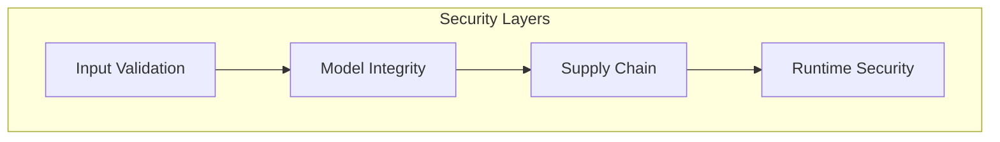

# Security Policy

## Purpose

This document outlines the security policy for the unbihexium project.

## Audience

Security researchers, contributors, and users.

## Supported Versions

| Version | Supported |
|---------|-----------|
| 1.0.x   | Yes       |
| < 1.0   | No        |

## Security Architecture



## Reporting a Vulnerability

Please report security vulnerabilities to: **security@unbihexium.org**

### Disclosure Timeline

$$T_{disclosure} = T_{report} + 90 \text{ days}$$

Where:
- $T_{report}$ = Date of initial report
- 90 days = Coordinated disclosure window

| Step | Timeline | Action |
|------|----------|--------|
| Report received | Day 0 | Acknowledgment within 48 hours |
| Initial assessment | Day 1-7 | Severity evaluation |
| Fix development | Day 7-60 | Patch development |
| Release | Day 60-90 | Coordinated disclosure |

## What to Include

- Description of the vulnerability
- Steps to reproduce
- Potential impact
- Suggested fix (if available)

## Model Integrity

All models include SHA256 checksums. Verification is mandatory:

```bash
unbihexium zoo verify model_id
```

## Supply Chain Security

- SBOM generated for each release
- Dependencies scanned with pip-audit
- SLSA Level 3 provenance attestations

## References

- [Responsible Use Policy](RESPONSIBLE_USE.md)
- [Privacy Policy](PRIVACY.md)
