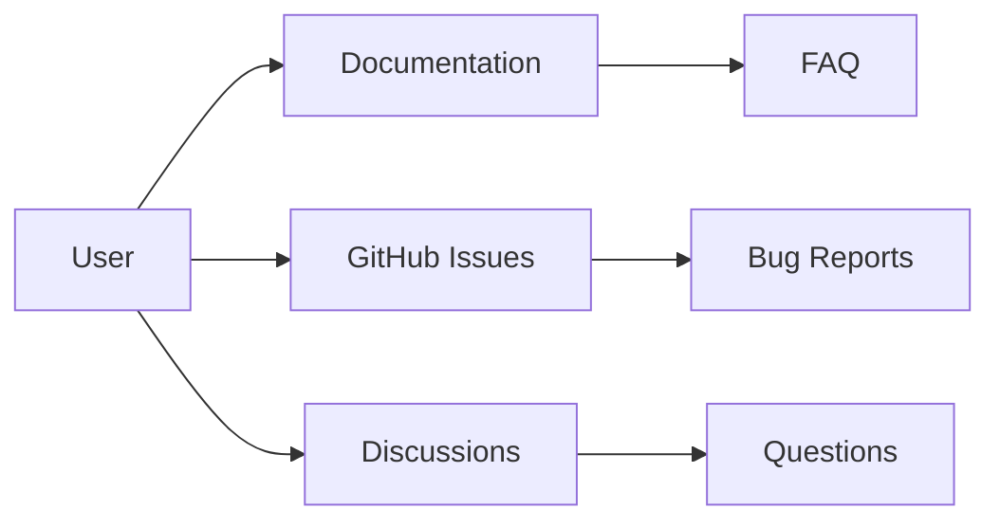

# Support

## Purpose

This document describes how to get help with unbihexium.

## Audience

Users seeking assistance and support.

## Support Channels

## Support Options

| Channel | Use Case | Response Time |
|---------|----------|---------------|
| Documentation | Self-service | Immediate |
| GitHub Issues | Bug reports | 1-5 days |
| Discussions | Questions | Community-driven |
| Security | Vulnerabilities | 48 hours |

## Issue Prioritization

$$P = severity \times impact \times urgency$$

Where each factor is rated 1-5.

## Before Opening an Issue

1. Check [FAQ](docs/faq.md)
2. Search existing issues
3. Verify with latest version
4. Prepare minimal reproduction

## Bug Reports

Include:
- Version information
- Steps to reproduce
- Expected vs actual behavior
- Error messages

## Feature Requests

Open a discussion first to gauge interest.

## Security Issues

Report to security@unbihexium.org (not public issues).

## References

- [FAQ](docs/faq.md)
- [Documentation](docs/index.md)
- [Contributing](CONTRIBUTING.md)
