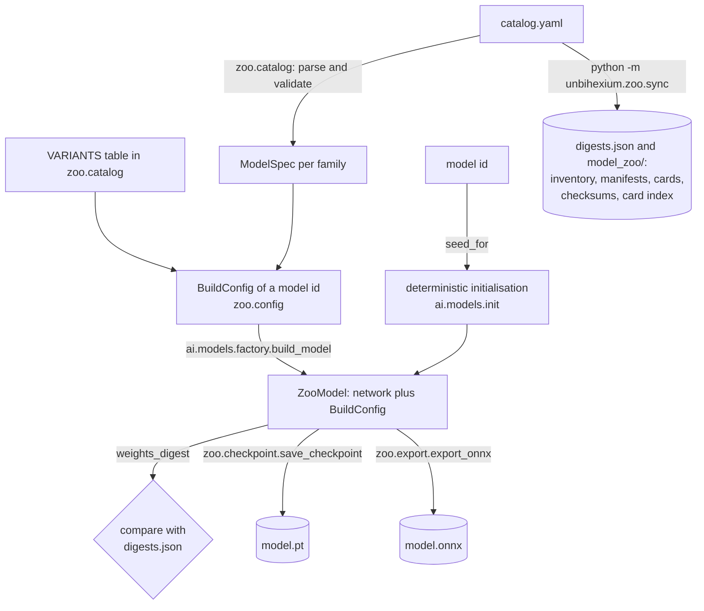

<!--
This Source Code Form is subject to the terms of the Mozilla Public
License, v. 2.0. If a copy of the MPL was not distributed with this
file, You can obtain one at https://mozilla.org/MPL/2.0/.

=============================================================================
Project     : Unbihexium
File        : docs/architecture/model_zoo_architecture.md
Title       : Model Zoo Architecture
Author      : Olaf Yunus Laitinen Imanov <yunus.z.imanov@helsinki.fi>
Affiliation : University of Helsinki
Copyright   : 2025-2026 Unbihexium OSS Foundation and contributors
Licence     : Mozilla Public License 2.0, see LICENSE.txt
Format      : Markdown (CommonMark with GitHub Flavored Markdown extensions)
=============================================================================
-->

# Model Zoo Architecture

| Field | Value |
| --- | --- |
| Document | UBX-DOC-503 |
| Version | 2.0 |
| Status | Active |
| Last reviewed | 2026-09-24 |
| Owner | Unbihexium maintainers (see [MAINTAINERS.md](../../MAINTAINERS.md)) |
| Applies to | Unbihexium 1.0.1 and the main branch, model catalogue 2.0.0 |

## Abstract

This document describes how the model zoo of Unbihexium is built, from the catalogue file to a model running in PyTorch or ONNX Runtime. It covers the catalogue `catalog.yaml` as the single source of truth, its parsed form `ModelSpec`, the four size variants, the network architectures, the deterministic starter weights derived from the model identifier and their published digests in `digests.json`, the generation of the `model_zoo/` directory by `unbihexium.zoo.sync`, the model registry and its sources, the local model store under `UNBIHEXIUM_CACHE`, the checkpoint format loaded with `torch.load(weights_only=True)`, and the ONNX export. It is written for contributors who change the zoo, users who need to understand what a zoo model is and how to verify it, and reviewers who assess its integrity. The code is in [src/unbihexium/zoo/](../../src/unbihexium/zoo/) and [src/unbihexium/ai/models/](../../src/unbihexium/ai/models/); every example was executed against it.

## Contents

- [1. Introduction](#1-introduction)
- [2. Components and data flow](#2-components-and-data-flow)
- [3. The catalogue](#3-the-catalogue)
- [4. Variants and architectures](#4-variants-and-architectures)
- [5. Starter weights and digests](#5-starter-weights-and-digests)
- [6. The model registry and model sources](#6-the-model-registry-and-model-sources)
- [7. The local model store](#7-the-local-model-store)
- [8. Checkpoints](#8-checkpoints)
- [9. ONNX export](#9-onnx-export)
- [10. Generated files and continuous checks](#10-generated-files-and-continuous-checks)
- [11. Examples](#11-examples)
- [12. Limitations](#12-limitations)
- [13. Related documents](#13-related-documents)
- [References](#references)

## 1. Introduction

### 1.1 What the zoo contains

The zoo defines 130 model families. Every family is available in four size variants (tiny, base, large and mega), which gives 520 models. **Apart from the 7 spectral index families (28 models), which compute exact formulas and have no weights, every model is an untrained starter model**: a complete, trainable network for its task whose initial weights are generated deterministically from its model identifier. Starter models have not been trained on Earth observation data, so their predictions are not meaningful until they are trained or fine-tuned on labelled data ([docs/model_zoo/training.md](../model_zoo/training.md)). No accuracy figures exist for the zoo.

No weights are distributed. The repository tracks no weight files, so nothing is stored in Git LFS, and there is no `model_zoo/assets` directory. Weights are produced on the user's machine when a model is built.

### 1.2 Terminology

| Term | Meaning |
| --- | --- |
| Family | A catalogue entry such as `ship_detector` |
| Variant | A size variant: `tiny`, `base`, `large` or `mega` |
| Model identifier | Family and variant joined by an underscore, for example `ship_detector_base`. `parse_model_id` splits it at the last underscore; a name without a variant suffix means the base variant |
| Starter weights | The deterministic initial weights of a model |
| Weights digest | The SHA-256 digest of the weights defined in Section 5.3 |

## 2. Components and data flow



| Module | Responsibility | Needs PyTorch |
| --- | --- | --- |
| [zoo/catalog.py](../../src/unbihexium/zoo/catalog.py) | Load and validate `catalog.yaml`; `Task`, `Variant`, `VariantSpec`, `ModelSpec`, lookups | No |
| [zoo/config.py](../../src/unbihexium/zoo/config.py) | `BuildConfig`, the effective configuration of one model | No |
| [zoo/registry.py](../../src/unbihexium/zoo/registry.py) | `ModelZooEntry`, `get_model`, `list_models`, `register_model` | No |
| [zoo/verify.py](../../src/unbihexium/zoo/verify.py) | File checksums and `sha256sum`-compatible files | No |
| [zoo/store.py](../../src/unbihexium/zoo/store.py) | `load_model`, `ensure_model`, the local store | Only when building or loading |
| [zoo/checkpoint.py](../../src/unbihexium/zoo/checkpoint.py) | Checkpoint format, save and load | Yes |
| [zoo/export.py](../../src/unbihexium/zoo/export.py) | ONNX export and verification | Yes, plus `onnx` and `onnxruntime` |
| [zoo/sync.py](../../src/unbihexium/zoo/sync.py) | Generation of `digests.json` and `model_zoo/` | Yes, unless digests are reused |
| [ai/models/](../../src/unbihexium/ai/models/) | Networks, building blocks, deterministic initialisation, spectral index modules | Yes |

## 3. The catalogue

### 3.1 Single source of truth

[src/unbihexium/zoo/catalog.yaml](../../src/unbihexium/zoo/catalog.yaml) is the only place where model families are defined. It is packaged with the wheel and read with `importlib.resources`, so it is available wherever the package is installed. Everything else about the zoo is derived from it: the model registry, the capability registry (one capability per family, see [capability_registry.md](capability_registry.md)), `digests.json`, and every file under [model_zoo/](../../model_zoo/). To add or change a family, edit the catalogue and run the synchronisation (Section 10).

### 3.2 File structure

The file has three top-level keys:

- `version`: the catalogue version, currently `"2.0.0"`, returned by `catalog_version()` and recorded in `digests.json` and the manifests;
- `band_sets`: named input band lists, for example `rgb: [red, green, blue]` or `s1: [VV, VH]`;
- `models`: a list of 130 family entries.

| Field | Meaning |
| --- | --- |
| `id` | Family identifier: lower case letters, digits and underscores |
| `name` | Human-readable name (default: the identifier) |
| `task` | `detection`, `segmentation`, `change_detection`, `dense_regression`, `scene_regression`, `enhancement`, `super_resolution` or `spectral_index` |
| `domain` | Capability domain (default `ai`); must be a `CapabilityDomain` value |
| `description` | What the model does once it is trained |
| `bands` | A band set name or an explicit list of band names of one acquisition |
| `dates` | Number of co-registered acquisitions stacked on the channel axis (default 1) |
| `outputs` | Class names, regression target names or output band names |
| `units` | Units of regression targets, one per output |
| `range` | Optional `[min, max]` of regression targets |
| `scale` | Upscaling factor, super-resolution only |
| `formula` | Formula identifier, spectral index only |
| `labels` | Reference data needed for training |
| `sources` | Suitable input data |

### 3.3 Validation

`_parse_entry` raises `CatalogError` (a subclass of `ValueError`) when an identifier is empty, not lower case or contains characters other than letters, digits and underscores; when the task is missing or unknown; when `outputs` is empty; when `units` does not have one entry per output; when `range` has a minimum not below its maximum; when `dates` is below 1; when a spectral index family has no `formula`; when a super-resolution family has a `scale` below 2; when `bands` names an unknown band set or is not a non-empty list of strings; and when a family identifier occurs twice. The parsed catalogue is cached for the lifetime of the process (`functools.lru_cache`).

### 3.4 `ModelSpec`

Each entry becomes a frozen dataclass `ModelSpec` with the fields of Section 3.2 and these derived properties:

| Property | Definition |
| --- | --- |
| `in_channels` | `len(bands) * dates` |
| `channel_names` | `bands` for one acquisition; otherwise `<band>_t1`, ..., `<band>_t<dates>` for every band, date by date |
| `out_channels` | `len(outputs)` |
| `sigmoid_output` | True for regression tasks with `range == [0, 1]` |
| `model_id(variant)` | `<family>_<variant>` |

`ModelSpec.to_dict()` adds `license: "MPL-2.0"`, the licence of every catalogue model.

### 3.5 Families by task

| Task | Families | Models | Architecture |
| --- | --- | --- | --- |
| Detection | 19 | 76 | CenterNet, anchor-free, output stride 4 [3] |
| Segmentation | 26 | 104 | U-Net [4] |
| Change detection | 6 | 24 | U-Net on the channel-stacked acquisitions |
| Dense regression | 49 | 196 | U-Net with a regression output |
| Scene regression | 11 | 44 | Encoder with a pooled regression head |
| Enhancement | 11 | 44 | U-Net, residual when the output bands do not outnumber the input bands and are not displacement fields |
| Super-resolution | 1 | 4 | Residual blocks without normalisation [5] and sub-pixel convolution [6] |
| Spectral index | 7 | 28 | Exact formula, no weights |
| **Total** | **130** | **520** | |

## 4. Variants and architectures

### 4.1 Variant hyperparameters

The variants are defined in code (`VARIANTS` in [zoo/catalog.py](../../src/unbihexium/zoo/catalog.py)), not in the catalogue, and apply to every family. Channel widths double at each encoder level and are capped at eight times the base width.

| Variant | Base channels | Encoder levels (depth) | Blocks per level | Head channels | Tile size | Size multiple $2^{\text{depth}}$ |
| --- | --- | --- | --- | --- | --- | --- |
| tiny | 16 | 3 | 1 | 32 | 256 | 8 |
| base | 32 | 4 | 1 | 64 | 256 | 16 |
| large | 48 | 4 | 2 | 96 | 512 | 16 |
| mega | 64 | 5 | 2 | 128 | 512 | 32 |

Parameter counts of the learned models, from `digests.json`:

| Variant | Smallest learned model | Largest learned model | All 130 models of the variant |
| --- | --- | --- | --- |
| tiny | 134,992 | 735,428 | 86,951,209 |
| base | 657,264 | 7,063,428 | 825,294,793 |
| large | 2,784,528 | 22,066,564 | 2,611,810,665 |
| mega | 6,109,872 | 60,460,548 | 7,131,069,449 |

The 520 models have 10,655,126,116 parameters in total; the spectral index models have none.

### 4.2 `BuildConfig`

`BuildConfig` ([zoo/config.py](../../src/unbihexium/zoo/config.py)) is the frozen record that describes one concrete model: `model_id`, `family`, `variant`, `task`, `channel_names`, `outputs`, `units`, `value_range`, `scale`, `formula`, `tile_size`, `customised` and `extra`. It is derived from a `ModelSpec` and a variant with `BuildConfig.from_spec`, stored in checkpoints, in ONNX metadata and in `config.json` of the store, and read by training, inference and export. `customised` is true when a model was built with input channels or outputs that differ from the catalogue (for example a four-band variant of an RGB model); such models are initialised from the same seed but cannot match the published digest. `extra` carries metadata added later, notably the per-band normalisation statistics recorded by training (`extra["normalization"]`). Because `BuildConfig` lives in the PyTorch-free `zoo` package, ONNX Runtime inference works without PyTorch.

### 4.3 Network selection

`unbihexium.ai.models.factory.build_model(name, variant=None, channel_names=None, outputs=None)` chooses the network by task: `CenterNet` for detection, `UNet` for segmentation, change detection, dense regression and enhancement, `SceneRegressor` for scene regression, `SuperResolutionNet` for super-resolution, and `SpectralIndex` for spectral index families (whose formula must match its channel count, otherwise `ValueError`). Classification networks return logits; regression networks with a value range end in a scaled sigmoid. The result is a `ZooModel`, a `torch.nn.Module` that holds the network and its `BuildConfig` and offers `num_parameters()`, `digest()` and `summary()`.

## 5. Starter weights and digests

### 5.1 Seed

The seed of a model is derived from its identifier ([ai/models/init.py](../../src/unbihexium/ai/models/init.py)):

$$
\text{seed}(\text{id}) = \text{uint32}_{\text{LE}}\big(\text{SHA-256}(\texttt{"unbihexium:"} \,\|\, \text{id})[0:4]\big),
$$

the first four bytes of the SHA-256 digest [7] of the prefixed identifier, read as an unsigned little-endian integer. For `ship_detector_tiny` the seed is 3315754281.

### 5.2 Initialisation

The numbers are drawn from `numpy.random.RandomState(seed)`. NumPy's legacy `RandomState` stream is frozen by its compatibility policy (NEP 19 [8]), so the same seed produces the same numbers in every NumPy release, unlike the generators and default initialisation schemes of PyTorch. Modules are visited in the order of `model.named_modules()`:

- convolution and linear weights are drawn from $\mathcal{N}(0, \sigma^2)$ with the He (Kaiming) standard deviation $\sigma = \sqrt{2 / \text{fan\_in}}$ [9], or with the layer's own `init_std` where a layer defines one;
- biases are zero, or the layer's `init_bias` (the CenterNet heatmap bias is $-2.19$, so that $\text{sigmoid}(-2.19) \approx 0.1$ [3]);
- group normalisation weights are one and biases zero.

### 5.3 Weights digest

The weights digest is the SHA-256 over all entries of the state dictionary in sorted key order, where each entry contributes the UTF-8 text `<key>:<shape>` followed by a newline and the little-endian float32 bytes of the tensor. It depends on the values of the weights, not on how a checkpoint file was serialised, so the same weights give the same digest in a `.pt` file, in memory and after a round trip.

### 5.4 Published digests

[src/unbihexium/zoo/digests.json](../../src/unbihexium/zoo/digests.json) is generated by the synchronisation (Section 10) and packaged with the wheel. It contains the catalogue version, a description of the algorithm and the initialisation, and, for each of the 520 model identifiers, `weights_digest` and `num_parameters`. The same digests are listed in [model_zoo/checksums.txt](../../model_zoo/checksums.txt) as lines of the form `<digest>  <model id>  # <n> parameters.` and in the per-family manifests.

### 5.5 Verification when a model is built

`unbihexium.zoo.load_model(model_id)` builds a catalogue model in memory and, with `verify=True` (the default), compares its weights digest with the published one; a mismatch raises `VerificationError`. The comparison is skipped when no digest is published or the model is customised. `unbihexium zoo build` and `ensure_model` use `load_model` and therefore perform the same check.

## 6. The model registry and model sources

### 6.1 `ModelZooEntry`

`ModelZooEntry` ([zoo/registry.py](../../src/unbihexium/zoo/registry.py)) describes one model: `model_id`, `spec` (the `ModelSpec`), `variant` (the `VariantSpec`), `weights_digest` and `num_parameters` from `digests.json`, `source`, `download_url`, `local_path`, `version` (`"2.0.0"`), `license` (`"MPL-2.0"`) and `tags`. The property `requires_training` is false only for spectral index families. `to_dict()` is what `unbihexium zoo info <model_id>` prints.

### 6.2 Lookups

`get_model(model_id)` returns a user-registered entry first, else the catalogue entry of the family and variant, else `None`; `ship_detector` resolves to `ship_detector_base`. `list_models(task=None, domain=None, variant=None)` returns the 520 catalogue entries followed by user entries, filtered. Both work without PyTorch.

### 6.3 Sources

| `source` | Meaning | How `load_model` obtains the model |
| --- | --- | --- |
| `build` (catalogue default) | Build locally from the catalogue | Build the network, apply the starter weights, compare with the published digest |
| `url` | Fetch a checkpoint from `download_url` | Download once into the store (Section 7.3), then load the checkpoint |
| `local` | Read a checkpoint from `local_path` | Load the checkpoint directly |

### 6.4 Registering trained models

`register_model(entry)` adds or replaces a user entry in memory; `unregister_model(model_id)` removes it. A typical use is to share a fine-tuned checkpoint inside a project under its own identifier, with `source="local"` or `source="url"`. Registrations are not persisted and must be repeated in every process.

## 7. The local model store

### 7.1 Location and layout

The store root is `$UNBIHEXIUM_CACHE/models`, with `UNBIHEXIUM_CACHE` defaulting to `~/.cache/unbihexium`. Each cached model has a directory:

```text
$UNBIHEXIUM_CACHE/models/<model_id>/
    model.pt        checkpoint (Section 8)
    model.onnx      ONNX export, when requested
    config.json     the entry of the model plus checkpoint_sha256
    model.sha256    sha256sum-compatible checksums of the files above
```

`cache_dir` arguments of the store functions and `--cache-dir` of `unbihexium zoo build` override the root.

### 7.2 Operations

| Function | Command | Behaviour |
| --- | --- | --- |
| `load_model(name, variant=None, verify=True)` | (used by all commands) | Returns a model in memory. A path ending in `.pt` is loaded as a checkpoint. Catalogue models are built in memory and nothing is written to disk |
| `ensure_model(model_id, cache_dir=None, onnx=False, force=False)` | `unbihexium zoo build [--onnx] [--force]` | Reuses a store entry only when every file matches `model.sha256` and `config.json` describes the entry; otherwise builds, downloads or copies the checkpoint (checking registered checkpoints against their registered digest), optionally exports ONNX, and writes `config.json` and `model.sha256` only when they change; returns the directory |
| `download_model(model_id, ...)` | hidden alias `unbihexium zoo download` | `ensure_model` without ONNX; returns the checkpoint path |
| `verify_model(model_id)` | `unbihexium zoo verify` | Checks every file listed in `model.sha256` (`model.pt`, `config.json` and, when present, `model.onnx`), loads the cached `model.pt` (which checks the digest recorded in it) and compares the weights with the entry's published digest; returns false when a file is missing, modified, unreadable or does not match |
| `verify_directory(directory)` | | Compares every file listed in `model.sha256` with its SHA-256 digest and returns a dictionary of results |
| `get_cached_model_path(model_id)` | `unbihexium zoo where` | Path of `model.pt`, or `None` |
| `list_cached()`, `is_model_cached(model_id)` | | Identifiers present in the store |
| `clear_cache(model_id=None)` | `unbihexium zoo clear [MODEL_ID] [--yes]` | Removes one model directory, or all of them (the CLI asks for confirmation unless `--yes`); identifiers with path separators or parent references are refused |

### 7.3 Downloads

Only entries registered with `source="url"` are downloaded. `_download` uses `requests` with HTTPS certificate verification (the `requests` default), a timeout of 60 seconds, streaming in 1 MiB chunks, and a limit of 4 GiB (`MAX_DOWNLOAD_BYTES`); the data is written to a `.part` file that replaces the target only when the download completes. The 520 catalogue models are never downloaded.

## 8. Checkpoints

### 8.1 Format

A checkpoint ([zoo/checkpoint.py](../../src/unbihexium/zoo/checkpoint.py)) is a file written with `torch.save` that contains only plain data:

```text
{
  "format": "unbihexium-checkpoint",
  "format_version": 1,
  "config": BuildConfig.to_dict(),
  "state_dict": {name: tensor, ...},
  "weights_digest": "<sha256>",
  "training": {...}
}
```

`save_checkpoint` writes to `<path>.tmp` and renames it, so a crash cannot leave a partial checkpoint under the final name.

### 8.2 Loading

`read_checkpoint` calls `torch.load(path, map_location="cpu", weights_only=True)`. With `weights_only=True` PyTorch uses a restricted unpickler that accepts tensors, primitive types and containers and refuses arbitrary Python objects [10], so loading a checkpoint cannot execute code through unpickling. The loader then rejects files whose `format` is not `unbihexium-checkpoint` and files written with a newer `format_version`. `load_checkpoint` rebuilds the network from the stored `BuildConfig` without initialisation, loads the state dictionary with `strict=True`, and, with `verify=True`, raises `CheckpointError` when the weights do not match the digest recorded in the checkpoint.

## 9. ONNX export

`export_onnx(model, path, verify=True, tolerance=1e-3)` ([zoo/export.py](../../src/unbihexium/zoo/export.py)) and `unbihexium zoo export MODEL OUTPUT [--no-verify]`:

1. export with the TorchScript-based exporter (`dynamo=False`) at opset 18, with one input `input` of shape $(N, C, H, W)$ and one output `output`, and dynamic batch, height and width (and output height and width for dense and strided outputs) [1];
2. store the `BuildConfig` as JSON under the metadata key `unbihexium_config` and the weights digest under `unbihexium_weights_digest`;
3. with verification, run the ONNX file in ONNX Runtime [2] on a random batch of two $96 \times 96$ images and raise `ExportError` if the output shape differs from PyTorch or the largest absolute difference exceeds `tolerance` times $\max(1, \max|y|)$.

The `Predictor` of `unbihexium.ai` opens an ONNX file with the `OnnxBackend`, which reads `unbihexium_config` from the metadata and refuses files without it; no PyTorch is needed at that point. Heights and widths should be multiples of the variant's size multiple (Section 4.1); the `Predictor` pads its tiles accordingly.

## 10. Generated files and continuous checks

### 10.1 Synchronisation

`python -m unbihexium.zoo.sync --root .` regenerates, from the catalogue:

| File | Content |
| --- | --- |
| `src/unbihexium/zoo/digests.json` | Weights digest and parameter count of all 520 models |
| `model_zoo/inventory.yaml` | One entry per family |
| `model_zoo/capability_to_models.yaml` | Family to model identifiers |
| `model_zoo/manifests/<family>.json` | Manifest per family, valid against [model_zoo/manifest.schema.json](../../model_zoo/manifest.schema.json) |
| `model_zoo/cards/<family>.md` | Model card per family |
| `model_zoo/checksums.txt` | `<digest>  <model id>` per model |
| `model_zoo/MODEL_CARDS.md` | Index of the model cards |

Computing the digests builds every model, which takes minutes on a CPU. `--skip-digests` reuses the existing `digests.json`, and `--check` writes nothing and exits with status 1 if any file is missing or out of date:

```bash
python -m unbihexium.zoo.sync --root . --check
# 265 model zoo files checked, 0 out of date.
```

The 265 files are the five fixed files plus one manifest and one card for each of the 130 families.

### 10.2 Continuous integration

The workflow [.github/workflows/model-zoo.yml](../../.github/workflows/model-zoo.yml) runs [.github/scripts/check_model_zoo.py](../../.github/scripts/check_model_zoo.py) when the zoo, its generator or the architectures change, weekly (Mondays 05:00 UTC) and on demand. The script checks that the generated files are in sync, that every manifest validates against the schema, and that there is exactly one manifest and one card per family. A second job rebuilds models and compares their digests with the published ones: the tiny variants on pull requests, all 520 models on pushes to main, weekly and by default on manual runs. This detects changes of the architecture or initialisation that would silently change the starter weights, and numerical drift between platforms. [scripts/validate_models.py](../../scripts/validate_models.py) performs the same comparison locally, runs a forward pass per model and, with `--onnx`, checks the ONNX export.

## 11. Examples

### 11.1 Python

```python
import numpy as np

from unbihexium.ai.inference import Predictor
from unbihexium.ai.models.init import seed_for
from unbihexium.zoo import ensure_model, get_model, get_spec, load_model, verify_model

# Catalogue lookups need neither PyTorch nor network access.
spec = get_spec("ship_detector")
entry = get_model("ship_detector_tiny")
print(spec.task.value, spec.bands, spec.outputs, entry.variant.tile_size, entry.num_parameters)

# Starter weights are derived from the model id and checked against digests.json.
print(seed_for("ship_detector_tiny"))
model = load_model("ship_detector_tiny")
print(model.digest() == entry.weights_digest)

# Build into the local store with an ONNX export, then verify the cached files.
directory = ensure_model("ship_detector_tiny", onnx=True)
print(sorted(p.name for p in directory.iterdir()), verify_model("ship_detector_tiny"))

# The ONNX file carries its configuration, so ONNX Runtime inference needs no PyTorch.
predictor = Predictor(directory / "model.onnx")
image = np.random.default_rng(0).uniform(0, 0.3, size=(3, 300, 300)).astype("float32")
boxes, scores, classes = predictor.detect(image, threshold=0.3)
print(type(predictor.backend).__name__, predictor.tile_size, boxes.shape[1])
```

Output, with `UNBIHEXIUM_CACHE` set to an empty temporary directory:

```text
detection ('red', 'green', 'blue') ('ship',) 256 730581
3315754281
True
['config.json', 'model.onnx', 'model.pt', 'model.sha256'] True
OnnxBackend 256 4
```

### 11.2 Command line

```bash
unbihexium zoo info ship_detector_tiny
unbihexium zoo build ship_detector_tiny --onnx
unbihexium zoo verify ship_detector_tiny
unbihexium zoo where ship_detector_tiny
unbihexium zoo list --task spectral_index --variant tiny
```

`zoo build` prints `Cached:` and the model directory, `zoo verify` prints `Verified: ship_detector_tiny`, `zoo where` prints the path of `model.pt`, and `zoo list` prints the seven spectral index models of the tiny variant with 0 parameters.

## 12. Limitations

- **Starter models only.** The zoo provides architectures and reproducible initial weights, not trained models (Section 1.1).
- **Registered checkpoints without a digest.** For entries registered with `source="local"` or `source="url"`, `load_model`, `ensure_model` and `verify_model` compare the weights with the entry's `weights_digest` when it is set; without it, only the digest recorded inside the checkpoint is checked, which detects damage but not replacement.
- **Local checksum files are not signatures.** `model.sha256` and `config.json` detect accidental modification of the store; someone who can write to the store can also rewrite them. The weights digest check against the packaged `digests.json` is the stronger control for catalogue models.
- **ONNX verification is a spot check.** The export is compared with PyTorch on one random input, which detects export errors but does not prove equivalence for every input.

## 13. Related documents

- [overview.md](overview.md): where the zoo sits in the package.
- [security_model.md](security_model.md): trust boundaries of model loading.
- [docs/security/model_integrity.md](../security/model_integrity.md): integrity controls in detail.
- [docs/model_zoo/model_catalog.md](../model_zoo/model_catalog.md), [docs/model_zoo/how_to_add_models.md](../model_zoo/how_to_add_models.md), [docs/model_zoo/training.md](../model_zoo/training.md), [docs/model_zoo/inference.md](../model_zoo/inference.md): using and extending the zoo.
- [model_zoo/MODEL_CARDS.md](../../model_zoo/MODEL_CARDS.md): index of the model cards.

## References

[1] ONNX project. Open Neural Network Exchange (ONNX) specification. 2026. <https://onnx.ai/onnx/intro/>

[2] Microsoft and contributors. ONNX Runtime. 2026. <https://onnxruntime.ai/docs/>

[3] Zhou, X., Wang, D. and Kraehenbuehl, P. Objects as points. arXiv:1904.07850. 2019. <https://arxiv.org/abs/1904.07850>

[4] Ronneberger, O., Fischer, P. and Brox, T. U-Net: Convolutional networks for biomedical image segmentation. MICCAI 2015, LNCS 9351, 234-241. 2015. <https://arxiv.org/abs/1505.04597>

[5] Lim, B., Son, S., Kim, H., Nah, S. and Lee, K. M. Enhanced deep residual networks for single image super-resolution. CVPR Workshops. 2017. <https://arxiv.org/abs/1707.02921>

[6] Shi, W., Caballero, J., Huszar, F., Totz, J., Aitken, A. P., Bishop, R., Rueckert, D. and Wang, Z. Real-time single image and video super-resolution using an efficient sub-pixel convolutional neural network. CVPR. 2016. <https://arxiv.org/abs/1609.05158>

[7] National Institute of Standards and Technology. Secure Hash Standard (SHS). FIPS PUB 180-4. 2015. <https://doi.org/10.6028/NIST.FIPS.180-4>

[8] NumPy developers. NEP 19: Random number generator policy. 2018. <https://numpy.org/neps/nep-0019-rng-policy.html>

[9] He, K., Zhang, X., Ren, S. and Sun, J. Delving deep into rectifiers: Surpassing human-level performance on ImageNet classification. ICCV. 2015. <https://arxiv.org/abs/1502.01852>

[10] PyTorch contributors. torch.load. 2026. <https://docs.pytorch.org/docs/stable/generated/torch.load.html>

<!--
=============================================================================
End of file docs/architecture/model_zoo_architecture.md
Part of Unbihexium (https://github.com/unbihexium-oss/unbihexium).
Cite the project as described in CITATION.cff.
=============================================================================
-->
