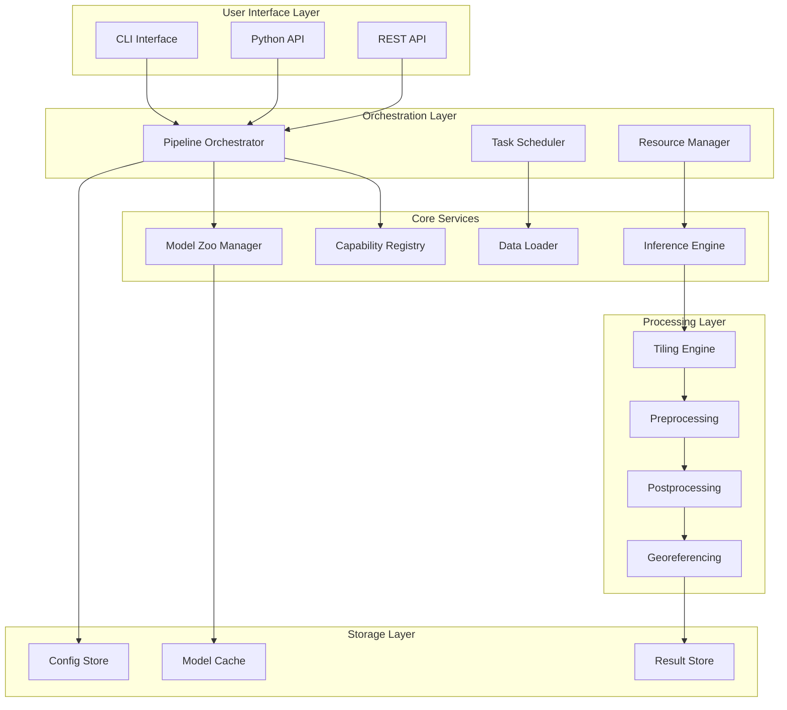
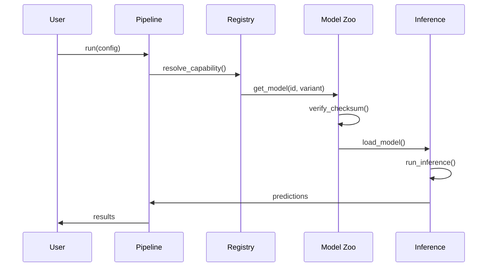

# Architecture Overview

## System Architecture

Unbihexium is designed as a modular, extensible framework for geospatial AI pipelines. The architecture follows a layered design with clear separation of concerns.

---

## High-Level Architecture

---

## Component Details

### Pipeline Orchestrator

Coordinates end-to-end processing workflows:

$$
\text{Pipeline} = \{S_1, S_2, ..., S_n\} \quad \text{where } S_i \text{ is a processing stage}
$$

### Capability Registry

Central registry of 130 base models across 12 domains:

| Attribute | Description |
|-----------|-------------|
| capability_id | Unique identifier |
| domain | Capability domain (01-12) |
| task | Task type (detection, segmentation, etc.) |
| models | Available model variants |
| metadata | Version, license, dependencies |

### Model Zoo Manager

Manages 520 model artifacts:

| Function | Description |
|----------|-------------|
| list() | Enumerate available models |
| get() | Load model by ID |
| download() | Fetch from remote |
| verify() | SHA256 validation |
| cache() | Local caching |

### Inference Engine

ONNX Runtime-based inference:

$$
\hat{y} = f_\theta(x) \quad \text{where } \theta \in \{tiny, base, large, mega\}
$$

---

## Data Flow

---

## Memory Model

Total memory consumption:

$$
M_{total} = M_{base} + M_{model} + N_{tiles} \times M_{tile}
$$

| Component | Tiny | Base | Large | Mega |
|-----------|------|------|-------|------|
| Model | 2 MB | 10 MB | 30 MB | 100 MB |
| Per Tile | 1 MB | 4 MB | 16 MB | 64 MB |
| Overhead | 50 MB | 100 MB | 200 MB | 500 MB |

---

## Extensibility

New capabilities can be added via:

1. Model registration in capability registry
2. Pipeline stage implementation
3. Pre/post-processor plugins
4. Custom data loaders
