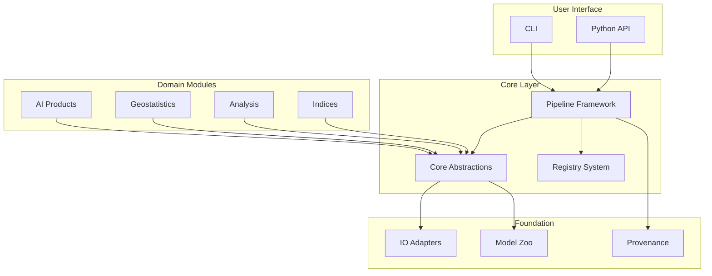

# Architecture Overview

High-level architecture of the unbihexium library.

## Module Structure

## Core Abstractions

| Abstraction | Purpose | Key Methods |
|-------------|---------|-------------|
| `Raster` | Geospatial raster data | `from_file`, `tiles`, `reproject` |
| `Vector` | Geospatial vector data | `from_wkt`, `buffer`, `intersects` |
| `Tile` | Processing unit | `data`, `offset` |
| `Pipeline` | Workflow orchestration | `add_step`, `run` |
| `Evidence` | Provenance tracking | `add_input`, `to_json` |

## Data Flow

$$\text{Input} \xrightarrow{\text{Load}} \text{Raster} \xrightarrow{\text{Tile}} \text{Process} \xrightarrow{\text{Mosaic}} \text{Output}$$

## Plugin Architecture

Extensibility through registries:

1. **Capability Registry**: Track all library features
2. **Model Registry**: Manage ML models
3. **Pipeline Registry**: Register processing pipelines

## Memory Management

Lazy loading and tiled processing for large datasets:

$$Memory_{peak} \approx n_{tiles} \times S^2 \times B \times dtype$$

Where:
- $n_{tiles}$ = concurrent tiles
- $S$ = tile size
- $B$ = bands
- $dtype$ = data type size

## Reproducibility

Every pipeline run produces:

- Configuration snapshot
- Input checksums
- Output checksums
- Provenance record

## Security

- SHA256 verification for models
- No telemetry by default
- SBOM for dependencies
