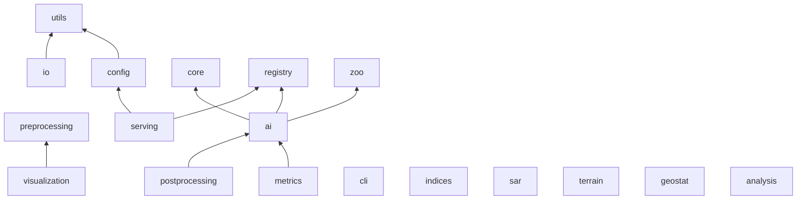
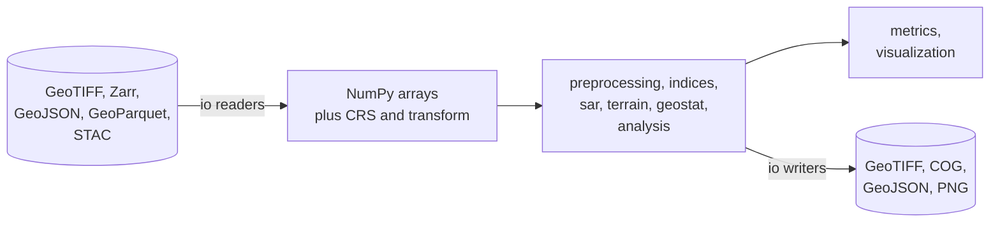
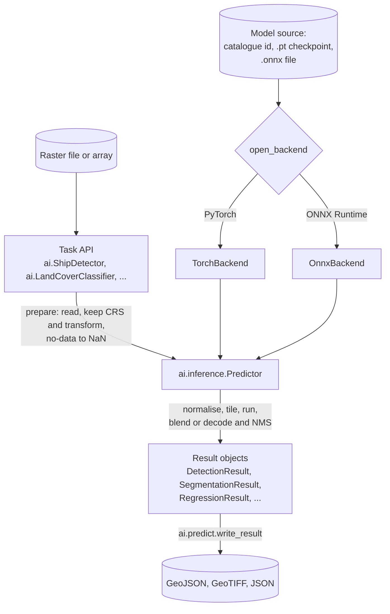

<!--
This Source Code Form is subject to the terms of the Mozilla Public
License, v. 2.0. If a copy of the MPL was not distributed with this
file, You can obtain one at https://mozilla.org/MPL/2.0/.

=============================================================================
Project     : Unbihexium
File        : docs/architecture/overview.md
Title       : Architecture Overview
Author      : Olaf Yunus Laitinen Imanov <yunus.z.imanov@helsinki.fi>
Affiliation : University of Helsinki
Copyright   : 2025-2026 Unbihexium OSS Foundation and contributors
Licence     : Mozilla Public License 2.0, see LICENSE.txt
Format      : Markdown (CommonMark with GitHub Flavored Markdown extensions)
=============================================================================
-->

# Architecture Overview

| Field | Value |
| --- | --- |
| Document | UBX-DOC-ARCH-OVERVIEW |
| Version | 2.0 |
| Status | Active |
| Last reviewed | 2026-09-24 |
| Owner | Unbihexium maintainers (see [MAINTAINERS.md](../../MAINTAINERS.md)) |
| Applies to | Unbihexium 1.0.1 and the main branch |

## Abstract

This document describes the software architecture of the `unbihexium` Python package as it is implemented in [src/unbihexium/](../../src/unbihexium/): the subpackages and what each one owns, the import dependencies between them, how optional third-party dependencies are isolated behind lazy imports, how data flows through the classical processing functions, the model zoo, the command line interface and the REST service, and the design principles that can be observed in the code. It is written for contributors who change the package, for users who want to know which parts of the library they can use without heavy dependencies, and for reviewers and auditors who need an accurate map of the code before reading the more specific architecture documents. Statements about import behaviour were checked by importing each subpackage in a clean interpreter; the detailed descriptions of the registries, the pipeline framework, the model zoo and the security model are in the companion documents listed in [Section 9](#9-related-documents).

## Contents

- [1. Introduction](#1-introduction)
- [2. Package layout](#2-package-layout)
- [3. Dependencies between subpackages](#3-dependencies-between-subpackages)
- [4. Optional dependencies and lazy imports](#4-optional-dependencies-and-lazy-imports)
- [5. Data flow](#5-data-flow)
- [6. Cross-cutting components](#6-cross-cutting-components)
- [7. Design principles visible in the code](#7-design-principles-visible-in-the-code)
- [8. Extension points and known structural limitations](#8-extension-points-and-known-structural-limitations)
- [9. Related documents](#9-related-documents)
- [References](#references)

## 1. Introduction

### 1.1 Scope

Unbihexium is a single Python distribution (`unbihexium` on [PyPI](https://pypi.org/project/unbihexium/)) with one import package, `unbihexium`, laid out under `src/`. It has three user-facing surfaces:

1. the Python API of the subpackages;
2. the command line interface `unbihexium`, declared in [pyproject.toml](../../pyproject.toml) as the entry point `unbihexium.cli.main:main`;
3. the REST service `unbihexium.serving`, a FastAPI [4] application started with an ASGI server such as uvicorn.

The package has no server component of its own, no background processes, no database and no persistent state other than the files the user asks it to write and the local model store described in [model_zoo_architecture.md](model_zoo_architecture.md).

### 1.2 Status of the models

The model zoo contains 520 models (130 families in the four variants tiny, base, large and mega). Apart from the 28 models of the 7 spectral index families, which compute exact formulas, every model is an untrained starter model with deterministic weights derived from its model identifier. The architecture described here is complete and trainable, but predictions of starter models are not meaningful until the models are trained on labelled data (see [docs/model_zoo/training.md](../model_zoo/training.md)).

### 1.3 Sources of truth

The facts in this document are taken from the source code and from the following files, which should be consulted when the code changes:

| Topic | Authoritative file |
| --- | --- |
| Package metadata, dependencies and extras | [pyproject.toml](../../pyproject.toml) |
| Model families of the zoo | [src/unbihexium/zoo/catalog.yaml](../../src/unbihexium/zoo/catalog.yaml) |
| Published starter weight digests | [src/unbihexium/zoo/digests.json](../../src/unbihexium/zoo/digests.json) |
| Command line interface | [src/unbihexium/cli/main.py](../../src/unbihexium/cli/main.py) and `unbihexium --help` |
| REST routes | [src/unbihexium/serving/app.py](../../src/unbihexium/serving/app.py) |
| Settings and their defaults | [src/unbihexium/config/settings.py](../../src/unbihexium/config/settings.py) |

## 2. Package layout

### 2.1 Subpackages

The top-level module [src/unbihexium/\_\_init\_\_.py](../../src/unbihexium/__init__.py) exports only `__version__` and `__version_tuple__`. Every other name is imported from a subpackage. The subpackages fall into five groups.

| Group | Subpackage | Responsibility |
| --- | --- | --- |
| Foundation | `unbihexium.utils` | Hashing, logging, timing, seeding, tile windows and atomic file writes |
| Foundation | `unbihexium.config` | Layered settings (`model`, `processing`, `serving` sections and `log_level`) |
| Foundation | `unbihexium.core` | Data model: `Raster`, `Vector`, `Tile` and `TileGrid`, `Scene`, `SensorModel`, `Product`, `ModelWrapper`, `Pipeline` and `PipelineRun`, `Evidence` and `ProvenanceRecord`, the spectral `IndexRegistry` |
| Data access | `unbihexium.io` | GeoTIFF and Cloud Optimized GeoTIFF, Zarr, GeoJSON, GeoParquet and STAC |
| Processing | `unbihexium.preprocessing` | Radiometric scaling, cloud and quality masks, stretches, pansharpening, resampling, tensor transforms |
| Processing | `unbihexium.indices` | Spectral indices and `compute_index` by name |
| Processing | `unbihexium.sar` | SAR calibration, speckle filters, polarimetry, interferometry |
| Processing | `unbihexium.terrain` | Terrain derivatives, hydrology, viewshed |
| Processing | `unbihexium.geostat` | Variograms, kriging, inverse distance weighting, spatial autocorrelation |
| Processing | `unbihexium.analysis` | Zonal statistics, suitability analysis, cost surfaces, least-cost paths and network analysis |
| Processing | `unbihexium.postprocessing` | Activations and thresholds, morphology, tile stitching, vectorisation |
| Processing | `unbihexium.metrics` | Classification, area, change, regression and image quality metrics |
| Processing | `unbihexium.visualization` | Colour maps, composites, relief shading, quicklooks and PNG output |
| Models | `unbihexium.zoo` | Model catalogue, variants, model registry, local store, checkpoints, digests, ONNX export, synchronisation of `model_zoo/` |
| Models | `unbihexium.ai` | Task APIs (for example `ShipDetector`, `LandCoverClassifier`), the tiled `Predictor`, result objects, datasets, training and evaluation, network architectures under `unbihexium.ai.models` |
| Models | `unbihexium.registry` | Capability, model and pipeline registries |
| Interfaces | `unbihexium.cli` | The `unbihexium` command (Click and Rich) |
| Interfaces | `unbihexium.serving` | `create_app()`, request schemas, inference service, request limits, API key and rate limiting |

The public names of each subpackage are listed in its `__all__` and described in [docs/reference/api.md](../reference/api.md).

### 2.2 Files outside the import package

Several directories of the repository are part of the architecture even though they are not imported at run time:

| Path | Role |
| --- | --- |
| [model_zoo/](../../model_zoo/) | Inventory, manifests, model cards and checksums, all generated from the catalogue by `python -m unbihexium.zoo.sync` |
| [fuzz/](../../fuzz/) | atheris fuzz targets for the GeoJSON and STAC parsers and their seed corpora |
| [tests/](../../tests/) | Unit, integration, end-to-end and benchmark tests |
| [scripts/](../../scripts/) | Lock file merging, model validation and Bash completion |
| [deploy/](../../deploy/), [Dockerfile](../../Dockerfile), [docker-compose.yml](../../docker-compose.yml) | Container image and deployment of the REST service |

## 3. Dependencies between subpackages

### 3.1 Measured import graph

The graph below shows which subpackages are loaded when a subpackage is imported. It was obtained by importing each subpackage in a fresh CPython 3.13 interpreter and listing the `unbihexium.*` modules in `sys.modules` afterwards, so it reflects module-level imports only; imports inside functions are covered in Section 3.3.

```mermaid
flowchart BT
    utils[utils]
    config[config] --> utils
    io[io] --> utils
    visualization[visualization] --> preprocessing[preprocessing]
    ai[ai] --> core[core]
    ai --> registry[registry]
    ai --> zoo[zoo]
    metrics[metrics] --> ai
    postprocessing[postprocessing] --> ai
    serving[serving] --> config
    serving --> registry
    cli[cli]
    indices[indices]
    sar[sar]
    terrain[terrain]
    geostat[geostat]
    analysis[analysis]
```

| Imported package | Other `unbihexium` subpackages loaded at import time |
| --- | --- |
| `unbihexium` | none (only `unbihexium._version`) |
| `core`, `indices`, `sar`, `terrain`, `geostat`, `analysis`, `preprocessing`, `registry`, `zoo`, `utils` | none |
| `io`, `config` | `utils` |
| `visualization` | `preprocessing` |
| `ai` | `core`, `registry`, `zoo` |
| `metrics`, `postprocessing` | `ai`, and through it `core`, `registry`, `zoo` |
| `serving` | `config`, `registry`, `utils` |
| `cli.main` | none |

### 3.2 Observations

- **The processing packages are independent.** `indices`, `sar`, `terrain`, `geostat`, `analysis` and `preprocessing` import no other subpackage at module level. They operate on NumPy arrays and can be used, tested and reviewed in isolation.
- **`core` is a leaf at import time.** It imports NumPy only; `rasterio`, GeoPandas, Shapely, pyproj, PyTorch and ONNX Runtime are imported inside the functions that need them (see the module header of [src/unbihexium/core/\_\_init\_\_.py](../../src/unbihexium/core/__init__.py)).
- **`metrics` and `postprocessing` depend on `ai`.** `metrics.image_quality` reuses `unbihexium.ai.evaluation`, and `postprocessing.activations` reuses `sigmoid` and `softmax` from `unbihexium.ai.decode`. Importing either package therefore loads `unbihexium.ai` and, through it, `core`, `registry` and `zoo`, but not PyTorch.
- **`zoo` and `ai` depend on each other, without an import cycle.** `ai` imports `zoo` at module level (catalogue, `BuildConfig`). `zoo` reaches into `ai` only in the modules that need PyTorch: `zoo.checkpoint` and `zoo.export` import `unbihexium.ai.models` at module level, and `zoo.store` imports the network factory inside `load_model` and `ensure_model`. `unbihexium.zoo/__init__.py` imports neither `checkpoint` nor `export`.
- **The CLI imports nothing at start-up.** `unbihexium.cli.main` imports Click, Rich and the version; each command imports the subpackages it needs inside its function body, so `unbihexium --help` does not load the model zoo or the processing code.

### 3.3 Imports inside functions

The following cross-package imports happen only when a function is called:

| Caller | Imports on demand |
| --- | --- |
| `cli.main` commands | `ai`, `core`, `registry`, `zoo` (per command) |
| `registry.capabilities`, `registry.models` | `zoo` (catalogue and model entries, loaded on first registry access) |
| `serving.app`, `serving.inference` | `ai` (task APIs, result types, pipelines) and `zoo` |
| `io` readers and writers | `core` (`Raster`) |
| `analysis` | `core` |
| `zoo.store` | `ai.models.factory`, `zoo.checkpoint`, `zoo.export` |

## 4. Optional dependencies and lazy imports

### 4.1 Core and optional dependencies

The core installation (the `dependencies` of [pyproject.toml](../../pyproject.toml)) contains NumPy, SciPy, rasterio, Shapely, GeoPandas, pyproj, Click, Rich, pydantic, PyYAML, requests, Pillow and scikit-image. Heavier or specialised components are optional extras [2]. The table maps each extra to the code that needs it.

| Extra | Packages | Needed by |
| --- | --- | --- |
| `torch` | torch, onnx | `unbihexium.ai.models`, `ai.training`, `ai.losses`, `zoo.checkpoint`, `zoo.export`, `zoo.load_model`, `zoo.ensure_model`, the `TorchBackend` of the `Predictor`, `unbihexium train`, `evaluate`, `zoo build`, `zoo export` |
| `onnx` | onnxruntime, onnx | The `OnnxBackend` of the `Predictor`, `ModelWrapper` with ONNX files, `unbihexium predict --backend onnx` |
| `serving` | fastapi, starlette, uvicorn | `unbihexium.serving` |
| `zarr` | zarr, numcodecs | `unbihexium.io.zarr_io` |
| `parquet` | pyarrow | `unbihexium.io.parquet` |

### 4.2 Lazy import pattern

The package applies one pattern consistently: a module that needs an optional dependency imports it inside the function or method that uses it, not at module level. Examples from the code:

- `TorchBackend.__init__` imports `torch`, and `OnnxBackend.__init__` imports `onnxruntime` ([src/unbihexium/ai/inference.py](../../src/unbihexium/ai/inference.py));
- `zoo.store.load_model` imports `unbihexium.ai.models.factory` and `unbihexium.zoo.checkpoint` when it is called;
- `io` readers import `rasterio`, `zarr`, `pyarrow` or `requests` inside the reading functions;
- modules that cannot work without PyTorch (`ai.models`, `ai.training`, `zoo.checkpoint`, `zoo.export`) import it at module level and are themselves imported only on demand.

`zoo.store` also uses `typing.TYPE_CHECKING` so that its type annotations can name `ZooModel` without importing PyTorch at run time.

### 4.3 Measured import footprint

The table shows which third-party packages from a list of heavy dependencies are loaded by importing each subpackage, measured in the same way as Section 3.1 (CPython 3.13.12, all extras installed, so a missing entry means "not imported", not "not installed").

| Imported package | Heavy third-party packages loaded |
| --- | --- |
| `unbihexium`, `core`, `io`, `indices`, `registry`, `utils` | none of torch, onnxruntime, rasterio, GeoPandas, Shapely, pyproj, FastAPI, SciPy, scikit-learn, scikit-image, PyYAML |
| `sar`, `terrain`, `geostat`, `analysis`, `preprocessing`, `visualization` | SciPy |
| `config`, `zoo` | PyYAML |
| `ai`, `metrics` | SciPy, PyYAML |
| `postprocessing` | SciPy, PyYAML, rasterio, Shapely, Click |
| `serving` | FastAPI, PyYAML |
| `cli.main` | Click |

In particular, importing `unbihexium.ai` or `unbihexium.zoo` does not import PyTorch or ONNX Runtime. Browsing the catalogue (`unbihexium zoo list`, `unbihexium.zoo.list_models`) therefore works in the core installation, while building, training and exporting models require the `torch` extra, and running exported ONNX files requires only the `onnx` extra.

### 4.4 Behaviour when an extra is missing

A missing extra surfaces as an `ImportError` (usually `ModuleNotFoundError`) at the call that needs it, not at import of the package. The CLI turns the most common case into an explanatory message: `unbihexium zoo build` and `unbihexium train` catch `ImportError` and print `install PyTorch with pip install 'unbihexium[torch]'`.

## 5. Data flow

### 5.1 Classical processing

The classical processing functions follow a plain array-in, array-out design. Readers in `unbihexium.io` (or `Raster.from_file` in `core`) return NumPy arrays together with their georeferencing (CRS and affine transform); processing functions take and return arrays; writers take arrays and georeferencing and write files.

```mermaid
flowchart LR
    F[(GeoTIFF, Zarr,<br/>GeoJSON, GeoParquet,<br/>STAC)] -->|io readers| A[NumPy arrays<br/>plus CRS and transform]
    A --> P[preprocessing, indices,<br/>sar, terrain, geostat,<br/>analysis]
    P --> M[metrics,<br/>visualization]
    P -->|io writers| O[(GeoTIFF, COG,<br/>GeoJSON, PNG)]
```

Nothing is cached between calls, and no function writes a file unless it is a writer called with a path.

### 5.2 Model inference

Model inference is layered: a task API selects and opens a model, the `Predictor` runs it tile by tile, and a result object converts the output to files.

```mermaid
flowchart TD
    I[(Raster file or array)] --> T[Task API<br/>ai.ShipDetector, ai.LandCoverClassifier, ...]
    T -->|prepare: read, keep CRS and transform,<br/>no-data to NaN| P[ai.inference.Predictor]
    S[(Model source:<br/>catalogue id, .pt checkpoint,<br/>.onnx file)] --> B{open_backend}
    B -->|PyTorch| TB[TorchBackend]
    B -->|ONNX Runtime| OB[OnnxBackend]
    TB --> P
    OB --> P
    P -->|normalise, tile, run,<br/>blend or decode and NMS| R[Result objects<br/>DetectionResult, SegmentationResult,<br/>RegressionResult, ...]
    R -->|ai.predict.write_result| O[(GeoJSON, GeoTIFF, JSON)]
```

The `BuildConfig` of the model travels with it: it is stored in checkpoints, in the metadata of ONNX exports and in `config.json` of the model store, so the `Predictor` knows the expected bands, task, tile size and normalisation statistics without consulting the catalogue. Details of the tiling are in [pipeline_framework.md](pipeline_framework.md), and details of the model sources in [model_zoo_architecture.md](model_zoo_architecture.md).

### 5.3 Training

`unbihexium.ai.training.train` (and the command `unbihexium train`) builds a starter model, trains it on a dataset folder or on synthetic samples, stores the per-band normalisation statistics estimated from the training data in `BuildConfig.extra["normalization"]`, and writes checkpoints with `zoo.checkpoint.save_checkpoint`. The resulting checkpoint is a model source for Section 5.2 and can be exported to ONNX with `unbihexium zoo export`.

### 5.4 Command line and REST service

Both interfaces are thin layers over the Python API:

- the CLI commands call `unbihexium.zoo`, `unbihexium.ai.predict.task_api` and `write_result`, `unbihexium.ai.training`, the pipeline registry and `core.index.IndexRegistry` (full reference: [docs/reference/cli.md](../reference/cli.md));
- the REST service decodes a JSON or base64 NumPy image in memory, validates it against the model entry and the configured limits, runs the task API through a small LRU cache of opened models and returns a JSON summary. It writes no request data to disk (see [security_model.md](security_model.md) and [PRIVACY.md](../../PRIVACY.md)).

## 6. Cross-cutting components

### 6.1 Configuration

`unbihexium.config` provides process-wide settings in the sections `model`, `processing` and `serving` plus `log_level`. Values are layered: dataclass defaults, then a YAML file (`load_config(path)` or the variable `UNBIHEXIUM_CONFIG`), then environment variables `UNBIHEXIUM_<SECTION>__<KEY>`, then explicit overrides. Unknown sections or keys are errors. This follows the principle of storing configuration in the environment [3]. The REST service reads its limits, API key, CORS origins and rate limit from the `serving` section. The model store location is not part of these settings; it is read from `UNBIHEXIUM_CACHE` directly by `zoo.store`. See [docs/getting_started/configuration.md](../getting_started/configuration.md).

### 6.2 Registries

`unbihexium.registry` holds three process-wide, class-level registries: capabilities (library algorithms plus one capability per model family), models (a validating view of the zoo) and pipelines (factories registered by the task APIs). They are described in [capability_registry.md](capability_registry.md).

### 6.3 Provenance

`unbihexium.core.evidence` records SHA-256 digests of files, byte strings and arrays and ties them to pipeline runs in a `ProvenanceRecord` whose own digest detects later modification. `core.pipeline.Pipeline` creates such a record for every run (see [pipeline_framework.md](pipeline_framework.md)).

### 6.4 Logging and output

The library logs through the standard `logging` module to the console; the level defaults to `WARNING` and is set with `UNBIHEXIUM_LOG_LEVEL` ([src/unbihexium/utils/log.py](../../src/unbihexium/utils/log.py)). There is no telemetry and no log file.

## 7. Design principles visible in the code

The following principles are not aspirations; each is implemented in the files named.

1. **One source of truth for the model zoo.** The 130 families are defined once in `catalog.yaml`. `digests.json` and every file under `model_zoo/` are generated from it by `unbihexium.zoo.sync`, and CI fails when a generated file is out of date ([model_zoo_architecture.md](model_zoo_architecture.md)).
2. **Determinism.** Starter weights are derived from a seed computed from the model identifier and drawn from NumPy's frozen legacy `RandomState` stream ([src/unbihexium/ai/models/init.py](../../src/unbihexium/ai/models/init.py)); pipelines seed Python, NumPy and, when loaded, PyTorch before the first step; registries return sorted listings.
3. **Cheap imports and optional heaviness.** Importing the package loads only the version; optional frameworks are imported where they are used (Section 4).
4. **Plain data at boundaries.** Checkpoints contain only tensors and dictionaries and are loaded with `torch.load(weights_only=True)` [5]; model configurations are JSON-serialisable dataclasses; ONNX files carry their configuration as metadata; REST responses are JSON with NaN converted to `null`; uploaded NumPy files are loaded with `allow_pickle=False`.
5. **Framework neutrality of inference.** `BuildConfig` lives in the PyTorch-free `zoo` package, and ONNX exports [1] carry it as metadata, so that ONNX Runtime inference does not need PyTorch.
6. **Validation with explicit errors.** Invalid inputs raise `ValueError` (or subclasses such as `CatalogError`) with a message that names the offending value; unknown identifiers raise `KeyError`. The REST layer maps these to HTTP 422 and 404.
7. **No implicit network access.** The library contacts the network only when the user queries a STAC API, registers a model with a download URL, or passes a remote path to a reader ([PRIVACY.md](../../PRIVACY.md), Section 4).
8. **Georeferencing is kept, not guessed.** Readers return CRS and transform with the data, task APIs pass them to the result objects, and plain arrays without georeferencing are given pixel coordinates (`EPSG:4326` label with the identity transform in `ZooTask.prepare`) rather than an invented location.

## 8. Extension points and known structural limitations

### 8.1 Extension points

| To add | Mechanism |
| --- | --- |
| A capability description | `unbihexium.registry.register_capability` ([capability_registry.md](capability_registry.md)) |
| A pipeline runnable from the CLI | `PipelineRegistry.register` decorator, or `ai.base.register_task_pipeline` for a task API ([pipeline_framework.md](pipeline_framework.md)) |
| A fine-tuned or project model | `unbihexium.zoo.register_model` with `source="local"` or `source="url"` ([model_zoo_architecture.md](model_zoo_architecture.md)) |
| A new model family | An entry in `catalog.yaml`, then `python -m unbihexium.zoo.sync --root .` ([docs/model_zoo/how_to_add_models.md](../model_zoo/how_to_add_models.md)) |

### 8.2 Known structural limitations

- **Three tiling implementations.** `core.tile` (`TileGrid`, `tile_offsets`), `utils.tiling` (`tile_starts`, `tile_windows`, `merge_tiles`) and `postprocessing.tiles` (`tile_positions`, `stitch_tiles`) implement the same edge-aligned tiling with slightly different interfaces and blending weights, and `ai.inference` has its own `tile_starts` and `blend_weights`. They produce the same tile origins for the same step, but changes must be made consistently.
- **Process-global registries.** The registries are class attributes shared by the whole process and have no locking except where noted in [capability_registry.md](capability_registry.md). Registrations are not persisted.
- **Pipelines appear only after `unbihexium.ai` is imported.** The five built-in pipelines are registered as a side effect of importing the task API modules; code that uses `PipelineRegistry` directly must import `unbihexium.ai` first, as the CLI and the REST service do.

## 9. Related documents

- [capability_registry.md](capability_registry.md): the capability, model and pipeline registries.
- [pipeline_framework.md](pipeline_framework.md): pipelines, run records, tiling and the `unbihexium pipeline` commands.
- [model_zoo_architecture.md](model_zoo_architecture.md): catalogue, starter weights, digests, local store and ONNX export.
- [security_model.md](security_model.md): trust boundaries and security controls.
- [docs/benchmarks/BENCHMARKS.md](../benchmarks/BENCHMARKS.md): the benchmark tests and measured results.
- [README.md](../../README.md), [SECURITY.md](../../SECURITY.md), [PRIVACY.md](../../PRIVACY.md): project overview, security policy and data handling.

## References

[1] ONNX project. Open Neural Network Exchange (ONNX) specification. 2026. <https://onnx.ai/onnx/intro/>

[2] Python Packaging Authority. Core metadata specifications: Provides-Extra. 2026. <https://packaging.python.org/en/latest/specifications/core-metadata/#provides-extra-multiple-use>

[3] Wiggins, A. The Twelve-Factor App, III. Config. 2017. <https://12factor.net/config>

[4] Ramirez, S. FastAPI. 2026. <https://fastapi.tiangolo.com/>

[5] PyTorch contributors. torch.load. 2026. <https://docs.pytorch.org/docs/stable/generated/torch.load.html>

<!--
=============================================================================
End of file docs/architecture/overview.md
Part of Unbihexium (https://github.com/unbihexium-oss/unbihexium).
Cite the project as described in CITATION.cff.
=============================================================================
-->
