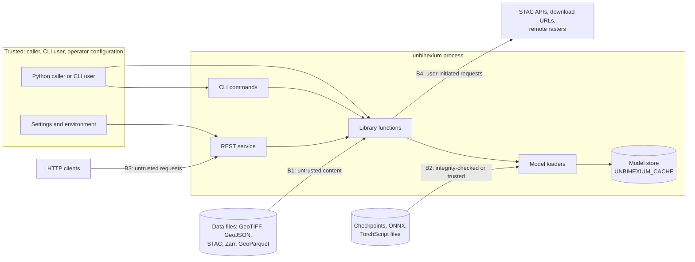

<!--
This Source Code Form is subject to the terms of the Mozilla Public
License, v. 2.0. If a copy of the MPL was not distributed with this
file, You can obtain one at https://mozilla.org/MPL/2.0/.

=============================================================================
Project     : Unbihexium
File        : docs/architecture/security_model.md
Title       : Security Model
Author      : Olaf Yunus Laitinen Imanov <yunus.z.imanov@helsinki.fi>
Affiliation : University of Helsinki
Copyright   : 2025-2026 Unbihexium OSS Foundation and contributors
Licence     : Mozilla Public License 2.0, see LICENSE.txt
Format      : Markdown (CommonMark with GitHub Flavored Markdown extensions)
=============================================================================
-->

# Security Model

| Field | Value |
| --- | --- |
| Document | UBX-DOC-ARCH-SECURITY-MODEL |
| Version | 2.0 |
| Status | Active |
| Last reviewed | 2026-09-24 |
| Owner | Unbihexium maintainers (see [MAINTAINERS.md](../../MAINTAINERS.md)) |
| Applies to | Unbihexium 1.0.1 and the main branch |

## Abstract

This document describes the security architecture of the Unbihexium software as implemented: the trust boundaries of the library, the command line interface, the REST service and model loading; how paths are handled; how GeoJSON and STAC input is validated in [src/unbihexium/io/geojson.py](../../src/unbihexium/io/geojson.py) and [src/unbihexium/io/stac.py](../../src/unbihexium/io/stac.py); which network connections the code opens; and how the parsers are fuzzed. Each control is tied to the code that implements it, and each known gap is stated. It is written for developers who embed the library, operators who deploy the REST service, and reviewers and auditors who assess the software. It complements, and does not repeat, the vulnerability reporting policy and supply-chain controls in [SECURITY.md](../../SECURITY.md) and the data handling statement in [PRIVACY.md](../../PRIVACY.md). No external security audit of Unbihexium has been performed.

## Contents

- [1. Introduction](#1-introduction)
- [2. Assets and trust boundaries](#2-assets-and-trust-boundaries)
- [3. The library](#3-the-library)
- [4. The command line interface](#4-the-command-line-interface)
- [5. Model loading](#5-model-loading)
- [6. The REST service](#6-the-rest-service)
- [7. Network access](#7-network-access)
- [8. Fuzzing and security testing](#8-fuzzing-and-security-testing)
- [9. Known gaps](#9-known-gaps)
- [10. Requirements for deployers](#10-requirements-for-deployers)
- [11. Related documents](#11-related-documents)
- [References](#references)

## 1. Introduction

### 1.1 Scope

The document covers the Python package under [src/unbihexium/](../../src/unbihexium/), the `unbihexium` command and the REST service `unbihexium.serving`. The container image, the deployment manifests, the release pipeline and the GitHub workflows are covered by [SECURITY.md](../../SECURITY.md), Sections 6 and 8. Third-party libraries (GDAL through rasterio, PROJ through pyproj, GEOS through Shapely, PyTorch, ONNX Runtime, FastAPI and Starlette) are outside the trust boundary of this project; vulnerabilities in them are reported upstream.

### 1.2 Conventions

The key words MUST, MUST NOT, SHOULD, SHOULD NOT and MAY in this document are to be interpreted as described in RFC 2119 [1] and RFC 8174 [2] when, and only when, they appear in all capitals. They are used in [Section 10](#10-requirements-for-deployers) and address deployers and integrators.

### 1.3 The models

The model zoo contains 520 models (130 families in four variants). Apart from the 28 models of the 7 spectral index families, which compute exact formulas, they are untrained starter models with deterministic weights. Their outputs are not meaningful until the models are trained; this is documented behaviour and not a security property. The integrity controls in [Section 5](#5-model-loading) establish which weights are loaded, not whether a model's predictions are correct.

## 2. Assets and trust boundaries

### 2.1 Assets

| Asset | Threat |
| --- | --- |
| The host running the library, CLI or service | Code execution through crafted input files or model files; file deletion or overwriting |
| Credentials | Leakage of the REST API key or of headers configured for STAC APIs |
| Integrity of results | Substituted or corrupted model weights; misleading output from untrusted models |
| Availability of the REST service | Resource exhaustion through large or many requests |
| Data processed | Disclosure of imagery or locations (see [PRIVACY.md](../../PRIVACY.md)) |

### 2.2 Boundaries



| Boundary | What crosses it | Trust assumption |
| --- | --- | --- |
| B1 | Content of data files and documents | Untrusted: parsers must reject malformed content with an exception and must not execute it |
| B2 | Model files | Catalogue models are verified against published digests; checkpoints are loaded without unpickling code; TorchScript and `torch.export` files MUST be trusted |
| B3 | HTTP requests to the REST service | Untrusted: size, shape and parameter limits apply; authentication is optional |
| B4 | Responses of remote servers the user chose | Partly trusted: the user selects the server, the library validates the parsed items |
| Caller and CLI user | Function arguments, command arguments, paths, configuration | Trusted: the library acts with the privileges of the calling process and does not sandbox paths chosen by its caller |

## 3. The library

### 3.1 General properties

- **No code from data.** The package contains no `eval` or `exec`. YAML is read only with `yaml.safe_load` (catalogue, settings, dataset descriptions); NumPy files are read with `allow_pickle=False` where the content can come from others (REST uploads, product archives).
- **Raster parsing is delegated.** GeoTIFF and other raster formats are parsed by GDAL through rasterio. Unbihexium adds no parser of its own for binary raster formats, so malformed-raster vulnerabilities are GDAL vulnerabilities.
- **Validation errors are exceptions.** Invalid input raises `ValueError` (or a subclass) with a message naming the problem. Callers that process untrusted files SHOULD catch `ValueError` and, for the reasons in [Section 9](#9-known-gaps), `RecursionError`.

### 3.2 GeoJSON validation

`geojson_problems(obj)` in [src/unbihexium/io/geojson.py](../../src/unbihexium/io/geojson.py) checks a parsed document against the structure of RFC 7946 [3] and returns a list of problems; `validate_geojson` raises `ValueError` with the first five problems if the list is not empty. It checks:

- the document is a JSON object whose `type` is a string naming a geometry, `Feature` or `FeatureCollection`;
- a `FeatureCollection` has a `features` array, and every feature is an object of type `Feature` with a `geometry` member that is null or a valid geometry, `properties` that is an object or null, and an `id`, when present, that is a string or a number;
- a `GeometryCollection` has a `geometries` array of valid geometries;
- coordinates have the nesting depth of the geometry type (0 for `Point` to 3 for `MultiPolygon`), and every position is an array of at least two numbers that are finite (booleans are rejected, and integers too large for a float count as not finite);
- a `LineString` has at least two positions; every linear ring of a `Polygon` or `MultiPolygon` has at least four positions and is closed.

`read_geojson(path, validate=True)` reads the file as UTF-8, raises `ValueError` for invalid JSON and validates the document. `write_geojson` validates before writing and replaces the target atomically. The validator does not check ring orientation (use `rewind`), self-intersection or coordinate ranges, and it does not interpret the legacy `crs` member beyond `geojson_crs`.

### 3.3 STAC validation and href resolution

`STACItem.from_dict` in [src/unbihexium/io/stac.py](../../src/unbihexium/io/stac.py) parses STAC items [4]. It requires the `type` `Feature`, a non-empty string `id`, a `datetime` or both `start_datetime` and `end_datetime`, and a `bbox` or a geometry from which one is computed, and checks that `properties` is an object; that `datetime`, `start_datetime` and `end_datetime` are strings or null; that `links` is an array of objects and `assets` an object of objects; that every `href` present is a string; that `stac_extensions` is an array of strings; that a non-null `geometry` is a valid GeoJSON geometry (not a `Feature` or `FeatureCollection`); and that `bbox` has 4 or 6 finite numbers. Times are parsed as RFC 3339 [5] by `parse_datetime`, which raises `ValueError` for other text, assumes UTC for times without offset, and truncates fractional seconds to microseconds; `parse_datetime_range` accepts open intervals (`..`) and rejects ranges that end before they start.

Asset hrefs are resolved by `resolve_href`: URLs with the schemes `http`, `https`, `s3`, `gs` and `file` and absolute paths are kept unchanged; relative hrefs are joined with the item URL or resolved against the directory of the item file. **Hrefs are not confined to the catalogue directory.** A relative href such as `../../secret.tif` resolves to a path outside it, and `load_from_stac(item, asset_key)` passes the resolved href to the raster reader. STAC documents therefore decide which local file or remote URL is read when their assets are loaded; items from untrusted sources SHOULD be inspected before `load_from_stac` is called.

`walk_catalog(path, max_depth=16)` follows `child` and `item` links of a local catalogue up to depth 16, visits each file once, and ignores links whose href contains `://`, so it never contacts the network. Like asset hrefs, relative links can point outside the catalogue directory, and every linked JSON file is read.

### 3.4 Path handling

- **Paths are taken as given.** Readers and writers use the paths their caller passes, without confinement to a base directory. Writers create missing parent directories where documented (for example `write_result`, `PipelineRun.to_json`, `save_checkpoint`) and overwrite existing files.
- **Atomic replacement.** GeoJSON files and configuration files are written with `atomic_write_text` ([src/unbihexium/utils/files.py](../../src/unbihexium/utils/files.py)); checkpoints are written to `<path>.tmp` and renamed; downloads are written to `<target>.part` and renamed on completion. Other writers (GeoTIFF, Zarr, GeoParquet, PNG) write in place.
- **Model store paths.** The store directory of a model is `$UNBIHEXIUM_CACHE/models/<model_id>`. `ensure_model`, `load_model` and `verify_model` accept only identifiers known to the model registry, but `clear_cache(model_id)` and `unbihexium zoo clear <model_id>` do not validate the identifier (see [Section 9](#9-known-gaps)).

## 4. The command line interface

The CLI runs with the privileges of the user who invokes it, and its arguments are trusted: file arguments are paths the user chose, and output files are created or overwritten at the given paths. Input paths of `predict` must exist (`click.Path(exists=True)`). Expected errors (unknown models, invalid input, failed verification, missing PyTorch) are printed as `Error: <message>` with exit status 1; two cases still end with a Python traceback: `unbihexium zoo export` with an unknown model identifier, and `unbihexium pipeline run` with a `-p` parameter that the task API does not accept. The CLI itself opens no outbound network connection and never sends data to the project; a URL given to `unbihexium index --input` is passed to rasterio and GDAL, which may fetch it.

## 5. Model loading

| Format | Loader | Protection |
| --- | --- | --- |
| Catalogue model (built locally) | `unbihexium.zoo.load_model`, `ensure_model` | Weights generated from the model identifier and compared with the digest in the packaged `digests.json`; mismatch raises `VerificationError` |
| Unbihexium checkpoint (`.pt`) | `zoo.checkpoint.load_checkpoint` | `torch.load(weights_only=True)`, which refuses to unpickle arbitrary Python objects [7]; format marker and version checked; weights compared with the digest recorded in the checkpoint; `strict=True` state dictionary loading |
| ONNX file (`.onnx`) | `ai.inference.OnnxBackend`, `core.model.ModelWrapper` | Executed by ONNX Runtime as a computation graph, not as Python code; `OnnxBackend` requires the `unbihexium_config` metadata. No digest check at load time |
| TorchScript archive, `torch.export` program (`.pt2`) | `core.model.ModelWrapper.load_weights` | None beyond PyTorch's own loaders. These formats contain programs; the files MUST come from a trusted source |
| Pickled scikit-learn style estimators | not loaded from files | `ModelWrapper` refuses to load them from a path and requires a fitted object instead |

A model that passes these checks is still only as trustworthy as its source: a malicious ONNX graph or checkpoint can produce misleading outputs or consume excessive memory and time. The detailed integrity mechanisms and their limits are described in [model_zoo_architecture.md](model_zoo_architecture.md) and [docs/security/model_integrity.md](../security/model_integrity.md).

## 6. The REST service

### 6.1 Controls

The service is created by `create_app()` in [src/unbihexium/serving/app.py](../../src/unbihexium/serving/app.py) with the settings of the `serving` section of `unbihexium.config`. The size, pixel and value limits address unrestricted resource consumption as described by OWASP [8]. The following behaviour was verified with the FastAPI test client.

| Control | Implementation | Default |
| --- | --- | --- |
| Request body size | `RequestSizeLimitMiddleware` answers 413 when the declared `Content-Length` exceeds the limit, and counts the bytes of bodies without `Content-Length` as they arrive, so chunked uploads cannot bypass it | 10 MiB (`UNBIHEXIUM_SERVING__MAX_REQUEST_BYTES`) |
| Image size | `ModelInferenceService.validate` answers 413 above the pixel limit (rows times columns) or the value limit (all bands); returned masks and value arrays are checked against the value limit too | 2048 x 2048 pixels, 16 x 1024 x 1024 values |
| Image decoding | Nested lists or a base64 `.npy` file loaded with `allow_pickle=False`; only boolean, integer and floating-point arrays of 2 or 3 dimensions are accepted; infinite values are rejected (422) | always on |
| Model selection | The model identifier in the path must be known to `ModelRegistry`; anything else, including path-like identifiers, gives 404. Clients cannot name files, devices or backends | always on |
| Request parameters | `PredictParameters` accepts only `threshold` and `iou_threshold` in [0, 1], `max_detections` in [1, 10000], `tile_size` in [32, 2048], `overlap` in [0, 0.9] and three response flags; other keys are ignored by the schema | always on |
| Band count | `ModelRegistry.check_input` rejects images whose band count does not match the model (422) | always on |
| Authentication | `APIKeyAuth`: header `X-API-Key`, compared with `hmac.compare_digest`; 401 when missing, 403 when wrong; applied to every route except `/health` | off (`UNBIHEXIUM_SERVING__API_KEY` unset) |
| Rate limiting | `RateLimiter`: token bucket per client IP address with a burst of one minute of requests; 429 with `Retry-After` | off (`UNBIHEXIUM_SERVING__RATE_LIMIT_PER_MINUTE=0`) |
| CORS | Starlette `CORSMiddleware` with methods GET and POST; credentials are allowed only when the origin list does not contain `*` | all origins (`*`) |
| Error disclosure | Unknown models 404, invalid input 422, over-limit 413; unexpected exceptions become 500 with `prediction failed: <exception type>` and no message or traceback | always on |
| Concurrency | Prediction routes are synchronous functions, run by FastAPI in its thread pool; opened models are kept in an LRU cache guarded by a lock | 4 models (`UNBIHEXIUM_SERVING__MODEL_CACHE_SIZE`) |

### 6.2 Properties to be aware of

- **Media types.** A body that is not JSON is rejected with 422 by request validation. `validate_content_type` in [src/unbihexium/serving/security.py](../../src/unbihexium/serving/security.py), which would answer 415, is defined but not used by any route.
- **Documentation routes.** `/docs` and `/openapi.json` are served without an API key even when one is configured. They describe the API but return no data.
- **Client identity for rate limiting.** The application keys the rate limit by `request.client.host` and does not read `X-Forwarded-For` itself. That address is the socket peer unless the ASGI server rewrites it from proxy headers (uvicorn does so only for proxy addresses it is configured to trust). Behind a reverse proxy without such configuration all clients share the proxy's address, so rate limiting SHOULD then be done at the proxy.
- **Transport.** The service speaks plain HTTP.
- **Disk writes.** Uploaded images and results are not written to disk. With the setting `UNBIHEXIUM_MODEL__BACKEND=onnx`, the service builds catalogue models into the model store (`ensure_model(..., onnx=True)`) the first time they are requested.

## 7. Network access

Unbihexium has no telemetry and no update check ([PRIVACY.md](../../PRIVACY.md), Section 4). The code opens connections only in these cases, each initiated by the caller:

| Case | Code | Controls |
| --- | --- | --- |
| STAC API search | `STACClient.search`, `STACClient.collections`, `search_stac` | `requests` with certificate verification, timeout 30 s per request (configurable), at most `max_pages` (default 100) pages, `limit` capped at 1000 in the request body; the transport can be replaced |
| Download of a registered checkpoint | `zoo.store._download` for entries with `source="url"` | `requests` with certificate verification, timeout 60 s, 4 GiB limit, `.part` file renamed on completion, checkpoint loaded with `weights_only=True` |
| Remote raster paths | rasterio and GDAL, when the caller passes a URL instead of a path (including resolved STAC hrefs) | GDAL's own configuration |

The STAC client follows the `next` links returned by the API, with the method and body those links specify, **to whatever URL the API returns, including other hosts, and sends the configured `headers` (for example an `Authorization` token) with every request**. Only APIs trusted with those headers SHOULD be queried with credentials.

## 8. Fuzzing and security testing

### 8.1 Fuzz targets

Coverage-guided fuzzing with atheris [6] exercises the two parsers that handle documents from other parties:

| Target | Functions | Properties checked |
| --- | --- | --- |
| [fuzz/fuzz_geojson.py](../../fuzz/fuzz_geojson.py) | `geojson_problems`, `geojson_bounds`, `rewind` | For any UTF-8 JSON input: the validator returns a list of strings; for valid documents the bounds are finite and ordered, `rewind` keeps the document valid and is idempotent |
| [fuzz/fuzz_stac.py](../../fuzz/fuzz_stac.py) | `parse_datetime`, `parse_datetime_range`, `STACItem.from_dict`, `STACItem.to_dict` | Parsed times are timezone-aware, ranges are ordered, invalid items raise only `ValueError`, and items survive a `to_dict` and `from_dict` round trip |

Any other exception is a crash. The seed corpora are in [fuzz/corpus/](../../fuzz/corpus/); inputs that crashed a target are added as `regression_*` files.

### 8.2 Continuous fuzzing and replay

[.github/workflows/fuzz.yml](../../.github/workflows/fuzz.yml) runs each target on CPython 3.12 for 2 minutes when `src/unbihexium/io/`, `fuzz/` or the fuzzing environment change on pushes to main and on pull requests, for 20 minutes weekly, and on demand; crashing inputs are uploaded as workflow artifacts. [tests/unit/test_fuzz_targets.py](../../tests/unit/test_fuzz_targets.py) runs both targets on every corpus file without atheris, so the regression inputs are replayed by the ordinary test suite on every supported Python version. To replay the corpus, and to fuzz a target locally on a copy of its corpus (the fuzzer adds new inputs to the corpus directory it is given; atheris must be installable for the Python version in use; CI uses CPython 3.12, and the commands below were tested with CPython 3.11):

```bash
python -m pytest tests/unit/test_fuzz_targets.py
python -m pip install atheris
cp -r fuzz/corpus/geojson /tmp/geojson-corpus
python fuzz/fuzz_geojson.py /tmp/geojson-corpus -max_total_time=60
```

### 8.3 Other checks

Static analysis (CodeQL, Bandit, ruff security rules), dependency auditing, secret scanning and container scanning are described in [SECURITY.md](../../SECURITY.md), Section 6.

## 9. Known gaps

The following gaps were found while preparing this document and are reproducible with the current code. They have low severity in the default deployment, but integrators who pass untrusted values to the functions concerned SHOULD take them into account.

1. **`clear_cache` does not validate the model identifier.** `unbihexium zoo clear ../victim` removes the directory `$UNBIHEXIUM_CACHE/victim`, outside the model store, without asking for confirmation (the confirmation applies only to clearing all models). Pass only identifiers from `list_cached()` to `clear_cache`.
2. **Deeply nested GeometryCollections raise `RecursionError`.** `geojson_problems`, and therefore `validate_geojson`, `read_geojson` and `STACItem.from_dict`, recurse once per nesting level; a document with 2000 nested `GeometryCollection` objects raised `RecursionError` instead of returning a problem. RFC 7946 advises against nested geometry collections [3]. Catch `RecursionError` when validating untrusted documents.
3. **STAC credentials follow `next` links to any host** (Section 7).
4. **Rate limiter state is unbounded.** `RateLimiter` keeps one bucket per client address for the lifetime of the process.
5. **`unbihexium zoo verify` checks only the checkpoint.** A modified `model.onnx` in the store is not detected by it; `unbihexium.zoo.verify_directory` compares all files with `model.sha256`.

Report other weaknesses privately as described in [SECURITY.md](../../SECURITY.md), through a [GitHub private security advisory](https://github.com/unbihexium-oss/unbihexium/security/advisories/new).

## 10. Requirements for deployers

1. Operators exposing the REST service beyond the local host MUST terminate TLS in front of it and SHOULD set `UNBIHEXIUM_SERVING__API_KEY`, restrict `UNBIHEXIUM_SERVING__CORS_ORIGINS` and set `UNBIHEXIUM_SERVING__RATE_LIMIT_PER_MINUTE` or an equivalent limit at the proxy ([SECURITY.md](../../SECURITY.md), Section 8).
2. Integrators MUST NOT load TorchScript or `torch.export` files from untrusted sources, and SHOULD load checkpoints and ONNX files only from sources they trust.
3. Integrators processing untrusted GeoJSON or STAC documents SHOULD catch `ValueError` and `RecursionError`, and SHOULD review asset hrefs before loading them.
4. Integrators MUST NOT pass unvalidated input as a model identifier to `clear_cache`.
5. Deployers processing imagery of people MUST meet their data protection obligations ([PRIVACY.md](../../PRIVACY.md), Section 8, which is not legal advice).

## 11. Related documents

- [SECURITY.md](../../SECURITY.md): reporting, supported versions, supply-chain controls, secure operation.
- [PRIVACY.md](../../PRIVACY.md): data processed, network access and storage.
- [RESPONSIBLE_USE.md](../../RESPONSIBLE_USE.md): intended and prohibited uses.
- [docs/security/model_integrity.md](../security/model_integrity.md), [docs/security/secrets_and_tokens.md](../security/secrets_and_tokens.md), [docs/security/supply_chain_security.md](../security/supply_chain_security.md), [docs/security/vulnerability_management.md](../security/vulnerability_management.md).
- [model_zoo_architecture.md](model_zoo_architecture.md): starter weights, digests and checkpoints.

## References

[1] Bradner, S. Key words for use in RFCs to Indicate Requirement Levels. RFC 2119. 1997. <https://www.rfc-editor.org/rfc/rfc2119>

[2] Leiba, B. Ambiguity of Uppercase vs Lowercase in RFC 2119 Key Words. RFC 8174. 2017. <https://www.rfc-editor.org/rfc/rfc8174>

[3] Butler, H., Daly, M., Doyle, A., Gillies, S., Hagen, S. and Schaub, T. The GeoJSON Format. RFC 7946. 2016. <https://www.rfc-editor.org/rfc/rfc7946>

[4] STAC contributors. SpatioTemporal Asset Catalog specification, version 1.0.0. 2021. <https://github.com/radiantearth/stac-spec>

[5] Klyne, G. and Newman, C. Date and Time on the Internet: Timestamps. RFC 3339. 2002. <https://www.rfc-editor.org/rfc/rfc3339>

[6] Google. Atheris: a coverage-guided Python fuzzing engine. 2026. <https://github.com/google/atheris>

[7] PyTorch contributors. torch.load. 2026. <https://docs.pytorch.org/docs/stable/generated/torch.load.html>

[8] OWASP Foundation. OWASP API Security Top 10, API4:2023 Unrestricted Resource Consumption. 2023. <https://owasp.org/API-Security/editions/2023/en/0xa4-unrestricted-resource-consumption/>

<!--
=============================================================================
End of file docs/architecture/security_model.md
Part of Unbihexium (https://github.com/unbihexium-oss/unbihexium).
Cite the project as described in CITATION.cff.
=============================================================================
-->
