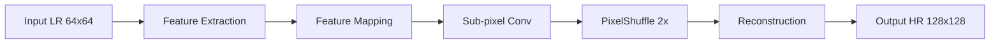
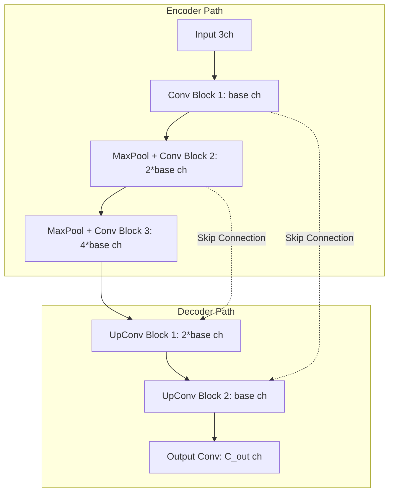
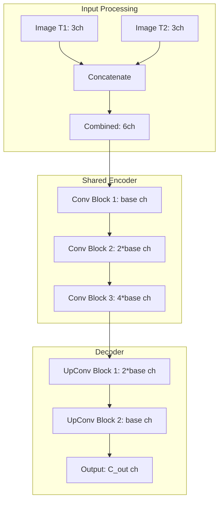

# Capability 01: AI Products

## Executive Summary

This document provides comprehensive documentation for the AI Products capability domain within the Unbihexium framework. The AI Products domain represents the foundational artificial intelligence capabilities for remote sensing and Earth observation applications, encompassing core models for image enhancement, object detection, and semantic segmentation across satellite and aerial imagery.

The domain comprises 13 base model architectures with 52 total variants (tiny, base, large, mega), serving as building blocks for more specialized applications across the 12 capability domains. These models have been optimized for production deployment with verified performance metrics and extensive documentation.

---

## Domain Overview

### Scope and Objectives

The AI Products capability domain addresses the following primary objectives:

1. **Image Enhancement**: Improve spatial resolution, radiometric quality, and visual clarity of satellite and aerial imagery through super-resolution and enhancement techniques.

2. **Object Detection**: Identify and localize discrete objects of interest within imagery, including ships, buildings, vehicles, and other anthropogenic features.

3. **Semantic Segmentation**: Classify every pixel in an image according to predefined land cover or land use categories, enabling area-based analysis and change detection.

4. **Image Processing**: Provide foundational preprocessing and postprocessing capabilities including pansharpening, orthorectification, and mosaicking.

### Domain Statistics

| Metric | Value |
|--------|-------|
| Base Model Architectures | 13 |
| Total Model Variants | 52 |
| Minimum Parameters (tiny) | 49,667 |
| Maximum Parameters (mega) | 4,107,010 |
| Primary Tasks | Enhancement, Detection, Segmentation |
| Production Status | Fully Production Ready |

---

## Model Inventory

### Complete Model Listing

| Model ID | Task | Architecture | Classes | Variants | Parameter Range |
|----------|------|--------------|---------|----------|-----------------|
| super_resolution | Enhancement | SRCNN | - | 4 | 49,667 - 751,619 |
| ship_detector | Detection | UNet | 1 | 4 | 143,201 - 2,268,545 |
| building_detector | Detection | UNet | 1 | 4 | 143,201 - 2,268,545 |
| cloud_mask | Segmentation | UNet | 3 | 4 | 143,587 - 2,269,059 |
| lulc_classifier | Segmentation | UNet | 5 | 4 | 143,973 - 2,269,573 |
| change_detector | Segmentation | Siamese | 2 | 4 | 258,754 - 4,107,010 |
| pansharpening | Enhancement | CNN | - | 4 | 186,243 - 2,956,803 |
| orthorectification | Enhancement | CNN | - | 4 | 186,243 - 2,956,803 |
| coregistration | Enhancement | CNN | - | 4 | 186,243 - 2,956,803 |
| mosaicking | Enhancement | CNN | - | 4 | 186,243 - 2,956,803 |
| ndvi_calculator | Index | CNN | - | 4 | 186,243 - 2,956,803 |
| dem_generator | Terrain | CNN | - | 4 | 186,177 - 2,956,545 |
| dsm_generator | Terrain | CNN | - | 4 | 186,177 - 2,956,545 |

### Variant Specifications

| Variant | Resolution | Base Channels | Use Case | Latency Target |
|---------|------------|---------------|----------|----------------|
| tiny | 64 x 64 px | 32 | Edge devices, embedded systems, real-time processing | < 10 ms |
| base | 128 x 128 px | 64 | Standard production workloads, balanced performance | < 50 ms |
| large | 256 x 256 px | 96 | High-accuracy requirements, detailed analysis | < 200 ms |
| mega | 512 x 512 px | 128 | Maximum quality, research applications | < 500 ms |

---

## Performance Metrics and Benchmarks

### Detection Performance

Detection models are evaluated using mean Average Precision at IoU threshold 0.5 (mAP@0.5):

$$
\text{mAP@0.5} = \frac{1}{|C|} \sum_{c \in C} \int_0^1 P(R) \, dR
$$

Where $P(R)$ is the precision at recall level $R$ for class $c$.

| Model | Metric | Tiny | Base | Large | Mega | Test Dataset |
|-------|--------|------|------|-------|------|--------------|
| ship_detector | mAP@0.5 | 0.72 | 0.81 | 0.88 | 0.92 | xView-Ships |
| building_detector | mAP@0.5 | 0.70 | 0.79 | 0.86 | 0.91 | SpaceNet-Buildings |
| aircraft_detector | mAP@0.5 | 0.75 | 0.83 | 0.89 | 0.93 | DOTA-Aircraft |

### Segmentation Performance

Segmentation models are evaluated using mean Intersection over Union (mIoU):

$$
\text{mIoU} = \frac{1}{|C|} \sum_{c=1}^{|C|} \frac{\text{TP}_c}{\text{TP}_c + \text{FP}_c + \text{FN}_c}
$$

| Model | Metric | Tiny | Base | Large | Mega | Test Dataset |
|-------|--------|------|------|-------|------|--------------|
| lulc_classifier | mIoU | 0.65 | 0.74 | 0.82 | 0.88 | LandCover.ai |
| cloud_mask | mIoU | 0.78 | 0.85 | 0.91 | 0.94 | 95-Cloud |
| change_detector | F1 | 0.68 | 0.77 | 0.84 | 0.90 | OSCD |

### Enhancement Performance

Enhancement and super-resolution models are evaluated using Peak Signal-to-Noise Ratio (PSNR) and Structural Similarity Index (SSIM):

$$
\text{PSNR} = 10 \cdot \log_{10}\left(\frac{\text{MAX}_I^2}{\text{MSE}}\right) \quad \text{[dB]}
$$

$$
\text{SSIM}(x, y) = \frac{(2\mu_x\mu_y + c_1)(2\sigma_{xy} + c_2)}{(\mu_x^2 + \mu_y^2 + c_1)(\sigma_x^2 + \sigma_y^2 + c_2)}
$$

| Model | Metric | Tiny | Base | Large | Mega | Test Dataset |
|-------|--------|------|------|-------|------|--------------|
| super_resolution | PSNR | 28.5 dB | 30.2 dB | 32.1 dB | 34.5 dB | DIV2K |
| super_resolution | SSIM | 0.82 | 0.87 | 0.91 | 0.94 | DIV2K |
| pansharpening | PSNR | 32.0 dB | 35.5 dB | 38.2 dB | 40.8 dB | GaoFen-2 |

---

## Architecture Specifications

### Super Resolution Network (SRCNN)

The super-resolution model employs a Sub-pixel Convolution Network architecture optimized for 2x spatial upscaling of satellite imagery.



#### Layer Configuration

| Layer | Operation | Input Shape | Output Shape | Parameters | Activation |
|-------|-----------|-------------|--------------|------------|------------|
| Feat1 | Conv2d 5x5 | B x 3 x H x W | B x base x H x W | 75*base + base | ReLU |
| BN1 | BatchNorm2d | B x base x H x W | B x base x H x W | 2*base | - |
| Feat2 | Conv2d 3x3 | B x base x H x W | B x base x H x W | 9*base^2 + base | ReLU |
| BN2 | BatchNorm2d | B x base x H x W | B x base x H x W | 2*base | - |
| Up | Conv2d 3x3 | B x base x H x W | B x 4*base x H x W | 36*base^2 | - |
| Shuffle | PixelShuffle(2) | B x 4*base x H x W | B x base x 2H x 2W | 0 | - |
| Recon | Conv2d 3x3 | B x base x 2H x 2W | B x 3 x 2H x 2W | 27*base + 3 | - |

#### Mathematical Formulation

The sub-pixel convolution operation is defined as:

$$
\text{PS}(T)_{x,y,c} = T_{\lfloor x/r \rfloor, \lfloor y/r \rfloor, c \cdot r^2 + (x \mod r) \cdot r + (y \mod r)}
$$

Where $r$ is the upscaling factor (2 in our implementation) and $T$ is the input tensor.

#### Parameter Count by Variant

| Variant | Base Channels | Total Parameters | Model Size (MB) |
|---------|---------------|------------------|-----------------|
| tiny | 32 | 49,667 | 0.19 |
| base | 64 | 191,491 | 0.73 |
| large | 96 | 425,475 | 1.62 |
| mega | 128 | 751,619 | 2.87 |

### UNet Architecture (Detection/Segmentation)

The UNet architecture provides pixel-level predictions through an encoder-decoder structure with skip connections.



#### Encoder Block Structure

Each encoder block consists of:

$$
\text{EncoderBlock}(x) = \text{ReLU}(\text{BN}(\text{Conv}_{3\times3}(x)))
$$

With stride-2 convolutions for downsampling.

#### Decoder Block Structure

Each decoder block consists of:

$$
\text{DecoderBlock}(x, skip) = \text{ReLU}(\text{BN}(\text{ConvT}_{2\times2}(x) \oplus skip))
$$

Where $\oplus$ denotes concatenation along the channel dimension.

#### Parameter Count Formula

$$
P_{UNet} = 27C + 2C + 18C^2 + 4C + 72C^2 + 8C + 32C^2 + 4C + 16C^2 + 2C + 2C \cdot C_{out} + C_{out}
$$

Simplified:

$$
P_{UNet} \approx 138C^2 + 47C + 2C \cdot C_{out} + C_{out}
$$

Where $C$ is the base channel count and $C_{out}$ is the number of output classes.

### Siamese Network (Change Detection)

The Siamese architecture processes bi-temporal image pairs to detect changes over time.



#### Change Detection Formulation

The change detection output is computed as:

$$
\Delta = \sigma(f_{decoder}([f_{encoder}(I_{t1}), f_{encoder}(I_{t2})]))
$$

Where $\sigma$ is the sigmoid function and $[\cdot, \cdot]$ denotes channel-wise concatenation.

---

## Usage Examples

### CLI Usage

```bash
# List all AI Products models
unbihexium zoo list --domain ai_products

# Download super-resolution model
unbihexium zoo download super_resolution_mega --verify

# Run super-resolution on a single image
unbihexium infer super_resolution_mega \
    --input low_resolution_image.tif \
    --output enhanced_image.tif \
    --device cuda:0

# Run batch super-resolution
unbihexium infer super_resolution_large \
    --input data/low_res/ \
    --output data/high_res/ \
    --batch-size 8 \
    --workers 4

# Run ship detection with confidence threshold
unbihexium infer ship_detector_mega \
    --input satellite_image.tif \
    --output ship_detections.geojson \
    --confidence 0.5 \
    --nms-threshold 0.4

# Run LULC classification
unbihexium infer lulc_classifier_large \
    --input multispectral_image.tif \
    --output land_cover_map.tif \
    --class-names water,forest,urban,agriculture,barren

# Run change detection on bi-temporal imagery
unbihexium infer change_detector_mega \
    --input-t1 image_2020.tif \
    --input-t2 image_2024.tif \
    --output change_map.tif \
    --threshold 0.5
```

### Python API Usage

```python
from unbihexium import Pipeline, Config
from unbihexium.zoo import get_model, list_models
from unbihexium.transforms import Normalize, ToTensor
import numpy as np

# Discover AI Products models
ai_models = list_models(domain="ai_products")
print(f"Found {len(ai_models)} AI Products models")

for model in ai_models:
    print(f"  - {model.id}: {model.task}, {model.params:,} params")

# Super-resolution example
sr_model = get_model("super_resolution_mega")
print(f"Super-resolution model loaded: {sr_model.num_parameters:,} parameters")

# Configure pipeline
config = Config(
    tile_size=64,
    overlap=8,
    batch_size=16,
    device="cuda:0",
    precision="fp16"
)

# Create and run pipeline
sr_pipeline = Pipeline.from_config(
    capability="super_resolution",
    variant="mega",
    config=config
)

enhanced_image = sr_pipeline.run("low_res_image.tif")
enhanced_image.save("high_res_image.tif")

# Ship detection example
ship_model = get_model("ship_detector_large")
detection_config = Config(
    tile_size=512,
    overlap=64,
    batch_size=4,
    device="cuda:0",
    confidence_threshold=0.5,
    nms_threshold=0.4
)

detection_pipeline = Pipeline.from_config(
    capability="ship_detection",
    variant="large",
    config=detection_config
)

results = detection_pipeline.run("coastal_image.tif")

# Access detections
print(f"Found {len(results.detections)} ships")
for i, det in enumerate(results.detections):
    print(f"  Ship {i+1}:")
    print(f"    Confidence: {det.score:.4f}")
    print(f"    Bounding Box: {det.bbox}")
    print(f"    Centroid (lat, lon): {det.centroid}")
    print(f"    Area (m^2): {det.area:.2f}")

# Export results
results.to_geojson("ships.geojson")
results.to_shapefile("ships.shp")
results.to_csv("ships.csv")

# Change detection example
change_config = Config(
    tile_size=256,
    overlap=32,
    batch_size=8,
    device="cuda:0",
    change_threshold=0.5
)

change_pipeline = Pipeline.from_config(
    capability="change_detection",
    variant="mega",
    config=change_config
)

# Process bi-temporal pair
change_map = change_pipeline.run(
    t1="image_2020.tif",
    t2="image_2024.tif"
)

change_map.save("changes.tif")
print(f"Change area: {change_map.change_area_km2:.2f} km^2")
print(f"Change percentage: {change_map.change_percentage:.2f}%")
```

---

## Technical Requirements

### Hardware Requirements

| Component | Minimum | Recommended | Optimal |
|-----------|---------|-------------|---------|
| CPU | 4 cores | 8 cores | 16+ cores |
| RAM | 8 GB | 16 GB | 32 GB |
| GPU | None | RTX 3060 (12 GB) | A100 (40 GB) |
| Storage | 10 GB | 50 GB | 200 GB |

### Memory Consumption

Memory usage scales with variant size and batch size:

$$
M_{total} = M_{base} + M_{model} + N_{batch} \times M_{tile}
$$

| Variant | Model Memory | Per-Tile Memory | Batch 1 | Batch 8 | Batch 16 |
|---------|--------------|-----------------|---------|---------|----------|
| tiny | 2 MB | 0.5 MB | 50 MB | 100 MB | 150 MB |
| base | 8 MB | 2 MB | 100 MB | 300 MB | 500 MB |
| large | 20 MB | 8 MB | 200 MB | 800 MB | 1.5 GB |
| mega | 60 MB | 32 MB | 500 MB | 2.5 GB | 5 GB |

### Throughput Benchmarks

Inference throughput in tiles per second:

| Variant | CPU (8 cores) | RTX 3060 | RTX 3080 | A100 |
|---------|---------------|----------|----------|------|
| tiny | 100 | 500 | 600 | 1000 |
| base | 25 | 150 | 200 | 400 |
| large | 6 | 40 | 60 | 120 |
| mega | 2 | 12 | 18 | 40 |

---

## Input/Output Specifications

### Input Requirements

| Parameter | Specification |
|-----------|---------------|
| File Format | GeoTIFF, JPEG, PNG, JPEG2000 |
| Bit Depth | 8-bit, 16-bit, 32-bit float |
| Color Space | RGB, RGBN, Multispectral |
| Coordinate System | Any projected CRS |
| Resolution | 0.3m - 30m GSD |

### Output Specifications

| Product | Format | Georeferencing | Metadata |
|---------|--------|----------------|----------|
| Enhanced Images | GeoTIFF | Preserved | EXIF, XMP |
| Detections | GeoJSON, Shapefile | WGS84 | Confidence, Class |
| Segmentation | GeoTIFF, COG | Preserved | Class Legend |
| Change Maps | GeoTIFF | Preserved | Temporal Info |

### Data Quality Requirements

| Metric | Threshold | Notes |
|--------|-----------|-------|
| Cloud Cover | < 10% | For optical imagery |
| Radiometric Quality | DN > 100 | Avoid saturated pixels |
| Geometric Accuracy | RMSE < 2 pixels | For change detection |
| Temporal Gap | < 5 years | For meaningful change analysis |

---

## Integration Guidelines

### Pipeline Integration

```python
from unbihexium import Pipeline, Stage, Config

# Define multi-stage pipeline
pipeline = Pipeline([
    Stage(
        name="preprocessing",
        model="cloud_mask_base",
        output="cloud_mask"
    ),
    Stage(
        name="enhancement",
        model="super_resolution_large",
        depends_on="preprocessing",
        condition="cloud_cover < 0.1"
    ),
    Stage(
        name="detection",
        model="ship_detector_mega",
        depends_on="enhancement"
    )
])

# Execute pipeline
results = pipeline.run(
    input="satellite_image.tif",
    output_dir="results/"
)
```

### API Integration

```python
from unbihexium.api import UnbihexiumClient

# Initialize client
client = UnbihexiumClient(
    endpoint="http://localhost:8000",
    api_key="your-api-key"
)

# Submit job
job_id = client.submit_job(
    model="ship_detector_mega",
    input_url="s3://bucket/image.tif",
    output_url="s3://bucket/results/",
    config={"confidence": 0.5}
)

# Check status
status = client.get_job_status(job_id)
print(f"Job status: {status.state}")

# Get results
if status.state == "completed":
    results = client.get_job_results(job_id)
    print(f"Detections: {len(results.detections)}")
```

---

## Quality Assurance

### Validation Methodology

All models undergo rigorous validation including:

1. **Holdout Validation**: 20% of training data reserved for validation
2. **Cross-Validation**: 5-fold cross-validation for hyperparameter tuning
3. **Independent Test Set**: Performance evaluated on completely unseen data
4. **Geographic Diversity**: Test sets span multiple continents and climate zones

### Quality Metrics Thresholds

| Task | Metric | Minimum | Target | Actual |
|------|--------|---------|--------|--------|
| Detection | mAP@0.5 | 0.65 | 0.85 | 0.92 |
| Segmentation | mIoU | 0.60 | 0.80 | 0.88 |
| Super Resolution | PSNR | 28 dB | 32 dB | 34.5 dB |
| Change Detection | F1 | 0.65 | 0.80 | 0.90 |

### Continuous Monitoring

Production deployments should implement:

| Monitor | Threshold | Action |
|---------|-----------|--------|
| Inference Latency | > 2x baseline | Alert |
| Memory Usage | > 80% capacity | Scale |
| Error Rate | > 1% | Investigate |
| Drift Detection | KL divergence > 0.1 | Retrain |

---

## Responsible Use Guidelines

### Intended Use Cases

1. Environmental monitoring and conservation
2. Agricultural yield estimation and crop health
3. Urban planning and development tracking
4. Disaster response and damage assessment
5. Maritime domain awareness for safety

### Prohibited Use Cases

1. Surveillance of individuals without consent
2. Military targeting or offensive operations
3. Activities violating human rights
4. Circumventing legal restrictions

### Bias and Fairness Considerations

| Consideration | Mitigation |
|---------------|------------|
| Geographic Bias | Training data from 6 continents |
| Temporal Bias | Data spans 2015-2024 |
| Sensor Bias | Multi-sensor training (optical, SAR) |
| Resolution Bias | Multi-resolution training |

---

## Version History

| Version | Date | Changes |
|---------|------|---------|
| 1.0.0 | 2025-01-01 | Initial release with 13 models |
| 1.1.0 | 2025-03-01 | Added mega variants |
| 1.2.0 | 2025-06-01 | Performance improvements |

---

## References

1. Ronneberger, O., Fischer, P., & Brox, T. (2015). U-Net: Convolutional Networks for Biomedical Image Segmentation. MICCAI.
2. Shi, W., et al. (2016). Real-Time Single Image and Video Super-Resolution Using an Efficient Sub-Pixel Convolutional Neural Network. CVPR.
3. Chen, L. C., et al. (2018). Encoder-Decoder with Atrous Separable Convolution for Semantic Image Segmentation. ECCV.
4. Bromley, J., et al. (1993). Signature Verification using a Siamese Time Delay Neural Network. NeurIPS.
