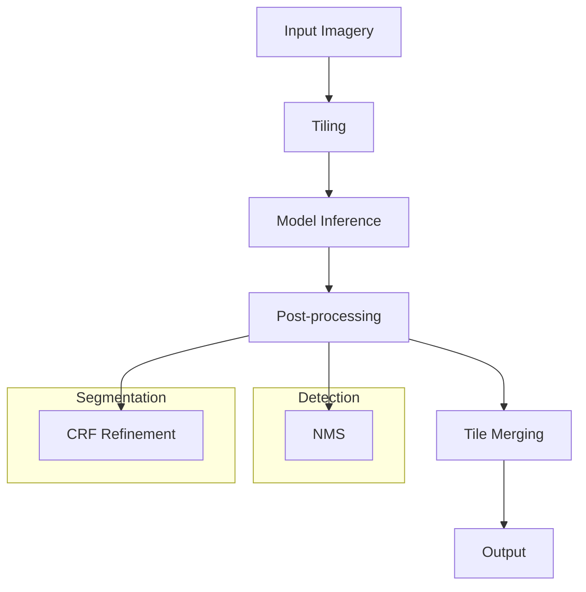

# 01 - AI Products

## Purpose

Deep learning and AI-powered capabilities for geospatial analysis including detection, segmentation, super-resolution, and synthetic imagery generation.

## Audience

Machine learning engineers, remote sensing analysts, GIS professionals.

## Prerequisites

- Python 3.10+
- PyTorch (optional, for model inference)
- unbihexium[ai] dependencies

## Inputs/Outputs

| Input | Format | Output | Format |
|-------|--------|--------|--------|
| Satellite imagery | GeoTIFF, COG | Detections | GeoJSON |
| Multi-band raster | Zarr, NetCDF | Segmentation mask | GeoTIFF |
| Low-res imagery | GeoTIFF | High-res imagery | GeoTIFF |

## Pipeline Architecture



## Algorithms

### IoU (Intersection over Union)

$$IoU = \frac{|A \cap B|}{|A \cup B|}$$

### Dice Coefficient

$$Dice = \frac{2|A \cap B|}{|A| + |B|}$$

### PSNR (Peak Signal-to-Noise Ratio)

$$PSNR = 10 \cdot \log_{10}\left(\frac{MAX^2}{MSE}\right)$$

## Metrics

| Metric | Description | Typical Value |
|--------|-------------|---------------|
| Precision | True positives / predicted positives | 0.85+ |
| Recall | True positives / actual positives | 0.80+ |
| F1 Score | Harmonic mean of P and R | 0.82+ |
| mAP | Mean Average Precision | 0.75+ |

## Mandatory Mapping Table

| Bullet Item | capability_id | Module Path | Pipeline ID | CLI Example | Example Script | Test Path | Model ID(s) | Maturity |
|-------------|---------------|-------------|-------------|-------------|----------------|-----------|-------------|----------|
| Super-resolution | super_resolution | `unbihexium.ai.super_resolution` | super_res | `unbihexium pipeline run super_res -i input.tif -o output.tif` | `examples/super_resolution.py` | `tests/unit/test_ai.py` | super_resolution_tiny, super_resolution_base, super_resolution_large | production |
| Synthetic imagery | synthetic_imagery | `unbihexium.ai.synthetic` | synth_img | `unbihexium pipeline run synth_img -i input.tif -o output.tif` | `examples/synthetic.py` | `tests/unit/test_ai.py` | synthetic_imagery_tiny, synthetic_imagery_base, synthetic_imagery_large | research |
| Ship detection | ship_detection | `unbihexium.ai.detection.ShipDetector` | ship_detection | `unbihexium pipeline run ship_detection -i input.tif -o output.geojson` | `examples/ship_detection.py` | `tests/unit/test_ai.py` | ship_detector_tiny, ship_detector_base, ship_detector_large | production |
| Building detection | building_detection | `unbihexium.ai.detection.BuildingDetector` | building_detection | `unbihexium pipeline run building_detection -i input.tif -o output.geojson` | `examples/building_detection.py` | `tests/unit/test_ai.py` | building_detector_tiny, building_detector_base, building_detector_large | production |
| Aircraft detection | aircraft_detection | `unbihexium.ai.detection.AircraftDetector` | aircraft_detection | `unbihexium pipeline run aircraft_detection -i input.tif -o output.geojson` | `examples/aircraft_detection.py` | `tests/unit/test_ai.py` | aircraft_detector_tiny, aircraft_detector_base, aircraft_detector_large | production |
| Change detection | change_detection | `unbihexium.ai.segmentation.ChangeDetector` | change_detection | `unbihexium pipeline run change_detection -i t1.tif -i t2.tif -o output.tif` | `examples/change_detection.py` | `tests/unit/test_ai.py` | change_detector_tiny, change_detector_base, change_detector_large | production |
| Vehicle detection | vehicle_detection | `unbihexium.ai.detection.VehicleDetector` | vehicle_detection | `unbihexium pipeline run vehicle_detection -i input.tif -o output.geojson` | `examples/vehicle_detection.py` | `tests/unit/test_ai.py` | vehicle_detector_tiny, vehicle_detector_base, vehicle_detector_large | production |
| Military objects detection (framework only; neutral) | military_objects_detection | `unbihexium.ai.detection.ObjectDetector` | mil_obj_detection | `unbihexium pipeline run mil_obj_detection -i input.tif -o output.geojson` | `examples/object_detection.py` | `tests/unit/test_ai.py` | military_objects_detector_tiny, military_objects_detector_base, military_objects_detector_large | research |
| Multi-solution segmentation | multi_segmentation | `unbihexium.ai.segmentation.SemanticSegmenter` | multi_seg | `unbihexium pipeline run multi_seg -i input.tif -o output.tif` | `examples/segmentation.py` | `tests/unit/test_ai.py` | multi_solution_segmentation_tiny, multi_solution_segmentation_base, multi_solution_segmentation_large | production |
| Greenhouse detection | greenhouse_detection | `unbihexium.ai.segmentation.GreenhouseDetector` | greenhouse_detection | `unbihexium pipeline run greenhouse_detection -i input.tif -o output.geojson` | `examples/greenhouse_detection.py` | `tests/unit/test_ai.py` | greenhouse_detector_tiny, greenhouse_detector_base, greenhouse_detector_large | production |
| Crop detection | crop_detection | `unbihexium.ai.detection.CropDetector` | crop_detection | `unbihexium pipeline run crop_detection -i input.tif -o output.geojson` | `examples/crop_detection.py` | `tests/unit/test_ai.py` | crop_detector_tiny, crop_detector_base, crop_detector_large | production |
| Automatic crop boundary delineation | crop_boundary | `unbihexium.ai.segmentation.BoundaryDelineator` | crop_boundary | `unbihexium pipeline run crop_boundary -i input.tif -o output.geojson` | `examples/crop_boundary.py` | `tests/unit/test_ai.py` | crop_boundary_delineation_tiny, crop_boundary_delineation_base, crop_boundary_delineation_large | production |
| Water surface detection | water_detection | `unbihexium.ai.segmentation.WaterDetector` | water_detection | `unbihexium pipeline run water_detection -i input.tif -o output.tif` | `examples/water_detection.py` | `tests/unit/test_ai.py` | water_surface_detector_tiny, water_surface_detector_base, water_surface_detector_large | production |

## Limitations

- Model accuracy depends on training data distribution
- GPU recommended for inference performance
- Large images require tiled processing

## Examples (CLI)

```bash
# Ship detection
unbihexium pipeline run ship_detection -i satellite.tif -o ships.geojson

# Building segmentation
unbihexium pipeline run building_detection -i urban.tif -o buildings.geojson

# Super-resolution (2x)
unbihexium pipeline run super_res -i lowres.tif -o highres.tif --scale 2
```

## API Entry Points

```python
from unbihexium.ai.detection import ShipDetector, BuildingDetector
from unbihexium.ai.segmentation import ChangeDetector, WaterDetector
from unbihexium.ai.super_resolution import SuperResolution
```

## Tests

- Unit tests: `tests/unit/test_ai.py`
- Integration tests: `tests/integration/test_detection_pipeline.py`

## Models

All models available in tiny/base/large variants with SHA256 verification.

## References

- [Documentation Index](../index.md)
- [Table of Contents](../toc.md)
- [Model Zoo Catalog](../model_zoo/catalog.md)
