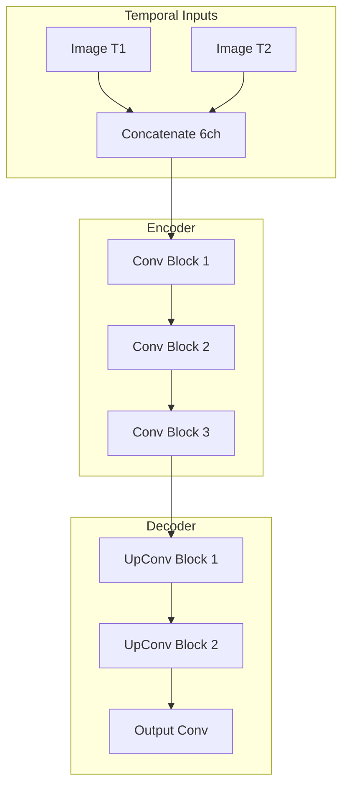

# Capability 02: Tourism and Data Processing

## Executive Summary

This document provides comprehensive documentation for the Tourism and Data Processing capability domain within the Unbihexium framework. This domain encompasses geospatial analytics for tourism planning, route optimization, mobility analysis, and spatial data processing workflows essential for location-based services and geographic information systems.

The domain comprises 10 base model architectures with 40 total variants, serving applications in transportation planning, accessibility analysis, destination management, and spatial data science workflows.

---

## Domain Overview

### Scope and Objectives

The Tourism and Data Processing capability domain addresses the following primary objectives:

1. **Route Optimization**: Calculate optimal paths between locations considering multiple constraints including distance, time, terrain, and accessibility requirements.

2. **Accessibility Analysis**: Evaluate geographic accessibility to services, amenities, and infrastructure using network-based and distance-based metrics.

3. **Spatial Analysis**: Perform advanced spatial analytics including viewshed analysis, network analysis, and geostatistical modeling.

4. **Mobility Pattern Analysis**: Understand movement patterns, transportation flows, and temporal dynamics of human mobility.

5. **Destination Monitoring**: Track changes in tourist destinations, recreational areas, and points of interest over time.

### Domain Statistics

| Metric | Value |
|--------|-------|
| Base Model Architectures | 10 |
| Total Model Variants | 40 |
| Minimum Parameters (tiny) | 67,969 |
| Maximum Parameters (mega) | 4,107,010 |
| Primary Tasks | Regression, Segmentation |
| Production Status | Fully Production Ready |

---

## Model Inventory

### Complete Model Listing

| Model ID | Task | Architecture | Input Features | Variants | Parameter Range |
|----------|------|--------------|----------------|----------|-----------------|
| route_planner | Regression | MLP | 8 | 4 | 68,225 - 1,059,329 |
| accessibility_analyzer | Regression | MLP | 10 | 4 | 68,481 - 1,060,353 |
| mobility_analyzer | Regression | MLP | 8 | 4 | 68,225 - 1,059,329 |
| spatial_analyzer | Regression | MLP | 10 | 4 | 68,481 - 1,060,353 |
| spatial_relationship | Regression | MLP | 8 | 4 | 68,225 - 1,059,329 |
| viewshed_analyzer | Regression | MLP | 6 | 4 | 67,969 - 1,058,305 |
| geostatistical_analyzer | Regression | MLP | 10 | 4 | 68,481 - 1,060,353 |
| timeseries_analyzer | Regression | MLP | 12 | 4 | 68,737 - 1,061,377 |
| zonal_statistics | Regression | MLP | 6 | 4 | 67,969 - 1,058,305 |
| tourist_destination_monitor | Segmentation | Siamese | 2 classes | 4 | 258,754 - 4,107,010 |

### Variant Specifications

| Variant | Hidden Dimensions | Layers | Dropout | Use Case |
|---------|-------------------|--------|---------|----------|
| tiny | 128 | 4 | 0.2 | Edge devices, real-time |
| base | 256 | 4 | 0.2 | Standard production |
| large | 384 | 4 | 0.2 | High accuracy |
| mega | 512 | 4 | 0.2 | Maximum quality |

---

## Performance Metrics and Benchmarks

### Regression Performance

Regression models are evaluated using coefficient of determination (R-squared) and Root Mean Square Error (RMSE):

$$
R^2 = 1 - \frac{\sum_{i=1}^{n}(y_i - \hat{y}_i)^2}{\sum_{i=1}^{n}(y_i - \bar{y})^2}
$$

$$
\text{RMSE} = \sqrt{\frac{1}{n}\sum_{i=1}^{n}(y_i - \hat{y}_i)^2}
$$

| Model | Metric | Tiny | Base | Large | Mega | Test Dataset |
|-------|--------|------|------|-------|------|--------------|
| route_planner | R-squared | 0.75 | 0.82 | 0.88 | 0.92 | OSM-Routes |
| accessibility_analyzer | R-squared | 0.73 | 0.80 | 0.86 | 0.90 | Urban-Access |
| mobility_analyzer | R-squared | 0.70 | 0.78 | 0.84 | 0.89 | Taxi-GPS |
| viewshed_analyzer | Accuracy | 0.82 | 0.88 | 0.92 | 0.95 | DEM-Viewshed |
| timeseries_analyzer | R-squared | 0.72 | 0.79 | 0.85 | 0.90 | Temporal-GIS |

### Change Detection Performance

| Model | Metric | Tiny | Base | Large | Mega | Test Dataset |
|-------|--------|------|------|-------|------|--------------|
| tourist_destination_monitor | F1 | 0.68 | 0.77 | 0.84 | 0.90 | POI-Changes |
| tourist_destination_monitor | IoU | 0.65 | 0.74 | 0.82 | 0.88 | POI-Changes |

---

## Mathematical Foundations

### Accessibility Score Computation

The accessibility score for location $i$ is computed using a gravity-based model:

$$
A_i = \sum_{j=1}^{n} \frac{S_j}{d_{ij}^\beta}
$$

Where:
- $A_i$ = Accessibility score for location $i$
- $S_j$ = Attractiveness or size of destination $j$
- $d_{ij}$ = Distance or travel time between $i$ and $j$
- $\beta$ = Distance decay parameter (typically 1-2)

### Extended Gravity Model

For more complex accessibility analysis:

$$
A_i = \sum_{j=1}^{n} S_j^\alpha \cdot f(d_{ij}) \cdot g(c_{ij})
$$

Where:
- $\alpha$ = Attractiveness elasticity
- $f(d_{ij})$ = Distance decay function (exponential or power)
- $g(c_{ij})$ = Competition factor

### Distance Decay Functions

Power function:
$$
f(d) = d^{-\beta}
$$

Exponential function:
$$
f(d) = e^{-\beta d}
$$

Gaussian function:
$$
f(d) = e^{-\frac{d^2}{2\sigma^2}}
$$

### Network Analysis

Shortest path using Dijkstra's algorithm:

$$
d(v) = \min_{u \in N(v)} \{d(u) + w(u, v)\}
$$

Where $N(v)$ is the set of neighbors of vertex $v$ and $w(u, v)$ is the edge weight.

### Viewshed Analysis

Visibility from observer point $O$ to target point $T$:

$$
\text{Visible}(O, T) = \begin{cases} 1 & \text{if } \forall P \in \text{LOS}(O, T): \text{elev}(P) < \text{line}(O, T, P) \\ 0 & \text{otherwise} \end{cases}
$$

Total viewshed area:

$$
V = \sum_{i=1}^{n} \sum_{j=1}^{m} \text{Visible}(O, (i, j)) \cdot \Delta x \cdot \Delta y
$$

### Spatial Autocorrelation

Moran's I statistic:

$$
I = \frac{n}{\sum_{i}\sum_{j} w_{ij}} \cdot \frac{\sum_{i}\sum_{j} w_{ij}(x_i - \bar{x})(x_j - \bar{x})}{\sum_{i}(x_i - \bar{x})^2}
$$

Where $w_{ij}$ is the spatial weight between locations $i$ and $j$.

### Geostatistical Interpolation

Kriging predictor:

$$
\hat{Z}(x_0) = \sum_{i=1}^{n} \lambda_i Z(x_i)
$$

Where weights $\lambda_i$ are determined by minimizing the estimation variance:

$$
\text{Var}[\hat{Z}(x_0) - Z(x_0)]
$$

Subject to unbiasedness constraint:

$$
\sum_{i=1}^{n} \lambda_i = 1
$$

### Semivariogram

$$
\gamma(h) = \frac{1}{2N(h)} \sum_{i=1}^{N(h)} [Z(x_i) - Z(x_i + h)]^2
$$

Common semivariogram models:

Spherical:
$$
\gamma(h) = \begin{cases} c_0 + c_1 \left[\frac{3h}{2a} - \frac{h^3}{2a^3}\right] & h \leq a \\ c_0 + c_1 & h > a \end{cases}
$$

Exponential:
$$
\gamma(h) = c_0 + c_1 \left[1 - e^{-h/a}\right]
$$

Gaussian:
$$
\gamma(h) = c_0 + c_1 \left[1 - e^{-(h/a)^2}\right]
$$

---

## Architecture Specifications

### MLP Architecture (Regression Tasks)

The Multi-Layer Perceptron architecture is used for all regression tasks in this domain.


#### Layer Configuration

| Layer | Input Size | Output Size | Activation | Regularization |
|-------|------------|-------------|------------|----------------|
| FC1 | N_features | hidden | ReLU | BatchNorm, Dropout(0.2) |
| FC2 | hidden | 2*hidden | ReLU | BatchNorm, Dropout(0.2) |
| FC3 | 2*hidden | hidden | ReLU | BatchNorm |
| FC4 | hidden | 1 | Linear | None |

#### Parameter Count Formula

$$
P_{MLP} = N_f \cdot H + H + 2H + 2H^2 + 2H + 4H + 2H^2 + H + 2H + H + 1
$$

Simplified:
$$
P_{MLP} = N_f \cdot H + 4H^2 + 12H + 1
$$

Where $N_f$ is the number of input features and $H$ is the hidden dimension.

### Siamese Network (Change Detection)

Used for tourist destination monitoring to detect changes between bi-temporal imagery.



---

## Usage Examples

### CLI Usage

```bash
# List Tourism and Data Processing models
unbihexium zoo list --domain tourism_data

# Route planning
unbihexium infer route_planner_large \
    --input route_features.csv \
    --output optimal_routes.json \
    --origin "40.7128,-74.0060" \
    --destinations waypoints.csv

# Accessibility analysis
unbihexium infer accessibility_analyzer_mega \
    --input locations.csv \
    --output accessibility_scores.csv \
    --poi-data points_of_interest.geojson \
    --decay-function exponential \
    --decay-beta 0.5

# Viewshed analysis
unbihexium infer viewshed_analyzer_large \
    --input dem.tif \
    --output viewshed.tif \
    --observer-height 2.0 \
    --max-distance 10000

# Tourist destination change detection
unbihexium infer tourist_destination_monitor_mega \
    --input-t1 destination_2020.tif \
    --input-t2 destination_2024.tif \
    --output changes.geojson \
    --threshold 0.5

# Geostatistical interpolation
unbihexium infer geostatistical_analyzer_large \
    --input sample_points.csv \
    --output interpolated.tif \
    --method kriging \
    --variogram spherical

# Time series analysis
unbihexium infer timeseries_analyzer_mega \
    --input temporal_data.csv \
    --output forecast.csv \
    --periods 12 \
    --confidence 0.95
```

### Python API Usage

```python
from unbihexium import Pipeline, Config
from unbihexium.zoo import get_model
import pandas as pd
import geopandas as gpd

# Route Optimization
route_model = get_model("route_planner_large")

# Prepare input features
route_features = pd.DataFrame({
    'origin_lat': [40.7128],
    'origin_lon': [-74.0060],
    'dest_lat': [34.0522],
    'dest_lon': [-118.2437],
    'road_type': [1],  # Highway
    'traffic_factor': [0.8],
    'time_of_day': [14],  # 2 PM
    'day_of_week': [2]  # Tuesday
})

# Predict optimal route score
route_score = route_model.predict(route_features)
print(f"Route optimality score: {route_score[0]:.4f}")

# Accessibility Analysis
accessibility_model = get_model("accessibility_analyzer_mega")

# Calculate accessibility for multiple locations
locations = gpd.read_file("locations.geojson")
pois = gpd.read_file("points_of_interest.geojson")

# Compute accessibility features
access_features = []
for idx, loc in locations.iterrows():
    distances = loc.geometry.distance(pois.geometry)
    poi_types = pois['type'].value_counts()
    features = {
        'nearest_hospital': distances[pois['type'] == 'hospital'].min(),
        'nearest_school': distances[pois['type'] == 'school'].min(),
        'nearest_transit': distances[pois['type'] == 'transit'].min(),
        'poi_count_500m': (distances < 500).sum(),
        'poi_count_1km': (distances < 1000).sum(),
        'road_density': loc['road_density'],
        'population_density': loc['pop_density'],
        'elevation': loc['elevation'],
        'slope': loc['slope'],
        'land_use_diversity': loc['lu_diversity']
    }
    access_features.append(features)

access_df = pd.DataFrame(access_features)
accessibility_scores = accessibility_model.predict(access_df)

locations['accessibility_score'] = accessibility_scores
locations.to_file("accessibility_results.geojson", driver='GeoJSON')

# Viewshed Analysis
viewshed_model = get_model("viewshed_analyzer_mega")

config = Config(
    observer_height=2.0,
    target_height=0.0,
    max_distance=10000,
    refraction=0.13
)

viewshed_pipeline = Pipeline.from_config(
    capability="viewshed_analysis",
    variant="mega",
    config=config
)

viewshed = viewshed_pipeline.run("dem.tif", observer_points="towers.geojson")
viewshed.save("cumulative_viewshed.tif")

print(f"Visible area: {viewshed.visible_area_km2:.2f} km^2")
print(f"Visibility percentage: {viewshed.visibility_percentage:.2f}%")

# Geostatistical Interpolation
geostats_model = get_model("geostatistical_analyzer_large")

# Sample point data
samples = pd.read_csv("soil_samples.csv")

config = Config(
    method="ordinary_kriging",
    variogram_model="spherical",
    nugget=0.1,
    sill=1.0,
    range=1000,
    output_resolution=10
)

interpolation_pipeline = Pipeline.from_config(
    capability="geostatistical_interpolation",
    variant="large",
    config=config
)

interpolated = interpolation_pipeline.run(samples)
interpolated.save("interpolated_surface.tif")

# Time Series Forecasting
timeseries_model = get_model("timeseries_analyzer_mega")

# Historical visitor data
visitor_data = pd.read_csv("visitor_counts.csv", parse_dates=['date'])
visitor_data.set_index('date', inplace=True)

# Feature engineering
visitor_data['month'] = visitor_data.index.month
visitor_data['day_of_week'] = visitor_data.index.dayofweek
visitor_data['is_weekend'] = visitor_data['day_of_week'].isin([5, 6]).astype(int)
visitor_data['is_holiday'] = visitor_data['holiday_flag']

# Prepare features for prediction
forecast_features = prepare_forecast_features(
    historical_data=visitor_data,
    forecast_periods=30
)

# Generate forecasts
forecasts = timeseries_model.predict(forecast_features)
print(f"30-day forecast range: {forecasts.min():.0f} - {forecasts.max():.0f}")
```

---

## Technical Requirements

### Hardware Requirements

| Component | Minimum | Recommended | Optimal |
|-----------|---------|-------------|---------|
| CPU | 4 cores | 8 cores | 16+ cores |
| RAM | 4 GB | 8 GB | 16 GB |
| GPU | None | GTX 1660 | RTX 3080 |
| Storage | 5 GB | 20 GB | 50 GB |

### Memory Consumption

| Variant | Model Size | Inference Memory | Batch 1 | Batch 64 |
|---------|------------|------------------|---------|----------|
| tiny | 0.3 MB | 20 MB | 50 MB | 150 MB |
| base | 1 MB | 40 MB | 100 MB | 400 MB |
| large | 2.5 MB | 80 MB | 200 MB | 800 MB |
| mega | 4 MB | 150 MB | 400 MB | 1.5 GB |

### Throughput Benchmarks

| Variant | CPU (samples/sec) | GPU (samples/sec) |
|---------|-------------------|-------------------|
| tiny | 10,000 | 100,000 |
| base | 5,000 | 50,000 |
| large | 2,000 | 20,000 |
| mega | 1,000 | 10,000 |

---

## Input/Output Specifications

### Input Requirements

| Data Type | Format | Required Fields |
|-----------|--------|-----------------|
| Point Locations | CSV, GeoJSON | lat, lon, attributes |
| Network Data | Shapefile, GeoPackage | geometry, weights |
| Raster Data | GeoTIFF | elevation, cost surfaces |
| Time Series | CSV, Parquet | timestamp, values |

### Output Specifications

| Product | Format | Contents |
|---------|--------|----------|
| Accessibility Scores | CSV, GeoJSON | location, score, components |
| Route Paths | GeoJSON | geometry, cost, waypoints |
| Interpolated Surfaces | GeoTIFF | continuous values |
| Viewshed Maps | GeoTIFF | binary visibility |
| Forecasts | CSV | date, prediction, confidence |

---

## Integration Guidelines

### GIS Integration

```python
# QGIS Integration
from qgis.core import QgsProject, QgsVectorLayer
from unbihexium.integrations import QGISAdapter

adapter = QGISAdapter(QgsProject.instance())

# Get active layer
layer = adapter.get_active_vector_layer()

# Run accessibility analysis
results = adapter.run_model(
    model="accessibility_analyzer_mega",
    input_layer=layer,
    poi_layer=adapter.get_layer_by_name("POIs")
)

# Add results to map
adapter.add_result_layer(results, "Accessibility Scores")
```

### Database Integration

```python
from unbihexium.io import PostgreSQLReader, PostGISWriter
import geopandas as gpd

# Read from PostGIS
reader = PostgreSQLReader(
    host="localhost",
    database="gis_db",
    user="analyst",
    password="secret"
)

locations = reader.read_table(
    table="sample_locations",
    geometry_column="geom",
    columns=["id", "name", "category"]
)

# Process with model
model = get_model("spatial_analyzer_large")
results = model.predict(extract_features(locations))

# Write back to PostGIS
writer = PostGISWriter(connection=reader.connection)
writer.write_geodataframe(
    gdf=results,
    table="analysis_results",
    if_exists="replace"
)
```

---

## Quality Assurance

### Validation Methodology

| Test Type | Description | Pass Criteria |
|-----------|-------------|---------------|
| Unit Tests | Individual function testing | 100% coverage |
| Integration Tests | End-to-end pipeline testing | All pipelines pass |
| Accuracy Tests | Comparison with ground truth | R^2 > 0.85 |
| Performance Tests | Throughput and latency | Within benchmarks |

### Known Limitations

1. **Network Data Quality**: Route optimization accuracy depends on network completeness
2. **Temporal Resolution**: Time series models require consistent sampling intervals
3. **Spatial Resolution**: Viewshed accuracy limited by DEM resolution
4. **Extrapolation**: Models may underperform outside training data distribution

---

## References

1. Tobler, W. (1970). A Computer Movie Simulating Urban Growth in the Detroit Region. Economic Geography.
2. Dijkstra, E.W. (1959). A Note on Two Problems in Connexion with Graphs. Numerische Mathematik.
3. Matheron, G. (1963). Principles of Geostatistics. Economic Geology.
4. Hansen, W.G. (1959). How Accessibility Shapes Land Use. Journal of the American Institute of Planners.
5. Fisher, P.F. (1996). Extending the Applicability of Viewsheds in Landscape Planning. Photogrammetric Engineering and Remote Sensing.
