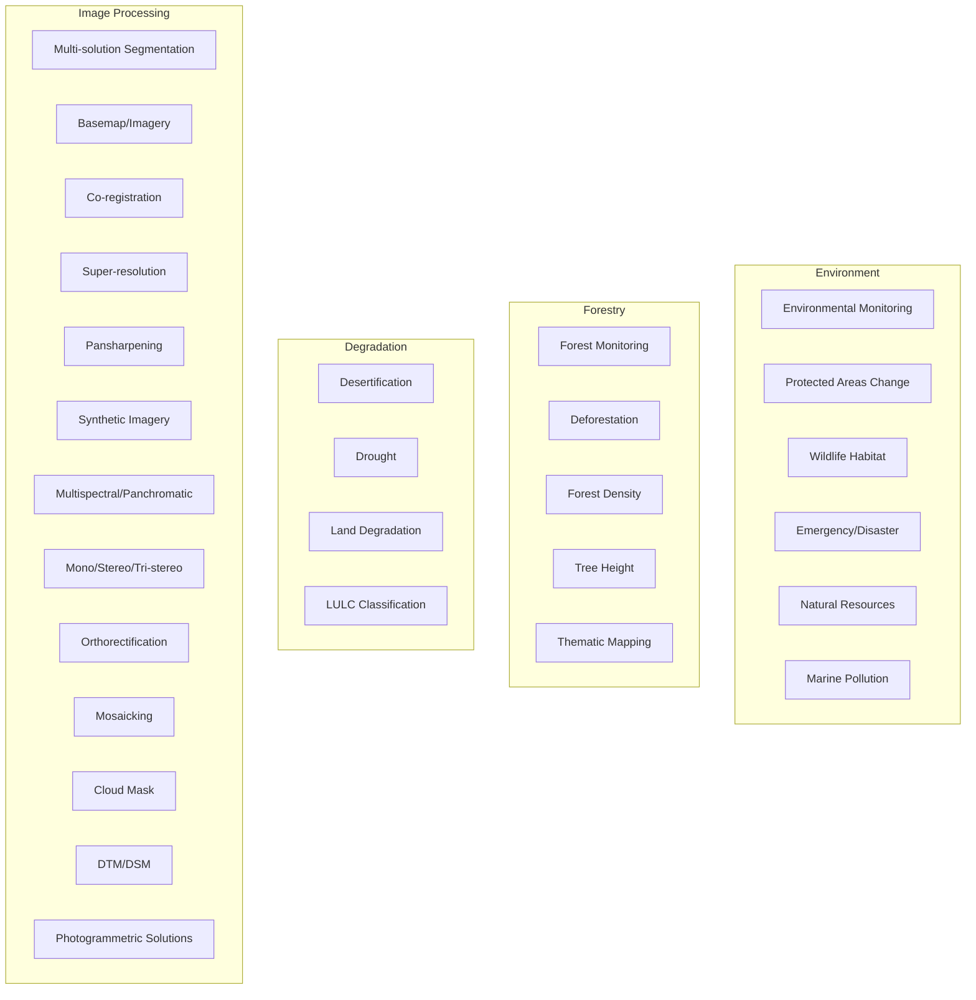

# 04 - Environment, Forestry and Image Processing

## Purpose

Environmental monitoring, forest analysis, and fundamental image processing primitives.

## Audience

Environmental scientists, forestry professionals, image processing engineers.

## Prerequisites

- Python 3.10+
- Multi-temporal imagery for change detection
- DEM for terrain analysis

## Inputs/Outputs

| Input | Format | Output | Format |
|-------|--------|--------|--------|
| Satellite imagery | GeoTIFF | Change maps | GeoTIFF |
| Multi-temporal stack | Zarr | Deforestation alerts | GeoJSON |
| Raw imagery | GeoTIFF | Processed imagery | GeoTIFF, COG |

## Pipeline Architecture



## Algorithms

### Forest Change Magnitude

$$\Delta_{forest} = |NDVI_{t2} - NDVI_{t1}|$$

### Biomass Estimation

$$AGB = a \times H^b \times \rho$$

Where $H$ is canopy height and $\rho$ is wood density.

### Orthorectification Ground Coordinate

$$X_g = X_0 + \frac{(Z_g - Z_0) \cdot (x - x_0)}{f}$$

## Metrics

| Application | Metric | Typical Accuracy |
|-------------|--------|------------------|
| Deforestation | F1 Score | 0.85+ |
| LULC | Overall Accuracy | 0.80+ |
| Orthorectification | RMSE | < 1 pixel |

## Mandatory Mapping Table - Environment/Forestry

| Bullet Item | capability_id | Module Path | Pipeline ID | CLI Example | Example Script | Test Path | Model ID(s) | Maturity |
|-------------|---------------|-------------|-------------|-------------|----------------|-----------|-------------|----------|
| Environmental monitoring | env_monitoring | `unbihexium.analysis.monitoring` | env_mon | `unbihexium pipeline run env_mon -i stack.zarr -o changes.tif` | `examples/env_monitoring.py` | `tests/unit/test_analysis.py` | environmental_monitor_tiny, environmental_monitor_base, environmental_monitor_large | production |
| Protected areas change detection | protected_change | `unbihexium.ai.segmentation.ChangeDetector` | protected_cd | `unbihexium pipeline run protected_cd -i t1.tif -i t2.tif -o change.tif` | `examples/protected_areas.py` | `tests/unit/test_ai.py` | protected_area_change_detector_tiny, protected_area_change_detector_base, protected_area_change_detector_large | production |
| Wildlife and habitat conservation + corridor identification | wildlife_habitat | `unbihexium.analysis.suitability.HabitatAnalyzer` | habitat | `unbihexium pipeline run habitat -i landcover.tif -o corridors.geojson` | `examples/habitat.py` | `tests/unit/test_analysis.py` | wildlife_habitat_analyzer_tiny, wildlife_habitat_analyzer_base, wildlife_habitat_analyzer_large | production |
| Emergency/disaster management | emergency_mgmt | `unbihexium.analysis.risk.DisasterManager` | disaster | `unbihexium pipeline run disaster -i event.tif -o response.geojson` | `examples/disaster.py` | `tests/unit/test_analysis.py` | emergency_disaster_manager_tiny, emergency_disaster_manager_base, emergency_disaster_manager_large | production |
| Forest monitoring/deforestation | deforestation | `unbihexium.ai.segmentation.DeforestationDetector` | deforest | `unbihexium pipeline run deforest -i t1.tif -i t2.tif -o deforest.tif` | `examples/deforestation.py` | `tests/unit/test_ai.py` | deforestation_detector_tiny, deforestation_detector_base, deforestation_detector_large | production |
| Forest density and tree height assessment | forest_density | `unbihexium.analysis.forestry.DensityEstimator` | forest_dens | `unbihexium pipeline run forest_dens -i lidar.tif -o density.tif` | `examples/forest_density.py` | `tests/unit/test_analysis.py` | forest_density_estimator_tiny, forest_density_estimator_base, forest_density_estimator_large | production |
| Thematic mapping | thematic | `unbihexium.analysis.mapping.ThematicMapper` | thematic | `unbihexium pipeline run thematic -i classified.tif -o map.pdf` | `examples/thematic.py` | `tests/unit/test_analysis.py` | thematic_mapper_tiny, thematic_mapper_base, thematic_mapper_large | production |
| Desertification, drought, land degradation | degradation | `unbihexium.analysis.degradation` | degrad | `unbihexium pipeline run degrad -i timeseries.zarr -o trends.tif` | `examples/degradation.py` | `tests/unit/test_analysis.py` | desertification_monitor_tiny, desertification_monitor_base, desertification_monitor_large | production |
| Natural resources and water resources monitoring | resources | `unbihexium.analysis.monitoring.ResourceMonitor` | resources | `unbihexium pipeline run resources -i data/ -o report.json` | `examples/resources.py` | `tests/unit/test_analysis.py` | natural_resources_monitor_tiny, natural_resources_monitor_base, natural_resources_monitor_large | production |
| Marine pollution detection | marine_pollution | `unbihexium.ai.segmentation.PollutionDetector` | marine_poll | `unbihexium pipeline run marine_poll -i coastal.tif -o pollution.geojson` | `examples/marine_pollution.py` | `tests/unit/test_ai.py` | marine_pollution_detector_tiny, marine_pollution_detector_base, marine_pollution_detector_large | production |
| LULC classification (salinity, erosion) | lulc | `unbihexium.ai.segmentation.LULCClassifier` | lulc | `unbihexium pipeline run lulc -i input.tif -o lulc.tif` | `examples/lulc.py` | `tests/unit/test_ai.py` | lulc_classifier_tiny, lulc_classifier_base, lulc_classifier_large | production |

## Mandatory Mapping Table - Image Processing

| Bullet Item | capability_id | Module Path | Pipeline ID | CLI Example | Example Script | Test Path | Model ID(s) | Maturity |
|-------------|---------------|-------------|-------------|-------------|----------------|-----------|-------------|----------|
| Multi-solution segmentation | multi_seg | `unbihexium.ai.segmentation` | multi_seg | `unbihexium pipeline run multi_seg -i input.tif -o seg.tif` | `examples/segmentation.py` | `tests/unit/test_ai.py` | multi_solution_segmentation_tiny, multi_solution_segmentation_base, multi_solution_segmentation_large | production |
| Multitype basemap/imagery basemap | basemap | `unbihexium.io.basemap` | basemap | `unbihexium pipeline run basemap -i tiles/ -o basemap.mbtiles` | `examples/basemap.py` | `tests/unit/test_io.py` | classical/no-weights | production |
| Co-registration + object export | coregistration | `unbihexium.io.geotiff.coregister` | coreg | `unbihexium pipeline run coreg -i ref.tif -i target.tif -o aligned.tif` | `examples/coregistration.py` | `tests/unit/test_io.py` | coregistration_tiny, coregistration_base, coregistration_large | production |
| Super-resolution | super_res | `unbihexium.ai.super_resolution` | super_res | `unbihexium pipeline run super_res -i low.tif -o high.tif` | `examples/super_resolution.py` | `tests/unit/test_ai.py` | super_resolution_tiny, super_resolution_base, super_resolution_large | production |
| Pansharpening | pansharpen | `unbihexium.io.geotiff.pansharpen` | pansharpen | `unbihexium pipeline run pansharpen -i ms.tif -i pan.tif -o sharp.tif` | `examples/pansharpen.py` | `tests/unit/test_io.py` | pansharpening_tiny, pansharpening_base, pansharpening_large | production |
| Synthetic imagery | synthetic | `unbihexium.ai.synthetic` | synthetic | `unbihexium pipeline run synthetic -i input.tif -o synth.tif` | `examples/synthetic.py` | `tests/unit/test_ai.py` | synthetic_imagery_tiny, synthetic_imagery_base, synthetic_imagery_large | research |
| Multispectral/panchromatic | spectral | `unbihexium.io.geotiff` | spectral | `unbihexium pipeline run spectral -i input.tif -o output.tif` | `examples/spectral.py` | `tests/unit/test_io.py` | multispectral_processor_tiny, multispectral_processor_base, multispectral_processor_large | production |
| Mono/stereo/tri-stereo abstractions | stereo | `unbihexium.io.stereo` | stereo | `unbihexium pipeline run stereo -i pair/ -o dsm.tif` | `examples/stereo.py` | `tests/unit/test_io.py` | stereo_processor_tiny, stereo_processor_base, stereo_processor_large | production |
| Orthorectification (adapter-based if needed) | ortho | `unbihexium.io.geotiff.orthorectify` | ortho | `unbihexium pipeline run ortho -i raw.tif -i dem.tif -o ortho.tif` | `examples/ortho.py` | `tests/unit/test_io.py` | orthorectification_tiny, orthorectification_base, orthorectification_large | production |
| Mosaicking | mosaic | `unbihexium.io.geotiff.mosaic` | mosaic | `unbihexium pipeline run mosaic -i tiles/ -o mosaic.tif` | `examples/mosaic.py` | `tests/unit/test_io.py` | mosaicking_tiny, mosaicking_base, mosaicking_large | production |
| Cloud mask | cloud_mask | `unbihexium.ai.segmentation.CloudMasker` | cloud | `unbihexium pipeline run cloud -i input.tif -o mask.tif` | `examples/cloud_mask.py` | `tests/unit/test_ai.py` | cloud_mask_tiny, cloud_mask_base, cloud_mask_large | production |
| DTM/DSM | dtm_dsm | `unbihexium.io.terrain` | terrain | `unbihexium pipeline run terrain -i stereo/ -o dsm.tif` | `examples/terrain.py` | `tests/unit/test_io.py` | dtm_generator_tiny, dtm_generator_base, dtm_generator_large | production |
| Photogrammetric solutions (adapter-based, no false claims) | photogrammetry | `unbihexium.io.photogrammetry` | photogram | `unbihexium pipeline run photogram -i images/ -o model/` | `examples/photogrammetry.py` | `tests/unit/test_io.py` | classical/adapter-based | experimental |

## Limitations

- Tree height estimation requires LiDAR or stereo data
- Photogrammetric solutions are adapter-based; no false claims about accuracy
- Cloud masking may miss thin clouds

## Examples (CLI)

```bash
# Deforestation detection
unbihexium pipeline run deforest -i 2020.tif -i 2024.tif -o deforestation.tif

# Pansharpening
unbihexium pipeline run pansharpen -i multispectral.tif -i panchromatic.tif -o sharpened.tif

# Mosaicking
unbihexium pipeline run mosaic -i tiles/*.tif -o mosaic.tif
```

## API Entry Points

```python
from unbihexium.ai.segmentation import DeforestationDetector, CloudMasker
from unbihexium.io.geotiff import pansharpen, orthorectify, mosaic
from unbihexium.analysis.forestry import DensityEstimator
```

## Tests

- Unit tests: `tests/unit/test_ai.py`, `tests/unit/test_io.py`

## References

- [Documentation Index](../index.md)
- [Table of Contents](../toc.md)

---

## Quick Navigation

| Prev | Home | Next |
|------|------|------|

