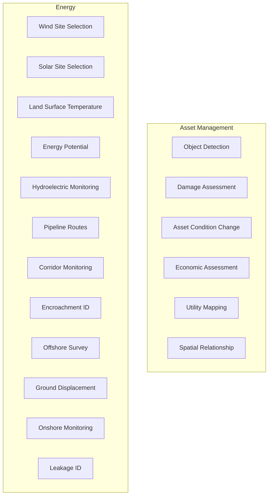

# 05 - Asset Management and Energy

## Purpose

Geospatial asset management, infrastructure monitoring, and energy sector analytics.

## Audience

Asset managers, energy planners, utility companies, infrastructure engineers.

## Prerequisites

- Python 3.10+
- High-resolution imagery for asset detection
- DEM for site selection

## Inputs/Outputs

| Input | Format | Output | Format |
|-------|--------|--------|--------|
| Satellite imagery | GeoTIFF | Asset inventory | GeoJSON |
| InSAR pairs | SLC | Displacement maps | GeoTIFF |
| Criteria layers | GeoTIFF | Suitability maps | GeoTIFF |

## Pipeline Architecture



## Algorithms

### Solar Irradiance

$$I = I_0 \times \cos(\theta_z) \times \tau_{atm}$$

### Ground Displacement (InSAR)

$$d = \frac{\lambda \cdot \phi_{unwrapped}}{4\pi}$$

### Damage Probability

$$P(damage) = \sigma(W^T \cdot features + b)$$

## Metrics

| Application | Metric | Unit |
|-------------|--------|------|
| Solar potential | GHI | kWh/m2/day |
| Wind potential | Wind speed | m/s |
| Displacement | mm/year | |

## Mandatory Mapping Table - Asset Management

| Bullet Item | capability_id | Module Path | Pipeline ID | CLI Example | Example Script | Test Path | Model ID(s) | Maturity |
|-------------|---------------|-------------|-------------|-------------|----------------|-----------|-------------|----------|
| Object detection | asset_detection | `unbihexium.ai.detection.ObjectDetector` | asset_detect | `unbihexium pipeline run asset_detect -i input.tif -o assets.geojson` | `examples/asset_detection.py` | `tests/unit/test_ai.py` | object_detector_tiny, object_detector_base, object_detector_large | production |
| Damage assessment | damage_assess | `unbihexium.ai.detection.DamageAssessor` | damage | `unbihexium pipeline run damage -i post.tif -o damage.geojson` | `examples/damage.py` | `tests/unit/test_ai.py` | damage_assessor_tiny, damage_assessor_base, damage_assessor_large | production |
| Asset-condition change detection | asset_change | `unbihexium.ai.segmentation.ChangeDetector` | asset_cd | `unbihexium pipeline run asset_cd -i t1.tif -i t2.tif -o change.tif` | `examples/asset_change.py` | `tests/unit/test_ai.py` | asset_condition_change_tiny, asset_condition_change_base, asset_condition_change_large | production |
| Economic spatial relationship assessment | economic_assess | `unbihexium.analysis.suitability.EconomicAnalyzer` | econ | `unbihexium pipeline run econ -i parcels.geojson -o value.json` | `examples/economic.py` | `tests/unit/test_analysis.py` | economic_spatial_assessor_tiny, economic_spatial_assessor_base, economic_spatial_assessor_large | production |
| Utility management/mapping | utility_map | `unbihexium.analysis.network.UtilityMapper` | utility | `unbihexium pipeline run utility -i network.geojson -o mapped.geojson` | `examples/utility.py` | `tests/unit/test_analysis.py` | utility_mapper_tiny, utility_mapper_base, utility_mapper_large | production |
| Spatial relationship assessment | spatial_rel | `unbihexium.analysis.spatial.RelationshipAnalyzer` | spatial_rel | `unbihexium pipeline run spatial_rel -i features.geojson -o relations.json` | `examples/spatial_rel.py` | `tests/unit/test_analysis.py` | spatial_relationship_tiny, spatial_relationship_base, spatial_relationship_large | production |

## Mandatory Mapping Table - Energy

| Bullet Item | capability_id | Module Path | Pipeline ID | CLI Example | Example Script | Test Path | Model ID(s) | Maturity |
|-------------|---------------|-------------|-------------|-------------|----------------|-----------|-------------|----------|
| Wind/solar site selection | site_selection | `unbihexium.analysis.suitability.EnergySiteSelector` | energy_site | `unbihexium pipeline run energy_site -i criteria.yaml -o sites.geojson` | `examples/energy_site.py` | `tests/unit/test_analysis.py` | wind_site_selector_tiny, solar_site_selector_tiny, wind_site_selector_base, solar_site_selector_base, wind_site_selector_large, solar_site_selector_large | production |
| Land surface temperature estimation | lst | `unbihexium.core.index.compute_lst` | lst | `unbihexium pipeline run lst -i thermal.tif -o lst.tif` | `examples/lst.py` | `tests/unit/test_core.py` | land_surface_temperature_tiny, land_surface_temperature_base, land_surface_temperature_large | production |
| Alternative energy potential by regions | energy_potential | `unbihexium.analysis.suitability.EnergyPotential` | energy_pot | `unbihexium pipeline run energy_pot -i region.geojson -o potential.json` | `examples/energy_potential.py` | `tests/unit/test_analysis.py` | energy_potential_tiny, energy_potential_base, energy_potential_large | production |
| Hydroelectric dams monitoring | hydro_monitor | `unbihexium.analysis.water.HydroMonitor` | hydro | `unbihexium pipeline run hydro -i reservoir.tif -o level.json` | `examples/hydro.py` | `tests/unit/test_analysis.py` | hydroelectric_monitor_tiny, hydroelectric_monitor_base, hydroelectric_monitor_large | production |
| Pipeline route planning and corridor monitoring | pipeline_route | `unbihexium.analysis.network.PipelinePlanner` | pipeline | `unbihexium pipeline run pipeline -i terrain.tif -o route.geojson` | `examples/pipeline.py` | `tests/unit/test_analysis.py` | pipeline_route_planner_tiny, pipeline_route_planner_base, pipeline_route_planner_large | production |
| Encroachment identification | encroachment | `unbihexium.ai.detection.EncroachmentDetector` | encroach | `unbihexium pipeline run encroach -i corridor.tif -o encroachment.geojson` | `examples/encroachment.py` | `tests/unit/test_ai.py` | encroachment_detector_tiny, encroachment_detector_base, encroachment_detector_large | production |
| Offshore survey abstractions | offshore | `unbihexium.analysis.marine.OffshoreSurvey` | offshore | `unbihexium pipeline run offshore -i bathymetry.tif -o survey.json` | `examples/offshore.py` | `tests/unit/test_analysis.py` | offshore_survey_tiny, offshore_survey_base, offshore_survey_large | production |
| Ground movement/displacement monitoring | displacement | `unbihexium.sar.interferometry.compute_displacement` | insar_disp | `unbihexium pipeline run insar_disp -i master.slc -i slave.slc -o disp.tif` | `examples/displacement.py` | `tests/unit/test_sar.py` | ground_displacement_tiny, ground_displacement_base, ground_displacement_large | research |
| Onshore monitoring | onshore | `unbihexium.analysis.monitoring.OnshoreMonitor` | onshore | `unbihexium pipeline run onshore -i facility.geojson -i imagery/ -o report.json` | `examples/onshore.py` | `tests/unit/test_analysis.py` | onshore_monitor_tiny, onshore_monitor_base, onshore_monitor_large | production |
| Leakage identification (document assumptions) | leakage | `unbihexium.ai.detection.LeakageDetector` | leakage | `unbihexium pipeline run leakage -i thermal.tif -o leaks.geojson` | `examples/leakage.py` | `tests/unit/test_ai.py` | leakage_detector_tiny, leakage_detector_base, leakage_detector_large | experimental |

## Limitations

- Leakage detection has documented assumptions about thermal signature visibility
- Ground displacement requires coherent InSAR pairs
- Solar potential depends on irradiance data quality

## Examples (CLI)

```bash
# Solar site selection
unbihexium pipeline run energy_site -i criteria.yaml --type solar -o solar_sites.geojson

# Damage assessment
unbihexium pipeline run damage -i post_disaster.tif -o damage_report.geojson

# Ground displacement
unbihexium pipeline run insar_disp -i master.slc -i slave.slc -o displacement.tif
```

## API Entry Points

```python
from unbihexium.ai.detection import DamageAssessor, EncroachmentDetector
from unbihexium.analysis.suitability import EnergySiteSelector
from unbihexium.sar.interferometry import compute_displacement
```

## Tests

- Unit tests: `tests/unit/test_ai.py`, `tests/unit/test_analysis.py`

## References

- [Documentation Index](../index.md)
- [Table of Contents](../toc.md)
- [SAR Capabilities](12_radar_sar.md)
