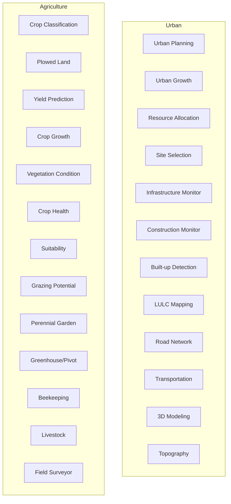

# 06 - Urban and Agriculture

## Purpose

Urban planning, infrastructure monitoring, and comprehensive agricultural analytics.

## Audience

Urban planners, municipalities, agricultural scientists, farmers, agronomists.

## Prerequisites

- Python 3.10+
- Multi-temporal imagery for monitoring
- Ground truth data for calibration

## Inputs/Outputs

| Input | Format | Output | Format |
|-------|--------|--------|--------|
| Satellite imagery | GeoTIFF | Urban change maps | GeoTIFF |
| NDVI time series | Zarr | Yield estimates | GeoJSON |
| Building footprints | GeoJSON | 3D models | OBJ, glTF |

## Pipeline Architecture



## Algorithms

### Urban Growth Rate

$$G = \frac{A_{t2} - A_{t1}}{A_{t1} \times \Delta t} \times 100\%$$

### Yield Prediction Model

$$Y = \alpha + \beta \cdot NDVI_{max} + \gamma \cdot \int_{t_1}^{t_2} NDVI(t) \, dt + \epsilon$$

### Crop Health Index

$$CHI = \frac{NDVI_{observed} - NDVI_{historical\_min}}{NDVI_{historical\_max} - NDVI_{historical\_min}}$$

## Metrics

| Application | Metric | Typical Value |
|-------------|--------|---------------|
| Urban growth | Annual rate | 1-5% |
| Yield prediction | R2 | 0.75+ |
| Crop classification | F1 | 0.85+ |

## Mandatory Mapping Table - Urban

| Bullet Item | capability_id | Module Path | Pipeline ID | CLI Example | Example Script | Test Path | Model ID(s) | Maturity |
|-------------|---------------|-------------|-------------|-------------|----------------|-----------|-------------|----------|
| Urban planning and process monitoring | urban_planning | `unbihexium.analysis.urban.UrbanPlanner` | urban_plan | `unbihexium pipeline run urban_plan -i layers.yaml -o plan.geojson` | `examples/urban_planning.py` | `tests/unit/test_analysis.py` | urban_planner_tiny, urban_planner_base, urban_planner_large | production |
| Urban growth assessment | urban_growth | `unbihexium.ai.segmentation.UrbanGrowthAssessor` | urban_growth | `unbihexium pipeline run urban_growth -i t1.tif -i t2.tif -o growth.tif` | `examples/urban_growth.py` | `tests/unit/test_ai.py` | urban_growth_assessor_tiny, urban_growth_assessor_base, urban_growth_assessor_large | production |
| Resource allocation optimization | resource_alloc | `unbihexium.analysis.optimization.ResourceAllocator` | resource | `unbihexium pipeline run resource -i demand.geojson -o allocation.geojson` | `examples/resource.py` | `tests/unit/test_analysis.py` | resource_allocation_tiny, resource_allocation_base, resource_allocation_large | production |
| Site selection | site_select | `unbihexium.analysis.suitability.SiteSelector` | site_sel | `unbihexium pipeline run site_sel -i criteria.yaml -o sites.geojson` | `examples/site_selection.py` | `tests/unit/test_analysis.py` | site_suitability_tiny, site_suitability_base, site_suitability_large | production |
| Infrastructure monitoring and change detection | infra_monitor | `unbihexium.ai.segmentation.InfrastructureMonitor` | infra_mon | `unbihexium pipeline run infra_mon -i t1.tif -i t2.tif -o changes.geojson` | `examples/infrastructure.py` | `tests/unit/test_ai.py` | infrastructure_monitor_tiny, infrastructure_monitor_base, infrastructure_monitor_large | production |
| Construction monitoring | construction | `unbihexium.ai.segmentation.ConstructionMonitor` | construct | `unbihexium pipeline run construct -i timeseries/ -o progress.json` | `examples/construction.py` | `tests/unit/test_ai.py` | construction_monitor_tiny, construction_monitor_base, construction_monitor_large | production |
| Built-up detection | builtup | `unbihexium.ai.segmentation.BuiltupDetector` | builtup | `unbihexium pipeline run builtup -i input.tif -o builtup.tif` | `examples/builtup.py` | `tests/unit/test_ai.py` | builtup_detector_tiny, builtup_detector_base, builtup_detector_large | production |
| LULC monitoring/mapping | lulc_urban | `unbihexium.ai.segmentation.LULCClassifier` | lulc | `unbihexium pipeline run lulc -i input.tif -o lulc.tif` | `examples/lulc.py` | `tests/unit/test_ai.py` | lulc_classifier_tiny, lulc_classifier_base, lulc_classifier_large | production |
| Road network analysis | road_network | `unbihexium.analysis.network.RoadAnalyzer` | roads | `unbihexium pipeline run roads -i network.geojson -o analysis.json` | `examples/roads.py` | `tests/unit/test_analysis.py` | road_network_analyzer_tiny, road_network_analyzer_base, road_network_analyzer_large | production |
| Transportation mapping | transport | `unbihexium.analysis.network.TransportMapper` | transport | `unbihexium pipeline run transport -i imagery.tif -o roads.geojson` | `examples/transport.py` | `tests/unit/test_analysis.py` | transportation_mapper_tiny, transportation_mapper_base, transportation_mapper_large | production |
| 3D modeling, topography mapping | modeling_3d | `unbihexium.io.terrain.Model3D` | model_3d | `unbihexium pipeline run model_3d -i stereo/ -o model.obj` | `examples/3d_modeling.py` | `tests/unit/test_io.py` | model_3d_tiny, model_3d_base, model_3d_large | production |

## Mandatory Mapping Table - Agriculture

| Bullet Item | capability_id | Module Path | Pipeline ID | CLI Example | Example Script | Test Path | Model ID(s) | Maturity |
|-------------|---------------|-------------|-------------|-------------|----------------|-----------|-------------|----------|
| Crop classification/mapping | crop_classify | `unbihexium.ai.segmentation.CropClassifier` | crop_class | `unbihexium pipeline run crop_class -i timeseries.zarr -o crops.tif` | `examples/crop_classification.py` | `tests/unit/test_ai.py` | crop_classifier_tiny, crop_classifier_base, crop_classifier_large | production |
| Plowed land identification | plowed | `unbihexium.ai.detection.PlowedLandDetector` | plowed | `unbihexium pipeline run plowed -i input.tif -o plowed.tif` | `examples/plowed.py` | `tests/unit/test_ai.py` | plowed_land_detector_tiny, plowed_land_detector_base, plowed_land_detector_large | production |
| Yield prediction | yield_pred | `unbihexium.analysis.agriculture.YieldPredictor` | yield | `unbihexium pipeline run yield -i ndvi_series.zarr -o yield.tif` | `examples/yield.py` | `tests/unit/test_analysis.py` | yield_predictor_tiny, yield_predictor_base, yield_predictor_large | production |
| Crop growth monitoring | crop_growth | `unbihexium.analysis.agriculture.GrowthMonitor` | growth | `unbihexium pipeline run growth -i timeseries/ -o phenology.json` | `examples/growth.py` | `tests/unit/test_analysis.py` | crop_growth_monitor_tiny, crop_growth_monitor_base, crop_growth_monitor_large | production |
| Vegetation condition monitoring | veg_condition | `unbihexium.analysis.agriculture.VegetationCondition` | veg_cond | `unbihexium pipeline run veg_cond -i ndvi.tif -i historical/ -o condition.tif` | `examples/vegetation_condition.py` | `tests/unit/test_analysis.py` | vegetation_condition_tiny, vegetation_condition_base, vegetation_condition_large | production |
| Crop health assessment | crop_health | `unbihexium.analysis.agriculture.HealthAssessor` | health | `unbihexium pipeline run health -i multispectral.tif -o health.tif` | `examples/crop_health.py` | `tests/unit/test_analysis.py` | crop_health_assessor_tiny, crop_health_assessor_base, crop_health_assessor_large | production |
| Suitability assessment | ag_suitability | `unbihexium.analysis.suitability.AgriculturalSuitability` | ag_suit | `unbihexium pipeline run ag_suit -i criteria.yaml -o suitable.tif` | `examples/ag_suitability.py` | `tests/unit/test_analysis.py` | site_suitability_tiny, site_suitability_base, site_suitability_large | production |
| Grazing potential areas | grazing | `unbihexium.analysis.agriculture.GrazingPotential` | graze | `unbihexium pipeline run graze -i landcover.tif -o grazing.tif` | `examples/grazing.py` | `tests/unit/test_analysis.py` | grazing_potential_tiny, grazing_potential_base, grazing_potential_large | production |
| Perennial garden suitability | perennial | `unbihexium.analysis.suitability.PerennialSuitability` | perennial | `unbihexium pipeline run perennial -i criteria.yaml -o suitable.tif` | `examples/perennial.py` | `tests/unit/test_analysis.py` | perennial_garden_suitability_tiny, perennial_garden_suitability_base, perennial_garden_suitability_large | production |
| Greenhouse/pivot inventory | greenhouse_inv | `unbihexium.ai.detection.GreenhouseDetector` | gh_inv | `unbihexium pipeline run gh_inv -i input.tif -o inventory.geojson` | `examples/greenhouse_inventory.py` | `tests/unit/test_ai.py` | pivot_inventory_tiny, pivot_inventory_base, pivot_inventory_large | production |
| Beekeeping suitability | beekeeping | `unbihexium.analysis.suitability.BeekeepingSuitability` | beekeep | `unbihexium pipeline run beekeep -i criteria.yaml -o suitable.tif` | `examples/beekeeping.py` | `tests/unit/test_analysis.py` | beekeeping_suitability_tiny, beekeeping_suitability_base, beekeeping_suitability_large | production |
| Livestock resources estimation | livestock | `unbihexium.analysis.agriculture.LivestockEstimator` | livestock | `unbihexium pipeline run livestock -i pasture.tif -o capacity.json` | `examples/livestock.py` | `tests/unit/test_analysis.py` | livestock_estimator_tiny, livestock_estimator_base, livestock_estimator_large | production |
| Field surveyor data management | field_survey | `unbihexium.io.survey.FieldSurveyor` | survey | `unbihexium pipeline run survey -i data/ -o managed/` | `examples/field_survey.py` | `tests/unit/test_io.py` | field_surveyor_tiny, field_surveyor_base, field_surveyor_large | production |

## Limitations

- Yield prediction requires calibration with local ground truth
- 3D modeling requires stereo/tri-stereo imagery
- Crop classification accuracy varies by phenological stage

## Examples (CLI)

```bash
# Urban growth detection
unbihexium pipeline run urban_growth -i 2020.tif -i 2024.tif -o growth.tif

# Crop classification
unbihexium pipeline run crop_class -i sentinel2_stack.zarr -o crops.tif

# Yield prediction
unbihexium pipeline run yield -i ndvi_timeseries.zarr -o yield_estimate.tif
```

## API Entry Points

```python
from unbihexium.ai.segmentation import UrbanGrowthAssessor, CropClassifier
from unbihexium.analysis.agriculture import YieldPredictor, GrowthMonitor
from unbihexium.analysis.urban import UrbanPlanner
```

## Tests

- Unit tests: `tests/unit/test_ai.py`, `tests/unit/test_analysis.py`

## References

- [Documentation Index](../index.md)
- [Table of Contents](../toc.md)
- [Vegetation Indices](03_indices_flood_water.md)
