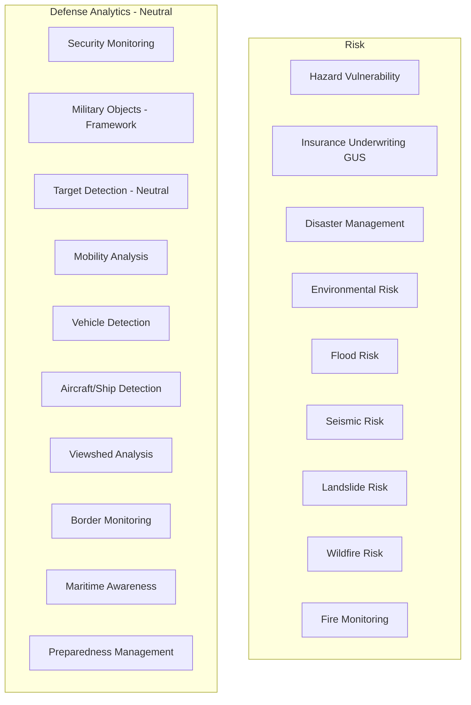

# 07 - Risk and Defense (Neutral)

## Purpose

Risk assessment, disaster management, and neutral security/defense analytics for situational awareness.

## Audience

Risk analysts, emergency managers, insurance professionals, security analysts.

## Prerequisites

- Python 3.10+
- Hazard data layers
- DEM for viewshed analysis

## Non-Goals

This documentation does not provide guidance for harmful applications. All capabilities are designed for defensive, humanitarian, and analytical purposes only.

## Inputs/Outputs

| Input | Format | Output | Format |
|-------|--------|--------|--------|
| Hazard layers | GeoTIFF | Risk maps | GeoTIFF |
| DEM | GeoTIFF | Viewshed | GeoTIFF |
| Satellite imagery | GeoTIFF | Detection results | GeoJSON |

## Pipeline Architecture



## Algorithms

### Risk Score

$$R = P(hazard) \times V(vulnerability) \times E(exposure)$$

### Viewshed Binary

$$visible(o, p) = \begin{cases} 1 & \text{if LoS unobstructed} \\ 0 & \text{otherwise} \end{cases}$$

### Hazard Probability

$$P(H > h) = 1 - e^{-\lambda t}$$

## Metrics

| Application | Metric | Unit |
|-------------|--------|------|
| Flood risk | Return period | years |
| Wildfire risk | Probability | 0-1 |
| Viewshed | Visible area | km2 |

## Mandatory Mapping Table - Risk

| Bullet Item | capability_id | Module Path | Pipeline ID | CLI Example | Example Script | Test Path | Model ID(s) | Maturity |
|-------------|---------------|-------------|-------------|-------------|----------------|-----------|-------------|----------|
| Hazard vulnerability analysis | hazard_vuln | `unbihexium.analysis.risk.HazardVulnerability` | hazard | `unbihexium pipeline run hazard -i layers.yaml -o risk.tif` | `examples/hazard.py` | `tests/unit/test_analysis.py` | hazard_vulnerability_tiny, hazard_vulnerability_base, hazard_vulnerability_large | production |
| Insurance underwriting (GUS) methods (documented) | insurance | `unbihexium.analysis.risk.InsuranceUnderwriting` | insurance | `unbihexium pipeline run insurance -i properties.geojson -o risk.json` | `examples/insurance.py` | `tests/unit/test_analysis.py` | insurance_underwriting_tiny, insurance_underwriting_base, insurance_underwriting_large | production |
| Disaster management planning | disaster_plan | `unbihexium.analysis.risk.DisasterPlanner` | disaster | `unbihexium pipeline run disaster -i scenario.yaml -o plan.json` | `examples/disaster_plan.py` | `tests/unit/test_analysis.py` | disaster_management_tiny, disaster_management_base, disaster_management_large | production |
| Environmental risk assessment | env_risk | `unbihexium.analysis.risk.EnvironmentalRisk` | env_risk | `unbihexium pipeline run env_risk -i site.geojson -o assessment.json` | `examples/env_risk.py` | `tests/unit/test_analysis.py` | environmental_risk_tiny, environmental_risk_base, environmental_risk_large | production |
| Flood/seismic/landslide/wildfire risk | multi_risk | `unbihexium.analysis.risk.MultiHazardRisk` | multi_risk | `unbihexium pipeline run multi_risk -i layers/ -o combined.tif` | `examples/multi_risk.py` | `tests/unit/test_analysis.py` | flood_risk_tiny, seismic_risk_tiny, landslide_risk_tiny, wildfire_risk_tiny (and base/large) | production |
| Fire identification and monitoring | fire_monitor | `unbihexium.ai.detection.FireMonitor` | fire | `unbihexium pipeline run fire -i thermal.tif -o hotspots.geojson` | `examples/fire.py` | `tests/unit/test_ai.py` | fire_monitor_tiny, fire_monitor_base, fire_monitor_large | production |

## Mandatory Mapping Table - Defense/Intelligence (Neutral)

| Bullet Item | capability_id | Module Path | Pipeline ID | CLI Example | Example Script | Test Path | Model ID(s) | Maturity |
|-------------|---------------|-------------|-------------|-------------|----------------|-----------|-------------|----------|
| Security solutions (monitoring, situational awareness) | security_mon | `unbihexium.analysis.security.SecurityMonitor` | security | `unbihexium pipeline run security -i aoi.geojson -i imagery/ -o alerts.json` | `examples/security.py` | `tests/unit/test_analysis.py` | security_monitor_tiny, security_monitor_base, security_monitor_large | production |
| Military objects detection (neutral framework) | mil_detect | `unbihexium.ai.detection.ObjectDetector` | mil_obj | `unbihexium pipeline run mil_obj -i input.tif -o objects.geojson` | `examples/object_detection.py` | `tests/unit/test_ai.py` | military_objects_detector_tiny, military_objects_detector_base, military_objects_detector_large | research |
| Target identification/detection (neutral object detection; no harmful guidance) | target_detect | `unbihexium.ai.detection.ObjectDetector` | target | `unbihexium pipeline run target -i input.tif -o targets.geojson` | `examples/object_detection.py` | `tests/unit/test_ai.py` | target_detector_tiny, target_detector_base, target_detector_large | research |
| Mobility analysis (neutral) | mobility | `unbihexium.analysis.network.MobilityAnalyzer` | mobility | `unbihexium pipeline run mobility -i terrain.tif -o mobility.tif` | `examples/mobility.py` | `tests/unit/test_analysis.py` | mobility_analyzer_tiny, mobility_analyzer_base, mobility_analyzer_large | production |
| Vehicle detection | vehicle_det | `unbihexium.ai.detection.VehicleDetector` | vehicle | `unbihexium pipeline run vehicle -i input.tif -o vehicles.geojson` | `examples/vehicle_detection.py` | `tests/unit/test_ai.py` | vehicle_detector_tiny, vehicle_detector_base, vehicle_detector_large | production |
| Aircraft/ship detection | airship_det | `unbihexium.ai.detection` | airship | `unbihexium pipeline run airship -i input.tif -o detections.geojson` | `examples/airship_detection.py` | `tests/unit/test_ai.py` | aircraft_detector_tiny, ship_detector_tiny (and base/large) | production |
| Viewshed analysis and border monitoring (viewshed only) | viewshed | `unbihexium.analysis.terrain.ViewshedAnalyzer` | viewshed | `unbihexium pipeline run viewshed -i dem.tif -i points.geojson -o viewshed.tif` | `examples/viewshed.py` | `tests/unit/test_analysis.py` | viewshed_analyzer_tiny, viewshed_analyzer_base, viewshed_analyzer_large | production |
| Maritime domain awareness analytics | maritime | `unbihexium.ai.detection.MaritimeAwareness` | maritime | `unbihexium pipeline run maritime -i sar.tif -o vessels.geojson` | `examples/maritime.py` | `tests/unit/test_ai.py` | maritime_awareness_tiny, maritime_awareness_base, maritime_awareness_large | production |
| Preparedness management for critical situations | preparedness | `unbihexium.analysis.risk.PreparednessManager` | prepare | `unbihexium pipeline run prepare -i scenario.yaml -o plan.json` | `examples/preparedness.py` | `tests/unit/test_analysis.py` | preparedness_manager_tiny, preparedness_manager_base, preparedness_manager_large | production |

## Legal Disclaimer

This document does not constitute legal advice. All capabilities must be used in compliance with applicable laws and regulations. Defense analytics are neutral analytical tools.

## Responsible Use

- Lawful purposes only
- No harmful guidance provided
- Defensive and humanitarian applications
- Privacy regulation compliance

## Limitations

- Insurance GUS methods documented with assumptions
- Detection frameworks are object-based; no targeting guidance
- Viewshed analysis is terrain-only (no atmospheric effects)

## Examples (CLI)

```bash
# Multi-hazard risk
unbihexium pipeline run multi_risk -i hazard_layers/ -o combined_risk.tif

# Viewshed analysis
unbihexium pipeline run viewshed -i dem.tif -i observation_points.geojson -o viewshed.tif

# Maritime awareness
unbihexium pipeline run maritime -i sentinel1.tif -o vessels.geojson
```

## API Entry Points

```python
from unbihexium.analysis.risk import HazardVulnerability, DisasterPlanner
from unbihexium.analysis.terrain import ViewshedAnalyzer
from unbihexium.ai.detection import MaritimeAwareness
```

## Tests

- Unit tests: `tests/unit/test_analysis.py`, `tests/unit/test_ai.py`

## References

- [Documentation Index](../index.md)
- [Table of Contents](../toc.md)
- [Responsible Use Policy](../security/responsible_use.md)
