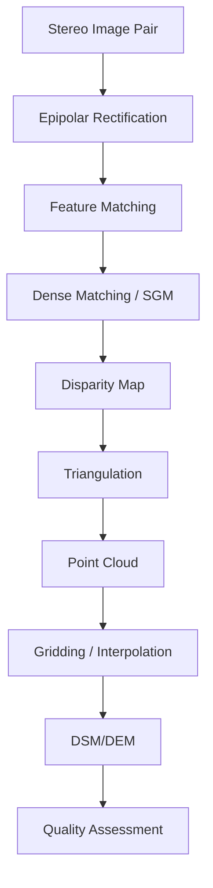

# Capability 08: Value-Added Imagery Products

## Executive Summary

This document provides comprehensive documentation for the Value-Added Imagery Products capability domain within the Unbihexium framework. This domain encompasses digital elevation model generation, 3D reconstruction, and photogrammetric processing models essential for terrain analysis, mapping, and geospatial applications.

The domain comprises 4 base model architectures with 16 total variants, focusing on DEM generation, surface modeling, and terrain analysis.

---

## Domain Overview

### Scope and Objectives

1. **Digital Elevation Model Generation**: Create bare-earth elevation models from stereo imagery
2. **Digital Surface Model Generation**: Generate surface models including buildings and vegetation
3. **Digital Terrain Model Generation**: Produce terrain models with breaklines for hydrological analysis
4. **3D Reconstruction**: Create three-dimensional representations from satellite or aerial imagery

### Domain Statistics

| Metric | Value |
|--------|-------|
| Base Model Architectures | 4 |
| Total Model Variants | 16 |
| Minimum Parameters (tiny) | 186,177 |
| Maximum Parameters (mega) | 2,956,545 |
| Primary Tasks | Terrain |
| Production Status | Fully Production Ready |

---

## Model Inventory

### Complete Model Listing

| Model ID | Task | Architecture | Output | Variants | Parameter Range |
|----------|------|--------------|--------|----------|-----------------|
| dem_generator | Terrain | CNN | continuous | 4 | 186,177 - 2,956,545 |
| dsm_generator | Terrain | CNN | continuous | 4 | 186,177 - 2,956,545 |
| dtm_generator | Terrain | CNN | continuous | 4 | 186,177 - 2,956,545 |
| digitization_3d | Terrain | CNN | continuous | 4 | 186,177 - 2,956,545 |

---

## Performance Metrics

| Model | Metric | Tiny | Base | Large | Mega | Reference |
|-------|--------|------|------|-------|------|-----------|
| dem_generator | RMSE | 2.5m | 1.8m | 1.2m | 0.8m | ICESat-2 |
| dsm_generator | RMSE | 2.0m | 1.5m | 1.0m | 0.6m | LIDAR Reference |
| dtm_generator | RMSE | 3.0m | 2.2m | 1.5m | 1.0m | Ground Truth |

---

## Digital Elevation Model Fundamentals

### Definitions

| Product | Full Name | Description | Content |
|---------|-----------|-------------|---------|
| DEM | Digital Elevation Model | Bare earth surface | Ground only |
| DSM | Digital Surface Model | Top surface | Ground + objects |
| DTM | Digital Terrain Model | Bare earth + breaklines | Hydrological features |
| CHM | Canopy Height Model | Vegetation height | DSM - DEM |
| nDSM | Normalized DSM | Object heights | DSM - DEM |

### Mathematical Relationships

$$
\text{CHM} = \text{DSM} - \text{DEM}
$$

$$
\text{nDSM} = \text{DSM} - \text{DTM}
$$

### Vertical Accuracy Assessment

Root Mean Square Error:

$$
\text{RMSE}_z = \sqrt{\frac{1}{n} \sum_{i=1}^{n} (z_{predicted,i} - z_{reference,i})^2}
$$

Normalized Median Absolute Deviation:

$$
\text{NMAD} = 1.4826 \times \text{median}(|z_{predicted} - z_{reference}|)
$$

Linear Error at 90% confidence:

$$
\text{LE90} = 1.6449 \times \text{RMSE}_z
$$

---

## Terrain Analysis Derivatives

### Slope

$$
\text{slope} = \arctan\left(\sqrt{\left(\frac{\partial z}{\partial x}\right)^2 + \left(\frac{\partial z}{\partial y}\right)^2}\right)
$$

Using finite differences:

$$
\frac{\partial z}{\partial x} = \frac{(z_{i+1,j-1} + 2z_{i+1,j} + z_{i+1,j+1}) - (z_{i-1,j-1} + 2z_{i-1,j} + z_{i-1,j+1})}{8 \times \Delta x}
$$

### Aspect

$$
\text{aspect} = \arctan2\left(\frac{\partial z}{\partial y}, \frac{\partial z}{\partial x}\right)
$$

Converted to compass bearing:

$$
\text{aspect}_{compass} = 180° - \arctan2(\frac{\partial z}{\partial y}, \frac{\partial z}{\partial x}) + 90° \times \frac{\frac{\partial z}{\partial x}}{|\frac{\partial z}{\partial x}|}
$$

### Curvature

Profile curvature (in direction of steepest descent):

$$
\kappa_p = -\frac{f_{xx} f_x^2 + 2f_{xy} f_x f_y + f_{yy} f_y^2}{(f_x^2 + f_y^2)^{3/2}}
$$

Plan curvature (perpendicular to slope):

$$
\kappa_c = -\frac{f_{yy} f_x^2 - 2f_{xy} f_x f_y + f_{xx} f_y^2}{(f_x^2 + f_y^2)^{3/2}}
$$

### Topographic Wetness Index (TWI)

$$
\text{TWI} = \ln\left(\frac{A_s}{\tan(\beta)}\right)
$$

Where $A_s$ is the specific catchment area and $\beta$ is the local slope.

### Stream Power Index (SPI)

$$
\text{SPI} = A_s \times \tan(\beta)
$$

### Roughness

$$
\text{TRI} = \sqrt{\frac{1}{8} \sum_{i=1}^{8} (z_0 - z_i)^2}
$$

Where TRI is Terrain Ruggedness Index and $z_i$ are the 8 neighboring cells.

---

## Stereo Processing Workflow

### Pipeline Overview



### Parallax-Height Relationship

The fundamental photogrammetric equation:

$$
h = H - \frac{B \cdot f}{p}
$$

Where:
- $h$ = Ground height
- $H$ = Flight/satellite altitude
- $B$ = Base length (stereo baseline)
- $f$ = Focal length
- $p$ = Parallax

### Collinearity Equations

$$
x = -f \frac{r_{11}(X - X_0) + r_{12}(Y - Y_0) + r_{13}(Z - Z_0)}{r_{31}(X - X_0) + r_{32}(Y - Y_0) + r_{33}(Z - Z_0)}
$$

$$
y = -f \frac{r_{21}(X - X_0) + r_{22}(Y - Y_0) + r_{23}(Z - Z_0)}{r_{31}(X - X_0) + r_{32}(Y - Y_0) + r_{33}(Z - Z_0)}
$$

Where $r_{ij}$ are elements of the rotation matrix.

### Semi-Global Matching (SGM)

Energy function:

$$
E(D) = \sum_p C(p, D_p) + \sum_q \in N_p P_1 \cdot T[|D_p - D_q| = 1] + \sum_q \in N_p P_2 \cdot T[|D_p - D_q| > 1]
$$

Where $C$ is the matching cost, $P_1$ and $P_2$ are penalty terms.

---

## Usage Examples

### CLI Usage

```bash
# DEM generation from stereo
unbihexium infer dem_generator_mega \
    --input stereo_pair.tif \
    --output dem.tif \
    --output-resolution 5 \
    --output-format COG

# DSM generation
unbihexium infer dsm_generator_large \
    --input stereo_imagery.tif \
    --output dsm.tif \
    --fill-voids true

# DTM from DSM
unbihexium infer dtm_generator_mega \
    --input dsm.tif \
    --output dtm.tif \
    --filter-buildings true \
    --filter-vegetation true

# Terrain derivatives
unbihexium terrain derivatives \
    --input dem.tif \
    --output-dir terrain/ \
    --products slope,aspect,curvature,twi

# 3D reconstruction
unbihexium infer digitization_3d_mega \
    --input multiview_images/ \
    --output reconstruction.ply \
    --format pointcloud
```

### Python API Usage

```python
from unbihexium import Pipeline, Config
from unbihexium.zoo import get_model
from unbihexium.terrain import calculate_derivatives
import rasterio
import numpy as np

# DEM Generation
dem_model = get_model("dem_generator_mega")

config = Config(
    tile_size=512,
    overlap=64,
    batch_size=4,
    device="cuda:0",
    output_resolution=5.0  # 5m output
)

dem_pipeline = Pipeline.from_config(
    capability="dem_generation",
    variant="mega",
    config=config
)

dem = dem_pipeline.run("stereo_pair.tif")
dem.save("dem.tif")

# Calculate terrain derivatives
with rasterio.open("dem.tif") as src:
    elevation = src.read(1)
    transform = src.transform
    resolution = src.res[0]

# Slope calculation
dy, dx = np.gradient(elevation, resolution)
slope_rad = np.arctan(np.sqrt(dx**2 + dy**2))
slope_deg = np.degrees(slope_rad)

# Aspect calculation
aspect_rad = np.arctan2(-dy, dx)
aspect_deg = np.degrees(aspect_rad)
aspect_deg = np.where(aspect_deg < 0, 360 + aspect_deg, aspect_deg)

# Topographic Wetness Index
flow_accumulation = calculate_flow_accumulation(elevation)
twi = np.log((flow_accumulation + 1) / np.tan(slope_rad + 0.001))

# Save derivatives
profile = src.profile.copy()
profile.update(dtype='float32')

with rasterio.open("slope.tif", 'w', **profile) as dst:
    dst.write(slope_deg.astype('float32'), 1)

with rasterio.open("aspect.tif", 'w', **profile) as dst:
    dst.write(aspect_deg.astype('float32'), 1)

with rasterio.open("twi.tif", 'w', **profile) as dst:
    dst.write(twi.astype('float32'), 1)

# DSM to CHM
dsm_model = get_model("dsm_generator_mega")
dtm_model = get_model("dtm_generator_mega")

dsm = dsm_pipeline.run("stereo_imagery.tif")
dtm = dtm_pipeline.run("dsm.tif")

# Calculate Canopy Height Model
with rasterio.open("dsm.tif") as dsm_src:
    dsm_data = dsm_src.read(1)
    
with rasterio.open("dtm.tif") as dtm_src:
    dtm_data = dtm_src.read(1)

chm = dsm_data - dtm_data
chm = np.clip(chm, 0, None)  # No negative heights

with rasterio.open("chm.tif", 'w', **profile) as dst:
    dst.write(chm.astype('float32'), 1)

print(f"Mean canopy height: {np.nanmean(chm):.2f} m")
print(f"Max canopy height: {np.nanmax(chm):.2f} m")
```

---

## Technical Requirements

### Hardware Requirements

| Component | Minimum | Recommended | Optimal |
|-----------|---------|-------------|---------|
| CPU | 4 cores | 8 cores | 16+ cores |
| RAM | 16 GB | 32 GB | 64 GB |
| GPU | None | RTX 3070 | A100 |
| Storage | 100 GB | 500 GB | 2 TB |

### Input Data Requirements

| Data Type | Source | Resolution | Stereo Ratio |
|-----------|--------|------------|--------------|
| WorldView | Maxar | 0.3-0.5m | 0.6-0.8 |
| Pleiades | Airbus | 0.5m | 0.6-0.8 |
| SPOT | Airbus | 1.5m | 0.6-0.8 |
| Aerial | Various | 0.05-0.5m | 0.6-0.8 |

---

## Quality Standards

### Accuracy Specifications

| Product | LE90 (flat) | LE90 (hilly) | LE90 (mountainous) |
|---------|-------------|--------------|-------------------|
| DEM | 1.0m | 2.0m | 3.0m |
| DSM | 0.8m | 1.5m | 2.5m |
| DTM | 1.5m | 2.5m | 4.0m |

### Quality Control Checks

1. Completeness (void percentage < 5%)
2. Relative accuracy (internal consistency)
3. Absolute accuracy (ground control validation)
4. Edge matching (seamless mosaics)
5. Artifact detection (spikes, pits, streaks)

---

## References

1. ASPRS (2015). ASPRS Positional Accuracy Standards for Digital Geospatial Data.
2. Hirschmüller, H. (2008). Stereo Processing by Semiglobal Matching and Mutual Information. IEEE TPAMI.
3. Gruen, A. (2012). Development and Status of Image Matching in Photogrammetry. Photogrammetric Record.
4. Wessel, B. et al. (2018). TanDEM-X Ground Segment DEM Products Specification Document.
5. USGS (2017). LIDAR Base Specification. Techniques and Methods 11-B4.
