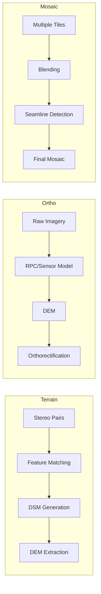

# 08 - Value-Added Imagery

## Purpose

Value-added imagery products including terrain models, orthorectification, and mosaicking.

## Audience

Image processing engineers, photogrammetry specialists, mapping professionals.

## Prerequisites

- Python 3.10+
- Stereo/tri-stereo imagery for DSM/DEM
- RPC coefficients or sensor models

## Inputs/Outputs

| Input | Format | Output | Format |
|-------|--------|--------|--------|
| Stereo pairs | GeoTIFF | DSM/DEM | GeoTIFF |
| Raw imagery + DEM | GeoTIFF | Orthorectified | GeoTIFF, COG |
| Multiple tiles | GeoTIFF | Mosaic | GeoTIFF, COG |

## Pipeline Architecture



## Algorithms

### DSM from Stereo

The disparity to height conversion:

$$h = H - \frac{B \times f}{d}$$

Where $B$ is baseline, $f$ is focal length, $d$ is disparity.

### Orthorectification Transform

$$\begin{pmatrix} x' \\ y' \end{pmatrix} = \begin{pmatrix} x \\ y \end{pmatrix} + \frac{\Delta h}{h} \cdot \begin{pmatrix} x - x_0 \\ y - y_0 \end{pmatrix}$$

## Metrics

| Product | Metric | Typical Value |
|---------|--------|---------------|
| DSM | Vertical accuracy | 1-3m (stereo) |
| DEM | RMSE | < 2m |
| Ortho | Horizontal accuracy | < 1 pixel |

## Mandatory Mapping Table

| Bullet Item | capability_id | Module Path | Pipeline ID | CLI Example | Example Script | Test Path | Model ID(s) | Maturity |
|-------------|---------------|-------------|-------------|-------------|----------------|-----------|-------------|----------|
| DSM vs DEM handling/generation utilities | dsm_dem | `unbihexium.io.terrain` | terrain | `unbihexium pipeline run terrain -i stereo/ -o dsm.tif` | `examples/terrain.py` | `tests/unit/test_io.py` | dsm_generator_tiny, dsm_generator_base, dsm_generator_large, dem_generator_tiny, dem_generator_base, dem_generator_large | production |
| Orthorectification | ortho | `unbihexium.io.geotiff.orthorectify` | ortho | `unbihexium pipeline run ortho -i raw.tif -i dem.tif -o ortho.tif` | `examples/ortho.py` | `tests/unit/test_io.py` | orthorectification_tiny, orthorectification_base, orthorectification_large | production |
| Mosaicking | mosaic | `unbihexium.io.geotiff.mosaic` | mosaic | `unbihexium pipeline run mosaic -i tiles/*.tif -o mosaic.tif` | `examples/mosaic.py` | `tests/unit/test_io.py` | mosaicking_tiny, mosaicking_base, mosaicking_large | production |

## DSM vs DEM

| Product | Definition | Use Case |
|---------|------------|----------|
| DSM | Digital Surface Model - includes buildings, trees | Urban modeling, solar potential |
| DEM | Digital Elevation Model - bare earth | Hydrology, slope analysis |
| DTM | Digital Terrain Model - bare earth with breaklines | Engineering, civil works |

## Limitations

- DSM accuracy depends on stereo geometry and texture
- Orthorectification requires accurate DEM and sensor model
- Mosaicking quality depends on radiometric consistency

## Examples (CLI)

```bash
# Generate DSM from stereo
unbihexium pipeline run terrain -i stereo_pair/ -o dsm.tif

# Orthorectify imagery
unbihexium pipeline run ortho -i raw.tif -i dem.tif -o ortho.tif

# Create mosaic
unbihexium pipeline run mosaic -i tiles/*.tif -o mosaic.tif --blend feather
```

## API Entry Points

```python
from unbihexium.io.terrain import generate_dsm, extract_dem
from unbihexium.io.geotiff import orthorectify, mosaic
```

## Tests

- Unit tests: `tests/unit/test_io.py`
- Integration tests: `tests/integration/test_terrain.py`

## References

- [Documentation Index](../index.md)
- [Table of Contents](../toc.md)
- [Image Processing](04_environment_forestry_image_processing.md)
