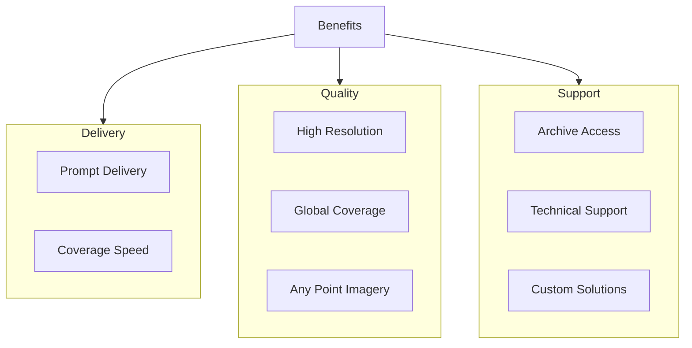

# 09 - Benefits Narrative

## Purpose

Documentation of the key benefits and value propositions of unbihexium and satellite imagery analysis.

## Audience

Decision makers, project managers, evaluators, procurement teams.

## Prerequisites

None required for reading this narrative documentation.

## Benefits Overview



## Value Proposition

| Benefit | Description | Business Impact |
|---------|-------------|-----------------|
| Prompt delivery | Fast turnaround from order to delivery | Time-critical decisions |
| High resolution | Sub-meter resolution options | Detailed analysis |
| Global coverage | Worldwide acquisition capability | Any location |
| Any point imagery | Tasking for specific locations | Targeted monitoring |
| Coverage speed | Rapid area coverage | Large-scale mapping |
| Archive | Historical imagery access | Change analysis |
| Support | Technical assistance | Implementation success |
| Custom solutions | Tailored processing | Specific requirements |

## Benefit Quantification

The value of timely satellite imagery can be expressed as:

$$V = \sum_{i=1}^{n} (B_i - C_i) \times P(success_i)$$

Where $B_i$ is benefit of decision $i$, $C_i$ is cost, and $P(success_i)$ is probability of successful outcome with imagery.

## Mandatory Mapping Table

| Bullet Item | capability_id | Module Path | Pipeline ID | CLI Example | Example Script | Test Path | Model ID(s) | Maturity |
|-------------|---------------|-------------|-------------|-------------|----------------|-----------|-------------|----------|
| Prompt delivery | delivery | `unbihexium.io.stac` | download | `unbihexium zoo download model_id` | `examples/download.py` | `tests/unit/test_zoo.py` | classical/no-weights | production |
| High resolution | resolution | `unbihexium.core.raster` | load | `unbihexium data info input.tif` | `examples/resolution.py` | `tests/unit/test_core.py` | classical/no-weights | production |
| Global coverage | coverage | `unbihexium.io.stac` | search | `unbihexium stac search --bbox ... --datetime ...` | `examples/stac_search.py` | `tests/unit/test_io.py` | classical/no-weights | production |
| Any point imagery | tasking | `unbihexium.io.stac` | search | `unbihexium stac search --point ...` | `examples/point_query.py` | `tests/unit/test_io.py` | classical/no-weights | production |
| Coverage speed | speed | `unbihexium.core.tile` | tile | `unbihexium pipeline run tile -i large.tif -o tiles/` | `examples/tiling.py` | `tests/unit/test_core.py` | raster_tiler_tiny, raster_tiler_base, raster_tiler_large | production |
| Archive | archive | `unbihexium.io.stac` | archive | `unbihexium stac search --datetime 2020-01-01/2024-12-31` | `examples/archive.py` | `tests/unit/test_io.py` | classical/no-weights | production |
| Support | support | documentation | N/A | `unbihexium --help` | N/A | N/A | classical/no-weights | production |
| Custom solutions | custom | `unbihexium.registry.pipelines` | custom | `unbihexium pipeline run custom -c config.yaml` | `examples/custom_pipeline.py` | `tests/unit/test_registry.py` | classical/no-weights | production |

## Use Case Examples

### Emergency Response

Quick delivery enables:
- Disaster damage assessment within hours
- Resource allocation optimization
- Evacuation route planning

### Agricultural Monitoring

Archive access provides:
- Multi-year trend analysis
- Seasonal comparison
- Yield prediction calibration

### Urban Planning

High resolution enables:
- Building footprint extraction
- Road network mapping
- 3D city modeling

## Limitations

- Benefits depend on imagery availability
- Cloud cover may affect optical imagery
- Processing time scales with area

## Examples (CLI)

```bash
# Search archive for historical imagery
unbihexium stac search --bbox 10,45,11,46 --datetime 2020-01-01/2024-12-31

# Check data resolution
unbihexium data info input.tif

# Get help
unbihexium --help
```

## API Entry Points

```python
from unbihexium.io.stac import STACClient, search_stac
from unbihexium.core.raster import Raster
from unbihexium.registry.pipelines import PipelineRegistry
```

## Tests

- Unit tests: `tests/unit/test_io.py`, `tests/unit/test_core.py`

## References

- [Documentation Index](../index.md)
- [Table of Contents](../toc.md)
- [STAC Integration](../reference/api.md)
