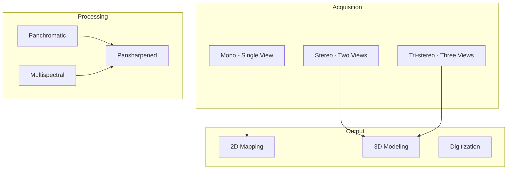

# 10 - Satellite Imagery Key Features

## Purpose

Documentation of satellite imagery acquisition modes, processing features, and capabilities.

## Audience

Remote sensing specialists, photogrammetry engineers, mapping professionals.

## Prerequisites

- Understanding of satellite imagery concepts
- Familiarity with sensor characteristics

## Inputs/Outputs

| Input | Format | Output | Format |
|-------|--------|--------|--------|
| Stereo/tri-stereo pairs | GeoTIFF | DSM | GeoTIFF |
| Panchromatic | GeoTIFF | Pansharpened | GeoTIFF |
| Multispectral | GeoTIFF | Analysis-ready | GeoTIFF, COG |

## Acquisition Modes



## Acquisition Geometry

The stereo convergence angle:

$$\theta = \arctan\left(\frac{B}{H}\right)$$

Where $B$ is baseline and $H$ is altitude.

### Height Accuracy

$$\sigma_h = \frac{H}{B} \times \sigma_p$$

Where $\sigma_p$ is parallax measurement accuracy.

## Feature Matrix

| Feature | Description | Application |
|---------|-------------|-------------|
| Stereo acquisition | Two views with B/H ratio | 3D reconstruction |
| Tri-stereo acquisition | Three views for redundancy | High-accuracy DEM |
| Panchromatic | Single high-res band | Detail extraction |
| Multispectral | Multiple spectral bands | Land cover, indices |
| Pansharpened | Fused Pan + MS | Best of both |

## Mandatory Mapping Table

| Bullet Item | capability_id | Module Path | Pipeline ID | CLI Example | Example Script | Test Path | Model ID(s) | Maturity |
|-------------|---------------|-------------|-------------|-------------|----------------|-----------|-------------|----------|
| Stereo/tri-stereo acquisitions abstraction | stereo | `unbihexium.io.stereo` | stereo | `unbihexium pipeline run stereo -i pair/ -o dsm.tif` | `examples/stereo.py` | `tests/unit/test_io.py` | stereo_processor_tiny, stereo_processor_base, stereo_processor_large, tri_stereo_processor_tiny, tri_stereo_processor_base, tri_stereo_processor_large | production |
| 2D and 3D digitization utilities | digitization | `unbihexium.io.digitization` | digitize | `unbihexium pipeline run digitize -i ortho.tif -o features.geojson` | `examples/digitization.py` | `tests/unit/test_io.py` | digitization_2d_tiny, digitization_2d_base, digitization_2d_large, digitization_3d_tiny, digitization_3d_base, digitization_3d_large | production |
| Mapping scales 1:2000-1:100000 in metadata + QA | scales | `unbihexium.core.product` | validate | `unbihexium data validate -i product.tif --scale 1:10000` | `examples/scale_validation.py` | `tests/unit/test_core.py` | classical/no-weights | production |
| Pansharpening, multispectral, panchromatic | spectral | `unbihexium.io.geotiff` | pansharpen | `unbihexium pipeline run pansharpen -i ms.tif -i pan.tif -o sharp.tif` | `examples/pansharpen.py` | `tests/unit/test_io.py` | pansharpening_tiny, pansharpening_base, pansharpening_large, panchromatic_processor_tiny, panchromatic_processor_base, panchromatic_processor_large, multispectral_processor_tiny, multispectral_processor_base, multispectral_processor_large | production |
| Mono/stereo/tri-stereo | acquisition | `unbihexium.io.stereo` | acquisition | `unbihexium data info stereo_pair/` | `examples/acquisition.py` | `tests/unit/test_io.py` | stereo_processor_tiny, stereo_processor_base, stereo_processor_large | production |

## Mapping Scale Guidelines

| Scale | Ground Resolution | Application |
|-------|-------------------|-------------|
| 1:2,000 | 0.3-0.5 m | Cadastral, engineering |
| 1:5,000 | 0.5-1.0 m | Urban planning |
| 1:10,000 | 1.0-2.5 m | Regional planning |
| 1:25,000 | 2.5-5.0 m | Topographic mapping |
| 1:50,000 | 5.0-10.0 m | National mapping |
| 1:100,000 | 10.0-25.0 m | Small-scale mapping |

## Limitations

- Stereo geometry affects height accuracy
- Cloud cover limits optical acquisition
- Off-nadir angles increase geometric distortion

## Examples (CLI)

```bash
# Process stereo pair
unbihexium pipeline run stereo -i stereo_pair/ -o dsm.tif

# Pansharpen imagery
unbihexium pipeline run pansharpen -i multispectral.tif -i panchromatic.tif -o pansharpened.tif

# Validate mapping scale
unbihexium data validate -i ortho.tif --target-scale 1:10000
```

## API Entry Points

```python
from unbihexium.io.stereo import StereoProcessor, TriStereoProcessor
from unbihexium.io.geotiff import pansharpen
from unbihexium.io.digitization import Digitizer
```

## Tests

- Unit tests: `tests/unit/test_io.py`

## References

- [Documentation Index](../index.md)
- [Table of Contents](../toc.md)
- [Value-Added Imagery](08_value_added_imagery.md)

---

## Quick Navigation

| Prev | Home | Next |
|------|------|------|

