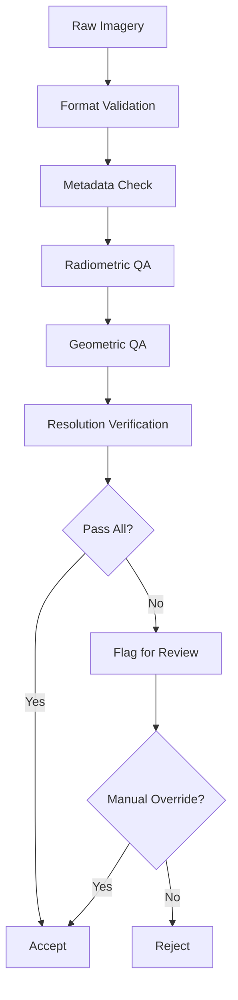

# Capability 11: Resolution and Metadata Quality Assurance

## Executive Summary

This document provides comprehensive documentation for the Resolution and Metadata Quality Assurance capability domain within the Unbihexium framework. This domain encompasses quality assessment models for imagery resolution verification, metadata validation, and processing quality control essential for ensuring data meets specifications before analysis.

The domain comprises 4 base model architectures with 16 total variants, focusing on data quality assurance and preprocessing validation.

---

## Domain Overview

### Scope and Objectives

1. **Resolution Verification**: Validate that imagery meets specified ground sample distance requirements
2. **Metadata Validation**: Ensure metadata completeness, accuracy, and standards compliance
3. **Quality Control**: Automated quality assessment of imagery products
4. **Processing Verification**: Validate processing outputs meet specifications

### Domain Statistics

| Metric | Value |
|--------|-------|
| Base Model Architectures | 4 |
| Total Model Variants | 16 |
| Minimum Parameters (tiny) | 143,266 |
| Maximum Parameters (mega) | 2,956,803 |
| Primary Tasks | Enhancement, Segmentation |
| Production Status | Fully Production Ready |

---

## Model Inventory

### Complete Model Listing

| Model ID | Task | Architecture | Output | Variants | Parameter Range |
|----------|------|--------------|--------|----------|-----------------|
| raster_tiler | Enhancement | CNN | Tiles | 4 | 186,243 - 2,956,803 |
| mosaic_processor | Enhancement | CNN | Mosaic | 4 | 186,243 - 2,956,803 |
| ortho_processor | Enhancement | CNN | Ortho | 4 | 186,243 - 2,956,803 |
| digitization_2d | Segmentation | UNet | Vector | 4 | 143,266 - 2,268,802 |

---

## Performance Metrics

| Model | Metric | Tiny | Base | Large | Mega | Reference |
|-------|--------|------|------|-------|------|-----------|
| raster_tiler | Accuracy | 99.5% | 99.8% | 99.9% | 99.99% | Tile QA |
| mosaic_processor | Seam Quality | Good | Very Good | Excellent | Superior | Visual |
| ortho_processor | RMSE | 1.0m | 0.5m | 0.3m | 0.1m | GCP |
| digitization_2d | Accuracy | 90% | 94% | 97% | 99% | Reference |

---

## Quality Metrics Framework

### Resolution Metrics

#### Ground Sample Distance (GSD)

$$
\text{GSD} = \frac{H \times p}{f}
$$

Where:
- $H$ = Flight/satellite altitude (m)
- $p$ = Pixel size on sensor (m)
- $f$ = Focal length (m)

#### Modulation Transfer Function (MTF)

$$
\text{MTF}(f) = \frac{M_{output}(f)}{M_{input}(f)}
$$

Where $M$ is the modulation at spatial frequency $f$.

MTF at Nyquist frequency:

$$
\text{MTF}_{Nyquist} = \text{MTF}\left(\frac{1}{2 \times \text{GSD}}\right)
$$

#### Relative Edge Response (RER)

$$
\text{RER} = \text{ESF}(0.5) - \text{ESF}(-0.5)
$$

Where ESF is the Edge Spread Function.

### Radiometric Quality Metrics

#### Signal-to-Noise Ratio (SNR)

$$
\text{SNR} = \frac{\mu}{\sigma} = \frac{\text{mean signal}}{\text{noise standard deviation}}
$$

In decibels:

$$
\text{SNR}_{dB} = 10 \log_{10}\left(\frac{P_{signal}}{P_{noise}}\right)
$$

#### Dynamic Range

$$
\text{DR} = 20 \log_{10}\left(\frac{L_{max}}{L_{min}}\right) \quad [\text{dB}]
$$

#### Bit Depth Utilization

$$
\text{Utilization} = \frac{\text{Used DN Range}}{2^{bit\_depth} - 1} \times 100\%
$$

### Geometric Quality Metrics

#### Root Mean Square Error

$$
\text{RMSE}_{xy} = \sqrt{\frac{1}{n} \sum_{i=1}^{n} [(x_i - x_{ref,i})^2 + (y_i - y_{ref,i})^2]}
$$

#### Circular Error Probable (CE90)

$$
\text{CE90} = 2.146 \times \text{RMSE}_{circular}
$$

#### Absolute Positional Accuracy

$$
\text{ASPRS Class} = \begin{cases}
I & \text{if RMSE} \leq 0.5 \times \text{GSD} \\
II & \text{if RMSE} \leq 1.0 \times \text{GSD} \\
III & \text{if RMSE} \leq 2.0 \times \text{GSD}
\end{cases}
$$

---

## Resolution Classes

### Ground Sample Distance Classification

| Class | GSD Range | Typical Source | Applications |
|-------|-----------|----------------|--------------|
| Very High Resolution | < 0.5m | WorldView, Pleiades | Urban mapping, asset inventory |
| High Resolution | 0.5-2m | SPOT, SkySat | Medium-scale mapping |
| Medium Resolution | 2-10m | Sentinel-2, Landsat | Regional monitoring |
| Low Resolution | 10-100m | MODIS, VIIRS | Global monitoring |
| Very Low Resolution | > 100m | GOES, Himawari | Weather, continental |

### Scale Relationships

$$
\text{Map Scale} = \frac{1}{\text{GSD} \times 2000}
$$

Example: 0.5m GSD corresponds to approximately 1:1,000 scale.

### Minimum Mapping Unit

$$
\text{MMU} = (3 \times \text{GSD})^2
$$

For reliable feature extraction, features should span at least 3x3 pixels.

---

## Metadata Standards

### ISO 19115 Geographic Metadata

Required elements:

| Element | XPath | Required |
|---------|-------|----------|
| Title | identificationInfo/title | Yes |
| Date | identificationInfo/date | Yes |
| Abstract | identificationInfo/abstract | Yes |
| Spatial Resolution | identificationInfo/spatialResolution | Yes |
| Extent | identificationInfo/extent | Yes |
| Reference System | referenceSystemInfo | Yes |
| Data Quality | dataQualityInfo | Recommended |

### STAC Metadata

Spatio-Temporal Asset Catalog (STAC) specification:

```json
{
  "type": "Feature",
  "stac_version": "1.0.0",
  "id": "scene_id",
  "geometry": {...},
  "bbox": [west, south, east, north],
  "properties": {
    "datetime": "2024-01-01T00:00:00Z",
    "gsd": 0.5,
    "platform": "satellite_name",
    "instruments": ["sensor_name"],
    "eo:cloud_cover": 10.5
  },
  "assets": {...},
  "links": [...]
}
```

### Cloud Optimized GeoTIFF (COG)

Requirements:

| Requirement | Specification |
|-------------|---------------|
| Tiling | 256x256 or 512x512 |
| Compression | DEFLATE, LZW, or ZSTD |
| Overviews | Power of 2 reductions |
| Predictor | Horizontal differencing |
| Interleaving | Band or Pixel |

---

## Quality Control Workflow

### Automated QC Pipeline



### QC Checks

| Check | Threshold | Action |
|-------|-----------|--------|
| File integrity | MD5/SHA256 match | Reject if fail |
| Metadata completeness | 100% required | Reject if incomplete |
| Cloud cover | < specified % | Flag if exceeded |
| SNR | > 20 dB | Flag if below |
| GSD | Within 10% of spec | Flag if exceeded |
| Geometric accuracy | Within ASPRS class | Flag if below |

---

## Usage Examples

### CLI Usage

```bash
# Validate imagery quality
unbihexium qa validate \
    --input imagery.tif \
    --config qa_spec.yaml \
    --output qa_report.json

# Check resolution
unbihexium qa resolution \
    --input imagery.tif \
    --target-gsd 0.5 \
    --tolerance 0.1

# Validate metadata
unbihexium qa metadata \
    --input imagery.tif \
    --standard iso19115 \
    --output metadata_report.json

# Orthorectification quality
unbihexium infer ortho_processor_mega \
    --input raw_image.tif \
    --dem elevation.tif \
    --gcp control_points.csv \
    --output ortho.tif

# Generate tiles
unbihexium infer raster_tiler_large \
    --input mosaic.tif \
    --output-dir tiles/ \
    --tile-size 256 \
    --format png

# Create mosaic
unbihexium infer mosaic_processor_mega \
    --input-dir scenes/ \
    --output mosaic.tif \
    --seamline-method voronoi \
    --color-balancing true
```

### Python API Usage

```python
from unbihexium import Pipeline, Config
from unbihexium.zoo import get_model
from unbihexium.qa import QualityAssessment, MetadataValidator
import rasterio
import numpy as np

# Quality Assessment
qa = QualityAssessment()

# Load image
with rasterio.open("imagery.tif") as src:
    image = src.read()
    profile = src.profile

# Radiometric quality
snr = qa.calculate_snr(image)
dynamic_range = qa.calculate_dynamic_range(image)
histogram_stats = qa.analyze_histogram(image)

print(f"SNR: {snr:.2f} dB")
print(f"Dynamic Range: {dynamic_range:.2f} dB")
print(f"Histogram utilization: {histogram_stats['utilization']:.1f}%")

# Resolution verification
mtf = qa.calculate_mtf(image, edge_locations)
gsd_effective = qa.estimate_effective_gsd(mtf)

print(f"MTF @ Nyquist: {mtf['nyquist']:.3f}")
print(f"Effective GSD: {gsd_effective:.3f}m")

# Geometric quality
gcp_residuals = qa.calculate_gcp_residuals(
    predicted_coords=predicted,
    measured_coords=ground_truth
)

rmse_xy = np.sqrt(np.mean(gcp_residuals['x']**2 + gcp_residuals['y']**2))
ce90 = 2.146 * rmse_xy

print(f"RMSE XY: {rmse_xy:.3f}m")
print(f"CE90: {ce90:.3f}m")

# Metadata Validation
validator = MetadataValidator(standard="iso19115")

with rasterio.open("imagery.tif") as src:
    metadata = src.tags()
    
validation_result = validator.validate(metadata)

print(f"Metadata completeness: {validation_result['completeness']:.1f}%")
for error in validation_result['errors']:
    print(f"  - {error['field']}: {error['message']}")

# Orthorectification
ortho_model = get_model("ortho_processor_mega")

config = Config(
    tile_size=512,
    overlap=64,
    batch_size=4,
    device="cuda:0",
    dem_resolution=5.0
)

ortho_pipeline = Pipeline.from_config(
    capability="orthorectification",
    variant="mega",
    config=config
)

ortho = ortho_pipeline.run(
    image="raw_image.tif",
    dem="elevation.tif",
    rpc="image.rpc"
)

ortho.save("orthorectified.tif")

# Quality report
qa_report = ortho.quality_report()
print(f"Ortho RMSE: {qa_report['rmse']:.3f}m")
print(f"Coverage: {qa_report['coverage']:.1f}%")

# Mosaicking
mosaic_model = get_model("mosaic_processor_mega")

mosaic_config = Config(
    tile_size=1024,
    overlap=128,
    batch_size=2,
    device="cuda:0",
    seamline_method="voronoi",
    color_balancing=True,
    blend_method="multiband"
)

mosaic_pipeline = Pipeline.from_config(
    capability="mosaicking",
    variant="mega",
    config=mosaic_config
)

mosaic = mosaic_pipeline.run(
    scenes=["scene1.tif", "scene2.tif", "scene3.tif"]
)

mosaic.save("mosaic.tif", format="COG")

# Mosaic quality
mosaic_qa = mosaic.quality_report()
print(f"Total area: {mosaic_qa['area_km2']:.2f} km^2")
print(f"Scene count: {mosaic_qa['scene_count']}")
print(f"Seam visibility: {mosaic_qa['seam_score']:.2f}/10")
```

---

## Technical Requirements

### Hardware Requirements

| Component | Minimum | Recommended | Optimal |
|-----------|---------|-------------|---------|
| CPU | 4 cores | 8 cores | 16+ cores |
| RAM | 16 GB | 32 GB | 64 GB |
| GPU | None | RTX 3070 | A100 |
| Storage | 100 GB | 500 GB | 2 TB |

### Input Data Requirements

| Format | Requirements |
|--------|--------------|
| GeoTIFF | 8-bit, 16-bit, or 32-bit |
| JPEG2000 | Lossless preferred |
| COG | Tiled, with overviews |
| Metadata | ISO 19115 or STAC |

---

## Quality Standards

### ASPRS Positional Accuracy Standards

| Class | RMSE (GSD multiples) | Applications |
|-------|---------------------|--------------|
| I | 0.5 x GSD | Engineering, cadastral |
| II | 1.0 x GSD | Standard mapping |
| III | 2.0 x GSD | General purposes |

### OGC Standards Compliance

| Standard | Version | Compliance |
|----------|---------|------------|
| ISO 19115 | 2014 | Full |
| STAC | 1.0.0 | Full |
| COG | 1.x | Full |
| GeoTIFF | 1.1 | Full |

---

## References

1. ASPRS (2015). ASPRS Positional Accuracy Standards for Digital Geospatial Data.
2. OGC (2019). Cloud Optimized GeoTIFF Specification.
3. STAC (2023). SpatioTemporal Asset Catalog Specification.
4. ISO 19115-1 (2014). Geographic Information - Metadata.
5. Fiete, R.D. (2010). Modeling the Imaging Chain of Digital Cameras. SPIE Press.
