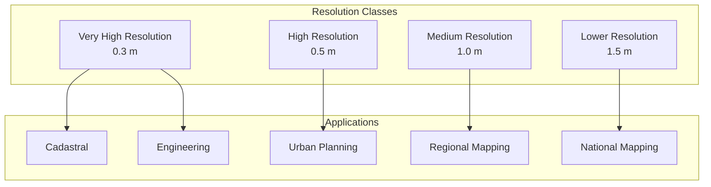

# 11 - Resolution Options and Quality Assurance

## Purpose

Documentation of supported resolution options and quality assurance procedures.

## Audience

Quality assurance engineers, data producers, mapping professionals.

## Prerequisites

- Understanding of spatial resolution concepts
- Familiarity with accuracy standards

## Inputs/Outputs

| Input | Format | Output | Format |
|-------|--------|--------|--------|
| Imagery products | GeoTIFF | QA reports | JSON, PDF |
| Ground control points | CSV, GeoJSON | Accuracy assessment | JSON |
| Reference data | Various | Comparison metrics | JSON |

## Resolution Hierarchy



## Resolution Options

| Resolution | Pixel Size | Mapping Scale | Application |
|------------|------------|---------------|-------------|
| 0.3 m | 30 cm | 1:2,000 | Detailed infrastructure |
| 0.5 m | 50 cm | 1:5,000 | Urban mapping |
| 1.0 m | 100 cm | 1:10,000 | Regional analysis |
| 1.5 m | 150 cm | 1:15,000 | Large area coverage |

## Quality Metrics

### Positional Accuracy

$$RMSE = \sqrt{\frac{1}{n} \sum_{i=1}^{n} (x_{est,i} - x_{ref,i})^2}$$

### Circular Error

$$CE90 = 1.5175 \times RMSE_{xy}$$

### Linear Error

$$LE90 = 1.6449 \times RMSE_z$$

## Mandatory Mapping Table

| Bullet Item | capability_id | Module Path | Pipeline ID | CLI Example | Example Script | Test Path | Model ID(s) | Maturity |
|-------------|---------------|-------------|-------------|-------------|----------------|-----------|-------------|----------|
| 0.3 m | resolution_03 | `unbihexium.core.raster` | validate | `unbihexium data validate -i input.tif --min-res 0.3` | `examples/resolution.py` | `tests/unit/test_core.py` | classical/no-weights | production |
| 0.5 m | resolution_05 | `unbihexium.core.raster` | validate | `unbihexium data validate -i input.tif --min-res 0.5` | `examples/resolution.py` | `tests/unit/test_core.py` | classical/no-weights | production |
| 1 m | resolution_10 | `unbihexium.core.raster` | validate | `unbihexium data validate -i input.tif --min-res 1.0` | `examples/resolution.py` | `tests/unit/test_core.py` | classical/no-weights | production |
| 1.5 m | resolution_15 | `unbihexium.core.raster` | validate | `unbihexium data validate -i input.tif --min-res 1.5` | `examples/resolution.py` | `tests/unit/test_core.py` | classical/no-weights | production |

## QA Procedures

| Check | Method | Threshold |
|-------|--------|-----------|
| Resolution | Metadata extraction | As specified |
| Positional accuracy | GCP comparison | CE90 < 3x resolution |
| Radiometric quality | Histogram analysis | No saturation > 1% |
| Coverage | Footprint check | > 99% specified AOI |

## Accuracy Standards

| Standard | Horizontal (CE90) | Vertical (LE90) |
|----------|-------------------|-----------------|
| Class I | 0.3 m | 0.5 m |
| Class II | 1.0 m | 1.0 m |
| Class III | 2.5 m | 2.5 m |

## Limitations

- Resolution alone does not guarantee feature detectability
- Accuracy depends on sensor calibration and processing
- Atmospheric conditions affect image quality

## Examples (CLI)

```bash
# Check image resolution
unbihexium data info input.tif

# Validate quality requirements
unbihexium data validate -i input.tif --min-res 0.5 --ce90 1.5

# Generate QA report
unbihexium data qa -i input.tif -o qa_report.json
```

## API Entry Points

```python
from unbihexium.core.raster import Raster
from unbihexium.core.product import ProductMetadata
```

## Tests

- Unit tests: `tests/unit/test_core.py`

## References

- [Documentation Index](../index.md)
- [Table of Contents](../toc.md)
- [Satellite Features](10_satellite_imagery_features.md)
