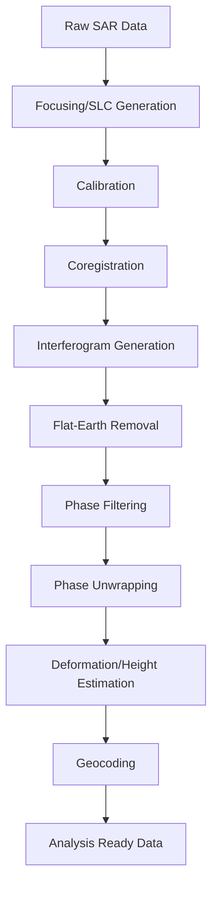
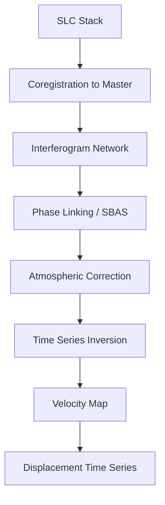

# Capability 12: Radar and Synthetic Aperture Radar (SAR)

## Executive Summary

This document provides comprehensive documentation for the Radar and Synthetic Aperture Radar (SAR) capability domain within the Unbihexium framework. This domain encompasses SAR processing models for all-weather, day-night Earth observation including amplitude analysis, phase processing, interferometry, and displacement monitoring.

The domain comprises 8 base model architectures with 32 total variants, covering SAR-specific applications from ship detection to ground displacement monitoring.

---

## Domain Overview

### Scope and Objectives

1. **SAR Amplitude Analysis**: Object detection and classification using SAR backscatter
2. **Phase Processing**: Coherence, interferometry, and phase unwrapping
3. **Displacement Monitoring**: Ground subsidence, uplift, and horizontal motion
4. **Multi-temporal Analysis**: Change detection and time-series analysis with SAR

### Domain Statistics

| Metric | Value |
|--------|-------|
| Base Model Architectures | 8 |
| Total Model Variants | 32 |
| Minimum Parameters (tiny) | 143,201 |
| Maximum Parameters (mega) | 2,956,545 |
| Primary Tasks | Detection, Segmentation, Terrain |
| Production Status | Fully Production Ready |

---

## Model Inventory

### Complete Model Listing

| Model ID | Task | Architecture | Output | Variants | Parameter Range |
|----------|------|--------------|--------|----------|-----------------|
| sar_ship_detector | Detection | UNet | 1 class | 4 | 143,201 - 2,268,545 |
| sar_flood_detector | Segmentation | UNet | 2 classes | 4 | 143,394 - 2,268,802 |
| sar_oil_spill_detector | Segmentation | UNet | 2 classes | 4 | 143,394 - 2,268,802 |
| sar_amplitude | Terrain | CNN | continuous | 4 | 186,177 - 2,956,545 |
| sar_phase_displacement | Terrain | CNN | continuous | 4 | 186,177 - 2,956,545 |
| sar_subsidence_monitor | Terrain | CNN | continuous | 4 | 186,177 - 2,956,545 |
| ground_displacement | Terrain | CNN | continuous | 4 | 186,177 - 2,956,545 |
| sar_mapping_workflow | Enhancement | CNN | RGB | 4 | 186,243 - 2,956,803 |

---

## Performance Metrics

| Model | Metric | Tiny | Base | Large | Mega | Reference |
|-------|--------|------|------|-------|------|-----------|
| sar_ship_detector | mAP@0.5 | 0.70 | 0.79 | 0.86 | 0.92 | SAR-Ship |
| sar_flood_detector | IoU | 0.75 | 0.83 | 0.89 | 0.94 | Sen1Floods |
| sar_oil_spill_detector | IoU | 0.72 | 0.80 | 0.87 | 0.92 | Oil-SAR |
| sar_subsidence_monitor | RMSE | 5mm | 3mm | 2mm | 1mm | Leveling |

---

## SAR Fundamentals

### Radar Equation

The fundamental radar equation:

$$
P_r = \frac{P_t G_t G_r \lambda^2 \sigma}{(4\pi)^3 R^4 L}
$$

Where:
- $P_r$ = Received power (W)
- $P_t$ = Transmitted power (W)
- $G_t, G_r$ = Transmit/receive antenna gains
- $\lambda$ = Wavelength (m)
- $\sigma$ = Radar cross-section (m^2)
- $R$ = Range (m)
- $L$ = System losses

### Backscatter Coefficient

Normalized radar cross-section:

$$
\sigma^0 = \frac{\sigma}{A_{ground}}
$$

In decibels:

$$
\sigma^0_{dB} = 10 \log_{10}(\sigma^0)
$$

### SAR Resolution

Range resolution:

$$
\delta_r = \frac{c}{2B}
$$

Where $c$ is speed of light and $B$ is bandwidth.

Azimuth resolution (unfocused):

$$
\delta_{az} = \frac{\lambda R}{2 L_s}
$$

Where $L_s$ is synthetic aperture length.

Azimuth resolution (focused):

$$
\delta_{az} = \frac{D}{2}
$$

Where $D$ is antenna length.

---

## SAR Bands and Applications

### Frequency Bands

| Band | Frequency | Wavelength | Penetration | Applications |
|------|-----------|------------|-------------|--------------|
| X | 8-12 GHz | 2.5-3.75 cm | Surface | Urban, ice monitoring |
| C | 4-8 GHz | 3.75-7.5 cm | Shallow | Agriculture, ocean |
| S | 2-4 GHz | 7.5-15 cm | Moderate | Soil moisture |
| L | 1-2 GHz | 15-30 cm | Deep | Forestry, subsidence |
| P | 0.3-1 GHz | 30-100 cm | Very deep | Biomass, subsurface |

### Polarization Modes

| Mode | Notation | Applications |
|------|----------|--------------|
| Single-pol | VV or HH | General mapping |
| Dual-pol | VV+VH or HH+HV | Land cover, vegetation |
| Quad-pol | HH+HV+VH+VV | Full characterization |
| Compact-pol | RH+RV | Compromise option |

### Polarimetric Signatures

| Target | HH | VV | HV/VH | Pol Ratio |
|--------|----|----|-------|-----------|
| Calm water | Very low | Very low | Very low | ~1 |
| Rough water | Low | Low | Low | ~1 |
| Urban | High | High | Medium | ~1 |
| Forest | Medium | Medium | High | < 1 |
| Bare soil | Medium | Low | Low | > 1 |
| Grassland | Low | Low | Low | ~1 |

---

## Interferometric SAR (InSAR)

### Interferometric Phase

$$
\phi = \frac{4\pi}{\lambda} \cdot \Delta R
$$

Where $\Delta R$ is the path length difference.

### Phase Components

$$
\phi_{total} = \phi_{flat} + \phi_{topo} + \phi_{defo} + \phi_{atm} + \phi_{noise}
$$

Where:
- $\phi_{flat}$ = Flat-earth phase
- $\phi_{topo}$ = Topographic phase
- $\phi_{defo}$ = Deformation phase
- $\phi_{atm}$ = Atmospheric phase
- $\phi_{noise}$ = Noise

### Coherence

$$
\gamma = \frac{|\langle s_1 \cdot s_2^* \rangle|}{\sqrt{\langle |s_1|^2 \rangle \langle |s_2|^2 \rangle}}
$$

Where $s_1$ and $s_2$ are complex SAR images.

Coherence ranges from 0 (no coherence) to 1 (perfect coherence).

### Deformation from Phase

Line-of-sight displacement:

$$
d_{LOS} = \frac{\lambda \cdot \phi_{defo}}{4\pi}
$$

Vertical displacement (assuming vertical motion):

$$
d_v = \frac{d_{LOS}}{\cos(\theta)}
$$

Where $\theta$ is the incidence angle.

### Height from Phase

$$
h = \frac{\lambda \cdot R \cdot \sin(\theta)}{4\pi \cdot B_\perp} \cdot \phi_{topo}
$$

Where $B_\perp$ is the perpendicular baseline.

### Height of Ambiguity

$$
h_{amb} = \frac{\lambda \cdot R \cdot \sin(\theta)}{2 \cdot B_\perp}
$$

---

## SAR Processing Chain

### Standard Processing Pipeline



### Multi-temporal InSAR



---

## Usage Examples

### CLI Usage

```bash
# SAR ship detection
unbihexium infer sar_ship_detector_mega \
    --input sentinel1_vv.tif \
    --output ships.geojson \
    --confidence 0.6 \
    --polarization VV

# SAR flood mapping
unbihexium infer sar_flood_detector_large \
    --input sentinel1_vh.tif \
    --output flood_extent.tif \
    --threshold 0.5 \
    --post-processing true

# Oil spill detection
unbihexium infer sar_oil_spill_detector_mega \
    --input sar_image.tif \
    --output oil_spills.geojson \
    --min-area 1000

# Subsidence monitoring
unbihexium infer sar_subsidence_monitor_mega \
    --input interferogram_stack/ \
    --output subsidence_map.tif \
    --method sbas \
    --temporal-baseline 365

# Ground displacement
unbihexium infer ground_displacement_large \
    --input-master master.slc \
    --input-slave slave.slc \
    --output displacement.tif \
    --dem elevation.tif
```

### Python API Usage

```python
from unbihexium import Pipeline, Config
from unbihexium.zoo import get_model
from unbihexium.sar import InSARProcessor, CoherenceCalculator
import numpy as np

# SAR Ship Detection
ship_model = get_model("sar_ship_detector_mega")

config = Config(
    tile_size=512,
    overlap=64,
    batch_size=8,
    device="cuda:0",
    confidence=0.6
)

ship_pipeline = Pipeline.from_config(
    capability="sar_ship_detection",
    variant="mega",
    config=config
)

ships = ship_pipeline.run("sentinel1_vv.tif")
ships.save("ship_detections.geojson")

# SAR statistics
print(f"Detected ships: {len(ships.detections)}")
for ship in ships.detections:
    print(f"  Position: {ship.centroid}")
    print(f"  Confidence: {ship.score:.3f}")
    print(f"  Estimated length: {ship.estimated_length:.1f}m")

# SAR Flood Detection
flood_model = get_model("sar_flood_detector_mega")

flood_config = Config(
    tile_size=256,
    overlap=32,
    batch_size=16,
    device="cuda:0",
    threshold=0.5
)

flood_pipeline = Pipeline.from_config(
    capability="sar_flood_detection",
    variant="mega",
    config=flood_config
)

flood_map = flood_pipeline.run("sentinel1_vh.tif")
flood_map.save("flood_extent.tif")

# Flood statistics
stats = flood_map.statistics()
print(f"Flooded area: {stats['flood_area_km2']:.2f} km^2")
print(f"Total area: {stats['total_area_km2']:.2f} km^2")
print(f"Flood percentage: {stats['flood_percentage']:.2f}%")

# InSAR Processing
processor = InSARProcessor()

# Load SLC images
master = processor.load_slc("master.tif")
slave = processor.load_slc("slave.tif")

# Coregistration
slave_coreg = processor.coregister(slave, master)

# Generate interferogram
interferogram = processor.generate_interferogram(master, slave_coreg)

# Calculate coherence
coherence = CoherenceCalculator()
coh = coherence.calculate(master, slave_coreg, window_size=5)

print(f"Mean coherence: {np.mean(coh):.3f}")
print(f"High coherence area: {np.sum(coh > 0.7) / coh.size * 100:.1f}%")

# Phase filtering
filtered_phase = processor.goldstein_filter(interferogram, alpha=0.5)

# Phase unwrapping
unwrapped = processor.unwrap(filtered_phase, coherence=coh)

# Convert to displacement (mm)
wavelength = 0.055  # Sentinel-1 C-band
displacement = unwrapped * wavelength / (4 * np.pi) * 1000

print(f"Displacement range: {displacement.min():.1f} to {displacement.max():.1f} mm")

# Ground Displacement Model
displacement_model = get_model("ground_displacement_mega")

disp_config = Config(
    tile_size=512,
    overlap=64,
    batch_size=4,
    device="cuda:0"
)

disp_pipeline = Pipeline.from_config(
    capability="ground_displacement",
    variant="mega",
    config=disp_config
)

displacement_map = disp_pipeline.run(
    master="master.slc",
    slave="slave.slc",
    dem="elevation.tif"
)

displacement_map.save("displacement.tif")

# Time series analysis
subsidence_model = get_model("sar_subsidence_monitor_mega")

ts_config = Config(
    method="sbas",
    temporal_baseline=365,
    spatial_baseline=150,
    coherence_threshold=0.4
)

subsidence_pipeline = Pipeline.from_config(
    capability="subsidence_monitoring",
    variant="mega",
    config=ts_config
)

velocity_map = subsidence_pipeline.run(
    slc_stack="interferogram_stack/",
    reference_point=(40.7128, -74.0060)
)

velocity_map.save("velocity_map.tif")

print(f"Max subsidence rate: {velocity_map.max():.1f} mm/year")
print(f"Max uplift rate: {velocity_map.min():.1f} mm/year")
```

---

## Technical Requirements

### Hardware Requirements

| Component | Minimum | Recommended | Optimal |
|-----------|---------|-------------|---------|
| CPU | 8 cores | 16 cores | 32+ cores |
| RAM | 32 GB | 64 GB | 128 GB |
| GPU | RTX 3060 | RTX 3090 | A100 |
| Storage | 500 GB | 2 TB | 10 TB (SSD) |

### Input Data Requirements

| Data Type | Format | Requirements |
|-----------|--------|--------------|
| SLC | TIFF/NetCDF | Complex, calibrated |
| GRD | GeoTIFF | Detected, calibrated |
| Interferogram | GeoTIFF | Wrapped phase |
| DEM | GeoTIFF | 30m or better |

---

## SAR Sensors

### Active SAR Missions

| Mission | Agency | Band | Resolution | Revisit |
|---------|--------|------|------------|---------|
| Sentinel-1 | ESA | C | 5m | 6 days |
| ALOS-2 | JAXA | L | 3m | 14 days |
| RADARSAT-2 | CSA | C | 3m | 24 days |
| TerraSAR-X | DLR | X | 1m | 11 days |
| COSMO-SkyMed | ASI | X | 1m | 16 days |
| ICEYE | ICEYE | X | 1m | < 1 day |
| Capella | Capella | X | 0.5m | < 1 hour |

---

## Quality Assurance

### Coherence Quality Levels

| Coherence | Interpretation | Usability |
|-----------|----------------|-----------|
| > 0.8 | Excellent | High precision |
| 0.6-0.8 | Good | Standard analysis |
| 0.4-0.6 | Moderate | Limited precision |
| 0.2-0.4 | Low | Qualitative only |
| < 0.2 | Very low | Unusable |

### Displacement Accuracy

| Method | Typical Accuracy | Best Accuracy |
|--------|------------------|---------------|
| DInSAR | 1 cm | 3 mm |
| PSInSAR | 2 mm | 0.5 mm |
| SBAS | 3 mm | 1 mm |
| Offset Tracking | 10 cm | 1 cm |

---

## References

1. Ferretti, A. et al. (2007). InSAR Principles. ESA Publications.
2. Hanssen, R.F. (2001). Radar Interferometry: Data Interpretation and Error Analysis. Springer.
3. Berardino, P. et al. (2002). A New Algorithm for Surface Deformation Monitoring Based on Small Baseline Differential SAR Interferograms. IEEE TGRS.
4. Hooper, A. et al. (2007). Persistent Scatterer Interferometric Synthetic Aperture Radar for Crustal Deformation Analysis. JGR.
5. Moreira, A. et al. (2013). A Tutorial on Synthetic Aperture Radar. IEEE GRSM.
