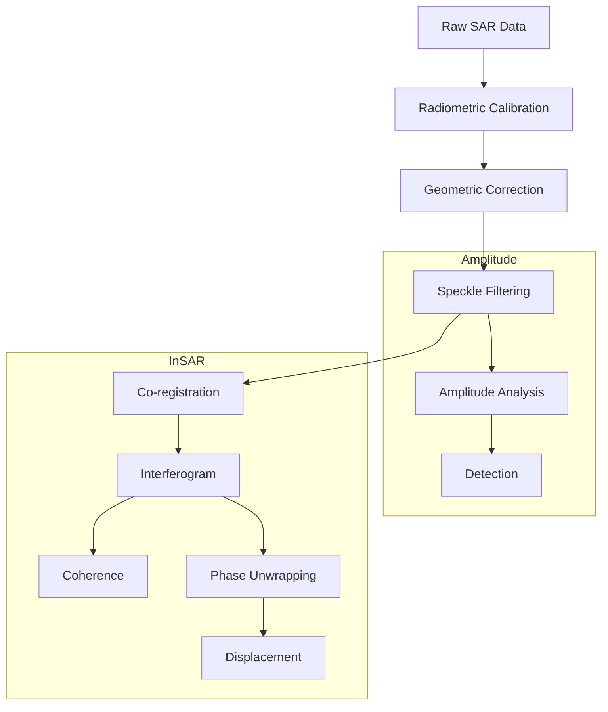

# 12 - Radar Imaging (SAR)

## Purpose

Synthetic Aperture Radar (SAR) processing, analysis, and applications.

## Audience

SAR specialists, radar engineers, remote sensing scientists, geophysicists.

## Prerequisites

- Python 3.10+
- SAR data (Sentinel-1, RADARSAT, ICEYE, etc.)
- Understanding of SAR principles

## Non-Goals

This documentation does not overclaim detection capabilities. SAR-based observations are constrained to scientifically validated techniques.

## Inputs/Outputs

| Input | Format | Output | Format |
|-------|--------|--------|--------|
| SLC data | SAFE, TIFF | Calibrated amplitude | GeoTIFF |
| InSAR pairs | SLC | Displacement maps | GeoTIFF |
| Multi-temporal stack | SLC | Time series | Zarr |

## SAR Processing Pipeline



## Algorithms

### Sigma0 Calibration

$$\sigma^0 = \frac{|DN|^2 \sin(\theta)}{K}$$

### Coherence

$$\gamma = \frac{|E[s_1 \cdot s_2^*]|}{\sqrt{E[|s_1|^2] \cdot E[|s_2|^2]}}$$

### Phase to Displacement (Research-Grade)

$$d = \frac{\lambda \cdot \phi_{unwrapped}}{4\pi}$$

Note: Phase unwrapping is research-grade; not validated for production.

## SAR Advantages

| Feature | Benefit | Constraint |
|---------|---------|------------|
| All-weather | Cloud penetration | Not for optical analysis |
| Day/night | 24-hour capability | Different interpretation |
| Surface sensitivity | Moisture/roughness | Complex scattering |

## Mandatory Mapping Table

| Bullet Item | capability_id | Module Path | Pipeline ID | CLI Example | Example Script | Test Path | Model ID(s) | Maturity |
|-------------|---------------|-------------|-------------|-------------|----------------|-----------|-------------|----------|
| SAR IO/preprocessing scaffolding | sar_io | `unbihexium.sar.amplitude` | sar_cal | `unbihexium pipeline run sar_cal -i raw.tif -o sigma0.tif` | `examples/sar_preprocessing.py` | `tests/unit/test_sar.py` | sar_amplitude_tiny, sar_amplitude_base, sar_amplitude_large | production |
| Amplitude analytics | amplitude | `unbihexium.sar.amplitude` | amplitude | `unbihexium pipeline run amplitude -i sar.tif -o amplitude.tif` | `examples/amplitude.py` | `tests/unit/test_sar.py` | sar_amplitude_tiny, sar_amplitude_base, sar_amplitude_large | production |
| Phase component displacement demo (InSAR-style; research-grade if not validated) | insar_disp | `unbihexium.sar.interferometry` | insar | `unbihexium pipeline run insar -i master.slc -i slave.slc -o disp.tif` | `examples/insar.py` | `tests/unit/test_sar.py` | sar_phase_displacement_tiny, sar_phase_displacement_base, sar_phase_displacement_large | research |
| Severe weather/night narrative with constraints | weather_mode | `unbihexium.sar` | sar_detect | `unbihexium pipeline run sar_detect -i sar.tif -o detections.geojson` | `examples/sar_detection.py` | `tests/unit/test_sar.py` | sar_ship_detector_tiny, sar_ship_detector_base, sar_ship_detector_large | production |
| Hidden object wording must be scientifically constrained; no overclaim | surface_scatter | `unbihexium.sar.amplitude` | scatter | `unbihexium pipeline run scatter -i sar.tif -o scatter.tif` | `examples/scattering.py` | `tests/unit/test_sar.py` | classical/no-weights | production |
| Mapping/monitoring workflows | sar_mapping | `unbihexium.sar` | sar_map | `unbihexium pipeline run sar_map -i timeseries/ -o changes.tif` | `examples/sar_mapping.py` | `tests/unit/test_sar.py` | sar_mapping_workflow_tiny, sar_mapping_workflow_base, sar_mapping_workflow_large | production |

## SAR Applications

| Application | Method | Model IDs |
|-------------|--------|-----------|
| Ship detection | CFAR + CNN | sar_ship_detector_* |
| Oil spill detection | Amplitude anomaly | sar_oil_spill_detector_* |
| Flood mapping | Thresholding + ML | sar_flood_detector_* |
| Subsidence monitoring | InSAR time series | sar_subsidence_monitor_* |

## Scientific Constraints

The following constraints apply to SAR-based observations:

1. **"Hidden object" detection** is limited to surface scattering properties. SAR does not "see through" solid structures.
2. **Phase unwrapping** is in research-grade status and may produce ambiguous results in areas of rapid deformation.
3. **Displacement measurements** require coherent image pairs and are affected by atmospheric delays.

## Severe Weather/Night Capability

SAR enables imaging in conditions where optical sensors fail:

| Condition | SAR Capability | Constraint |
|-----------|----------------|------------|
| Cloud cover | Full penetration | N/A |
| Night | Active illumination | N/A |
| Rain | Reduced for X-band | C-band preferred |
| Fog | Full penetration | N/A |

## Limitations

- InSAR requires coherent image pairs
- Speckle noise requires filtering
- Geometric distortions (foreshortening, layover, shadow)
- Phase unwrapping may fail in complex terrain

## Examples (CLI)

```bash
# SAR calibration
unbihexium pipeline run sar_cal -i sentinel1.tif -o sigma0.tif

# Ship detection
unbihexium pipeline run sar_detect -i sar.tif -o ships.geojson

# InSAR displacement (research-grade)
unbihexium pipeline run insar -i master.slc -i slave.slc -o displacement.tif
```

## API Entry Points

```python
from unbihexium.sar.amplitude import calibrate_amplitude, speckle_filter
from unbihexium.sar.polarimetry import pauli_decomposition
from unbihexium.sar.interferometry import compute_coherence, compute_displacement
```

## Tests

- Unit tests: `tests/unit/test_sar.py`

## References

- [Documentation Index](../index.md)
- [Table of Contents](../toc.md)
- [Glossary](../glossary.md)

---

## Quick Navigation

| Prev | Home | Next |
|------|------|------|

