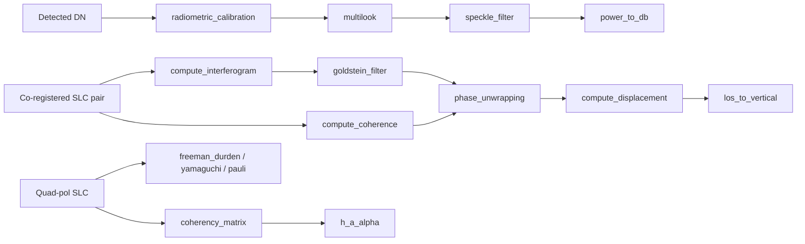

<!--
This Source Code Form is subject to the terms of the Mozilla Public
License, v. 2.0. If a copy of the MPL was not distributed with this
file, You can obtain one at https://mozilla.org/MPL/2.0/.

=============================================================================
Project     : Unbihexium
File        : docs/capabilities/12_radar_sar.md
Title       : Capability 12: Radar and Synthetic Aperture Radar
Author      : Olaf Yunus Laitinen Imanov <yunus.z.imanov@helsinki.fi>
Affiliation : University of Helsinki
Copyright   : 2025-2026 Unbihexium OSS Foundation and contributors
Licence     : Mozilla Public License 2.0, see LICENSE.txt
Format      : Markdown (CommonMark with GitHub Flavored Markdown extensions)
=============================================================================
-->

# Capability 12: Radar and Synthetic Aperture Radar

| Field | Value |
| --- | --- |
| Document | UBX-DOC-CAP-12-SAR |
| Version | 2.0 |
| Status | Active |
| Last reviewed | 2026-09-24 |
| Owner | Unbihexium maintainers (see [MAINTAINERS.md](../../MAINTAINERS.md)) |
| Applies to | Unbihexium 1.0.1 and the main branch |

## Abstract

This document describes the synthetic aperture radar (SAR) capability of Unbihexium as it is implemented: the array-level functions of the `unbihexium.sar` package (radiometric calibration, decibel conversion, multilooking, eight speckle filters, interferogram formation, coherence estimation, Goldstein filtering, three phase unwrapping methods, phase-to-displacement conversion and four polarimetric decompositions), the Sentinel-1 sensor table of `unbihexium.core.sensor`, and the eight model families whose catalogue domain is `sar`. It is written for remote sensing users who want to process SAR arrays in Python, for contributors who maintain the code, and for reviewers who need to know which formulas are implemented and where they come from. Every formula is given as the code computes it, with its primary source, and every example was executed against the current code. The SAR model families are untrained starter models; the document states what they are meant to do after training and what the library does not provide (product readers, orbit handling, co-registration, geocoding and terrain correction).

## Contents

1. [Scope and status](#1-scope-and-status)
2. [Components of the capability](#2-components-of-the-capability)
3. [Radiometric calibration and decibel conversion](#3-radiometric-calibration-and-decibel-conversion)
4. [Multilooking and speckle filtering](#4-multilooking-and-speckle-filtering)
5. [Interferometry](#5-interferometry)
6. [Polarimetry](#6-polarimetry)
7. [SAR model families](#7-sar-model-families)
8. [Command line](#8-command-line)
9. [Limitations](#9-limitations)
10. [Related documents](#10-related-documents)
11. [References](#references)

## 1. Scope and status

### 1.1 What the capability covers

The SAR capability consists of two kinds of components, which the capability registry (`unbihexium.registry.CapabilityRegistry`) lists separately:

- the library capability `sar_processing` (domain `sar`, maturity `stable`), implemented by the package `unbihexium.sar`. Its functions are deterministic implementations of published methods; they take and return NumPy arrays and are covered by the unit tests in `tests/`;
- eight model capabilities, one per model family of the model zoo catalogue (`src/unbihexium/zoo/catalog.yaml`) whose `domain` field is `sar`. They have maturity `beta` and the tag `requires_training: true`.

The domain therefore has nine registered capabilities. The sensor table of Sentinel-1 in `unbihexium.core.sensor` (C-band wavelength, acquisition modes) supports the SAR functions but is part of the core package.

### 1.2 Status of the models

The 32 SAR models (8 families in the variants `tiny`, `base`, `large` and `mega`) are untrained starter models. Each has a complete, trainable network with the input and output layout of its task and deterministically initialised weights whose SHA-256 digest is published in `src/unbihexium/zoo/digests.json`, but none has been trained on radar data. Their predictions carry no information until the model has been trained or fine-tuned on labelled data for the user's area and sensor, as described in [docs/model_zoo/training.md](../model_zoo/training.md). The domain name describes the intended application of a family, not a validated product. Of the 520 models of the zoo, only the 28 models of the 7 spectral index families compute exact formulas without training, and none of them belongs to this domain. No accuracy figures are published for any model; see section 2 of [RESPONSIBLE_USE.md](../../RESPONSIBLE_USE.md).

### 1.3 Conventions

Arrays are NumPy arrays. Two-dimensional images have the shape `(rows, cols)` with rows along azimuth and columns along range. "Intensity" means power, $|s|^2$ of a complex sample $s$; "amplitude" means $|s|$. Values are in linear units unless the name says decibels (dB). Angles are in degrees unless a function takes `degrees=False`. Pixels that are NaN are treated as missing by the speckle filters, `multilook` and the unwrapping functions.

## 2. Components of the capability

The public names of `unbihexium.sar` are grouped in three modules:

| Module | Functions | Purpose |
| --- | --- | --- |
| `unbihexium.sar.amplitude` | `radiometric_calibration`, `calibrate_amplitude`, `compute_beta0`, `compute_sigma0`, `compute_gamma0`, `power_to_db`, `db_to_power`, `amplitude_to_db`, `multilook`, `equivalent_number_of_looks`, `speckle_filter`, `lee_filter`, `kuan_filter`, `enhanced_lee_filter`, `frost_filter`, `gamma_map_filter`, `refined_lee_filter` | Radiometry of detected images and speckle reduction |
| `unbihexium.sar.interferometry` | `compute_interferogram`, `compute_coherence`, `wrap_phase`, `phase_residues`, `goldstein_filter`, `phase_unwrapping`, `compute_displacement`, `los_to_vertical`, `height_of_ambiguity`, record `InterferometricResult` | Interferometric processing of co-registered single look complex (SLC) pairs |
| `unbihexium.sar.polarimetry` | `coherency_matrix`, `covariance_matrix`, `pauli_decomposition`, `pauli_rgb`, `freeman_durden_decomposition`, `yamaguchi_decomposition`, `h_a_alpha`, `h_alpha_decomposition`, `h_alpha_zones`, `compute_polarimetric_decomposition`, record `PolarimetricResult` | Decompositions of fully polarimetric (quad-pol) data |

The processing chain that these functions support is shown below. Boxes are functions of the library; the steps outside the library (reading the product, co-registration, geocoding) are the user's responsibility (section 9).


```mermaid
flowchart LR
    A[Detected DN] --> B[radiometric_calibration]
    B --> C[multilook]
    C --> D[speckle_filter]
    D --> E[power_to_db]
    F[Co-registered SLC pair] --> G[compute_interferogram]
    F --> H[compute_coherence]
    G --> I[goldstein_filter]
    I --> J[phase_unwrapping]
    H --> J
    J --> K[compute_displacement]
    K --> L[los_to_vertical]
    M[Quad-pol SLC] --> N[coherency_matrix]
    N --> O[h_a_alpha]
    M --> P[freeman_durden / yamaguchi / pauli]
```

The Sentinel-1 sensor table, `get_sensor("sentinel1")`, provides the C-band centre frequency of 5.405 GHz (wavelength $c/f$) and the four acquisition modes SM, IW, EW and WV with their swath widths and nominal resolutions.

## 3. Radiometric calibration and decibel conversion

### 3.1 Look-up table calibration

`radiometric_calibration(dn, lut, noise=None, clip_negative=True)` converts digital numbers of a detected (GRD) or complex (SLC) product into a calibrated intensity with the calibration equation of the Sentinel-1 instrument processing facility [1]:

$$
v = \frac{|DN|^2 - \eta}{A^2}
$$

where $A$ is the calibration look-up table value (for example `sigmaNought`, `betaNought` or `gamma` of the Sentinel-1 calibration annotation, interpolated to the pixel grid by the user) and $\eta$ the optional thermal noise power. Negative results of the noise subtraction are set to zero unless `clip_negative=False`. Look-up table values must be positive.

### 3.2 Ellipsoid conversions

For a calibrated amplitude $a$ with calibration constant $K$ (default 1) and ellipsoid incidence angle $\theta$, the module computes

$$
\beta^0 = \frac{a^2}{K}, \qquad \sigma^0 = \beta^0 \sin\theta, \qquad \gamma^0 = \frac{\sigma^0}{\cos\theta}
$$

(`compute_beta0`, `compute_sigma0`, `compute_gamma0`). These are the ellipsoid-based conversions; they do not correct for local terrain slope. Radiometric terrain flattening in the sense of Small [2] is not implemented; the `sar_amplitude` model family (section 7) is a starter model intended to learn it once trained.

### 3.3 Decibels

`power_to_db` computes $10 \log_{10} p$ for intensities (non-positive values become NaN, or the `floor` value when one is given), `db_to_power` the inverse, and `amplitude_to_db` the value $10 \log_{10} a^2$ with a default floor of -40 dB.

### 3.4 Example

```python
import numpy as np

from unbihexium.core.sensor import get_sensor
from unbihexium.sar import (
    compute_beta0,
    compute_gamma0,
    compute_sigma0,
    db_to_power,
    power_to_db,
    radiometric_calibration,
)

# Digital numbers of a detected (GRD) product and a sigmaNought look-up table.
dn = np.array([[120.0, 340.0], [560.0, 0.0]])
lut_sigma = np.full(dn.shape, 474.0)
sigma0 = radiometric_calibration(dn, lut_sigma, noise=25.0)
print(np.round(power_to_db(sigma0, floor=-40.0), 2))

# Ellipsoid model: beta0 from calibrated amplitude, then sigma0 and gamma0 at 35 degrees.
amplitude = np.array([0.20, 0.35])
beta0 = compute_beta0(amplitude)
sigma = compute_sigma0(amplitude, incidence_angle=35.0)
gamma = compute_gamma0(sigma, incidence_angle=35.0)
print(np.round(beta0, 4), np.round(sigma, 4), np.round(gamma, 4))
print(np.allclose(db_to_power(power_to_db(gamma)), gamma))

# Sentinel-1 band table: C-band wavelength and the IW mode.
s1 = get_sensor("sentinel1")
print(round(s1.wavelength_m, 6), s1.mode("IW"))
```

Output:

```text
[[-11.94  -2.89]
 [  1.45 -40.  ]]
[0.04   0.1225] [0.0229 0.0703] [0.028  0.0858]
True
0.055466 SARMode(name='IW', swath_km=250.0, range_resolution_m=5.0, azimuth_resolution_m=20.0, polarisations=('VV', 'VH', 'HH', 'HV'))
```

The pixel with DN 0 has a negative intensity after noise subtraction, which is clipped to zero and shown at the -40 dB floor.

## 4. Multilooking and speckle filtering

### 4.1 Speckle model

Fully developed speckle is modelled as multiplicative noise, $I = R\,v$, where $R$ is the underlying reflectivity and $v$ has unit mean. For an $L$-look intensity image the coefficient of variation of $v$ is $C_u = 1/\sqrt{L}$; for an amplitude image it is $C_u = \sqrt{4/\pi - 1}/\sqrt{L}$, about 0.5227 for one look [3]. The adaptive filters compare $C_u$ with the local coefficient of variation $C_i = \sigma_z / \bar{z}$ of a moving window: homogeneous areas ($C_i \approx C_u$) are smoothed, edges and point targets ($C_i \gg C_u$) keep the observed value. Local statistics ignore NaN pixels and NaN pixels stay NaN.

### 4.2 Multilooking and the equivalent number of looks

`multilook(intensity, looks=(rows, cols))` averages non-overlapping blocks of `rows` azimuth by `cols` range pixels, ignoring NaN; complex input is converted to intensity first. The output grid is smaller by the block size. `equivalent_number_of_looks(intensity)` estimates

$$
\mathrm{ENL} = \frac{\bar{z}^2}{s_z^2}
$$

from the pixels of a homogeneous area (sample variance with $n-1$ in the denominator) [3]. It is the usual measure of speckle reduction.

### 4.3 Filters

`speckle_filter(data, filter_type, window_size=5, looks=1.0)` dispatches to the filters below; `window_size` must be an odd integer of at least 3. With $\bar{z}$ and $\sigma_z^2$ the local mean and variance of the window and $z$ the centre pixel:

| `filter_type` | Function | Estimate | Source |
| --- | --- | --- | --- |
| `boxcar` | (moving mean) | $\hat{x} = \bar{z}$ | none |
| `median` | (moving median) | median of the window, ignoring NaN | none |
| `lee` | `lee_filter` | $\hat{x} = \bar{z} + W (z - \bar{z})$, $W = 1 - C_u^2 / C_i^2$ clipped to $[0, 1]$ | Lee [4] |
| `kuan` | `kuan_filter` | as Lee with $W = (1 - C_u^2/C_i^2) / (1 + C_u^2)$ | Kuan et al. [5] |
| `enhanced_lee` | `enhanced_lee_filter` | $\bar{z}$ if $C_i \le C_u$; $z$ if $C_i \ge C_{\max}$; otherwise $\bar{z} W + z (1 - W)$ with $W = \exp(-D (C_i - C_u)/(C_{\max} - C_i))$ and $C_{\max} = \sqrt{1 + 2/L}$ | Lopes, Touzi and Nezry [6] |
| `frost` | `frost_filter` | weighted mean with weights $\exp(-K C_i^2 \lVert t \rVert)$, $\lVert t \rVert$ the distance from the centre pixel, damping $K$ (default 2.0) | Frost et al. [7] |
| `gamma_map` | `gamma_map_filter` | $\bar{z}$ if $C_i^2 \le C_u^2$; $z$ if $C_i^2 \ge C_{\max}^2$; otherwise $\hat{x} = \left(b \bar{z} + \sqrt{\bar{z}^2 b^2 + 4 \alpha L z \bar{z}}\right) / (2\alpha)$ with $\alpha = (1 + C_u^2)/(C_i^2 - C_u^2)$ and $b = \alpha - L - 1$ | Lopes et al. [8] |
| `refined_lee` | `refined_lee_filter` | 7 x 7 window; the edge direction is chosen from the gradients of the 3 x 3 sub-window means, the half of the window on the side of the centre pixel is selected from 8 directional masks, and the Lee estimate uses $\mathrm{var}(x) = (\sigma_z^2 - \bar{z}^2 C_u^2)/(1 + C_u^2)$ in that mask | Lee [9] |

`lee_filter`, `kuan_filter` and `enhanced_lee_filter` accept `amplitude=True` for amplitude images; the dispatcher always assumes intensities. `refined_lee_filter` always uses a 7 x 7 window and needs an image of at least 4 x 4 pixels.

### 4.4 Example

The example simulates a single-look intensity image with two homogeneous halves whose reflectivities differ by a factor of 4, applies every filter with a 7 x 7 window, and reports the ENL of a homogeneous area and the ratio of the mean values of the two halves (4.0 without bias).

```python
import numpy as np

from unbihexium.sar import equivalent_number_of_looks, multilook, speckle_filter

# Single-look intensity: a 0.05 field with a 0.20 half, times unit-mean exponential speckle.
rng = np.random.default_rng(42)
scene = np.full((128, 128), 0.05)
scene[:, 64:] = 0.20
intensity = scene * rng.exponential(1.0, size=scene.shape)

# ENL of a homogeneous 40 x 40 area before and after filtering; contrast of the two halves.
area = (slice(20, 60), slice(10, 50))
print(f"{'input':>12}: ENL {equivalent_number_of_looks(intensity[area]):5.2f}")
for name in ("boxcar", "median", "lee", "kuan", "enhanced_lee", "frost", "gamma_map", "refined_lee"):
    out = speckle_filter(intensity, filter_type=name, window_size=7, looks=1.0)
    ratio = out[:, 70:120].mean() / out[:, 8:58].mean()
    print(f"{name:>12}: ENL {equivalent_number_of_looks(out[area]):5.2f}, contrast {ratio:4.2f}")

# 4 x 1 multilooking (azimuth x range) reduces the grid and raises the ENL.
ml = multilook(intensity, looks=(4, 1))
print(ml.shape, round(equivalent_number_of_looks(ml[5:15, 10:50]), 2))
```

Output:

```text
       input: ENL  0.97
      boxcar: ENL 50.63, contrast 4.04
      median: ENL 30.17, contrast 3.98
         lee: ENL 24.07, contrast 4.05
        kuan: ENL 39.56, contrast 4.05
enhanced_lee: ENL 23.06, contrast 4.05
       frost: ENL  3.14, contrast 4.05
   gamma_map: ENL 29.79, contrast 4.05
 refined_lee: ENL 20.46, contrast 4.04
(32, 128) 3.86
```

These numbers describe one synthetic image and only show how the functions are called; they are not a comparison of the filters. The Frost filter smooths little with the default damping $K = 2$ on single-look data because the weights decay as $\exp(-2 C_i^2 \lVert t \rVert)$ with $C_i \approx 1$; a smaller `damping` smooths more. The median of exponential speckle is biased low, which explains the smaller contrast of the median filter. Every filter keeps NaN pixels as NaN and ignores them in the window statistics.

## 5. Interferometry

### 5.1 Sign convention

The module assumes the phase of a return $\phi = -4\pi R/\lambda$ for slant range $R$ and wavelength $\lambda$. The interferometric phase of a reference image $s_1$ and a secondary image $s_2$ is then $\phi_1 - \phi_2 = 4\pi (R_2 - R_1)/\lambda$, and `compute_displacement` returns the range change $R_2 - R_1$: positive values are motion away from the sensor (for example subsidence), negative values motion towards it. Data from processors with the opposite convention must be negated first.

### 5.2 Interferogram and coherence

`compute_interferogram(master, slave, multilook=(1, 1))` returns the wrapped phase and the complex interferogram $s_1 s_2^{*}$, optionally averaged over a moving window of the given size (the output keeps the input grid). `compute_coherence(master, slave, window_size=5)` estimates the coherence magnitude with a boxcar window [10]:

$$
|\hat{\gamma}| = \frac{\left|\sum s_1 s_2^{*}\right|}{\sqrt{\sum |s_1|^2 \sum |s_2|^2}}
$$

clipped to $[0, 1]$. The estimator is biased upwards for small windows and low coherence [10]. Both functions require co-registered images of equal shape.

### 5.3 Residues and Goldstein filtering

`phase_residues(phase)` returns the charge of every 2 x 2 loop of the phase image: the sum of the wrapped differences around the loop divided by $2\pi$, which is $+1$, $-1$ or 0 [11]. Residues mark inconsistencies that path-following unwrapping cannot resolve.

`goldstein_filter(interferogram, alpha=0.5, patch_size=32, smoothing=3)` implements the adaptive filter of Goldstein and Werner [12]: the interferogram is split into patches of `patch_size` pixels with 50 % overlap, the spectrum $Z$ of each patch is multiplied by $H = (\tilde{|Z|} / \max \tilde{|Z|})^{\alpha}$, where $\tilde{|Z|}$ is the spectrum magnitude smoothed with a `smoothing` x `smoothing` moving average, and the patches are recombined with a triangular taper. $\alpha = 0$ leaves the input unchanged, $\alpha = 1$ filters most strongly.

### 5.4 Phase unwrapping

`phase_unwrapping(phase, method="least_squares", coherence=None, coherence_threshold=0.3)` unwraps a wrapped phase image. Pixels whose coherence is below the threshold, and NaN pixels, are masked and returned as NaN. Three methods are available:

| `method` | Algorithm | Source |
| --- | --- | --- |
| `least_squares` (default) | Minimises $\sum w (\Delta\phi - W(\Delta\psi))^2$ over the horizontal and vertical differences, where $W$ wraps to $[-\pi, \pi)$. Without weights the Neumann Poisson equation is solved exactly with the discrete cosine transform; with coherence weights, a conjugate gradient solver uses the unweighted solution as preconditioner. The constant of integration is chosen to match the wrapped input on average. | Ghiglia and Romero [13], Ghiglia and Pritt [14] |
| `quality_guided` | Region growing from the most reliable pixel, always integrating the wrapped difference to the neighbour of highest quality. Quality is the coherence when given, otherwise the reliability $1/D$ from second differences. | Herraez et al. [15] |
| `simple` | Itoh's one-dimensional unwrapping along the first column and then along every row. Correct only for noise-free data without aliasing. | Itoh [16] |

For data without residues whose true phase differences are smaller than $\pi$, the least-squares solution equals the true phase up to a constant.

### 5.5 Displacement and topographic sensitivity

`compute_displacement(unwrapped_phase, wavelength, incidence_angle=None, vertical=False)` converts unwrapped phase to range change,

$$
d_{\mathrm{LOS}} = \frac{\lambda\,\phi}{4\pi},
$$

and `los_to_vertical(range_change, incidence_angle)` projects it to vertical motion under the assumption that the motion is purely vertical, $d_U = -d_{\mathrm{LOS}}/\cos\theta$ (positive upwards). `height_of_ambiguity(wavelength, slant_range, incidence_angle, perpendicular_baseline)` returns the height difference that produces one $2\pi$ fringe in a repeat-pass interferogram [17]:

$$
h_a = \frac{\lambda R \sin\theta}{2 B_\perp}.
$$

### 5.6 Example

The example builds a synthetic co-registered SLC pair with a 28 mm subsidence bowl, estimates coherence, filters and unwraps the phase, and converts it to displacement.

```python
import numpy as np

from unbihexium.sar import (
    compute_coherence,
    compute_displacement,
    compute_interferogram,
    goldstein_filter,
    height_of_ambiguity,
    los_to_vertical,
    phase_residues,
    phase_unwrapping,
)

# Synthetic co-registered SLC pair: a 28 mm subsidence bowl seen in range (C band).
wavelength = 0.05546576
rng = np.random.default_rng(7)
y, x = np.mgrid[0:128, 0:128]
range_change = 0.028 * np.exp(-((x - 64) ** 2 + (y - 64) ** 2) / (2 * 25.0**2))
true_phase = 4 * np.pi * range_change / wavelength
reflectivity = rng.normal(size=(128, 128)) + 1j * rng.normal(size=(128, 128))
noise = 0.8 * (rng.normal(size=(128, 128)) + 1j * rng.normal(size=(128, 128)))
master = reflectivity * np.exp(1j * true_phase)
slave = reflectivity + noise

phase, ifg = compute_interferogram(master, slave)
coherence = compute_coherence(master, slave, window_size=5)
filtered = goldstein_filter(ifg, alpha=0.5, patch_size=32)
print("mean coherence", round(float(coherence.mean()), 2))
print("residues before/after filtering", np.abs(phase_residues(phase)).sum(), np.abs(phase_residues(np.angle(filtered))).sum())

unwrapped = phase_unwrapping(np.angle(filtered), method="least_squares", coherence=coherence)
los = compute_displacement(unwrapped, wavelength)
los -= np.nanmedian(los[:10, :10])  # Reference to a stable corner.
print("peak range change (mm): true", round(range_change.max() * 1000, 1), "estimated", round(float(np.nanmax(los)) * 1000, 1))
print("peak vertical motion (mm)", round(float(np.nanmin(los_to_vertical(los, 39.0))) * 1000, 1))
print("height of ambiguity (m)", round(height_of_ambiguity(wavelength, 850_000.0, 39.0, 150.0), 1))
```

Output:

```text
mean coherence 0.78
residues before/after filtering 1324 0
peak range change (mm): true 28.0 estimated 30.2
peak vertical motion (mm) -38.9
height of ambiguity (m) 98.9
```

The estimate differs from the true value because of the simulated decorrelation noise; the example shows the call sequence, not the accuracy of the method on real data.

## 6. Polarimetry

### 6.1 Conventions

The functions take the complex scattering amplitudes $S_{HH}$, $S_{HV}$ and $S_{VV}$ of a quad-pol acquisition, and optionally $S_{VH}$. Reciprocity is assumed: when $S_{VH}$ is given, the cross-polar channel is the mean of $S_{HV}$ and $S_{VH}$. The Pauli target vector is $\mathbf{k} = (S_{HH} + S_{VV},\ S_{HH} - S_{VV},\ 2 S_{HV}) / \sqrt{2}$ and the coherency matrix $T_3 = \langle \mathbf{k} \mathbf{k}^H \rangle$; the lexicographic vector is $(S_{HH},\ \sqrt{2} S_{HV},\ S_{VV})$ and the covariance matrix $C_3$ its outer product. The ensemble average $\langle \cdot \rangle$ is a moving window mean of size `window_size` (odd, default 5). The span $|S_{HH}|^2 + 2|S_{HV}|^2 + |S_{VV}|^2$ equals the trace of $T_3$ and of $C_3$ [18].

### 6.2 Decompositions

| Function | Components | Method | Source |
| --- | --- | --- | --- |
| `pauli_decomposition` | `surface` $= \lvert S_{HH} + S_{VV}\rvert^2/2$, `dihedral` $= \lvert S_{HH} - S_{VV}\rvert^2/2$, `volume` $= 2\lvert S_{HV}\rvert^2$ | Powers of the Pauli basis, per pixel without averaging | Cloude and Pottier [19] |
| `pauli_rgb` | (H, W, 3) image | Square roots of dihedral, volume and surface as red, green and blue, each scaled by its 98th percentile and clipped to $[0, 1]$ | Lee and Pottier [18] |
| `freeman_durden_decomposition` | `surface`, `dihedral`, `volume`, `span` | Volume power $P_v = 8\langle\lvert S_{HV}\rvert^2\rangle$ from a random dipole cloud; surface and dihedral powers from the remaining covariance, with the sign of $\mathrm{Re}\langle S_{HH} S_{VV}^{*}\rangle$ deciding which mechanism is dominant | Freeman and Durden [20] |
| `yamaguchi_decomposition` | `surface`, `dihedral`, `volume`, `helix`, `span` | Adds the helix power $P_c = 2\lvert\mathrm{Im}\langle S_{HV}^{*}(S_{HH} - S_{VV})\rangle\rvert$ and selects the volume model from $10\log_{10}(\langle\lvert S_{VV}\rvert^2\rangle / \langle\lvert S_{HH}\rvert^2\rangle)$ with a threshold of 2 dB | Yamaguchi et al. [21] |
| `h_a_alpha`, `h_alpha_decomposition` | `entropy`, `anisotropy`, `alpha`, `lambda1` to `lambda3` | Eigen-decomposition of $T_3$ with eigenvalues $\lambda_1 \ge \lambda_2 \ge \lambda_3$ and $p_i = \lambda_i / \sum \lambda_j$: $H = -\sum p_i \log_3 p_i$, $A = (\lambda_2 - \lambda_3)/(\lambda_2 + \lambda_3)$, $\bar{\alpha} = \sum p_i \arccos\lvert e_{1i}\rvert$ in degrees | Cloude and Pottier [19] |
| `h_alpha_zones` | zone numbers 1 to 9, 0 for invalid pixels | Zones of the $H$ / $\bar{\alpha}$ plane with the entropy limits 0.5 and 0.9 and the alpha limits 55 and 40 degrees ($H > 0.9$), 50 and 40 degrees ($0.5 < H \le 0.9$) and 47.5 and 42.5 degrees ($H \le 0.5$) | Cloude and Pottier [22] |

In the model-based decompositions the surface, dihedral and volume (and helix) powers sum to the span wherever no power had to be clipped at zero; where the volume power exceeds the co-polar powers, the whole span (minus the helix power) is assigned to volume scattering. `compute_polarimetric_decomposition(hh, hv, vv, decomposition=...)` dispatches by the names `pauli`, `freeman_durden`, `yamaguchi` and `h_alpha` and returns a `PolarimetricResult`.

### 6.3 Example

The example simulates three stripes with ideal surface ($S_{HH} = S_{VV}$), double-bounce ($S_{HH} = -S_{VV}$) and random volume scattering, and prints the dominant component of every decomposition and the mean $H$, $\bar{\alpha}$ and most frequent zone of every stripe.

```python
import numpy as np

from unbihexium.sar import (
    compute_polarimetric_decomposition,
    h_alpha_zones,
    pauli_rgb,
)

# Quad-pol scattering amplitudes of three stripes: surface (HH = VV),
# double bounce (HH = -VV) and random volume (independent channels, strong HV).
rng = np.random.default_rng(3)
shape = (60, 90)


def speckle():
    return (rng.normal(size=shape) + 1j * rng.normal(size=shape)) / np.sqrt(2)


common = speckle()
hh, hv, vv = common.copy(), 0.05 * speckle(), common.copy()
vv[:, 30:60] = -common[:, 30:60]
hh[:, 60:], hv[:, 60:], vv[:, 60:] = speckle()[:, 60:], 0.6 * speckle()[:, 60:], speckle()[:, 60:]

stripes = (("surface", slice(5, 25)), ("dihedral", slice(35, 55)), ("volume", slice(65, 85)))
for name in ("pauli", "freeman_durden", "yamaguchi"):
    result = compute_polarimetric_decomposition(hh, hv, vv, decomposition=name, window_size=7)
    for stripe, cols in stripes:
        powers = {k: float(v[:, cols].mean()) for k, v in result.components.items() if k != "span"}
        print(f"{name:>14} {stripe:>8}: dominant {max(powers, key=powers.get)}")

h_alpha = compute_polarimetric_decomposition(hh, hv, vv, decomposition="h_alpha", window_size=7)
zones = h_alpha_zones(h_alpha.entropy, h_alpha.alpha)
for stripe, cols in stripes:
    zone = np.bincount(zones[:, cols].ravel()).argmax()
    print(f"{stripe:>8}: H {h_alpha.entropy[:, cols].mean():.2f}, alpha {h_alpha.alpha[:, cols].mean():5.1f} deg, zone {zone}")
print(pauli_rgb(hh, hv, vv).shape)
```

Output:

```text
         pauli  surface: dominant surface
         pauli dihedral: dominant dihedral
         pauli   volume: dominant surface
freeman_durden  surface: dominant surface
freeman_durden dihedral: dominant dihedral
freeman_durden   volume: dominant volume
     yamaguchi  surface: dominant surface
     yamaguchi dihedral: dominant dihedral
     yamaguchi   volume: dominant volume
 surface: H 0.02, alpha   0.6 deg, zone 9
dihedral: H 0.02, alpha  90.0 deg, zone 7
  volume: H 0.96, alpha  53.0 deg, zone 2
(60, 90, 3)
```

The Pauli components are powers in a basis, not scattering mechanisms: for the random volume stripe the power $\lvert S_{HH} + S_{VV}\rvert^2/2$ is larger than $2\lvert S_{HV}\rvert^2$, while the model-based decompositions assign most of the power to volume scattering. The zones match the classes of Cloude and Pottier [22]: zone 9 is low-entropy surface scattering, zone 7 low-entropy multiple (dihedral) scattering and zone 2 high-entropy vegetation scattering.

## 7. SAR model families

### 7.1 Families of the domain

The tables below were generated from the model catalogue with the script of section 7.2. The network names are those of `unbihexium.ai.models.networks`: a U-Net with a residual encoder for dense outputs and a CenterNet head for detection [23]. Parameter counts are those of the built models.

| Family | Domain | Task | Network | Input bands | Outputs | Parameters (tiny / base / large / mega) |
| --- | --- | --- | --- | --- | --- | --- |
| `sar_ship_detector` | sar | detection | CenterNet | VV, VH | ship | 730,437 / 7,048,837 / 22,037,765 / 60,412,933 |
| `sar_flood_detector` | sar | segmentation | U-Net | VV, VH | non_flooded, flooded | 732,802 / 7,058,178 / 22,058,690 / 60,450,050 |
| `sar_oil_spill_detector` | sar | segmentation | U-Net | VV | sea, oil_spill, look_alike | 732,675 / 7,057,923 / 22,058,307 / 60,449,539 |
| `sar_amplitude` | sar | dense_regression | U-Net | VV, VH, elevation | gamma0_vv, gamma0_vh (dB, dB) | 732,946 / 7,058,466 / 22,059,122 / 60,450,626 |
| `sar_mapping_workflow` | sar | enhancement | U-Net | VV, VH | VV, VH | 732,802 / 7,058,178 / 22,058,690 / 60,450,050 |
| `sar_phase_displacement` | sar | dense_regression | U-Net | cos_phase, sin_phase, coherence | unwrapped_phase (rad) | 732,929 / 7,058,433 / 22,059,073 / 60,450,561 |
| `ground_displacement` | sar | dense_regression | U-Net | cos_phase, sin_phase, coherence | los_displacement (mm) | 732,929 / 7,058,433 / 22,059,073 / 60,450,561 |
| `sar_subsidence_monitor` | sar | dense_regression | U-Net | los_t1, los_t2, los_t3, los_t4, los_t5, los_t6 | velocity (mm a-1) | 733,361 / 7,059,297 / 22,060,369 / 60,452,289 |

| Family | Intended application (once trained) | Reference data needed for training | Suitable input data |
| --- | --- | --- | --- |
| `sar_ship_detector` | Detects ships in synthetic aperture radar backscatter, independent of cloud cover and daylight. | Bounding boxes of ships in SAR images. | Sentinel-1 GRD (sigma0 in dB); other C- or X-band SAR |
| `sar_flood_detector` | Maps flooded areas in radar backscatter. | Flood masks. | Sentinel-1 GRD (sigma0 in dB) |
| `sar_oil_spill_detector` | Segments oil spills and look-alike dark areas on the sea surface. | Oil spill and look-alike masks. | Sentinel-1 GRD VV |
| `sar_amplitude` | Estimates terrain-flattened gamma0 backscatter from sigma0 and elevation. | Terrain-flattened gamma0 from radiometric terrain correction. | Sentinel-1 GRD; Copernicus DEM |
| `sar_mapping_workflow` | Removes speckle from dual-polarisation SAR backscatter. | Multi-temporal averages as speckle-free references. | Sentinel-1 GRD |
| `sar_phase_displacement` | Estimates unwrapped phase from a wrapped interferogram. | Unwrapped phase from SNAPHU or similar processing. | Sentinel-1 SLC interferograms |
| `ground_displacement` | Estimates line-of-sight ground displacement from a wrapped interferogram. | Unwrapped displacement from InSAR processing or GNSS. | Sentinel-1 SLC interferograms |
| `sar_subsidence_monitor` | Estimates mean subsidence velocity from a stack of six displacement maps. | Velocity from persistent scatterer or SBAS processing. | Sentinel-1 InSAR time series |

The recommended tile size is 256 pixels for the `tiny` and `base` variants and 512 pixels for `large` and `mega`. The interferometric families take the wrapped phase as its cosine and sine, which avoids the $2\pi$ discontinuity; `compute_interferogram` and `compute_coherence` produce these inputs. None of these families has a registered processing pipeline.

### 7.2 Generating the tables

```python
from unbihexium.zoo import list_models
from unbihexium.zoo.catalog import get_spec

FAMILIES = ["sar_ship_detector", "sar_flood_detector", "sar_oil_spill_detector", "sar_amplitude",
            "sar_mapping_workflow", "sar_phase_displacement", "ground_displacement", "sar_subsidence_monitor"]
NETWORK = {"detection": "CenterNet", "scene_regression": "SceneRegressor",
           "super_resolution": "SuperResolutionNet", "spectral_index": "formula"}
params = {(e.family, e.variant.variant.value): e.num_parameters for e in list_models()}
for family in FAMILIES:
    spec = get_spec(family)
    outputs = ", ".join(spec.outputs) + (f" ({', '.join(spec.units)})" if spec.units else "")
    counts = " / ".join(f"{params[family, v]:,}" for v in ("tiny", "base", "large", "mega"))
    print(f"| `{family}` | {spec.domain} | {spec.task.value} | {NETWORK.get(spec.task.value, 'U-Net')} "
          f"| {', '.join(spec.bands)} | {outputs} | {counts} |")
for family in FAMILIES:
    spec = get_spec(family)
    print(f"| `{family}` | {spec.description} | {spec.labels} | {'; '.join(spec.sources)} |")
```

### 7.3 Running a tiny model

`predict` builds a catalogue model in memory with its deterministic starter weights and checks them against the published digest; `unbihexium zoo build` stores a model in the directory named by `UNBIHEXIUM_CACHE` (default `~/.cache/unbihexium`). The class map below comes from an untrained model and is meaningless; the example only shows the input layout (two bands, VV and VH backscatter in dB) and the result type.

```python
import numpy as np
from rasterio.transform import from_origin

from unbihexium.ai import predict
from unbihexium.io import write_geotiff

rng = np.random.default_rng(0)
vv_vh_db = np.stack([rng.normal(-12, 3, (128, 128)), rng.normal(-19, 3, (128, 128))]).astype("float32")
write_geotiff(vv_vh_db, "s1.tif", crs="EPSG:32635", transform=from_origin(500000, 6700000, 10, 10))
result = predict("sar_flood_detector_tiny", "s1.tif")
print(type(result).__name__, result.mask.shape, result.classes)
```

Output:

```text
SegmentationResult (128, 128) ['non_flooded', 'flooded']
```

## 8. Command line

The command line interface has no SAR-specific commands; the SAR functions are used from Python. The model families are handled by the generic commands, documented in [docs/reference/cli.md](../reference/cli.md):

```bash
unbihexium zoo list --domain sar --variant tiny
unbihexium zoo info sar_flood_detector_tiny
unbihexium predict sar_flood_detector_tiny s1.tif flood.tif
```

`zoo list` prints the eight tiny SAR models, `zoo info` the inputs, outputs and metadata of one model (including `"requires_training": true`), and `predict` writes the class map as a GeoTIFF (`Wrote: flood.tif (sar_flood_detector_tiny)`). To train a family, use `unbihexium train` with a labelled dataset as described in [docs/model_zoo/training.md](../model_zoo/training.md).

## 9. Limitations

The following are outside the implemented scope. Earlier versions of this document described some of them; they have no code behind them in the current release.

- **Product readers.** There is no reader for Sentinel-1 SAFE packages or other SAR product formats and no parser of calibration or noise annotations. Measurement rasters in GeoTIFF format can be read with `unbihexium.io.read_geotiff`; look-up tables must be read and interpolated by the user.
- **Geometry.** Orbit handling, SLC co-registration, deburst, range-Doppler terrain correction, geocoding and radiometric terrain flattening are not implemented. Interferometric functions expect co-registered images, and polarimetric functions expect aligned channels.
- **Interferometric corrections.** Flat-earth and topographic phase removal, atmospheric phase screens, baseline estimation and time series inversion (persistent scatterers, SBAS) are not implemented. `height_of_ambiguity` is a closed-form sensitivity calculation, not a baseline estimator.
- **Scale.** The functions work on in-memory NumPy arrays. Large scenes must be processed in blocks by the caller; the quality-guided unwrapper is implemented in Python with a priority queue and is slow on large images.
- **Models.** The SAR model families are untrained (section 1.2), and no SAR training data are distributed with the library.
- **Sensors.** The sensor table contains Sentinel-1 only; other missions are used by passing their wavelength and angles explicitly.

## 10. Related documents

- [README.md](../../README.md): project overview and installation.
- [RESPONSIBLE_USE.md](../../RESPONSIBLE_USE.md): limits of the starter models and dual-use considerations (for example ship detection).
- [docs/model_zoo/training.md](../model_zoo/training.md) and [docs/model_zoo/inference.md](../model_zoo/inference.md): training and running the model families.
- [docs/model_zoo/model_catalog.md](../model_zoo/model_catalog.md): the complete model catalogue.
- [docs/capabilities/03_indices_flood_water.md](03_indices_flood_water.md): optical water and flood mapping, which complements SAR flood mapping.
- [docs/capabilities/index.md](index.md): overview of all capability documents.

## References

[1] Miranda, N., Meadows, P. J. Radiometric calibration of S-1 Level-1 products from the S-1 IPF. ESA-EOPG-CSCOP-TN-0002, European Space Agency. 2015.

[2] Small, D. Flattening gamma: radiometric terrain correction for SAR imagery. IEEE Transactions on Geoscience and Remote Sensing 49(8), 3081-3093. 2011. <https://doi.org/10.1109/TGRS.2011.2120616>

[3] Oliver, C., Quegan, S. Understanding Synthetic Aperture Radar Images. Artech House, Boston. 1998.

[4] Lee, J.-S. Digital image enhancement and noise filtering by use of local statistics. IEEE Transactions on Pattern Analysis and Machine Intelligence PAMI-2(2), 165-168. 1980. <https://doi.org/10.1109/TPAMI.1980.4766994>

[5] Kuan, D. T., Sawchuk, A. A., Strand, T. C., Chavel, P. Adaptive noise smoothing filter for images with signal-dependent noise. IEEE Transactions on Pattern Analysis and Machine Intelligence PAMI-7(2), 165-177. 1985. <https://doi.org/10.1109/TPAMI.1985.4767641>

[6] Lopes, A., Touzi, R., Nezry, E. Adaptive speckle filters and scene heterogeneity. IEEE Transactions on Geoscience and Remote Sensing 28(6), 992-1000. 1990. <https://doi.org/10.1109/36.62623>

[7] Frost, V. S., Stiles, J. A., Shanmugan, K. S., Holtzman, J. C. A model for radar images and its application to adaptive digital filtering of multiplicative noise. IEEE Transactions on Pattern Analysis and Machine Intelligence PAMI-4(2), 157-166. 1982. <https://doi.org/10.1109/TPAMI.1982.4767223>

[8] Lopes, A., Nezry, E., Touzi, R., Laur, H. Maximum a posteriori speckle filtering and first order texture models in SAR images. Proceedings of IGARSS 1990, 2409-2412. 1990.

[9] Lee, J.-S. Refined filtering of image noise using local statistics. Computer Graphics and Image Processing 15(4), 380-389. 1981. <https://doi.org/10.1016/S0146-664X(81)80018-4>

[10] Touzi, R., Lopes, A., Bruniquel, J., Vachon, P. W. Coherence estimation for SAR imagery. IEEE Transactions on Geoscience and Remote Sensing 37(1), 135-149. 1999. <https://doi.org/10.1109/36.739146>

[11] Goldstein, R. M., Zebker, H. A., Werner, C. L. Satellite radar interferometry: two-dimensional phase unwrapping. Radio Science 23(4), 713-720. 1988. <https://doi.org/10.1029/RS023i004p00713>

[12] Goldstein, R. M., Werner, C. L. Radar interferogram filtering for geophysical applications. Geophysical Research Letters 25(21), 4035-4038. 1998. <https://doi.org/10.1029/1998GL900033>

[13] Ghiglia, D. C., Romero, L. A. Robust two-dimensional weighted and unweighted phase unwrapping that uses fast transforms and iterative methods. Journal of the Optical Society of America A 11(1), 107-117. 1994. <https://doi.org/10.1364/JOSAA.11.000107>

[14] Ghiglia, D. C., Pritt, M. D. Two-Dimensional Phase Unwrapping: Theory, Algorithms, and Software. Wiley, New York. 1998.

[15] Herraez, M. A., Burton, D. R., Lalor, M. J., Gdeisat, M. A. Fast two-dimensional phase-unwrapping algorithm based on sorting by reliability following a noncontinuous path. Applied Optics 41(35), 7437-7444. 2002. <https://doi.org/10.1364/AO.41.007437>

[16] Itoh, K. Analysis of the phase unwrapping algorithm. Applied Optics 21(14), 2470. 1982. <https://doi.org/10.1364/AO.21.002470>

[17] Hanssen, R. F. Radar Interferometry: Data Interpretation and Error Analysis. Kluwer Academic Publishers, Dordrecht. 2001. <https://doi.org/10.1007/0-306-47633-9>

[18] Lee, J.-S., Pottier, E. Polarimetric Radar Imaging: From Basics to Applications. CRC Press, Boca Raton. 2009.

[19] Cloude, S. R., Pottier, E. A review of target decomposition theorems in radar polarimetry. IEEE Transactions on Geoscience and Remote Sensing 34(2), 498-518. 1996. <https://doi.org/10.1109/36.485127>

[20] Freeman, A., Durden, S. L. A three-component scattering model for polarimetric SAR data. IEEE Transactions on Geoscience and Remote Sensing 36(3), 963-973. 1998. <https://doi.org/10.1109/36.673687>

[21] Yamaguchi, Y., Moriyama, T., Ishido, M., Yamada, H. Four-component scattering model for polarimetric SAR image decomposition. IEEE Transactions on Geoscience and Remote Sensing 43(8), 1699-1706. 2005. <https://doi.org/10.1109/TGRS.2005.852084>

[22] Cloude, S. R., Pottier, E. An entropy based classification scheme for land applications of polarimetric SAR. IEEE Transactions on Geoscience and Remote Sensing 35(1), 68-78. 1997. <https://doi.org/10.1109/36.551935>

[23] Zhou, X., Wang, D., Kraehenbuehl, P. Objects as points. arXiv:1904.07850. 2019. <https://arxiv.org/abs/1904.07850>

<!--
=============================================================================
End of file docs/capabilities/12_radar_sar.md
Part of Unbihexium (https://github.com/unbihexium-oss/unbihexium).
Cite the project as described in CITATION.cff.
=============================================================================
-->
