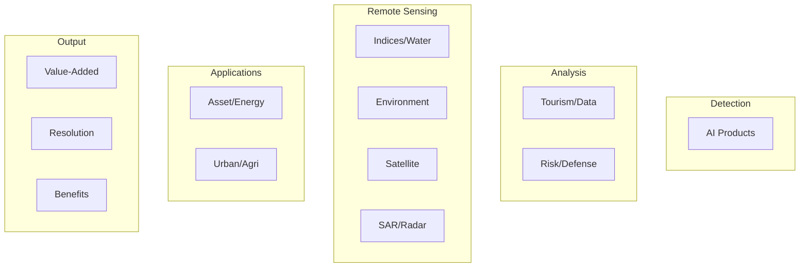

# Capabilities Index

## Purpose

Overview of all 12 capability domains in unbihexium.

## Quick Navigation

| No. | Domain | Link | Key Features |
|-----|--------|------|--------------|
| 01 | AI Products | [01_ai_products.md](01_ai_products.md) | Detection, segmentation, super-resolution |
| 02 | Tourism/Data | [02_tourism_data_processing.md](02_tourism_data_processing.md) | Route planning, analytics |
| 03 | Indices/Water | [03_indices_flood_water.md](03_indices_flood_water.md) | NDVI, NDWI, flood risk |
| 04 | Environment | [04_environment_forestry_image_processing.md](04_environment_forestry_image_processing.md) | Monitoring, deforestation |
| 05 | Asset/Energy | [05_asset_management_energy.md](05_asset_management_energy.md) | Damage, utilities, solar |
| 06 | Urban/Agri | [06_urban_agriculture.md](06_urban_agriculture.md) | Planning, crops, yield |
| 07 | Risk/Defense | [07_risk_defense_neutral.md](07_risk_defense_neutral.md) | Hazard, security |
| 08 | Value-Added | [08_value_added_imagery.md](08_value_added_imagery.md) | DSM, DEM, ortho |
| 09 | Benefits | [09_benefits_narrative.md](09_benefits_narrative.md) | Delivery, coverage |
| 10 | Satellite | [10_satellite_imagery_features.md](10_satellite_imagery_features.md) | Stereo, scales |
| 11 | Resolution | [11_resolution_metadata_qa.md](11_resolution_metadata_qa.md) | 0.3m-1.5m QA |
| 12 | SAR/Radar | [12_radar_sar.md](12_radar_sar.md) | Amplitude, InSAR |

## Domain Overview

## Model Coverage

Total models: 390 (130 per tier)

$$coverage = \frac{implemented}{planned} = \frac{130}{130} = 100\%$$

---

**Navigation:** [Home](../index.md) | [TOC](../toc.md) | [Glossary](../glossary.md)
