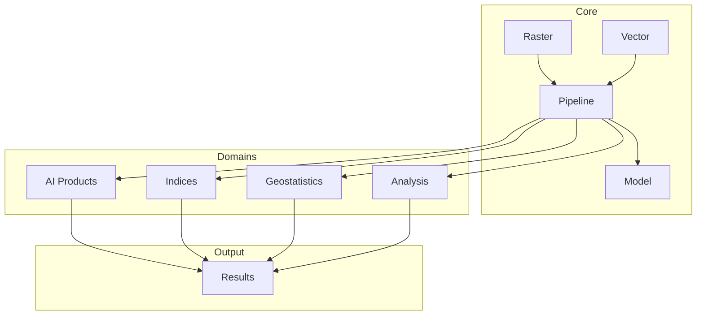

# Capabilities

Unbihexium provides capabilities across multiple domains.

## Domain Coverage

| Domain | Capabilities | Maturity |
|--------|-------------|----------|
| AI Products | Detection, Segmentation, Super-Resolution | Stable |
| Indices | NDVI, NDWI, NBR, EVI, SAVI, MSI | Stable |
| Geostatistics | Variogram, Kriging, Moran's I | Stable |
| Analysis | Zonal, Suitability, Network | Stable |
| Water | Flood detection, Water bodies | Stable |
| Agriculture | Crop classification, Yield prediction | Stable |
| Urban | Building detection, Change analysis | Stable |
| SAR | Amplitude analysis, Phase processing | Research |

## Capability Architecture

## Maturity Levels

We follow a clear maturity classification:

| Level | Definition | Testing |
|-------|------------|---------|
| Stable | Production-ready | Full test suite |
| Beta | Feature-complete, may change | Integration tests |
| Research | Experimental, API may change | Smoke tests |

## Performance Formula

Pipeline throughput is calculated as:

$$T = \frac{N \times S^2}{t_{total}}$$

Where:
- $N$ = number of tiles
- $S$ = tile size (pixels)
- $t_{total}$ = total processing time

## Learn More

- [AI Capabilities](ai.md)
- [Water Domain](water.md)
- [Agriculture Domain](agriculture.md)
