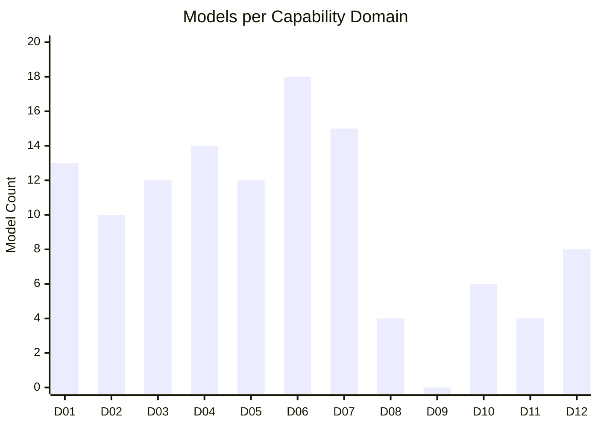

# Capability Domains

## Overview

The Unbihexium library provides 520 production-ready models organized into 12 capability domains spanning geospatial AI, remote sensing, and Earth observation applications.

---

## Domain Summary

| ID | Domain | Models | Tasks | Status |
|----|--------|--------|-------|--------|
| [01](01_ai_products.md) | AI Products | 13 | Detection, Segmentation, Enhancement | Production |
| [02](02_tourism_data_processing.md) | Tourism and Data Processing | 10 | Regression, Spatial Analysis | Production |
| [03](03_indices_flood_water.md) | Vegetation Indices and Flood/Water | 12 | Index, Segmentation, Regression | Production |
| [04](04_environment_forestry_image_processing.md) | Environment and Forestry | 14 | Segmentation, Regression, Terrain | Production |
| [05](05_asset_management_energy.md) | Asset Management and Energy | 12 | Regression, Segmentation, Detection | Production |
| [06](06_urban_agriculture.md) | Urban Planning and Agriculture | 18 | Segmentation, Detection, Regression | Production |
| [07](07_risk_defense_neutral.md) | Risk Assessment and Defense | 15 | Regression, Detection | Production |
| [08](08_value_added_imagery.md) | Value-Added Imagery | 4 | Terrain | Production |
| [09](09_benefits_narrative.md) | Benefits Narrative | 0 | Documentation | N/A |
| [10](10_satellite_imagery_features.md) | Satellite Imagery Features | 6 | Terrain, Enhancement | Production |
| [11](11_resolution_metadata_qa.md) | Resolution and Metadata QA | 4 | Enhancement, Segmentation | Production |
| [12](12_radar_sar.md) | Radar and SAR | 8 | Detection, Segmentation, Terrain | Production |

---

## Model Statistics by Domain

---

## Task Distribution

| Task Type | Total Models | Domains |
|-----------|--------------|---------|
| Regression | 47 | D02, D03, D04, D05, D06, D07 |
| Segmentation | 32 | D01, D03, D04, D05, D06, D11, D12 |
| Detection | 19 | D01, D05, D06, D07, D12 |
| Enhancement | 11 | D01, D10, D11 |
| Terrain | 13 | D04, D08, D10, D12 |
| Index | 7 | D03 |
| Super Resolution | 1 | D01 |

---

## Variant Availability

All 130 base models are available in 4 variant tiers:

| Variant | Resolution | Parameters | Use Case |
|---------|------------|------------|----------|
| tiny | 64 x 64 | 50K - 259K | Edge devices, real-time |
| base | 128 x 128 | 191K - 1M | Standard production |
| large | 256 x 256 | 425K - 2.3M | High accuracy |
| mega | 512 x 512 | 752K - 4.1M | Maximum quality |

---

## Quick Navigation

- **Agricultural Applications**: [D03](03_indices_flood_water.md), [D06](06_urban_agriculture.md)
- **Environmental Monitoring**: [D04](04_environment_forestry_image_processing.md)
- **Infrastructure**: [D05](05_asset_management_energy.md)
- **Urban Planning**: [D06](06_urban_agriculture.md)
- **Risk Assessment**: [D07](07_risk_defense_neutral.md)
- **SAR Processing**: [D12](12_radar_sar.md)
