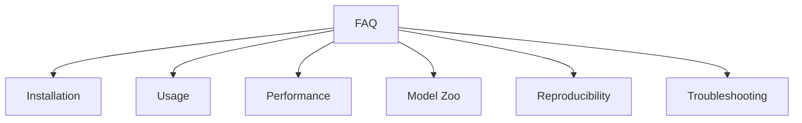

# Frequently Asked Questions

## Purpose

Answers to common questions about unbihexium.

## Audience

New users, developers, and evaluators.

## Question Categories



## Installation

| Question | Answer |
|----------|--------|
| What Python versions are supported? | Python 3.10, 3.11, and 3.12 |
| How do I install unbihexium? | `pip install unbihexium` |
| How do I install with all optional dependencies? | `pip install unbihexium[all]` |
| What are the system requirements? | GDAL, Proj installed on system |

### Why does installation fail with GDAL errors?

GDAL must be installed at the system level before installing unbihexium:

```bash
# Ubuntu/Debian
sudo apt-get install gdal-bin libgdal-dev

# macOS
brew install gdal
```

## Usage

| Question | Answer |
|----------|--------|
| How do I load a GeoTIFF? | `Raster.from_file("image.tif")` |
| How do I calculate NDVI? | `compute_index("NDVI", bands)` |
| How do I run a detection model? | `ShipDetector().predict(raster)` |

### What is the basic workflow?

$$\text{Load} \rightarrow \text{Process} \rightarrow \text{Analyze} \rightarrow \text{Export}$$

## Performance

| Question | Answer |
|----------|--------|
| How do I process large images? | Use tiled processing with `raster.tiles()` |
| Can I use GPU acceleration? | Yes, with the `[cuda]` optional dependencies |
| How much memory is needed? | Depends on tile size; default 512x512 uses approx 50MB |

## Model Zoo

| Question | Answer |
|----------|--------|
| Where are models stored? | `~/.cache/unbihexium/models/` |
| How do I download a model? | `unbihexium zoo download model_id` |
| How do I verify model integrity? | `unbihexium zoo verify model_id` |
| What is the difference between tiny/base/large? | Tiny for testing, base for production, large for highest accuracy |

### How are model checksums verified?

Using SHA256:

$$H_{computed} = SHA256(file) \stackrel{?}{=} H_{expected}$$

## Reproducibility

| Question | Answer |
|----------|--------|
| Are results deterministic? | Yes, with fixed random seeds |
| How do I track provenance? | Use the `Evidence` class |
| What is recorded in provenance? | Inputs, outputs, models, configuration, checksums |

## Troubleshooting

| Question | Answer |
|----------|--------|
| Import errors | Ensure all dependencies are installed |
| CRS mismatch | Reproject data to common CRS |
| Out of memory | Reduce tile size or use disk-backed arrays |
| Model download fails | Check network; use offline cache |

## References

- [Documentation Index](index.md)
- [Table of Contents](toc.md)
- [Installation Guide](getting_started/installation.md)
