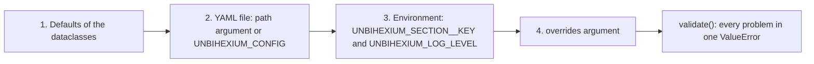

<!--
This Source Code Form is subject to the terms of the Mozilla Public
License, v. 2.0. If a copy of the MPL was not distributed with this
file, You can obtain one at https://mozilla.org/MPL/2.0/.

=============================================================================
Project     : Unbihexium
File        : docs/getting_started/configuration.md
Title       : Configuration
Author      : Olaf Yunus Laitinen Imanov <yunus.z.imanov@helsinki.fi>
Affiliation : University of Helsinki
Copyright   : 2025-2026 Unbihexium OSS Foundation and contributors
Licence     : Mozilla Public License 2.0, see LICENSE.txt
Format      : Markdown (CommonMark with GitHub Flavored Markdown extensions)
=============================================================================
-->

# Configuration

| Field | Value |
| --- | --- |
| Document | UBX-DOC-305 |
| Version | 2.0 |
| Status | Active |
| Last reviewed | 2026-09-24 |
| Owner | Unbihexium maintainers (see [MAINTAINERS.md](../../MAINTAINERS.md)) |
| Applies to | Unbihexium 1.0.1 and the main branch |

## Abstract

This document describes every mechanism that configures Unbihexium at run time: the environment variables that the package reads, the layered settings of `unbihexium.config` (defaults, a YAML file, `UNBIHEXIUM_<SECTION>__<KEY>` variables and explicit overrides), the location of the local model store, logging, the options of the `unbihexium` command, the settings of the REST service, and the variables of third-party libraries that affect the package. For each setting it states the default, the accepted values and, importantly, which part of the code actually uses it. It is written for users who adapt the library to their environment, for operators who deploy the command line interface or the REST service, and for auditors who need to know which inputs influence the behaviour of a deployment. The set of variables was established by searching the source code for every access to `os.environ`.

## Contents

- [1. Scope and conventions](#1-scope-and-conventions)
- [2. Overview of the mechanisms](#2-overview-of-the-mechanisms)
- [3. Environment variables read by the package](#3-environment-variables-read-by-the-package)
- [4. Layered settings in unbihexium.config](#4-layered-settings-in-unbihexiumconfig)
- [5. Model store](#5-model-store)
- [6. Logging](#6-logging)
- [7. Command line options](#7-command-line-options)
- [8. REST service settings](#8-rest-service-settings)
- [9. Variables of third-party libraries](#9-variables-of-third-party-libraries)
- [10. Recommendations for deployments](#10-recommendations-for-deployments)
- [References](#references)

## 1. Scope and conventions

### 1.1 Scope

The document covers the package `unbihexium` of the main branch, its command line interface and the REST service `unbihexium.serving`, including the container image and `docker-compose.yml`. Settings of the Helm chart and of the Kubernetes manifests under `deploy/` are described in [docs/operations/docker.md](../operations/docker.md).

### 1.2 Conventions

The key words MUST, MUST NOT, SHOULD, SHOULD NOT and MAY in this document are to be interpreted as described in RFC 2119 [1] and RFC 8174 [2] when, and only when, they appear in capitals. Setting names are written as `section.key`, for example `serving.api_key`; the corresponding environment variable is `UNBIHEXIUM_SERVING__API_KEY`.

## 2. Overview of the mechanisms

Unbihexium has no global configuration file that every function reads. Most functions are configured by their arguments. The mechanisms that exist beyond function arguments are:

| Mechanism | Configures | Read by |
| --- | --- | --- |
| `UNBIHEXIUM_CACHE` | Root of the local model store | `unbihexium.zoo.store.get_cache_dir`, used by every model zoo function and command |
| `unbihexium.config` (YAML file, `UNBIHEXIUM_CONFIG`, `UNBIHEXIUM_<SECTION>__<KEY>`, overrides) | Validated settings in the sections `model` and `serving`, plus `log_level` | Your code through `load_config` or `get_settings`; the REST service, `unbihexium serve` and the default variant of the other commands through `get_settings` |
| `UNBIHEXIUM_LOG_LEVEL` | Level of the `unbihexium` logger | `unbihexium.utils.configure_logging`, which every `unbihexium` command calls, and `log_level` of `unbihexium.config` |
| Command line options | Each command individually | The `unbihexium` command; `unbihexium serve` also reads `unbihexium.config`, and `train` and `predict` take `model.variant` as the default variant of bare family names |
| Variables of GDAL, OpenMP, CUDA and HTTP clients | Behaviour of the dependencies | rasterio and GDAL, NumPy, PyTorch, ONNX Runtime, requests |

Every setting of `unbihexium.config` is read by the package. The REST service (`create_app()`) uses the `serving` section and the keys `model.device`, `model.backend` and `model.batch_size`; `unbihexium serve` additionally uses `serving.host`, `serving.port` and `log_level` (as the log level of uvicorn); `unbihexium train` and `unbihexium predict` use `model.variant` as the variant of a bare family name such as `ship_detector` when `--variant` is not given. The Python task APIs are configured by their arguments and default to the `base` variant. Settings of earlier releases that nothing read, `model.num_workers` and the `processing` section, were removed; a file or variable that still sets them is rejected with a message naming the key (Section 4.4).

## 3. Environment variables read by the package

The following table is complete for the main branch: no other variable is read by the code under `src/unbihexium`.

| Variable | Default | Effect | Source |
| --- | --- | --- | --- |
| `UNBIHEXIUM_CACHE` | `~/.cache/unbihexium` | Root of the model store; models are stored in its subdirectory `models/`. `~` is expanded. | `src/unbihexium/zoo/store.py` |
| `UNBIHEXIUM_CONFIG` | unset | Path of a YAML file loaded by `load_config()` and `get_settings()` when no path is passed; `unbihexium serve --config FILE` sets it for the server process | `src/unbihexium/config/settings.py` |
| `UNBIHEXIUM_<SECTION>__<KEY>` | unset | Setting `<section>.<key>` of `unbihexium.config`, for example `UNBIHEXIUM_SERVING__PORT=9000` (two underscores between section and key) | `src/unbihexium/config/settings.py` |
| `UNBIHEXIUM_LOG_LEVEL` | `WARNING` | Level used by `configure_logging()` when no level is passed; also the top-level `log_level` of `unbihexium.config` | `src/unbihexium/utils/log.py`, `src/unbihexium/config/settings.py` |

Variables named in documentation or deployment files of earlier releases, such as `UNBIHEXIUM_HOME`, `UNBIHEXIUM_CACHE_DIR`, `UNBIHEXIUM_MODEL_DIR`, `UNBIHEXIUM_DEVICE` and `UNBIHEXIUM_BATCH_SIZE`, are **not** read. Use `UNBIHEXIUM_CACHE` for the model store and `UNBIHEXIUM_MODEL__DEVICE` or `UNBIHEXIUM_MODEL__BATCH_SIZE` for the model settings of the REST service.

Variables with the prefix `UNBIHEXIUM_` whose name contains no `__` separator, or whose section is not `model` or `serving`, are ignored by `unbihexium.config`, except that the removed `UNBIHEXIUM_PROCESSING__*` variables and `UNBIHEXIUM_MODEL__NUM_WORKERS` are errors; a misspelt key inside a known section is an error too (Section 4.4).

## 4. Layered settings in unbihexium.config

### 4.1 Layers

`load_config()` combines four layers; later layers override earlier ones, key by key [3]:



`load_config(path=None, env=True, overrides=None, environ=None)` returns a validated `Config`. With `env=False`, both the environment variables and `UNBIHEXIUM_CONFIG` are ignored; `environ` replaces `os.environ`, which is useful in tests. `get_settings()` returns `load_config()` cached for the lifetime of the process, and `reset_settings()` clears that cache, for example after the environment was changed.

### 4.2 Settings reference

Section `model` (class `ModelConfig`):

| Key | Type | Default | Accepted values | Used by |
| --- | --- | --- | --- | --- |
| `variant` | str | `base` | `tiny`, `base`, `large`, `mega` | `unbihexium train` and `predict`: variant of bare family names |
| `device` | str | `cpu` | `cpu`, `cuda`, `cuda:<n>`, `mps` | REST service |
| `backend` | str | `auto` | `auto`, `torch`, `onnx` | REST service |
| `batch_size` | int | 8 | 1 or more | REST service (tiles per forward pass) |

Section `serving` (class `ServingConfig`), used by the REST service (Section 8):

| Key | Type | Default | Accepted values |
| --- | --- | --- | --- |
| `host` | str | `127.0.0.1` | any address |
| `port` | int | 8000 | 1 to 65535 |
| `max_request_bytes` | int | 10485760 (10 MiB) | 1 or more |
| `max_pixels` | int | 4194304 (2048 x 2048) | 1 or more |
| `max_values` | int | 16777216 | 1 or more |
| `api_key` | str or null | null (no key) | a non-empty string |
| `cors_origins` | list of str | `["*"]` | origins such as `https://maps.example.org` |
| `rate_limit_per_minute` | int | 0 (no limit) | 0 or more |
| `model_cache_size` | int | 4 | 1 or more |

Top level: `log_level` (str, default `WARNING`; `DEBUG`, `INFO`, `WARNING`, `ERROR` or `CRITICAL`, case-insensitive, stored in upper case).

### 4.3 Value conversion

YAML files are read with `yaml.safe_load`. Values from environment variables are text and are converted to the type of the field: integers (`"16"`, also `"16.0"`), floats, booleans (`true`/`false`, `yes`/`no`, `on`/`off`, `1`/`0`), comma-separated lists (`"https://a.example.org, https://b.example.org"`), and `none` or `null` for optional fields.

### 4.4 Validation

Unknown sections and unknown keys raise `ValueError`, and so do values that cannot be converted and the removed settings `model.num_workers` and `processing.*`. After all layers are applied, `validate()` checks the ranges of Section 4.2 and reports every violation in a single `ValueError`:

```python
from unbihexium.config import load_config

for environ in ({"UNBIHEXIUM_MODEL__BATCHSIZE": "4"},
                {"UNBIHEXIUM_MODEL__BATCH_SIZE": "four"},
                {"UNBIHEXIUM_SERVING__PORT": "70000", "UNBIHEXIUM_MODEL__VARIANT": "huge"},
                {"UNBIHEXIUM_PROCESSING__TILE_SIZE": "256"}):
    try:
        load_config(environ=environ)
    except ValueError as exc:
        print(exc)
```

```text
unknown setting model.batchsize; known: variant, device, backend, batch_size
model.batch_size must be an integer, got 'four'
invalid configuration: model.variant must be one of tiny, base, large, mega; serving.port must be in [1, 65535]
setting processing.tile_size was removed because nothing in the library read it; delete it from the configuration file or the environment
```

### 4.5 Defaults

```python
from unbihexium.config import get_default_config

config = get_default_config()
for section, values in config.to_dict().items():
    print(section, values)
```

```text
model {'variant': 'base', 'device': 'cpu', 'backend': 'auto', 'batch_size': 8}
serving {'host': '127.0.0.1', 'port': 8000, 'max_request_bytes': 10485760, 'max_pixels': 4194304, 'max_values': 16777216, 'api_key': None, 'cors_origins': ['*'], 'rate_limit_per_minute': 0, 'model_cache_size': 4}
log_level WARNING
```

### 4.6 YAML file, environment and overrides together

A configuration file contains any subset of the sections; omitted keys keep their defaults. Save the following as `unbihexium.yaml`:

```yaml
model:
  variant: tiny
  device: cpu
  batch_size: 4
serving:
  port: 9000
  rate_limit_per_minute: 120
  cors_origins: ["https://maps.example.org"]
log_level: info
```

```python
from unbihexium.config import load_config

environ = {
    "UNBIHEXIUM_MODEL__BATCH_SIZE": "16",
    "UNBIHEXIUM_SERVING__API_KEY": "change-me",
    "UNBIHEXIUM_SERVING__CORS_ORIGINS": "https://a.example.org, https://b.example.org",
}
config = load_config("unbihexium.yaml", environ=environ, overrides={"serving": {"port": 9100}})
print(config.model.variant, config.model.batch_size)
print(config.serving.port, config.serving.rate_limit_per_minute, config.serving.cors_origins)
print(config.serving.api_key is not None, config.log_level)
print(config.to_dict()["serving"]["api_key"])
```

```text
tiny 16
9100 120 ['https://a.example.org', 'https://b.example.org']
True INFO
***
```

The file sets the variant and the rate limit; the environment overrides the batch size and the CORS origins and adds an API key; the override sets the port. `to_dict()` and `to_yaml()` replace the API key with `***` unless they are called with `include_secrets=True`, so that a written configuration does not leak the key. The same file is used by `get_settings()` when its path is exported:

```bash
UNBIHEXIUM_CONFIG=unbihexium.yaml python -c \
  "from unbihexium.config import get_settings; s = get_settings(); print(s.model.variant, s.serving.port)"
```

```text
tiny 9000
```

### 4.7 Changing and saving settings in code

`Config.update()` accepts plain keys (`batch_size`), dotted or double-underscore keys (`serving__port`) and `log_level`, validates the result and changes the object in place. `to_yaml()` writes the effective configuration atomically and `from_yaml()` reads and validates a file:

```python
from unbihexium.config import Config

config = Config().update(batch_size=2, serving__port=8080, log_level="debug")
print(config.model.batch_size, config.serving.port, config.log_level)
config.to_yaml("effective.yaml")
print(Config.from_yaml("effective.yaml") == config)
```

```text
2 8080 DEBUG
True
```

Because `get_settings()` caches its result, a process that changes `os.environ` MUST call `reset_settings()` before the change takes effect:

```python
import os

from unbihexium.config import get_settings, reset_settings

os.environ["UNBIHEXIUM_SERVING__MAX_PIXELS"] = "1048576"
reset_settings()
print(get_settings().serving.max_pixels)
```

```text
1048576
```

## 5. Model store

Models built or downloaded by `unbihexium.zoo` (and by the commands `zoo build`, `zoo verify`, `zoo where` and `zoo clear`) are kept in `$UNBIHEXIUM_CACHE/models/<model_id>/`:

| File | Content |
| --- | --- |
| `model.pt` | Checkpoint: configuration, weights and weights digest, loaded with `torch.load(weights_only=True)` |
| `model.onnx` | ONNX export, when requested with `--onnx` or `ensure_model(..., onnx=True)` |
| `config.json` | Build configuration and catalogue metadata |
| `model.sha256` | sha256sum-compatible checksums of the files above |

```python
import os
import tempfile
from pathlib import Path

from unbihexium.zoo import get_cache_dir

os.environ["UNBIHEXIUM_CACHE"] = tempfile.mkdtemp()
print(get_cache_dir().name, get_cache_dir().parent == Path(os.environ["UNBIHEXIUM_CACHE"]))
```

```text
models True
```

The variable is read on every call, so it can be changed while a process runs. Functions that take a `cache_dir` argument (`ensure_model`, `download_model`, `clear_cache`, `verify_model`, `get_cached_model_path`, `list_cached`, `model_dir`, `is_model_cached`) and the option `--cache-dir` of `unbihexium zoo build`, `verify`, `where` and `clear` use the given directory directly as the model root instead of `$UNBIHEXIUM_CACHE/models`. In the container image `UNBIHEXIUM_CACHE` is `/home/unbihexium/.cache/unbihexium`, a declared volume. When several workers share one store, build the models once before the workers start, for example at deployment time.

## 6. Logging

Every module logs through a child of the logger `unbihexium`. Following the recommendation of the Python logging HOWTO for libraries [4], the package installs no handler by itself; records of level WARNING and above then reach standard error through Python's last-resort handler. An application enables formatted output once with `configure_logging()`, whose level defaults to `UNBIHEXIUM_LOG_LEVEL` (and to WARNING when the variable is unset):

```python
import sys

from unbihexium.utils import configure_logging, get_logger

logger = configure_logging(stream=sys.stdout)  # level from UNBIHEXIUM_LOG_LEVEL, default WARNING
get_logger("quickstart").info("visible at INFO and DEBUG")
print(logger.name, logger.level)
```

Run with `UNBIHEXIUM_LOG_LEVEL=INFO`:

```text
2026-09-24T07:17:40.698Z INFO     unbihexium.quickstart: visible at INFO and DEBUG
unbihexium 20
```

Time stamps are UTC in ISO 8601 format. Calling `configure_logging()` again replaces its earlier handler instead of adding a second one. The `unbihexium` command calls `configure_logging()` before every subcommand, so `UNBIHEXIUM_LOG_LEVEL` sets the level of its log messages on standard error, and the global option `--verbose` raises it to DEBUG. `unbihexium serve` also passes `log_level` (and therefore `UNBIHEXIUM_LOG_LEVEL`) to uvicorn as the level of the server log. In your own code, `log_level` of `unbihexium.config` is not applied automatically; pass it on explicitly, for example `configure_logging(get_settings().log_level)`.

## 7. Command line options

Apart from `unbihexium serve` (Section 8) and the default variant `model.variant`, the commands read no configuration file and no `UNBIHEXIUM_<SECTION>__<KEY>` variable; apart from `UNBIHEXIUM_CACHE` and `UNBIHEXIUM_LOG_LEVEL`, they are configured by their options. The defaults most often changed are:

| Command | Option | Default |
| --- | --- | --- |
| `train` | `--device` | `auto` (CUDA, then Apple `mps`, then CPU) |
| `train` | `--epochs`, `--batch-size`, `--lr`, `--weight-decay` | 50, 8, 0.001, 0.0001 |
| `train` | `--output` | `runs` |
| `train`, `predict` | `--variant` | the suffix of the model id; for a bare family name `model.variant` of `unbihexium.config` (`base`) |
| `evaluate` | `--device`, `--batch-size`, `--threshold` | `auto`, 8, 0.3 |
| `predict` | `--device`, `--backend`, `--overlap` | `cpu`, `auto`, 0.25 |
| `predict` | `--tile-size` | the tile size of the variant (256 or 512 px) |
| `index` | `--blue`, `--green`, `--red`, `--nir`, ... | band numbers of the 13-band Sentinel-2 Level-1C order |
| `zoo build`, `verify`, `where`, `clear` | `--cache-dir` | `$UNBIHEXIUM_CACHE/models` |
| `serve` | `--host`, `--port` | `serving.host` and `serving.port` of `unbihexium.config` (127.0.0.1 and 8000) |

The complete list, with exit codes, is in [docs/reference/cli.md](../reference/cli.md).

## 8. REST service settings

### 8.1 How the service reads its settings

The service can be started in three ways:

| Start command | Settings used |
| --- | --- |
| `unbihexium serve [--host H] [--port P] [--config FILE] [--proxy-headers]` | `get_settings()` after `--config FILE` has been exported as `UNBIHEXIUM_CONFIG`; `--host` and `--port` override `serving.host` and `serving.port`; `log_level` becomes the uvicorn log level |
| `uvicorn unbihexium.serving.app:app --host H --port P` | The module creates `app = create_app()` when it is imported, from `get_settings()` at that moment; uvicorn's own options set the address and port |
| `python -m unbihexium.serving.app` | Like the uvicorn form, with `serving.host` and `serving.port` as address and port |

In every case the settings MUST be in place (environment variables, `UNBIHEXIUM_CONFIG` or `--config`) before the server starts; changing them later requires a restart. `create_app(config=ServingConfig(...))` bypasses the serving section for embedded or test use; the model section is still read from `get_settings()`. `--proxy-headers` makes uvicorn take the client address from `X-Forwarded-For` and related headers, which is only safe behind a trusted reverse proxy.

The following commands start two services, one configured by the YAML file of Section 4.6 and an API key in the environment:

```bash
unbihexium serve --port 8791
UNBIHEXIUM_SERVING__API_KEY=change-me unbihexium serve --config unbihexium.yaml
curl -s http://127.0.0.1:8791/health
curl -s -o /dev/null -w "%{http_code}\n" http://127.0.0.1:9000/models
curl -s -o /dev/null -w "%{http_code}\n" -H "X-API-Key: change-me" http://127.0.0.1:9000/models
```

```text
{"status":"healthy","version":"1.0.1","ready":true,"models_available":520,"models_loaded":0}
401
200
```

The second service listens on port 9000 from the YAML file and logs at level INFO because the file sets `log_level: info`. The uvicorn forms were checked in the same way:

```bash
UNBIHEXIUM_SERVING__PORT=8765 python -m unbihexium.serving.app
UNBIHEXIUM_SERVING__API_KEY=change-me uvicorn unbihexium.serving.app:app --host 127.0.0.1 --port 8766
```

### 8.2 Effect of each setting

| Setting | Effect |
| --- | --- |
| `serving.max_request_bytes` | Request bodies larger than this are answered with 413 [5]; both the declared `Content-Length` and the bytes actually received are counted |
| `serving.max_pixels`, `serving.max_values` | Images with more pixels (rows x columns) or more values (bands x rows x columns) are rejected with 413; `max_values` also limits arrays returned in a response |
| `serving.api_key` | When set, every route except `/health` requires the header `X-API-Key` with this value (401 otherwise); the comparison uses `hmac.compare_digest` |
| `serving.rate_limit_per_minute` | When greater than 0, a token bucket per client address allows this many requests per minute, with bursts up to the same number; excess requests get 429 [6] with `Retry-After`. The client address is the one seen by the ASGI server; `X-Forwarded-For` is not trusted by the service itself |
| `serving.cors_origins` | Origins allowed by the CORS middleware [7]; credentials are allowed only when the list does not contain `*` |
| `serving.model_cache_size` | Number of opened models kept in a least-recently-used cache |
| `model.device`, `model.backend`, `model.batch_size` | Device, inference backend and tiles per forward pass of every prediction; clients cannot choose them |

Clients can set only the prediction options `threshold`, `iou_threshold`, `max_detections`, `tile_size` and `overlap` of a request. The following check of the API key and the rate limit was run with the FastAPI test client:

```python
from fastapi.testclient import TestClient

from unbihexium.config import ServingConfig
from unbihexium.serving import create_app

app = create_app(config=ServingConfig(api_key="s3cret", rate_limit_per_minute=2,
                                      cors_origins=["https://maps.example.org"]))
client = TestClient(app)
print(client.get("/health").status_code)
print(client.get("/models?limit=1").status_code)
headers = {"X-API-Key": "s3cret"}
print([client.get("/models?limit=1", headers=headers).status_code for _ in range(3)])
```

```text
200
401
[200, 200, 429]
```

### 8.3 Containers

In a container, pass settings with `docker run -e UNBIHEXIUM_SERVING__API_KEY=...`, mount a YAML file and pass it with `unbihexium serve --config`, or use the `.env` file that `docker-compose.yml` reads (see [.env.example](../../.env.example)). `docker-compose.yml` starts the service with `unbihexium serve --host 0.0.0.0 --port 8000 --proxy-headers`. The default settings allow every CORS origin, require no API key and apply no rate limit; before a service is reachable beyond a trusted network, `serving.api_key` and `serving.rate_limit_per_minute` SHOULD be set and `serving.cors_origins` SHOULD list only the origins that need access. The API key is a secret and MUST NOT be committed in a YAML file or an `.env` file; see [docs/security/secrets_and_tokens.md](../security/secrets_and_tokens.md) and [SECURITY.md](../../SECURITY.md).

## 9. Variables of third-party libraries

The following variables are read by dependencies, not by Unbihexium; they are listed in [.env.example](../../.env.example) because they commonly matter for Earth observation workloads.

| Variable | Read by | Typical use |
| --- | --- | --- |
| `GDAL_CACHEMAX`, `GDAL_NUM_THREADS` | GDAL through rasterio [8] | Block cache size and threads for compression and warping |
| `GDAL_DISABLE_READDIR_ON_OPEN`, `CPL_VSIL_CURL_ALLOWED_EXTENSIONS` | GDAL | Faster opening of remote Cloud Optimized GeoTIFFs |
| `AWS_NO_SIGN_REQUEST`, `AWS_REGION`, `AWS_ACCESS_KEY_ID`, `AWS_SECRET_ACCESS_KEY` | GDAL | Access to public or private S3 buckets |
| `OMP_NUM_THREADS` | NumPy, ONNX Runtime, PyTorch | Number of CPU threads |
| `CUDA_VISIBLE_DEVICES` | CUDA builds of PyTorch | GPUs visible to the process |
| `HTTPS_PROXY`, `NO_PROXY` | requests (STAC client, model downloads) and pip | Proxies in corporate networks |
| `PYTHONUNBUFFERED`, `PYTHONDONTWRITEBYTECODE` | CPython | Set in the container image |

## 10. Recommendations for deployments

1. Set `UNBIHEXIUM_CACHE` to a persistent, writable location and build the required models there before the service starts (`unbihexium zoo build <model id> --onnx`), so that no request triggers a build.
2. Keep non-secret settings in a YAML file referenced by `UNBIHEXIUM_CONFIG` and inject secrets such as `UNBIHEXIUM_SERVING__API_KEY` as environment variables from a secret store, in line with the Twelve-Factor App [3].
3. Validate the effective configuration at start-up with `load_config()` and log `Config.to_dict()` without the API key; `load_config()` fails early on misspelt keys.
4. Remember that the starter models of the zoo (all 520 models except the 28 spectral index models) are untrained; serving them returns arbitrary predictions until trained checkpoints are registered. Read [RESPONSIBLE_USE.md](../../RESPONSIBLE_USE.md) before exposing model output to others.

This document describes technical settings only and is not legal advice on the processing of data by a deployment; see [PRIVACY.md](../../PRIVACY.md) and [COMPLIANCE.md](../../COMPLIANCE.md).

## References

[1] S. Bradner. RFC 2119: Key words for use in RFCs to Indicate Requirement Levels. IETF, 1997. <https://www.rfc-editor.org/rfc/rfc2119>

[2] B. Leiba. RFC 8174: Ambiguity of Uppercase vs Lowercase in RFC 2119 Key Words. IETF, 2017. <https://www.rfc-editor.org/rfc/rfc8174>

[3] A. Wiggins. The Twelve-Factor App, III. Config. 2017. <https://12factor.net/config>

[4] Python Software Foundation. Logging HOWTO: Configuring Logging for a Library. 2026. <https://docs.python.org/3/howto/logging.html#configuring-logging-for-a-library>

[5] R. Fielding, M. Nottingham and J. Reschke. RFC 9110: HTTP Semantics. IETF, 2022. <https://www.rfc-editor.org/rfc/rfc9110>

[6] M. Nottingham and R. Fielding. RFC 6585: Additional HTTP Status Codes. IETF, 2012. <https://www.rfc-editor.org/rfc/rfc6585>

[7] WHATWG. Fetch Standard, CORS protocol. 2026. <https://fetch.spec.whatwg.org/#http-cors-protocol>

[8] GDAL/OGR contributors. GDAL configuration options. 2026. <https://gdal.org/en/stable/user/configoptions.html>

<!--
=============================================================================
End of file docs/getting_started/configuration.md
Part of Unbihexium (https://github.com/unbihexium-oss/unbihexium).
Cite the project as described in CITATION.cff.
=============================================================================
-->
