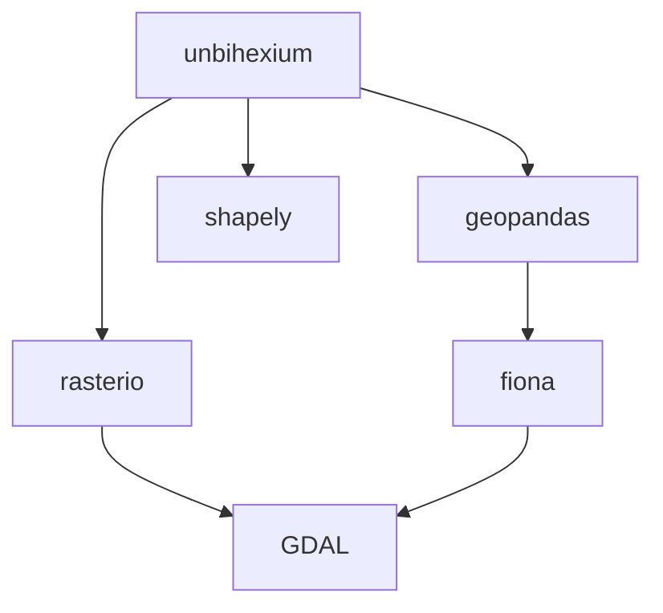

# Installation

## Requirements

- Python 3.10 or higher
- pip 21.0 or higher

Compatibility range: $Python \geq 3.10 \land pip \geq 21.0$

## Standard Installation

```bash
pip install unbihexium
```

## Installation with Optional Dependencies

| Extra | Description | Command |
|-------|-------------|---------|
| gpu | GPU support with PyTorch and CuPy | `pip install unbihexium[gpu]` |
| dask | Dask for parallel processing | `pip install unbihexium[dask]` |
| ray | Ray for distributed computing | `pip install unbihexium[ray]` |
| zarr | Zarr array support | `pip install unbihexium[zarr]` |
| stac | STAC catalog support | `pip install unbihexium[stac]` |
| docs | Documentation dependencies | `pip install unbihexium[docs]` |
| dev | Development dependencies | `pip install unbihexium[dev]` |
| all | All optional dependencies | `pip install unbihexium[all]` |

## Development Installation

For development, clone the repository and install in editable mode:

```bash
git clone https://github.com/unbihexium-oss/unbihexium.git
cd unbihexium
pip install -e ".[dev]"
```

## Verification

Verify the installation:

```bash
unbihexium --version
unbihexium info
```

## System Dependencies

Some features require system-level dependencies. The following diagram shows the dependency structure:



For GDAL installation:

| Platform | Command |
|----------|---------|
| Ubuntu/Debian | `sudo apt install gdal-bin libgdal-dev` |
| macOS | `brew install gdal` |
| Windows | Use conda: `conda install gdal` |
