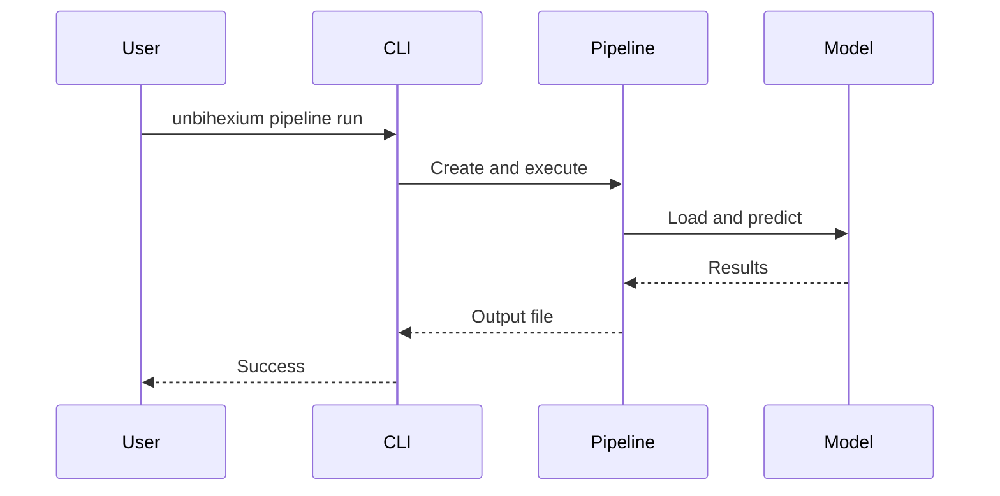

# Quick Start

## Prerequisites

Ensure unbihexium is installed:

```bash
pip install unbihexium
```

## Basic Usage

### Loading Rasters

```python
from unbihexium.core.raster import Raster

# From file
raster = Raster.from_file("satellite.tif")

# From array
import numpy as np
data = np.random.rand(3, 256, 256)
raster = Raster.from_array(data, crs="EPSG:4326")
```

### Computing Spectral Indices

```python
from unbihexium.core.index import compute_index

bands = {
    "NIR": raster.data[3],  # Near-infrared band
    "RED": raster.data[2],  # Red band
}

ndvi = compute_index("NDVI", bands)
```

The available indices are:

| Index | Formula | Use Case |
|-------|---------|----------|
| NDVI | $(NIR - RED) / (NIR + RED)$ | Vegetation health |
| NDWI | $(GREEN - NIR) / (GREEN + NIR)$ | Water bodies |
| NBR | $(NIR - SWIR2) / (NIR + SWIR2)$ | Burn areas |
| EVI | $G \times (NIR - RED) / (NIR + C_1 \times RED - C_2 \times BLUE + L)$ | Enhanced vegetation |
| SAVI | $((NIR - RED) / (NIR + RED + L)) \times (1 + L)$ | Soil-adjusted vegetation |
| MSI | $SWIR1 / NIR$ | Moisture stress |

### Object Detection

```python
from unbihexium.ai.detection import ShipDetector

detector = ShipDetector(threshold=0.5)
result = detector.predict(raster)

print(f"Found {result.count} ships")
for detection in result.detections:
    print(f"  {detection.class_name}: {detection.confidence:.2f}")
```

### CLI Usage

```bash
# List models
unbihexium zoo list

# Compute index
unbihexium index NDVI -i input.tif -o output.tif

# Run pipeline
unbihexium pipeline run ship_detection -i input.tif -o output.geojson
```

## Workflow Diagram


