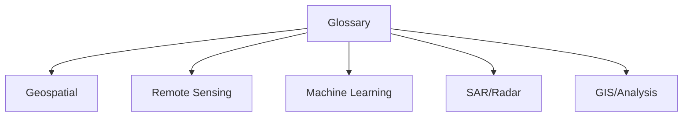

# Glossary

## Purpose

Definitions of terms, acronyms, and concepts used in unbihexium.

## Audience

All users seeking clarification on technical terminology.

## Term Categories

## Geospatial Terms

| Term | Definition |
|------|------------|
| CRS | Coordinate Reference System - defines how coordinates map to locations on Earth |
| EPSG | European Petroleum Survey Group - registry of CRS codes |
| GeoTIFF | TIFF with embedded geospatial metadata |
| COG | Cloud-Optimized GeoTIFF - tiled GeoTIFF optimized for HTTP range requests |
| Raster | Grid of cells with values (pixels) |
| Vector | Geometric shapes (points, lines, polygons) |
| Tile | Subset of a raster for processing |
| Mosaic | Combined image from multiple tiles |

## Remote Sensing Terms

| Term | Definition |
|------|------------|
| NDVI | Normalized Difference Vegetation Index: $(NIR - RED) / (NIR + RED)$ |
| NDWI | Normalized Difference Water Index: $(GREEN - NIR) / (GREEN + NIR)$ |
| NBR | Normalized Burn Ratio: $(NIR - SWIR) / (NIR + SWIR)$ |
| EVI | Enhanced Vegetation Index |
| SAVI | Soil-Adjusted Vegetation Index |
| MSI | Moisture Stress Index |
| Pansharpening | Fusion of panchromatic and multispectral imagery |
| Orthorectification | Geometric correction removing terrain distortion |

## Machine Learning Terms

| Term | Definition |
|------|------------|
| Detection | Locating objects with bounding boxes |
| Segmentation | Pixel-wise classification |
| Classification | Assigning labels to images or regions |
| Regression | Predicting continuous values |
| Inference | Running a trained model on new data |
| NMS | Non-Maximum Suppression - removing duplicate detections |

## SAR/Radar Terms

| Term | Definition |
|------|------------|
| SAR | Synthetic Aperture Radar |
| InSAR | Interferometric SAR - measures surface displacement |
| Amplitude | Signal intensity in SAR |
| Phase | Signal timing in SAR |
| Coherence | Similarity between SAR acquisitions: $\gamma = \|E[s_1 \cdot s_2^*]\| / \sqrt{E[\|s_1\|^2] \cdot E[\|s_2\|^2]}$ |
| Speckle | Granular noise in SAR imagery |
| Polarimetry | Analysis of polarization channels (HH, HV, VH, VV) |

## GIS/Analysis Terms

| Term | Definition |
|------|------------|
| Zonal Statistics | Aggregate statistics within zones |
| Buffer | Area surrounding a geometry |
| Kriging | Geostatistical interpolation method |
| Variogram | Spatial correlation function |
| Moran's I | Spatial autocorrelation measure |
| Viewshed | Visible area from a point |

## Formula Reference

Key formulas used throughout the library:

$$NDVI = \frac{NIR - RED}{NIR + RED}$$

$$\gamma(h) = \frac{1}{2N(h)} \sum_{i=1}^{N(h)} [z(x_i) - z(x_i + h)]^2$$

## References

- [Documentation Index](index.md)
- [Table of Contents](toc.md)
