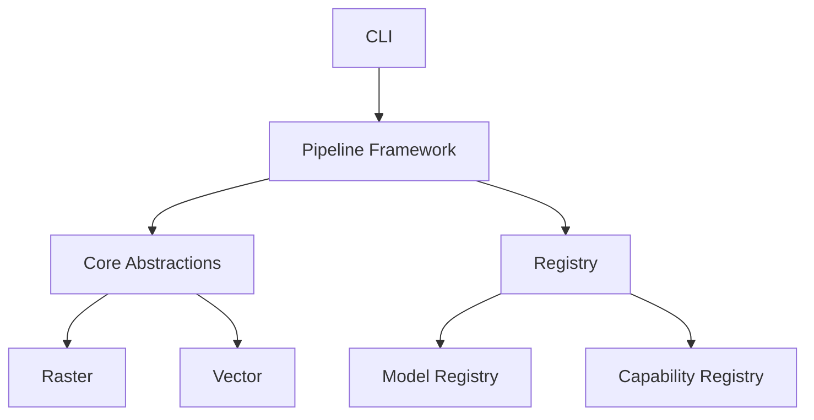

# Unbihexium Documentation

Welcome to the Unbihexium documentation. Unbihexium is a production-grade Python library for Earth Observation, Geospatial, Remote Sensing, and SAR applications.

## Features

| Domain | Capabilities |
|--------|-------------|
| AI Products | Object detection, segmentation, super-resolution, change detection |
| Spectral Indices | NDVI, NDWI, NBR, EVI, SAVI, MSI |
| Geostatistics | Variogram analysis, Kriging, Moran's I, Geary's C |
| Analysis | Zonal statistics, AHP suitability, network analysis |
| Water/Flood | Watershed management, flood risk assessment |
| Agriculture | Crop classification, yield prediction, crop health |

## Quick Start

```python
from unbihexium.core.index import compute_index
import numpy as np

bands = {
    "NIR": np.random.rand(256, 256),
    "RED": np.random.rand(256, 256),
}

ndvi = compute_index("NDVI", bands)
```

## Architecture



## Mathematical Foundation

The library implements various mathematical formulas, including:

**NDVI (Normalized Difference Vegetation Index)**:
$$NDVI = \frac{NIR - RED}{NIR + RED}$$

**Moran's I (Spatial Autocorrelation)**:
$$I = \frac{n}{\sum_i \sum_j w_{ij}} \cdot \frac{\sum_i \sum_j w_{ij}(x_i - \bar{x})(x_j - \bar{x})}{\sum_i (x_i - \bar{x})^2}$$

## Getting Started

- [Installation](getting_started/installation.md)
- [Quick Start Guide](getting_started/quickstart.md)
- [Tutorials](tutorials/index.md)
