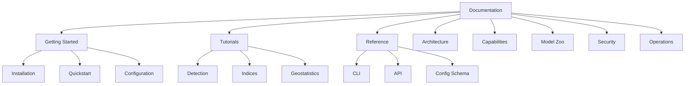

# Unbihexium Documentation

## Purpose

Central hub for Unbihexium documentation covering installation, usage, API reference, and capabilities.

## Audience

- Data scientists
- Geospatial engineers
- Remote sensing analysts
- Software developers

## Documentation Structure

## Documentation Metrics

$$
\text{Coverage} = \frac{\text{Documented APIs}}{\text{Total APIs}} \times 100\%
$$

## Quick Links

| Section | Description |
|---------|-------------|
| [Installation](getting_started/installation.md) | Install the library |
| [Quickstart](getting_started/quickstart.md) | First steps |
| [Notebooks](tutorials/notebooks.md) | 130 comprehensive Jupyter notebooks |
| [CLI Reference](reference/cli.md) | Command-line interface |
| [API Reference](reference/api.md) | Python API |
| [Model Zoo](model_zoo/model_catalog.md) | 520 available models |
| [Capabilities](capabilities/index.md) | 12 domain capabilities |

## Prerequisites

- Python 3.10+
- pip or conda
- 8GB RAM (recommended)

## Non-Goals

- Real-time processing
- Mobile deployment
- GUI applications

## Version

Documentation version: 1.0.0

Matches library version in pyproject.toml.
