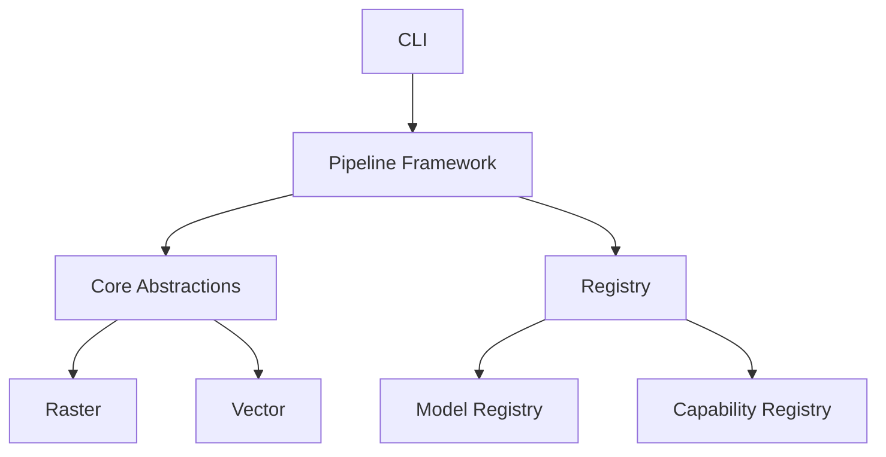

# Unbihexium Documentation

Welcome to the Unbihexium documentation. Unbihexium is a production-grade Python library for Earth Observation, Geospatial, Remote Sensing, and SAR applications.

## Quick Navigation

| Section | Description |
|---------|-------------|
| [Getting Started](getting_started/installation.md) | Installation and setup |
| [Tutorials](tutorials/index.md) | Step-by-step guides |
| [Capabilities](capabilities/index.md) | 12 domain capabilities |
| [API Reference](reference/api.md) | Python API docs |
| [CLI Reference](reference/cli.md) | Command-line interface |
| [Model Zoo](model_zoo/catalog.md) | Pre-trained models |
| [Architecture](architecture/overview.md) | System design |

## Features

| Domain | Capabilities | Documentation |
|--------|-------------|---------------|
| AI Products | Detection, segmentation, super-resolution | [01_ai_products](capabilities/01_ai_products.md) |
| Tourism/Data | Route planning, analytics, zonal | [02_tourism](capabilities/02_tourism_data_processing.md) |
| Indices/Water | NDVI, NDWI, flood risk | [03_indices](capabilities/03_indices_flood_water.md) |
| Environment | Monitoring, deforestation | [04_environment](capabilities/04_environment_forestry_image_processing.md) |
| Asset/Energy | Damage, utilities, solar | [05_asset](capabilities/05_asset_management_energy.md) |
| Urban/Agri | Planning, crops, yield | [06_urban](capabilities/06_urban_agriculture.md) |
| Risk/Defense | Hazard, security | [07_risk](capabilities/07_risk_defense_neutral.md) |
| Value-Added | DSM, DEM, ortho | [08_value](capabilities/08_value_added_imagery.md) |
| Benefits | Delivery, coverage | [09_benefits](capabilities/09_benefits_narrative.md) |
| Satellite | Stereo, scales | [10_satellite](capabilities/10_satellite_imagery_features.md) |
| Resolution | 0.3m-1.5m QA | [11_resolution](capabilities/11_resolution_metadata_qa.md) |
| SAR/Radar | Amplitude, InSAR | [12_sar](capabilities/12_radar_sar.md) |

## Architecture

## Mathematical Foundation

$$NDVI = \frac{NIR - RED}{NIR + RED}$$

## Quick Links

- [Table of Contents](toc.md) | [Glossary](glossary.md) | [FAQ](faq.md) | [Style Guide](style_guide.md)
- [Security](security/responsible_use.md) | [Secrets/Tokens](security/secrets_and_tokens.md)

---

**Next:** [Installation](getting_started/installation.md) | [Quickstart](getting_started/quickstart.md)
