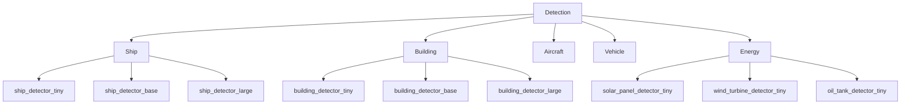

# Model Zoo Catalog

Complete catalog of ALL available models in the unbihexium model zoo.

## Summary Statistics

| Category | Tiny Models | Base/Production | Total |
|----------|-------------|-----------------|-------|
| Detection | 8 | 9 | 17 |
| Segmentation | 10 | 10 | 20 |
| Change Detection | 3 | 2 | 5 |
| Super Resolution | 2 | 3 | 5 |
| SAR | 3 | 0 | 3 |
| Classification | 2 | 1 | 3 |
| Embedding | 1 | 1 | 2 |
| Regression | 3 | 1 | 4 |
| **Total** | **32** | **27** | **59** |

## Detection Models



| Model ID | Domain | Classes | Source |
|----------|--------|---------|--------|
| ship_detector_tiny | maritime | ship | repo |
| ship_detector_base | maritime | ship | release |
| ship_detector_large | maritime | ship, vessel, boat, tanker, cargo | release |
| building_detector_tiny | urban | building | repo |
| building_detector_base | urban | building | release |
| building_detector_large | urban | building, damaged, destroyed | release |
| aircraft_detector_tiny | aviation | aircraft | repo |
| aircraft_detector_base | aviation | aircraft | release |
| vehicle_detector_tiny | transport | vehicle | repo |
| vehicle_detector_base | transport | car, truck, bus, motorcycle | release |
| solar_panel_detector_tiny | energy | solar_panel | repo |
| solar_panel_detector_base | energy | solar_panel, solar_farm | release |
| wind_turbine_detector_tiny | energy | wind_turbine | repo |
| wind_turbine_detector_base | energy | wind_turbine | release |
| oil_tank_detector_tiny | energy | oil_tank | repo |
| oil_tank_detector_base | energy | oil_tank, storage_tank | release |
| pool_detector_tiny | urban | pool | repo |

## Segmentation Models

| Model ID | Domain | Classes | Source |
|----------|--------|---------|--------|
| segmentation_tiny | general | background, foreground | repo |
| segmentation_base | general | background, building, road, water, vegetation, bare_soil | release |
| land_cover_tiny | environment | urban, forest, agriculture, water, barren | repo |
| land_cover_base | environment | 8 classes | release |
| water_segmentation_tiny | water | land, water | repo |
| water_segmentation_base | water | land, river, lake, ocean, pond | release |
| flood_mapping_tiny | water | dry, flooded | repo |
| flood_mapping_base | water | dry, flooded, permanent_water | release |
| crop_segmentation_tiny | agriculture | background, crop | repo |
| crop_segmentation_base | agriculture | wheat, corn, soybean, rice, cotton, barley | release |
| forest_segmentation_tiny | forestry | non_forest, forest | repo |
| forest_segmentation_base | forestry | deciduous, coniferous, mixed | release |
| road_segmentation_tiny | transport | background, road | repo |
| road_segmentation_base | transport | highway, primary, secondary, residential | release |
| building_footprint_tiny | urban | background, building | repo |
| building_footprint_base | urban | residential, commercial, industrial | release |
| greenhouse_detector_tiny | agriculture | background, greenhouse | repo |
| greenhouse_detector_base | agriculture | plastic, glass greenhouse | release |
| cloud_segmentation_tiny | imaging | clear, cloud, shadow | repo |
| cloud_segmentation_base | imaging | thin_cloud, thick_cloud, shadow | release |

## Change Detection Models

| Model ID | Domain | Classes | Source |
|----------|--------|---------|--------|
| change_detector_tiny | general | no_change, change | repo |
| change_detector_base | general | no_change, change | release |
| urban_change_detector_tiny | urban | no_change, new_construction, demolition | repo |
| deforestation_detector_tiny | forestry | no_change, deforestation, reforestation | repo |
| deforestation_detector_base | forestry | degradation included | release |

## Super Resolution Models

| Model ID | Scale | Source |
|----------|-------|--------|
| super_resolution_tiny | 2x | repo |
| super_resolution_2x | 2x | release |
| super_resolution_4x | 4x | release |
| pan_sharpening_tiny | 4x | repo |
| pan_sharpening_base | 4x | release |

## SAR Models (Research-Grade)

| Model ID | Task | Source | Maturity |
|----------|------|--------|----------|
| sar_segmentation_tiny | segmentation | repo | research |
| sar_ship_detector_tiny | detection | repo | research |
| sar_oil_spill_detector_tiny | segmentation | repo | research |

## Classification Models

| Model ID | Classes | Source |
|----------|---------|--------|
| scene_classifier_tiny | 5 scene types | repo |
| scene_classifier_base | 15 scene types | release |
| damage_classifier_tiny | no_damage, minor, major, destroyed | repo |

## Embedding Models

| Model ID | Embedding Dim | Source |
|----------|---------------|--------|
| geo_embedding_tiny | 256 | repo |
| geo_embedding_base | 768 | release |

## Regression Models

| Model ID | Output | Domain | Source |
|----------|--------|--------|--------|
| yield_predictor_tiny | tons/hectare | agriculture | repo |
| yield_predictor_base | tons/hectare | agriculture | release |
| biomass_estimator_tiny | tons/hectare | forestry | repo |
| height_estimator_tiny | meters | urban | repo |

## Verification

All models use SHA256 verification:

$$H_{computed} \stackrel{?}{=} H_{expected}$$

```bash
# Verify model integrity
unbihexium zoo verify ship_detector_tiny
```

## Download

```bash
# List all models
unbihexium zoo list

# Filter by task
unbihexium zoo list --task detection

# Download
unbihexium zoo download ship_detector_tiny
```
