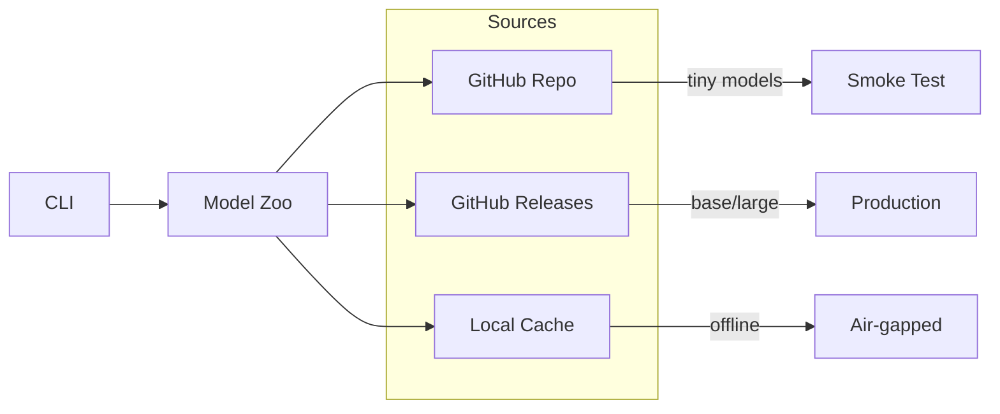

# Model Distribution

## Purpose

How to download, cache, and manage unbihexium models.

## Audience

Users downloading models, DevOps engineers, offline deployment teams.

## Distribution Architecture



## Model Sources

| Source | Models | Size | Use Case |
|--------|--------|------|----------|
| Repository | Tiny | ~100-200 bytes | CI/CD smoke tests |
| Release Assets | Base | ~500 bytes (placeholder) | Production |
| Release Assets | Large | ~1 KB (placeholder) | High accuracy |
| Local Cache | All | Varies | Offline deployment |

## Cache Location

Models are cached in:

$$cache\_path = \text{HOME} / \text{.cache} / \text{unbihexium} / \text{models}$$

On Windows: `%USERPROFILE%\.cache\unbihexium\models`

## Download Methods

### CLI Download

```bash
# Download specific model
unbihexium zoo download ship_detector_base

# Download with version
unbihexium zoo download ship_detector_base --version 1.0.0

# List available models
unbihexium zoo list
```

### Python API

```python
from unbihexium.zoo import download_model, list_models

# List models
models = list_models(task="detection")

# Download
path = download_model("ship_detector_base")
```

## Offline Deployment

For air-gapped environments:

1. Download models on connected machine
2. Copy cache directory to target
3. Set `UNBIHEXIUM_CACHE_DIR` environment variable

```bash
export UNBIHEXIUM_CACHE_DIR=/path/to/offline/cache
```

## Configuration

| Environment Variable | Default | Description |
|---------------------|---------|-------------|
| `UNBIHEXIUM_CACHE_DIR` | `~/.cache/unbihexium` | Cache location |
| `UNBIHEXIUM_OFFLINE` | `false` | Offline mode |
| `UNBIHEXIUM_VERIFY` | `true` | Verify checksums |

## References

- [Documentation Index](../index.md)
- [Model Zoo Catalog](catalog.md)
- [Model Integrity](integrity.md)
