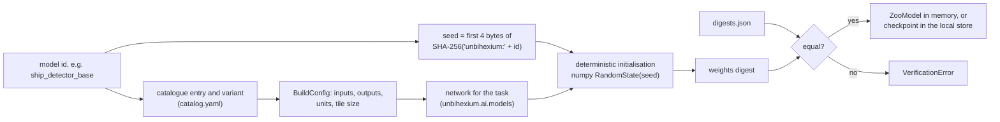

<!--
This Source Code Form is subject to the terms of the Mozilla Public
License, v. 2.0. If a copy of the MPL was not distributed with this
file, You can obtain one at https://mozilla.org/MPL/2.0/.

=============================================================================
Project     : Unbihexium
File        : docs/model_zoo/distribution.md
Title       : Model Distribution
Author      : Olaf Yunus Laitinen Imanov <yunus.z.imanov@helsinki.fi>
Affiliation : University of Helsinki
Copyright   : 2025-2026 Unbihexium OSS Foundation and contributors
Licence     : Mozilla Public License 2.0, see LICENSE.txt
Format      : Markdown (CommonMark with GitHub Flavored Markdown extensions)
=============================================================================
-->

# Model Distribution

| Field | Value |
| --- | --- |
| Document | UBX-DOC-706 |
| Version | 2.0 |
| Status | Active |
| Last reviewed | 2026-09-24 |
| Owner | Unbihexium maintainers (see [MAINTAINERS.md](../../MAINTAINERS.md)) |
| Applies to | Unbihexium 2.0.0 and the main branch, model zoo catalogue version 2.0.0 |

## Abstract

This document describes how the models of the Unbihexium model zoo reach a user. It is written for users who want to know what they obtain and from where, for operators who run the library in restricted or offline environments, and for auditors who need to assess the integrity and reproducibility of the model weights. It explains that no weight files are distributed at all: every model is built locally and deterministically from the catalogue, and its weights are checked against a published SHA-256 digest. It specifies the seed derivation, the initialisation scheme and the digest, describes the local model store, the continuous integration that proves reproducibility, the only code path that can download a file (models registered by the user with a URL), and how trained models can be shared. The learned models built this way are untrained starter models; only the 28 models of the 7 spectral index families compute exact formulas.

## Contents

1. [Introduction](#1-introduction)
2. [What is distributed](#2-what-is-distributed)
3. [How a model is built](#3-how-a-model-is-built)
4. [The local model store](#4-the-local-model-store)
5. [Reproducibility checks](#5-reproducibility-checks)
6. [Models outside the catalogue](#6-models-outside-the-catalogue)
7. [Sharing trained models](#7-sharing-trained-models)
8. [References](#references)

## 1. Introduction

### 1.1 Purpose and scope

The model zoo defines 520 models: 130 families in the variants `tiny`, `base`, `large` and `mega` (see [model_catalog.md](model_catalog.md)). This document covers how those models are obtained. Building, verifying and exporting them in practice is described in [download_and_verify.md](download_and_verify.md), and the licence of the resulting weights in [licensing_and_provenance.md](licensing_and_provenance.md).

The model zoo was introduced in release 2.0.0 and is listed in the 2.0.0 section of [CHANGELOG.md](../../CHANGELOG.md). Release 1.0.1 and earlier do not contain it.

### 1.2 Status of the models

Every learned model is a starter model: a complete network for its task with deterministic initial weights that has **not** been trained on Earth observation data. Its predictions are meaningless until it is trained on labelled data ([training.md](training.md)). The 28 models of the 7 spectral index families have no trainable weights and compute published formulas exactly. The distribution mechanism described here guarantees that everybody obtains the same starter weights; it says nothing about the quality of a model.

### 1.3 Conventions

The key words MUST, SHOULD and MAY in this document are to be interpreted as described in RFC 2119 [1] and RFC 8174 [2] when, and only when, they appear in capitals.

## 2. What is distributed

### 2.1 No weight files

No file of model weights is stored in the Git repository, attached to a GitHub release, included in a wheel or source distribution, or contained in the container image. The repository does not use Git LFS. Obtaining a catalogue model never contacts a server: the model is built on the local machine from the catalogue and the architecture code, and its weights are compared with the published digest.

Distributing weight files would also be impractical. The 520 models have 10,655,126,116 parameters in total (sum of the counts in `src/unbihexium/zoo/digests.json`), which is about 42.6 GB as float32 values, while the catalogue and the digests that define them take less than 200 kB (99,262 bytes for `catalog.yaml` and 85,580 bytes for `digests.json` at catalogue version 2.0.0).

### 2.2 What each channel carries

| Channel | Model zoo content |
| --- | --- |
| Git repository ([github.com/unbihexium-oss/unbihexium](https://github.com/unbihexium-oss/unbihexium)) | The catalogue [src/unbihexium/zoo/catalog.yaml](../../src/unbihexium/zoo/catalog.yaml), the digests [src/unbihexium/zoo/digests.json](../../src/unbihexium/zoo/digests.json), the architecture code under `src/unbihexium/ai/models/`, and the generated metadata under [model_zoo/](../../model_zoo/README.md): model cards, manifests, inventory and checksums |
| Wheel | The package, including `catalog.yaml` and `digests.json` as package data; enough to build and verify every model when PyTorch is installed |
| Source distribution | The wheel content plus `model_zoo/`, the tests and the licence and notice files (see `[tool.hatch.build.targets.sdist]` in [pyproject.toml](../../pyproject.toml)) |
| Container image `ghcr.io/unbihexium-oss/unbihexium` | The package with the REST service and the CPU builds of PyTorch and ONNX Runtime, but no weights: the service builds catalogue models on first use and verifies them against the published digests (see [../operations/docker.md](../operations/docker.md)) |

Building a model requires the extra `torch` (`pip install "unbihexium[torch]"`). Running an exported ONNX model requires only the extra `onnx`.

## 3. How a model is built

### 3.1 Overview


```mermaid
flowchart LR
    A["model id, e.g. ship_detector_base"] --> B["catalogue entry and variant<br/>(catalog.yaml)"]
    B --> C["BuildConfig: inputs, outputs,<br/>units, tile size"]
    C --> D["network for the task<br/>(unbihexium.ai.models)"]
    A --> E["seed = first 4 bytes of<br/>SHA-256('unbihexium:' + id)"]
    E --> F["deterministic initialisation<br/>numpy RandomState(seed)"]
    D --> F
    F --> G["weights digest"]
    H["digests.json"] --> I{"equal?"}
    G --> I
    I -- yes --> J["ZooModel in memory, or<br/>checkpoint in the local store"]
    I -- no --> K["VerificationError"]
```

`unbihexium.zoo.load_model` performs these steps and returns the model in memory. `unbihexium.zoo.ensure_model` and `unbihexium zoo build` additionally write the model to the local model store (Section 4).

### 3.2 Seed

The seed of a model is derived from its model identifier only:

$$\mathrm{seed}(\mathit{id}) = \mathrm{uint32}_{\mathrm{LE}}\big(\mathrm{SHA256}(\texttt{"unbihexium:"} \,\Vert\, \mathit{id})[0:4]\big)$$

that is, the first four bytes of the SHA-256 hash [3] of the string `unbihexium:` followed by the model identifier, read as an unsigned little-endian integer (`unbihexium.ai.models.init.seed_for`):

```python
import hashlib

from unbihexium.ai.models.init import seed_for

print(seed_for("ship_detector_base"))
print(int.from_bytes(hashlib.sha256(b"unbihexium:ship_detector_base").digest()[:4], "little"))
```

```text
1486520127
1486520127
```

### 3.3 Initialisation

The seed initialises `numpy.random.RandomState`. NumPy keeps the stream of this legacy generator unchanged across releases (NEP 19 [4]), so the same seed yields the same numbers on every platform and with every NumPy release; PyTorch's own initialisers do not give that guarantee. The modules of the network are visited in the order of `named_modules()`:

- convolution and linear layers: weights drawn from a normal distribution with standard deviation $\sqrt{2 / \mathrm{fan_{in}}}$ (He initialisation [5]), or from the standard deviation that the layer declares for its task-specific output; biases zero or the layer's declared bias;
- group normalisation layers: weight one, bias zero.

The spectral index models have no parameters, so nothing is initialised.

### 3.4 Weights digest

The weights digest (`unbihexium.ai.models.init.weights_digest`) is a SHA-256 hash over all tensors of the state dictionary in sorted key order. For each tensor it hashes the line `<key>:<shape>` followed by a newline, then the tensor values as little-endian float32 bytes. The digest therefore identifies the weights independently of the file format they are stored in: a checkpoint, a model in memory and a rebuilt model have the same digest when their weights are identical.

The published digests and parameter counts of all 520 models are in [src/unbihexium/zoo/digests.json](../../src/unbihexium/zoo/digests.json), which also records the algorithm and the initialisation method, and, one line per model, in [model_zoo/checksums.txt](../../model_zoo/checksums.txt). Both files are generated by `python -m unbihexium.zoo.sync` (see [how_to_add_models.md](how_to_add_models.md)).

```python
from unbihexium.ai.models import build_model
from unbihexium.zoo import get_model

model = build_model("ship_detector_tiny")
print(model.digest() == get_model("ship_detector_tiny").weights_digest)
print(model.digest()[:16], model.num_parameters())
```

```text
True
e278457bcbb75b89 730581
```

### 3.5 Verification on load

`load_model` compares the digest of every catalogue model it builds with the published digest and raises `unbihexium.zoo.VerificationError` on a mismatch. A mismatch means that the architecture code, the catalogue or the numerical environment differs from the one that produced the published digests; the model MUST NOT then be treated as the published starter model. Models whose inputs or outputs were changed on purpose (Section 6.1) are marked as customised and are not compared, because their digests necessarily differ.

## 4. The local model store

`unbihexium.zoo.ensure_model` and `unbihexium zoo build` write a built model to a directory of the local model store:

```text
$UNBIHEXIUM_CACHE/models/<model id>/
    model.pt       checkpoint: configuration, state dictionary and weights digest
    model.onnx     ONNX export, only with onnx=True or --onnx
    config.json    catalogue fields, variant, digest and checkpoint SHA-256
    model.sha256   SHA-256 of the files above, in sha256sum format
```

The root is the environment variable `UNBIHEXIUM_CACHE`; when it is not set, the store is `~/.cache/unbihexium/models`. The `--cache-dir` option of `zoo build` and the `cache_dir` argument of the Python functions override it for a single call. Checkpoints are written with `torch.save` and read with `torch.load(weights_only=True)`, so loading a checkpoint cannot execute code. Every file in the store can be regenerated at any time, and the store MAY be deleted with `unbihexium zoo clear --yes`.

For offline or air-gapped use, build the required models once on a machine with PyTorch and copy the store directory, or copy exported ONNX files, which run with ONNX Runtime alone.

## 5. Reproducibility checks

The workflow [.github/workflows/model-zoo.yml](../../.github/workflows/model-zoo.yml) proves on every relevant change that the published files and weights can be reproduced:

| Job | Runs | Check |
| --- | --- | --- |
| Catalogue, manifests and cards | Pull requests to `main` and pushes to `main` that touch `model_zoo/`, `src/unbihexium/zoo/`, `src/unbihexium/ai/models/`, the check script or the workflow | `python .github/scripts/check_model_zoo.py`: every generated file matches the catalogue, every manifest validates against the schema, one manifest and one card per family |
| Rebuild starter weights | The same events, and every Monday at 05:00 UTC; manual runs choose the variants | `check_model_zoo.py --rebuild <variant>`: rebuilds the models and compares their digests with `digests.json`; `tiny` on pull requests, all 520 models on schedule and pushes |

The same checks can be run locally; see [download_and_verify.md](download_and_verify.md) for commands and measured run times.

## 6. Models outside the catalogue

### 6.1 Customised models

`unbihexium.ai.models.build_model` accepts other input channels (`channel_names`) or outputs (`outputs`), for example a four-band sensor for an RGB model or project-specific classes; training does the same when `dataset.yaml` declares `channel_names` or `classes` ([training.md](training.md)). Such a model is initialised from the seed of its model identifier like a catalogue model, but it has a different shape, so its digest differs from the published one, and its configuration is marked `customised`.

### 6.2 Registered models

A user can register additional models at run time with `unbihexium.zoo.register_model`, for example a trained checkpoint under its own identifier. A `ModelZooEntry` has one of three sources:

| `source` | Behaviour of `ensure_model` |
| --- | --- |
| `build` (default) | Build from the catalogue with starter weights, as in Section 3 |
| `local` | Copy the checkpoint at `local_path` into the store |
| `url` | Download the checkpoint from `download_url` with `requests`, streamed to a temporary file and aborted above 4 GiB |

The `url` source is the only code path in the model zoo that downloads a file, and it is used only for entries a user registers; no catalogue entry has a URL. A downloaded checkpoint is checked against the digest recorded inside it when it is loaded, which detects a damaged file, and against the entry's `weights_digest` when the entry has one, which also detects a replaced file: `ensure_model` deletes a download that does not match and `load_model` raises `VerificationError`. Users who register a URL SHOULD therefore set `weights_digest` and SHOULD obtain it through a channel other than the download itself. An example of registering a local checkpoint is in [how_to_add_models.md](how_to_add_models.md).

## 7. Sharing trained models

Training writes ordinary checkpoints (`best.pt`, `last.pt`) in the same format as the store. A checkpoint contains the model configuration, including the normalisation statistics estimated from the training data, the weights, their digest and the training metadata; an ONNX export carries the configuration and the weights digest as metadata. Either file is enough to run the model elsewhere ([inference.md](inference.md)).

When a trained model is shared, the provider SHOULD publish its weights digest (`load_checkpoint(path).digest()`) or the SHA-256 of the file alongside it, and SHOULD describe the training data, its licence and the measured accuracy on independent reference data, as required by [RESPONSIBLE_USE.md](../../RESPONSIBLE_USE.md) and discussed in [licensing_and_provenance.md](licensing_and_provenance.md). The generated model cards under `model_zoo/cards/` describe the starter models only and MUST NOT be edited to describe a trained model; a trained model needs its own documentation.

## References

[1] Bradner, S. Key words for use in RFCs to Indicate Requirement Levels. RFC 2119. 1997. <https://www.rfc-editor.org/rfc/rfc2119>

[2] Leiba, B. Ambiguity of Uppercase vs Lowercase in RFC 2119 Key Words. RFC 8174. 2017. <https://www.rfc-editor.org/rfc/rfc8174>

[3] National Institute of Standards and Technology. Secure Hash Standard (SHS). FIPS PUB 180-4. 2015. <https://doi.org/10.6028/NIST.FIPS.180-4>

[4] Kern, R. NEP 19: Random number generator policy. NumPy Enhancement Proposals. 2018. <https://numpy.org/neps/nep-0019-rng-policy.html>

[5] He, K., Zhang, X., Ren, S. and Sun, J. Delving deep into rectifiers: Surpassing human-level performance on ImageNet classification. ICCV 2015, 1026-1034. 2015. <https://arxiv.org/abs/1502.01852>

<!--
=============================================================================
End of file docs/model_zoo/distribution.md
Part of Unbihexium (https://github.com/unbihexium-oss/unbihexium).
Cite the project as described in CITATION.cff.
=============================================================================
-->
