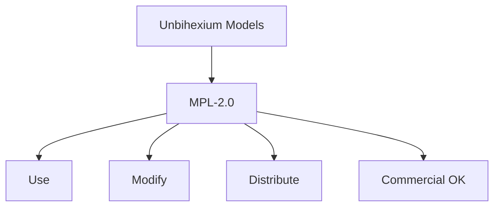

# Model Licensing and Provenance

## Purpose

License terms and provenance tracking for models.

## License Structure



## Provenance Formula

$$
\text{Provenance} = (\text{Training Data}, \text{Model Architecture}, \text{Training Config})
$$

| Model | License | Training Data | Origin |
| ------- | --------- | --------------- | -------- |
| All models | MPL-2.0 | Synthetic | Unbihexium |

## License Terms

- **Use**: Permitted for any purpose, including commercial use
- **Modify**: Permitted; modified MPL-2.0 files remain under MPL-2.0
- **Distribute**: Permitted; source of MPL-2.0 files must be made available
- **Combine**: Permitted in larger works under other licenses (file-level copyleft)
- **Patent**: Grant included
- **Trademark**: Not granted

## Provenance Tracking

Each model includes provenance in manifest:

```json
{
  "provenance": {
    "training_data": "synthetic",
    "architecture": "resnet_fpn",
    "trained_by": "unbihexium",
    "training_date": "2025-12-19"
  }
}
```

## Attribution

When using Unbihexium models, include:

```text
Models from Unbihexium (https://github.com/unbihexium-oss/unbihexium)
Licensed under MPL-2.0 (https://mozilla.org/MPL/2.0/)
```
