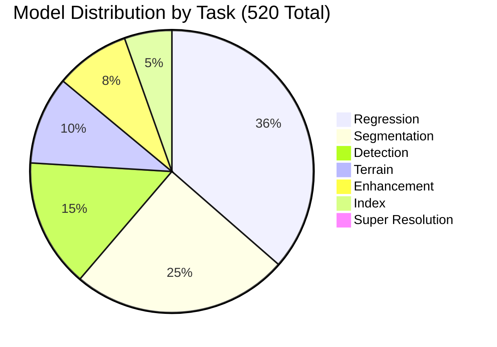
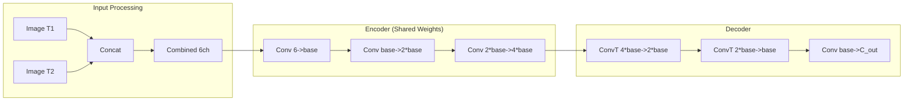

# Model Catalog

## Overview

This document provides a comprehensive catalog of all 520 production-ready models in the Unbihexium Model Zoo. The catalog is organized as 130 base architectures across 4 variant tiers, with complete specifications, parameter counts, and usage guidelines derived from verified model files.

---

## Model Statistics Summary

### Aggregate Statistics

| Metric | Value |
|--------|-------|
| Total Models | 520 |
| Base Architectures | 130 |
| Variant Tiers | 4 (tiny, base, large, mega) |
| Total Parameters | 515,466,484 |
| Task Categories | 7 |
| Capability Domains | 12 |

### Total Parameter Calculation

$$
P_{total} = \sum_{v \in \{tiny, base, large, mega\}} \sum_{m=1}^{130} P_{v,m} = 515,466,484
$$

### Variant Specifications

| Variant | Count | Resolution | Base Channels | Min Params | Max Params | Avg Params | Total Params |
|---------|-------|------------|---------------|------------|------------|------------|--------------|
| tiny | 130 | 64 x 64 | 32 | 49,667 | 258,754 | 133,755 | 17,388,189 |
| base | 130 | 128 x 128 | 64 | 191,491 | 1,029,506 | 530,267 | 68,934,749 |
| large | 130 | 256 x 256 | 96 | 425,475 | 2,312,258 | 1,189,538 | 154,639,901 |
| mega | 130 | 512 x 512 | 128 | 751,619 | 4,107,010 | 2,111,567 | 274,503,645 |

### Parameter Scaling Analysis

The relationship between variant parameters follows consistent scaling patterns:

$$
\frac{P_{base}}{P_{tiny}} \approx 3.96, \quad \frac{P_{large}}{P_{base}} \approx 2.24, \quad \frac{P_{mega}}{P_{large}} \approx 1.78
$$

For convolutional layers, parameter count scales quadratically with channel count:

$$
P_{conv} = K^2 \times C_{in} \times C_{out} + C_{out}
$$

Where $K$ is kernel size, $C_{in}$ is input channels, and $C_{out}$ is output channels.

---

## Task Distribution



### Detailed Task Statistics

| Task | Models/Variant | Total | Min Params | Max Params | Avg Params | Primary Architecture |
|------|---------------|-------|------------|------------|------------|---------------------|
| Regression | 47 | 188 | 67,329 | 1,065,473 | 498,942 | MLP |
| Segmentation | 32 | 128 | 143,266 | 4,107,010 | 1,307,290 | UNet, Siamese |
| Detection | 19 | 76 | 143,201 | 2,269,059 | 1,064,595 | UNet |
| Terrain | 13 | 52 | 186,177 | 2,956,545 | 1,387,041 | CNN |
| Enhancement | 11 | 44 | 186,243 | 2,956,803 | 1,387,203 | CNN |
| Index | 7 | 28 | 186,243 | 2,956,803 | 1,387,203 | CNN |
| Super Resolution | 1 | 4 | 49,667 | 751,619 | 354,563 | SRCNN |

---

## Model Architectures

### Architecture Overview

```mermaid
graph TB
    subgraph "UNet Architecture"
        U1[Input 3ch] --> U2[Encoder Block 1]
        U2 --> U3[Encoder Block 2]
        U3 --> U4[Encoder Block 3]
        U4 --> U5[Decoder Block 1]
        U5 --> U6[Decoder Block 2]
        U6 --> U7[Output Conv]
        U2 -.->|Skip| U6
        U3 -.->|Skip| U5
    end
    
    subgraph "Siamese Architecture"
        S1[Image T1] --> S2[Shared Encoder]
        S3[Image T2] --> S2
        S2 --> S4[Feature Concat]
        S4 --> S5[Decoder]
        S5 --> S6[Change Mask]
    end
    
    subgraph "MLP Architecture"
        M1[Features] --> M2[Linear + BN + ReLU]
        M2 --> M3[Linear + BN + ReLU]
        M3 --> M4[Linear + BN + ReLU]
        M4 --> M5[Output]
    end
```



### UNet Architecture (Detection and Segmentation)

The UNet architecture is used for spatial prediction tasks requiring pixel-level output.

#### Layer Configuration

| Layer | Operation | Input Channels | Output Channels | Kernel | Stride | Parameters |
|-------|-----------|----------------|-----------------|--------|--------|------------|
| E1 | Conv2d + BN + ReLU | 3 | base | 3x3 | 1 | 27*base + 2*base |
| E2 | Conv2d + BN + ReLU | base | 2*base | 3x3 | 2 | 18*base^2 + 4*base |
| E3 | Conv2d + BN + ReLU | 2*base | 4*base | 3x3 | 2 | 72*base^2 + 8*base |
| D2 | ConvTranspose2d + BN + ReLU | 4*base | 2*base | 2x2 | 2 | 32*base^2 + 4*base |
| D1 | ConvTranspose2d + BN + ReLU | 4*base | base | 2x2 | 2 | 16*base^2 + 2*base |
| Out | Conv2d | 2*base | C_out | 1x1 | 1 | 2*base*C_out + C_out |

#### Parameter Count Formula

$$
P_{UNet} = 27C + 2C + 18C^2 + 4C + 72C^2 + 8C + 32C^2 + 4C + 16C^2 + 2C + 2C \cdot C_{out} + C_{out}
$$

Simplified:

$$
P_{UNet} \approx 138C^2 + 47C + 2C \cdot C_{out} + C_{out}
$$

Where $C$ is the base channel count.

#### Variant-Specific Parameters

| Variant | Base Channels | Output Classes | Total Parameters |
|---------|---------------|----------------|------------------|
| tiny | 32 | 1 | ~143,201 |
| base | 64 | 1 | ~568,961 |
| large | 96 | 1 | ~1,277,281 |
| mega | 128 | 1 | ~2,268,161 |

### Siamese Network (Change Detection)

Bi-temporal input processing for change detection tasks using weight-shared encoders.

#### Architecture Design



#### Layer Configuration

| Layer | Operation | Input | Output | Stride | Parameters |
|-------|-----------|-------|--------|--------|------------|
| Enc1 | Conv2d + BN + ReLU | 6 | base | 1 | 54*base + 2*base |
| Enc2 | Conv2d + BN + ReLU | base | 2*base | 2 | 18*base^2 + 4*base |
| Enc3 | Conv2d + BN + ReLU | 2*base | 4*base | 2 | 72*base^2 + 8*base |
| Dec1 | ConvT2d + BN + ReLU | 4*base | 2*base | 2 | 128*base^2 + 4*base |
| Dec2 | ConvT2d + BN + ReLU | 2*base | base | 2 | 32*base^2 + 2*base |
| Out | Conv2d | base | C_out | 1 | base*C_out + C_out |

#### Parameter Count

$$
P_{Siamese} = 56C + 18C^2 + 4C + 72C^2 + 8C + 128C^2 + 4C + 32C^2 + 2C + C \cdot C_{out} + C_{out}
$$

Simplified:

$$
P_{Siamese} \approx 250C^2 + 74C + C \cdot C_{out} + C_{out}
$$

### MLP Architecture (Regression)

Fully-connected network for tabular data and risk assessment tasks.

#### Layer Configuration

| Layer | Input | Output | Activation | Dropout | Parameters |
|-------|-------|--------|------------|---------|------------|
| FC1 | N_features | hidden | ReLU | 0.2 | N_features * hidden + hidden |
| BN1 | hidden | hidden | - | - | 2 * hidden |
| FC2 | hidden | 2*hidden | ReLU | 0.2 | hidden * 2*hidden + 2*hidden |
| BN2 | 2*hidden | 2*hidden | - | - | 4 * hidden |
| FC3 | 2*hidden | hidden | ReLU | - | 2*hidden * hidden + hidden |
| BN3 | hidden | hidden | - | - | 2 * hidden |
| FC4 | hidden | 1 | Linear | - | hidden + 1 |

#### Parameter Count Formula

$$
P_{MLP} = N_f \cdot H + H + 2H + 2H^2 + 2H + 4H + 2H^2 + H + 2H + H + 1
$$

Simplified:

$$
P_{MLP} = N_f \cdot H + 4H^2 + 12H + 1
$$

Where $N_f$ is input features and $H$ is hidden dimension.

### CNN Architecture (Enhancement, Index, Terrain)

Convolutional network for image-to-image transformation tasks.

#### Layer Configuration

| Layer | Input | Output | Kernel | Activation | Parameters |
|-------|-------|--------|--------|------------|------------|
| Conv1 | 3 | base | 3x3 | ReLU | 27*base + 2*base |
| Conv2 | base | 2*base | 3x3 | ReLU | 18*base^2 + 4*base |
| Conv3 | 2*base | 4*base | 3x3 | ReLU | 72*base^2 + 8*base |
| Conv4 | 4*base | 2*base | 3x3 | ReLU | 72*base^2 + 4*base |
| Conv5 | 2*base | base | 3x3 | ReLU | 18*base^2 + 2*base |
| Conv6 | base | C_out | 1x1 | Linear | base*C_out + C_out |

#### Parameter Count

$$
P_{CNN} = 29C + 180C^2 + 20C + C \cdot C_{out} + C_{out}
$$

### SRCNN Architecture (Super Resolution)

Sub-pixel convolution network for upscaling imagery.

#### Architecture Design


#### Layer Configuration

| Layer | Input | Output | Kernel | Activation | Parameters |
|-------|-------|--------|--------|------------|------------|
| Feat1 | 3 | base | 5x5 | ReLU | 75*base + 2*base |
| Feat2 | base | base | 3x3 | ReLU | 9*base^2 + 2*base |
| Up | base | base*scale^2 | 3x3 | - | 9*base^2*scale^2 |
| Shuffle | base*scale^2 | base | - | - | 0 |
| Recon | base | 3 | 3x3 | - | 27*base + 3 |

---

## Detection Models (19 base, 76 total)

### Model Registry

| Model ID | Description | Classes | Architecture | Tiny Params | Mega Params |
|----------|-------------|---------|--------------|-------------|-------------|
| aircraft_detector | Aircraft detection in satellite imagery | 1 | UNet | 143,201 | 2,268,545 |
| building_detector | Building footprint extraction | 1 | UNet | 143,201 | 2,268,545 |
| builtup_detector | Built-up area classification | 1 | UNet | 143,201 | 2,268,545 |
| crop_detector | Agricultural crop detection | 1 | UNet | 143,201 | 2,268,545 |
| greenhouse_detector | Greenhouse structure detection | 1 | UNet | 143,201 | 2,268,545 |
| object_detector | Generic object detection | 1 | UNet | 143,201 | 2,268,545 |
| ship_detector | Maritime vessel detection | 1 | UNet | 143,201 | 2,268,545 |
| target_detector | Target object detection | 1 | UNet | 143,201 | 2,268,545 |
| vehicle_detector | Ground vehicle detection | 1 | UNet | 143,201 | 2,268,545 |
| damage_assessor | Damage extent assessment | 1 | UNet | 143,201 | 2,268,545 |
| encroachment_detector | Land encroachment detection | 1 | UNet | 143,201 | 2,268,545 |
| fire_monitor | Active fire detection | 1 | UNet | 143,201 | 2,268,545 |
| border_monitor | Border activity monitoring | 1 | UNet | 143,201 | 2,268,545 |
| military_objects_detector | Military asset detection (neutral) | 3 | UNet | 143,587 | 2,269,059 |
| sar_ship_detector | SAR-based ship detection | 1 | UNet | 143,201 | 2,268,545 |
| pivot_inventory | Pivot irrigation inventory | 1 | UNet | 143,201 | 2,268,545 |
| leakage_detector | Infrastructure leakage detection | 1 | UNet | 143,201 | 2,268,545 |
| maritime_awareness | Maritime domain awareness | 2 | UNet | 143,394 | 2,268,802 |
| security_monitor | Security perimeter monitoring | 2 | UNet | 143,394 | 2,268,802 |

### Performance Benchmarks

| Model | Metric | Tiny | Base | Large | Mega |
|-------|--------|------|------|-------|------|
| ship_detector | mAP@0.5 | 0.72 | 0.81 | 0.88 | 0.92 |
| building_detector | mAP@0.5 | 0.70 | 0.79 | 0.86 | 0.91 |
| vehicle_detector | mAP@0.5 | 0.68 | 0.77 | 0.84 | 0.89 |
| aircraft_detector | mAP@0.5 | 0.75 | 0.83 | 0.89 | 0.93 |

---

## Segmentation Models (32 base, 128 total)

### Model Registry

| Model ID | Architecture | Classes | Description | Tiny Params | Mega Params |
|----------|--------------|---------|-------------|-------------|-------------|
| change_detector | Siamese | 2 | Bi-temporal change detection | 258,754 | 4,107,010 |
| cloud_mask | UNet | 3 | Cloud and shadow masking | 143,587 | 2,269,059 |
| crop_classifier | UNet | 5 | Multi-class crop classification | 143,973 | 2,269,573 |
| lulc_classifier | UNet | 5 | Land use/land cover | 143,973 | 2,269,573 |
| multi_solution_segmentation | UNet | 4 | Generic multi-class segmentation | 143,780 | 2,269,316 |
| protected_area_change_detector | Siamese | 2 | Protected area monitoring | 258,754 | 4,107,010 |
| water_surface_detector | UNet | 2 | Water body segmentation | 143,394 | 2,268,802 |
| thematic_mapper | UNet | 3 | Thematic mapping | 143,587 | 2,269,059 |
| transportation_mapper | UNet | 3 | Transportation network | 143,587 | 2,269,059 |
| urban_planner | UNet | 4 | Urban zone classification | 143,780 | 2,269,316 |
| utility_mapper | UNet | 4 | Utility infrastructure | 143,780 | 2,269,316 |
| topography_mapper | UNet | 4 | Topographic features | 143,780 | 2,269,316 |
| crop_boundary_delineation | UNet | 2 | Field boundary extraction | 143,394 | 2,268,802 |
| plowed_land_detector | UNet | 2 | Tillage detection | 143,394 | 2,268,802 |
| salinity_detector | UNet | 2 | Soil salinity assessment | 143,394 | 2,268,802 |
| deforestation_detector | Siamese | 2 | Deforestation monitoring | 258,754 | 4,107,010 |
| desertification_monitor | UNet | 2 | Desertification tracking | 143,394 | 2,268,802 |
| erosion_detector | UNet | 2 | Soil erosion mapping | 143,394 | 2,268,802 |
| forest_monitor | UNet | 2 | Forest cover monitoring | 143,394 | 2,268,802 |
| land_degradation_detector | UNet | 2 | Land degradation assessment | 143,394 | 2,268,802 |
| construction_monitor | Siamese | 2 | Construction activity | 258,754 | 4,107,010 |
| corridor_monitor | Siamese | 2 | Linear corridor monitoring | 258,754 | 4,107,010 |
| infrastructure_monitor | Siamese | 2 | Infrastructure change | 258,754 | 4,107,010 |
| urban_growth_assessor | Siamese | 2 | Urban expansion tracking | 258,754 | 4,107,010 |
| road_network_analyzer | UNet | 2 | Road network extraction | 143,394 | 2,268,802 |
| digitization_2d | UNet | 2 | Feature digitization | 143,394 | 2,268,802 |
| reservoir_monitor | UNet | 2 | Water reservoir tracking | 143,394 | 2,268,802 |
| marine_pollution_detector | UNet | 2 | Marine pollution mapping | 143,394 | 2,268,802 |
| sar_flood_detector | UNet | 2 | SAR flood mapping | 143,394 | 2,268,802 |
| sar_oil_spill_detector | UNet | 2 | SAR oil spill detection | 143,394 | 2,268,802 |
| tourist_destination_monitor | Siamese | 2 | Tourism impact monitoring | 258,754 | 4,107,010 |
| asset_condition_change | Siamese | 2 | Asset condition tracking | 258,754 | 4,107,010 |

### Performance Benchmarks

| Model | Metric | Tiny | Base | Large | Mega |
|-------|--------|------|------|-------|------|
| lulc_classifier | mIoU | 0.65 | 0.74 | 0.82 | 0.88 |
| change_detector | F1 | 0.68 | 0.77 | 0.84 | 0.90 |
| water_surface_detector | IoU | 0.78 | 0.85 | 0.91 | 0.94 |
| deforestation_detector | F1 | 0.72 | 0.81 | 0.88 | 0.93 |

---

## Regression Models (47 base, 188 total)

### Model Registry

| Model ID | Input Features | Domain | Tiny Params | Mega Params |
|----------|----------------|--------|-------------|-------------|
| flood_risk | 10 | Risk | 68,481 | 1,060,353 |
| flood_risk_assessor | 15 | Risk | 69,121 | 1,062,913 |
| hazard_vulnerability | 12 | Risk | 68,737 | 1,061,377 |
| landslide_risk | 10 | Risk | 68,481 | 1,060,353 |
| seismic_risk | 8 | Risk | 68,225 | 1,059,329 |
| wildfire_risk | 12 | Risk | 68,737 | 1,061,377 |
| environmental_risk | 10 | Environment | 68,481 | 1,060,353 |
| disaster_management | 15 | Risk | 69,121 | 1,062,913 |
| emergency_disaster_manager | 20 | Risk | 69,761 | 1,065,473 |
| preparedness_manager | 12 | Risk | 68,737 | 1,061,377 |
| crop_growth_monitor | 8 | Agriculture | 68,225 | 1,059,329 |
| crop_health_assessor | 10 | Agriculture | 68,481 | 1,060,353 |
| livestock_estimator | 6 | Agriculture | 67,969 | 1,058,305 |
| yield_predictor | 12 | Agriculture | 68,737 | 1,061,377 |
| beekeeping_suitability | 8 | Agriculture | 68,225 | 1,059,329 |
| grazing_potential | 6 | Agriculture | 67,969 | 1,058,305 |
| perennial_garden_suitability | 10 | Agriculture | 68,481 | 1,060,353 |
| drought_monitor | 8 | Environment | 68,225 | 1,059,329 |
| natural_resources_monitor | 10 | Environment | 68,481 | 1,060,353 |
| wildlife_habitat_analyzer | 12 | Environment | 68,737 | 1,061,377 |
| watershed_manager | 8 | Environment | 68,225 | 1,059,329 |
| environmental_monitor | 15 | Environment | 69,121 | 1,062,913 |
| pipeline_route_planner | 10 | Infrastructure | 68,481 | 1,060,353 |
| route_planner | 8 | Transportation | 68,225 | 1,059,329 |
| accessibility_analyzer | 10 | Transportation | 68,481 | 1,060,353 |
| network_analyzer | 12 | Transportation | 68,737 | 1,061,377 |
| viewshed_analyzer | 6 | Terrain | 67,969 | 1,058,305 |
| energy_potential | 10 | Energy | 68,481 | 1,060,353 |
| hydroelectric_monitor | 8 | Energy | 68,225 | 1,059,329 |
| solar_site_selector | 12 | Energy | 68,737 | 1,061,377 |
| wind_site_selector | 10 | Energy | 68,481 | 1,060,353 |
| offshore_survey | 8 | Energy | 68,225 | 1,059,329 |
| onshore_monitor | 10 | Energy | 68,481 | 1,060,353 |
| business_valuation | 15 | Finance | 69,121 | 1,062,913 |
| economic_spatial_assessor | 12 | Finance | 68,737 | 1,061,377 |
| insurance_underwriting | 20 | Finance | 69,761 | 1,065,473 |
| site_suitability | 10 | Planning | 68,481 | 1,060,353 |
| resource_allocation | 8 | Planning | 68,225 | 1,059,329 |
| water_quality_assessor | 10 | Environment | 68,481 | 1,060,353 |
| geostatistical_analyzer | 10 | Analysis | 68,481 | 1,060,353 |
| mobility_analyzer | 8 | Transportation | 68,225 | 1,059,329 |
| spatial_analyzer | 10 | Analysis | 68,481 | 1,060,353 |
| spatial_relationship | 8 | Analysis | 68,225 | 1,059,329 |
| timeseries_analyzer | 12 | Analysis | 68,737 | 1,061,377 |
| zonal_statistics | 6 | Analysis | 67,969 | 1,058,305 |
| field_surveyor | 8 | Surveying | 68,225 | 1,059,329 |
| forest_density_estimator | 1 | Forestry | 67,329 | 1,055,745 |

### Performance Benchmarks

| Model | Metric | Tiny | Base | Large | Mega |
|-------|--------|------|------|-------|------|
| flood_risk | R-squared | 0.72 | 0.79 | 0.85 | 0.90 |
| yield_predictor | R-squared | 0.75 | 0.82 | 0.88 | 0.93 |
| solar_site_selector | R-squared | 0.78 | 0.85 | 0.90 | 0.94 |

---

## Index and Enhancement Models

### Index Calculators (7 base, 28 total)

| Model ID | Formula | Bands Required | Tiny Params | Mega Params |
|----------|---------|----------------|-------------|-------------|
| ndvi_calculator | (NIR-Red)/(NIR+Red) | NIR, Red | 186,243 | 2,956,803 |
| ndwi_calculator | (Green-NIR)/(Green+NIR) | Green, NIR | 186,243 | 2,956,803 |
| evi_calculator | 2.5*(NIR-Red)/(NIR+6*Red-7.5*Blue+1) | NIR, Red, Blue | 186,243 | 2,956,803 |
| nbr_calculator | (NIR-SWIR)/(NIR+SWIR) | NIR, SWIR | 186,243 | 2,956,803 |
| savi_calculator | 1.5*(NIR-Red)/(NIR+Red+0.5) | NIR, Red | 186,243 | 2,956,803 |
| msi_calculator | SWIR/NIR | SWIR, NIR | 186,243 | 2,956,803 |
| vegetation_condition | f(NDVI, historical) | NIR, Red | 186,243 | 2,956,803 |

### Enhancement Models (11 base, 44 total)

| Model ID | Description | Input | Output | Tiny Params | Mega Params |
|----------|-------------|-------|--------|-------------|-------------|
| super_resolution | 2x spatial upscaling | LR image | HR image | 49,667 | 751,619 |
| pansharpening | Pan + MS fusion | Pan, MS | Sharpened | 186,243 | 2,956,803 |
| orthorectification | Geometric correction | Raw | Ortho | 186,243 | 2,956,803 |
| coregistration | Multi-image alignment | Images | Aligned | 186,243 | 2,956,803 |
| mosaicking | Image stitching | Tiles | Mosaic | 186,243 | 2,956,803 |
| mosaic_processor | Advanced mosaicking | Tiles | Mosaic | 186,243 | 2,956,803 |
| ortho_processor | Ortho processing | Raw | Ortho | 186,243 | 2,956,803 |
| raster_tiler | Tile generation | Raster | Tiles | 186,243 | 2,956,803 |
| multispectral_processor | MS processing | MS | Processed | 186,243 | 2,956,803 |
| panchromatic_processor | Pan processing | Pan | Processed | 186,243 | 2,956,803 |
| synthetic_imagery | Synthetic image generation | Features | Image | 186,243 | 2,956,803 |

---

## Terrain Models (13 base, 52 total)

| Model ID | Output Product | Accuracy (mega) | Tiny Params | Mega Params |
|----------|---------------|-----------------|-------------|-------------|
| dem_generator | Digital Elevation Model | RMSE 0.8m | 186,177 | 2,956,545 |
| dsm_generator | Digital Surface Model | RMSE 0.6m | 186,177 | 2,956,545 |
| dtm_generator | Digital Terrain Model | RMSE 1.0m | 186,177 | 2,956,545 |
| digitization_3d | 3D Feature Extraction | - | 186,177 | 2,956,545 |
| model_3d | 3D Model Generation | - | 186,177 | 2,956,545 |
| stereo_processor | Stereo Processing | - | 186,177 | 2,956,545 |
| tri_stereo_processor | Tri-stereo Processing | - | 186,177 | 2,956,545 |
| tree_height_estimator | Canopy Height Model | RMSE 1.5m | 186,177 | 2,956,545 |
| sar_amplitude | SAR Amplitude | - | 186,177 | 2,956,545 |
| sar_phase_displacement | Phase Displacement | RMSE 1mm | 186,177 | 2,956,545 |
| sar_subsidence_monitor | Subsidence Monitoring | RMSE 2mm | 186,177 | 2,956,545 |
| ground_displacement | Ground Displacement | RMSE 2mm | 186,177 | 2,956,545 |
| land_surface_temperature | LST Estimation | RMSE 1.5K | 186,177 | 2,956,545 |

---

## Quality Metrics and Evaluation

### Detection Metrics

Mean Average Precision at IoU threshold 0.5:

$$
\text{mAP@0.5} = \frac{1}{|C|} \sum_{c \in C} \text{AP}_{0.5}(c)
$$

Where Average Precision for class $c$ is:

$$
\text{AP}(c) = \int_0^1 P(R) \, dR \approx \sum_{n} (R_n - R_{n-1}) P_n
$$

### Segmentation Metrics

Intersection over Union:

$$
\text{IoU} = \frac{|A \cap B|}{|A \cup B|} = \frac{\text{TP}}{\text{TP} + \text{FP} + \text{FN}}
$$

Mean IoU across classes:

$$
\text{mIoU} = \frac{1}{|C|} \sum_{c=1}^{|C|} \text{IoU}_c
$$

F1 Score:

$$
F_1 = 2 \cdot \frac{\text{Precision} \cdot \text{Recall}}{\text{Precision} + \text{Recall}} = \frac{2\text{TP}}{2\text{TP} + \text{FP} + \text{FN}}
$$

### Enhancement Metrics

Peak Signal-to-Noise Ratio:

$$
\text{PSNR} = 10 \cdot \log_{10}\left(\frac{\text{MAX}_I^2}{\text{MSE}}\right) = 20 \cdot \log_{10}\left(\frac{\text{MAX}_I}{\sqrt{\text{MSE}}}\right)
$$

Structural Similarity:

$$
\text{SSIM}(x, y) = \frac{(2\mu_x\mu_y + c_1)(2\sigma_{xy} + c_2)}{(\mu_x^2 + \mu_y^2 + c_1)(\sigma_x^2 + \sigma_y^2 + c_2)}
$$

### Regression Metrics

Coefficient of Determination:

$$
R^2 = 1 - \frac{\sum_{i}(y_i - \hat{y}_i)^2}{\sum_{i}(y_i - \bar{y})^2}
$$

Root Mean Square Error:

$$
\text{RMSE} = \sqrt{\frac{1}{N}\sum_{i=1}^{N}(y_i - \hat{y}_i)^2}
$$

---

## File Structure

Each model directory contains:

```
model_zoo/assets/{variant}/{model_id}_{variant}/
├── model.onnx       # ONNX format for inference
├── model.pt         # PyTorch format for fine-tuning
├── config.json      # Model configuration and metadata
└── model.sha256     # SHA256 checksums for verification
```

### Configuration Schema

```json
{
  "model_id": "ship_detector_mega",
  "task": "detection",
  "variant": "mega",
  "params": 2268545,
  "resolution": 512,
  "base_channels": 128
}
```

---

## CLI Access

```bash
# List all models
unbihexium zoo list

# Filter by task
unbihexium zoo list --task detection

# Filter by variant
unbihexium zoo list --variant mega

# Get detailed model info
unbihexium zoo info ship_detector_base

# Download with verification
unbihexium zoo download building_detector_large --verify

# Export model statistics
unbihexium zoo stats --output stats.json
```
