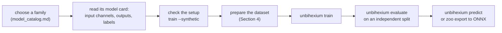

<!--
This Source Code Form is subject to the terms of the Mozilla Public
License, v. 2.0. If a copy of the MPL was not distributed with this
file, You can obtain one at https://mozilla.org/MPL/2.0/.

=============================================================================
Project     : Unbihexium
File        : docs/model_zoo/training.md
Title       : Training and Evaluating Models
Author      : Olaf Yunus Laitinen Imanov <yunus.z.imanov@helsinki.fi>
Affiliation : University of Helsinki
Copyright   : 2025-2026 Unbihexium OSS Foundation and contributors
Licence     : Mozilla Public License 2.0, see LICENSE.txt
Format      : Markdown (CommonMark with GitHub Flavored Markdown extensions)
=============================================================================
-->

# Training and Evaluating Models

| Field | Value |
| --- | --- |
| Document | UBX-DOC-704 |
| Version | 2.0 |
| Status | Active |
| Last reviewed | 2026-09-24 |
| Owner | Unbihexium maintainers (see [MAINTAINERS.md](../../MAINTAINERS.md)) |
| Applies to | The main branch of Unbihexium, model zoo catalogue version 2.0.0 (not part of release 1.0.1) |

## Abstract

Every learned model of the Unbihexium model zoo is an untrained starter model, so training is the step that turns it into a useful model. This document is written for users who train or fine-tune a model on their own labelled data and for reviewers who need to know exactly what the training code does. It specifies the dataset layout that `unbihexium train` and `unbihexium evaluate` read (the model cards refer to this document for it), the label formats of every task and the optional `dataset.yaml` settings; it then describes how to check a setup on synthetic data, the training command and its options, what happens during training (normalisation, chips, augmentation, losses, optimiser, checkpoints), training from Python, evaluation and its metrics, and how to use and report a trained model. The 7 spectral index families compute exact formulas and cannot be trained.

## Contents

1. [Introduction](#1-introduction)
2. [Workflow](#2-workflow)
3. [Checking a setup on synthetic data](#3-checking-a-setup-on-synthetic-data)
4. [Dataset layout](#4-dataset-layout)
5. [Training on the command line](#5-training-on-the-command-line)
6. [What happens during training](#6-what-happens-during-training)
7. [Training from Python](#7-training-from-python)
8. [Evaluation](#8-evaluation)
9. [Using a trained model](#9-using-a-trained-model)
10. [Reporting and responsible use](#10-reporting-and-responsible-use)
11. [References](#references)

## 1. Introduction

### 1.1 Status of the models

The starter models have complete architectures and deterministic initial weights, but they have **not** been trained on Earth observation data; their output is meaningless until they are trained. No trained weights are published and no accuracy figures exist for the zoo. The 28 models of the 7 spectral index families (`evi_calculator`, `msi_calculator`, `nbr_calculator`, `ndvi_calculator`, `ndwi_calculator`, `savi_calculator` and `vegetation_condition`) compute published formulas and are rejected by the training code with the message `... computes a fixed formula and is not trainable`.

### 1.2 Conventions

The key words MUST, SHOULD and MAY in this document are to be interpreted as described in RFC 2119 [1] and RFC 8174 [2] when, and only when, they appear in capitals.

### 1.3 Requirements

Training and evaluation need the extra `torch`:

```bash
python -m pip install "unbihexium[torch]"
```

The model zoo is only on the main branch; install from source as described in [README.md](../../README.md) until a release contains it. A CUDA GPU or Apple MPS device is used automatically when PyTorch can see one (`--device auto`); training on a CPU works but is slow for the `large` and `mega` variants. The examples below were run on 2026-09-24 in a container with 4 vCPUs, CPython 3.13 and PyTorch 2.14 on the CPU; the metrics they print come from a few epochs on toy data and have no meaning beyond showing the output format.

## 2. Workflow



The model card of each family (`model_zoo/cards/<family>.md`, listed in [model_catalog.md](model_catalog.md)) states the input channels in order, the outputs with their units, the reference data needed for training and the training command.

## 3. Checking a setup on synthetic data

Before real data is prepared, `--synthetic N` trains on `N` generated samples for the task of the model (objects with class-specific spectra for detection, class regions for segmentation, changed regions between two dates, smooth band-dependent targets for regression, degraded images for enhancement and downsampled images for super-resolution), with a synthetic validation set of `max(4, N // 4)` samples:

```bash
unbihexium train ship_detector_tiny --synthetic 16 --epochs 2 --chip-size 64
```

```text
epoch 1/2 loss 5.3291 map50 0.0000
epoch 2/2 loss 2.2181 map50 0.0000
Best epoch: 1
Best checkpoint: runs/ship_detector_tiny/best.pt
{
  "loss": 2.5295004844665527,
  "map50": 0.0,
  ...
}
```

A synthetic run only shows that the installation, the device and the chosen options work. A model trained on synthetic data is useless for real imagery.

## 4. Dataset layout

### 4.1 Directory structure

A dataset is a directory with one subdirectory per split:

```text
dataset/
    dataset.yaml                 optional settings (Section 4.5)
    train/
        images/<id>.tif          image of sample <id>
        labels/<id>.tif          target of sample <id>, same file stem
        targets.csv              scene regression only, instead of labels/
    val/
        images/<id>.tif
        labels/<id>.tif
    test/
        images/<id>.tif
        labels/<id>.tif
```

- `train/images/` MUST exist and contain at least one image.
- `val/` is used for validation after every epoch when `val/images/` exists. It SHOULD exist and SHOULD be spatially independent of the training data; without it, the training loss is monitored instead (Section 6.5).
- `test/` is optional and is read only by `unbihexium evaluate --split test`.
- Every image MUST have a target with the same file stem (`<id>`), except in scene regression with a `targets.csv` file.

### 4.2 Images

| Property | Requirement |
| --- | --- |
| Formats | GeoTIFF (`.tif`, `.tiff`), NumPy (`.npy`, `.npz`), PNG or JPEG (`.png`, `.jpg`); GeoTIFFs and PNG or JPEG files are read with rasterio |
| Array layout | `(bands, rows, columns)`; a two-dimensional array is one band |
| Band order | After the optional `band_indices` selection, the bands MUST be the input channels of the model in the order of its model card, for example `red, green, blue` for `ship_detector` or the ten Sentinel-2 bands `B02` to `B12` of `lulc_classifier` |
| Change detection | The bands of the first date followed by the bands of the second date, for example six bands `red_t1, green_t1, blue_t1, red_t2, green_t2, blue_t2` for `change_detector` |
| Size | Any size. Training reads random windows of the chip size, validation a regular grid of windows; GeoTIFFs are read window by window and `.npy` files are memory-mapped, so large scenes need not fit in memory. `.npz` files are read completely. |
| Values | Any numeric type, converted to float32. Use the same physical quantity (for example surface reflectance) for training and inference; `scale` in `dataset.yaml` converts digital numbers |
| Missing data | NaN, or the value given as `nodata` in `dataset.yaml`; a pixel is missing when all its bands equal `nodata` |

An `.npz` archive is read from its array `image` (images) or `label` (targets), otherwise from `arr_0` or its first array. The image of a sample is the file in `images/` whose extension is one of those above; the target is looked up in `labels/` with the same stem, trying `.tif`, `.tiff`, `.npy`, `.npz`, `.png` and `.jpg` in that order (`.json`, then `.geojson` for detection and scene regression).

### 4.3 Targets by task

| Task | Target file | Content |
| --- | --- | --- |
| Detection | `labels/<id>.json` or `labels/<id>.geojson` | `{"boxes": [[x1, y1, x2, y2], ...], "labels": [...]}` with axis-aligned boxes in pixel coordinates (column, row) of the image, or a GeoJSON FeatureCollection [3] in map coordinates (Section 4.4) |
| Segmentation | `labels/<id>.tif` (or another raster format) | One band of class indices `0` to `K - 1` in the order of the model outputs; `255` is ignored by the loss and the metrics |
| Change detection | `labels/<id>.tif` | One band of change class indices in the order of the model outputs (the first output is the no-change class in the catalogue families); `255` is ignored |
| Dense regression | `labels/<id>.tif` | One band per model output, in output order and in the units of the model card; NaN marks missing reference values, which are skipped |
| Scene regression | `labels/<id>.json`, or `<split>/targets.csv` | JSON `{"values": [v1, v2, ...]}` in output order or `{"values": {"<output>": v, ...}}`; or one CSV file per split with a column `id` (or `image`) holding the file stem and one column per output name |
| Enhancement | `labels/<id>.tif` | One band per model output on the same grid as the image |
| Super-resolution | `labels/<id>.tif` | One band per output on a grid `scale` times finer than the image (`scale` is 4 for `super_resolution`), covering the same area |

Detection labels MAY be class indices or class names; names are resolved against the model outputs, or against `classes` in `dataset.yaml`. A missing `labels` list means class 0 for every box. The number of target bands of dense regression, enhancement and super-resolution MUST equal the number of model outputs, and the scene regression targets MUST provide every output.

### 4.4 Detection labels in map coordinates

A GeoJSON FeatureCollection is converted to pixel boxes with the affine transform of the GeoTIFF image: each feature becomes the bounding box of all its coordinates. The class is read from the feature property `class`, or `label`, or defaults to 0. Coordinates are assumed to be in the coordinate reference system of the image; when the collection declares `"crs": "EPSG:<code>"` as a string and it differs from the image CRS, the coordinates are reprojected with pyproj first. Map coordinates require a GeoTIFF image, because other formats carry no transform.

```json
{
  "type": "FeatureCollection",
  "crs": "EPSG:32635",
  "features": [
    {
      "type": "Feature",
      "properties": {"class": "ship"},
      "geometry": {
        "type": "Polygon",
        "coordinates": [[[500100, 6699900], [500300, 6699900], [500300, 6699700], [500100, 6699700], [500100, 6699900]]]
      }
    }
  ]
}
```

### 4.5 dataset.yaml

All keys are optional:

```yaml
# Zero-based bands to read from the image files, in the order of the model inputs.
band_indices: [1, 2, 3, 4]
# Multiply image values, for example to convert digital numbers to reflectance.
scale: 0.0001
# Image value that marks missing pixels (all bands equal to it).
nodata: 0
# Remap raw mask values to class indices; values not listed become 255 (ignored).
label_map: {0: 0, 1: 1, 2: 1, 255: 255}
# Class names; replaces the outputs of the catalogue model.
classes: [background, water]
# Input channel names; replaces the inputs of the catalogue model.
channel_names: [blue, green, red, nir]
```

| Key | Effect |
| --- | --- |
| `band_indices` | Bands read from every image file, zero-based, in model input order |
| `scale` | Factor applied to the image values after reading (after `nodata` is detected) |
| `nodata` | Pixels whose bands all equal this value become NaN |
| `label_map` | Mapping from raw mask values to class indices for segmentation and change detection; unmapped values become 255 |
| `classes` | Output names of the model to train; also used to resolve class names in detection labels |
| `channel_names` | Input channel names of the model to train; their number sets the input width |

`band_indices`, `scale`, `nodata` and `label_map` affect only how the dataset is read; they are not stored in the checkpoint. Inference therefore MUST receive images whose bands are already in model order and in the same units as the scaled training images (Section 9).

When `classes` or `channel_names` differ from the catalogue entry, `unbihexium train` builds the model with the new output or input layout. The starter weights of such a customised model come from the same seed, but its digest differs from the published one, and its units are dropped when the outputs change. A trained checkpoint keeps the customised layout, so fine-tuning or evaluating it needs no `dataset.yaml` entry for it.

### 4.6 A complete example

The following script creates a small segmentation dataset for `water_surface_detector` (inputs `blue, green, red, nir`, outputs `background, water`) from six-band images stored as digital numbers:

```python
from pathlib import Path

import numpy as np
import rasterio
from rasterio.transform import from_origin

rng = np.random.default_rng(0)
root = Path("water_ds")
profile = {
    "driver": "GTiff",
    "width": 96,
    "height": 96,
    "crs": "EPSG:32635",
    "transform": from_origin(500000, 6700000, 10, 10),
}
for split, count in (("train", 4), ("val", 2)):
    (root / split / "images").mkdir(parents=True, exist_ok=True)
    (root / split / "labels").mkdir(parents=True, exist_ok=True)
    for i in range(count):
        water = np.zeros((96, 96), dtype=np.uint8)
        water[:, : 30 + 10 * i] = 1
        # Bands: coastal, blue, green, red, nir, swir, as digital numbers.
        dn = rng.integers(800, 1200, size=(6, 96, 96)).astype(np.uint16)
        dn[4][water == 1] = 300
        with rasterio.open(root / split / "images" / f"tile_{i}.tif", "w", count=6, dtype="uint16", **profile) as dst:
            dst.write(dn)
        with rasterio.open(root / split / "labels" / f"tile_{i}.tif", "w", count=1, dtype="uint8", **profile) as dst:
            dst.write(water[None])
(root / "dataset.yaml").write_text("band_indices: [1, 2, 3, 4]\nscale: 0.0001\nnodata: 0\n")
```

## 5. Training on the command line

### 5.1 Command

```bash
unbihexium train water_surface_detector_tiny --data water_ds --epochs 3 --chip-size 64
```

```text
epoch 1/3 loss 1.7645 miou 0.3575
epoch 2/3 loss 1.5421 miou 0.3697
epoch 3/3 loss 1.4346 miou 0.4042
Best epoch: 3
Best checkpoint: runs/water_surface_detector_tiny/best.pt
{
  "loss": 1.1887074708938599,
  "accuracy": 0.5974392361111112,
  "miou": 0.4041898328278065,
  ...
}
```

The command prints one line per epoch with the mean training loss and the monitored validation metric, then the best epoch, the path of the best checkpoint and the validation metrics of that epoch as JSON. `MODEL` is a model identifier, a family name with `--variant`, or the path of a `.pt` checkpoint to fine-tune; one of `--data` and `--synthetic` MUST be given.

### 5.2 Options

| Option | Default | Meaning |
| --- | --- | --- |
| `--data DIRECTORY` | none | Dataset root in the layout of Section 4 |
| `--synthetic N` | none | Train on `N` synthetic samples instead of a dataset |
| `--variant` | from the model identifier | `tiny`, `base`, `large` or `mega`, for family names |
| `--epochs` | 50 | Number of epochs |
| `--batch-size` | 8 | Chips per optimisation step |
| `--lr` | 0.001 | Peak learning rate of AdamW |
| `--weight-decay` | 0.0001 | Decoupled weight decay of AdamW |
| `--chip-size` | tile size of the variant (256 or 512) | Side length of training and validation chips, rounded up to a multiple of $2^{\mathrm{depth}}$ (8, 16, 16 or 32 pixels) |
| `--samples-per-epoch` | number of training images | Random chips per epoch; raise it when there are few large images |
| `--device` | `auto` | `auto` (CUDA, then MPS, then CPU), `cpu`, `cuda`, `cuda:1`, `mps` |
| `--workers` | 0 | Data loader processes |
| `--seed` | 0 | Seed of the chip positions, the augmentation and the batch order |
| `--amp` | off | Mixed precision; effective on CUDA only |
| `--patience` | none | Stop after this many epochs without improvement of the monitored metric |
| `--regression-loss` | `l1` | `l1`, `mse` or `huber` for regression targets |
| `--no-augment` | off | Disable geometric and photometric augmentation |
| `--output` | `runs` | Output directory; the default `runs` becomes `runs/<model id>`, any other value is used as given |

### 5.3 Output files

| File | Content |
| --- | --- |
| `best.pt` | Checkpoint of the epoch with the best monitored metric |
| `last.pt` | Checkpoint of the last completed epoch, rewritten after every epoch |
| `history.json` | Model identifier, best epoch, best metrics and one record per epoch (training loss, learning rate, validation metrics, seconds) |

Both checkpoints contain the model configuration with the normalisation statistics, the weights, their digest and the training metadata (epoch, metrics and hyperparameters), and are loaded with `torch.load(weights_only=True)`.

### 5.4 Fine-tuning

Pass a checkpoint instead of a model identifier to continue training, for example on more data or at a lower learning rate. The architecture, the input and output layout and the normalisation statistics are taken from the checkpoint:

```bash
unbihexium train runs/water_surface_detector_tiny/best.pt --data water_ds --epochs 1 --chip-size 64 --lr 0.0003 --output runs/water_finetuned
```

## 6. What happens during training

### 6.1 Normalisation

Before the first epoch, the per-band mean and standard deviation are estimated from up to 32 training chips taken at evenly spaced positions of the chip sequence. Missing values and the padding of chips that extend beyond an image enter this estimate as zeros, so datasets with large gaps SHOULD be cut to the valid area. They are stored in the model configuration (`extra["normalization"]`) and therefore in every checkpoint and ONNX export, and inference applies them automatically. Each band is standardised as $x' = (x - \mu) / \sigma$, and missing values become 0 after standardisation. When a checkpoint that already carries statistics is fine-tuned, its statistics are kept.

### 6.2 Chips

Training draws one random window of the chip size per image and epoch (or `--samples-per-epoch` windows in total, cycling over the images). Validation and evaluation cut every image into a regular grid of non-overlapping windows. Windows that extend beyond an image are padded: images with zeros before normalisation, class masks with 255 and continuous targets with NaN, so that the padding is ignored by the losses and the metrics. Scene regression uses whole images, cropped to the chip size (randomly for training, centrally for validation) when they are larger.

### 6.3 Augmentation

Unless `--no-augment` is given, every training chip is transformed by a random element of the eight symmetries of the square (rotations by multiples of 90 degrees, with or without mirroring), applied to image and target together, boxes included. Models whose outputs include the displacement components `dx` and `dy` (for example `coregistration`) are not transformed geometrically, because a rotation would change the meaning of the target. Detection, segmentation and change detection chips also receive photometric jitter: a per-band gain and offset drawn uniformly from $[-0.1, 0.1]$ around 1 and 0, and Gaussian noise with a standard deviation of 0.025, applied to the image only.

### 6.4 Losses and optimisation

| Task | Loss | Monitored metric |
| --- | --- | --- |
| Detection | Penalty-reduced focal loss on the class heatmaps [4], [5], plus L1 losses on box size (weight 0.1) and centre offset (weight 1), normalised by the number of objects | `map50`, larger is better |
| Segmentation, change detection | Cross-entropy plus soft Dice loss [6], ignoring label 255 | `miou`, larger is better |
| Dense and scene regression | Masked L1 (default), MSE or Huber loss; NaN targets skipped | `rmse`, smaller is better |
| Enhancement, super-resolution | L1 loss [7] | `psnr`, larger is better; `rmse` for displacement outputs |

The optimiser is AdamW [8] with the peak learning rate `--lr` and the weight decay `--weight-decay`. The learning rate factor $f$ of optimisation step $t$ rises linearly during the first epoch ($w$ steps) and then follows a cosine decay [9] to 1 percent of the peak over the remaining steps up to the total $T$:

$$
f(t) =
\begin{cases}
\dfrac{t + 1}{w} & t < w \\[1ex]
0.01 + 0.99 \cdot \dfrac{1}{2}\left(1 + \cos\left(\pi \min\left(1, \dfrac{t - w}{T - w}\right)\right)\right) & t \geq w
\end{cases}
$$

Gradients are clipped to a global norm of 10. Batches with a non-finite loss are skipped. With `--amp` on a CUDA device, the forward pass runs in mixed precision with gradient scaling.

### 6.5 Checkpoints and early stopping

After every epoch the validation split is evaluated with the metrics of Section 8. When the monitored metric improves on the best value so far (strictly), `best.pt` is written; `last.pt` and `history.json` are written after every epoch. Without a validation split the mean training loss is monitored instead, which says nothing about the accuracy on new images. With `--patience N`, training stops after `N` consecutive epochs without improvement.

## 7. Training from Python

```python
from unbihexium.ai.training import TrainConfig, train

config = TrainConfig(epochs=2, batch_size=8, chip_size=64, patience=5, output_dir="runs/water_py")
result = train("water_surface_detector_tiny", "water_ds", config)
print(result.best_epoch, round(result.best_metrics["miou"], 3), result.best_checkpoint)
```

```text
epoch 1/2 loss 1.7645 miou 0.3575
epoch 2/2 loss 1.5421 miou 0.3697
2 0.37 runs/water_py/best.pt
```

`train(model, data=None, config=None, variant=None, synthetic=None, callback=None)` accepts a model identifier, a checkpoint path or a `ZooModel`, and calls `callback` with the record of every epoch. `TrainConfig` has the fields of the command-line options (`epochs`, `batch_size`, `learning_rate`, `weight_decay`, `chip_size`, `samples_per_epoch`, `num_workers`, `device`, `seed`, `amp`, `patience`, `regression_loss`, `augment`, `output_dir`) and a few more: `warmup_epochs` (1.0), `grad_clip` (10.0), `photometric` (task default when `None`), `detection_threshold` (0.3), `class_weights` for the cross-entropy loss, and `verbose`. For custom loops, `unbihexium.ai.training` also provides `ChipDataset`, `Trainer` and `estimate_normalization`, and `unbihexium.ai.data` provides `FolderDataset` and `SyntheticDataset`; `ChipDataset` accepts any sequence of `unbihexium.ai.transforms.Sample` records.

## 8. Evaluation

### 8.1 Command

`unbihexium evaluate MODEL --data DIRECTORY` evaluates a checkpoint, a model identifier or a family name on one split (`--split`, default `val`) and prints the metrics as JSON:

```bash
unbihexium evaluate runs/water_surface_detector_tiny/best.pt --data water_ds --split val --chip-size 64
```

```text
{
  "loss": 1.1887074708938599,
  "accuracy": 0.5974392361111112,
  "miou": 0.4041898328278065,
  "mf1": 0.5662580999092781,
  "kappa": 0.13252307767250415,
  "iou_per_class": {
    "background": 0.5180879392089368,
    "water": 0.2902917264466762
  },
  ...
  "pixels": 18432
}
```

The options are `--split`, `--chip-size` (default: the tile size of the model), `--batch-size` (8), `--device` (`auto`) and `--threshold` (detection score threshold, 0.3). The chips are cut as for validation (Section 6.2) and normalised with the statistics stored in the checkpoint. The final evaluation of a model SHOULD use a `test` split that was not used for model selection.

### 8.2 Metrics

| Task | Keys | Definition |
| --- | --- | --- |
| Detection | `map50`, `map50_95`, `precision`, `recall`, `ap50_per_class`, `images` | Average precision per class at IoU 0.5 and averaged over IoU 0.5 to 0.95 in steps of 0.05, following PASCAL VOC [10] and COCO [11]; means over the classes with reference boxes |
| Segmentation, change detection | `accuracy`, `miou`, `mf1`, `kappa`, `iou_per_class`, `f1_per_class`, `precision_per_class`, `recall_per_class`, `pixels` | From the confusion matrix of all valid pixels; Cohen's kappa [12] |
| Dense and scene regression, displacement fields | `mae`, `rmse`, `bias`, `r2`, `per_output` (the same four values and `count` for every output) | Mean absolute error, root mean squared error, mean error and coefficient of determination, averaged over the outputs and ignoring NaN targets |
| Enhancement, super-resolution | `psnr`, `ssim`, `mae`, `rmse`, `images` | Peak signal-to-noise ratio and structural similarity [13] with a data range of 1 |

Every result also contains `loss`, the mean task loss on the split.

## 9. Using a trained model

The example scene `scene_rgbn.tif` is a synthetic 4-band image of reflectance in the model input order `blue, green, red, nir`:

```python
import numpy as np
from rasterio.transform import from_origin

from unbihexium.io import write_geotiff

rng = np.random.default_rng(0)
scene = rng.uniform(0, 0.3, (4, 200, 300)).astype("float32")
write_geotiff(scene, "scene_rgbn.tif", crs="EPSG:32635", transform=from_origin(500000, 6700000, 10, 10))
```

```bash
unbihexium predict runs/water_surface_detector_tiny/best.pt scene_rgbn.tif water.tif
unbihexium zoo export runs/water_surface_detector_tiny/best.pt water.onnx
unbihexium predict water.onnx scene_rgbn.tif water_onnx.tif
```

```text
Wrote: water.tif (water_surface_detector_tiny)
Exported: water.onnx
Wrote: water_onnx.tif (water_surface_detector_tiny)
```

The input raster of `predict` MUST contain exactly the model input channels in model order, in the same units as the training images after `scale` was applied; in this example `scene_rgbn.tif` holds `blue, green, red, nir` as reflectance. The normalisation statistics are applied automatically. [inference.md](inference.md) describes the Python task APIs, tiling and the output formats.

## 10. Reporting and responsible use

A trained model is only as good as its reference data. Before its output is used:

- the model SHOULD be evaluated on an independent test split from the area, sensor and season of use, and the metrics SHOULD be reported with every result derived from the model;
- the documentation of a shared model SHOULD state the training data, its licence, area, sensor and period, the variant, the options used and the weights digest (see [licensing_and_provenance.md](licensing_and_provenance.md));
- uses that affect people, property or security MUST follow [RESPONSIBLE_USE.md](../../RESPONSIBLE_USE.md), in particular for the detection families of the `defense` domain.

## References

[1] Bradner, S. Key words for use in RFCs to Indicate Requirement Levels. RFC 2119. 1997. <https://www.rfc-editor.org/rfc/rfc2119>

[2] Leiba, B. Ambiguity of Uppercase vs Lowercase in RFC 2119 Key Words. RFC 8174. 2017. <https://www.rfc-editor.org/rfc/rfc8174>

[3] Butler, H., Daly, M., Doyle, A., Gillies, S., Hagen, S. and Schaub, T. The GeoJSON Format. RFC 7946. 2016. <https://www.rfc-editor.org/rfc/rfc7946>

[4] Zhou, X., Wang, D. and Kraehenbuehl, P. Objects as points. arXiv:1904.07850. 2019. <https://arxiv.org/abs/1904.07850>

[5] Lin, T.-Y., Goyal, P., Girshick, R., He, K. and Dollar, P. Focal loss for dense object detection. ICCV 2017, 2980-2988. 2017. <https://arxiv.org/abs/1708.02002>

[6] Milletari, F., Navab, N. and Ahmadi, S.-A. V-Net: Fully convolutional neural networks for volumetric medical image segmentation. 3DV 2016, 565-571. 2016. <https://arxiv.org/abs/1606.04797>

[7] Lim, B., Son, S., Kim, H., Nah, S. and Lee, K. M. Enhanced deep residual networks for single image super-resolution. CVPR Workshops. 2017. <https://arxiv.org/abs/1707.02921>

[8] Loshchilov, I. and Hutter, F. Decoupled weight decay regularization. ICLR 2019. 2019. <https://arxiv.org/abs/1711.05101>

[9] Loshchilov, I. and Hutter, F. SGDR: Stochastic gradient descent with warm restarts. ICLR 2017. 2017. <https://arxiv.org/abs/1608.03983>

[10] Everingham, M., Van Gool, L., Williams, C. K. I., Winn, J. and Zisserman, A. The PASCAL Visual Object Classes (VOC) challenge. International Journal of Computer Vision 88, 303-338. 2010. <https://doi.org/10.1007/s11263-009-0275-4>

[11] Lin, T.-Y., Maire, M., Belongie, S., Hays, J., Perona, P., Ramanan, D., Dollar, P. and Zitnick, C. L. Microsoft COCO: Common objects in context. ECCV 2014, LNCS 8693, 740-755. 2014. <https://arxiv.org/abs/1405.0312>

[12] Cohen, J. A coefficient of agreement for nominal scales. Educational and Psychological Measurement 20(1), 37-46. 1960. <https://doi.org/10.1177/001316446002000104>

[13] Wang, Z., Bovik, A. C., Sheikh, H. R. and Simoncelli, E. P. Image quality assessment: From error visibility to structural similarity. IEEE Transactions on Image Processing 13(4), 600-612. 2004. <https://doi.org/10.1109/TIP.2003.819861>

<!--
=============================================================================
End of file docs/model_zoo/training.md
Part of Unbihexium (https://github.com/unbihexium-oss/unbihexium).
Cite the project as described in CITATION.cff.
=============================================================================
-->
